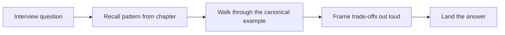

> **Acronyms used in this chapter.** AWS: Amazon Web Services. CI: Continuous Integration. CSS: Cascading Style Sheets. FE: Frontend. HTML: HyperText Markup Language. PDF: Portable Document Format. REST: Representational State Transfer. ROI: Return on Investment. RFC: Request for Comments. SPA: Single-Page Application. TS: TypeScript.

## Conventions

Every chapter follows the same shape so that the book can be scanned quickly during interview preparation. The structure is:

1. **A short framing of the topic and why interviewers ask about it.** This is the paragraph the reader uses to decide whether to read the chapter linearly or to jump to a specific section.
2. **The core concept with a small, runnable TypeScript example.** Inline code is a first-class teaching tool in this book; if a senior reader could plausibly ask "show me what that looks like in code", a snippet appears in the prose.
3. **Sub-sections that go deeper, with diagrams where useful.** Diagrams use Mermaid, never image files, so the same source renders identically in Docusaurus and Quarto.
4. **`Key takeaways`** — the summary that should fit on a flashcard.
5. **`Common interview questions`** — the questions you should be able to answer aloud in two minutes.
6. **`Answers`** — a detailed answer for every question above, written at the depth a senior candidate would actually deliver in a loop.
7. **`Further reading`** — the canonical specifications, RFCs, and posts that go beyond what the chapter can cover.

Code samples are real and live in [`code/`](https://github.com/Dejaaaan/senior-fe-interview-book/tree/main/code) as runnable packages. Inline snippets are short excerpts (≤ 30 lines as a rule); follow the link to the full project when you need to see the surrounding files.

> **Note:** Callouts use Markdown blockquotes, like this one, so the same source renders cleanly in both Docusaurus and Quarto. The book does not use Docusaurus admonitions or Quarto shortcodes.

Diagrams use Mermaid:

## How to read it

Reading all thirteen parts linearly is not required and is rarely the most efficient use of preparation time. Pick a path based on the role you are interviewing for:

- **AWS-heavy interview** (a cloud-native company with a Cognito + Lambda + DynamoDB stack): [Part 2 (Foundations)](../02-foundations/index.md), [Part 3 (Modern React)](../03-react/index.md), [Part 9 (REST APIs & Networking)](../09-rest-and-networking/index.md), [Part 10 (Authentication & Authorization)](../10-auth/index.md), [Part 11 (Security & Privacy)](../11-security-and-privacy/index.md), and [Part 12 (AWS for Frontend Engineers)](../12-aws/index.md). The combination covers the platform foundations, the React surface, the networking layer that those AWS services expose, and the cloud services themselves.
- **Senior frontend generalist** (most product companies): [Part 2 (Foundations)](../02-foundations/index.md), [Part 3 (Modern React)](../03-react/index.md), [Part 4 (Next.js)](../04-nextjs/index.md), [Part 6 (Frontend Architecture)](../06-fe-architecture/index.md), [Part 7 (Production Concerns)](../07-production-concerns/index.md), [Part 9 (REST APIs & Networking)](../09-rest-and-networking/index.md), and [Part 13 (Interview Prep Toolkit)](../13-interview-prep/index.md). This path emphasises React, Next.js, frontend architecture, and the production concerns that distinguish a senior candidate from a mid-level one.
- **Backend-leaning frontend** (a full-stack Node.js role): [Part 2 (Foundations)](../02-foundations/index.md), [Part 3 (Modern React)](../03-react/index.md), [Part 8 (Node.js Backend)](../08-nodejs-backend/index.md), [Part 9 (REST APIs & Networking)](../09-rest-and-networking/index.md), [Part 10 (Authentication & Authorization)](../10-auth/index.md), [Part 11 (Security & Privacy)](../11-security-and-privacy/index.md), and [Part 12 (AWS for Frontend Engineers)](../12-aws/index.md). Here the Node.js trio (Express, Fastify, NestJS), REST, auth, and security carry more weight than micro-frontend architecture.
- **Refresher before a loop tomorrow**: Skim [Part 2 (Foundations)](../02-foundations/index.md), the `Key takeaways` of every chapter in [Part 3 (Modern React)](../03-react/index.md) and [Part 4 (Next.js)](../04-nextjs/index.md), and the entirety of [Part 13 (Interview Prep Toolkit)](../13-interview-prep/index.md).

The two cross-cutting parts — [Part 10 (Authentication & Authorization)](../10-auth/index.md) and [Part 11 (Security & Privacy)](../11-security-and-privacy/index.md) — are short, dense, and asked in almost every loop. Read them even if the role description says "frontend only", because they are the topics that most frequently distinguish a senior from a staff candidate in the same loop.

## What this book is *not*

- Not a reference for every React API. The chapters cover the application programming interfaces that interviewers actually ask about and the ones that materially affect the rest of the codebase.
- Not a deep AWS certification study guide. The book covers the core services a frontend engineer ships against (Identity and Access Management, Simple Storage Service, CloudFront, Lambda, API Gateway, DynamoDB, Cognito), not specialised services such as Glue or Redshift.
- Not a JavaScript-from-scratch primer. If `Array.prototype.map` is unfamiliar, start with a JavaScript book first and return to this one once the language fundamentals are comfortable.

## Key takeaways

- Each chapter has a fixed shape: framing, core example, deeper sections, `Key takeaways`, `Common interview questions`, `Answers`, `Further reading`. Use it to navigate quickly during preparation.
- Use the **reading paths** above instead of going front-to-back. The book is designed to be read non-linearly.
- The cross-cutting parts (Auth, Security, Interview Prep) deliver the highest return on investment per page; read them regardless of the role's stated focus.
