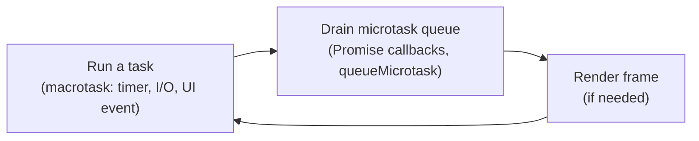

Modern frameworks abstract a substantial amount of the underlying runtime, but every senior interview will at some point ask the candidate to explain the runtime that those frameworks sit on top of. This chapter covers the parts of the language that should be articulable without preparation: closures, prototypes, the `this`-binding rules, modules, the event loop, and the semantics of `Promise` combinators.

> **Acronyms used in this chapter.** API: Application Programming Interface. CJS: CommonJS. CPU: Central Processing Unit. DOM: Document Object Model. ESM: ECMAScript Modules. JIT: Just-in-Time. JS: JavaScript. JSON: JavaScript Object Notation. RFC: Request for Comments. TDZ: Temporal Dead Zone. TS: TypeScript. UI: User Interface. UUID: Universally Unique Identifier.

## Closures

A closure is a function plus the lexical environment that was in scope where the function was defined. The closure retains access to those variables for as long as the function itself is reachable, which is the foundation of encapsulation in JavaScript and the source of more than one historic bug.

```js
function makeCounter() {
  let count = 0;
  return {
    inc() { count += 1; },
    get() { return count; },
  };
}

const c = makeCounter();
c.inc();
c.inc();
c.get(); // 2
```

`inc` and `get` close over `count`. There is no syntax that reaches `count` from outside `makeCounter` — closures provide the encapsulation that classes provide in other languages, and they were the standard private-state mechanism in JavaScript for two decades before classes added `#private` fields.

The second classic — the `for var` bug — is the canonical demonstration that closure semantics differ from intuition for variables that share a binding across iterations:

```js
for (var i = 0; i < 3; i++) {
  setTimeout(() => console.log(i), 0); // 3, 3, 3
}

for (let i = 0; i < 3; i++) {
  setTimeout(() => console.log(i), 0); // 0, 1, 2
}
```

`var` is function-scoped, so all three callbacks close over the same `i` and observe its terminal value. `let` is block-scoped, so each iteration gets a fresh binding and each callback closes over a different one. The correct fix in 2026 is `let`; the historical fix was an immediately-invoked function expression that wrapped the iteration body to create a new scope per iteration.

## `this` is determined at the call site

`this` does not depend on where a function was defined, but on **how it was called**. Every other rule in the table follows from that single fact.

| Call form | `this` is |
| --- | --- |
| `obj.fn()` | `obj` |
| `fn()` | `undefined` (strict mode) or `globalThis` (sloppy) |
| `fn.call(ctx)` / `fn.apply(ctx, args)` | `ctx` |
| `new Fn()` | the new instance |
| Arrow function | inherited from the enclosing scope (lexical `this`) |
| Class method | the instance, but **only** if called as `instance.method()` |

The classic pitfall is detaching a method from its instance, which loses the binding:

```js
class Counter {
  count = 0;
  inc() { this.count += 1; }
}

const c = new Counter();
const f = c.inc;
f(); // BAD: TypeError: Cannot read properties of undefined (reading 'count')
```

The two standard fixes both lock the binding at construction time:

```js
class CounterArrow {
  count = 0;
  inc = () => { this.count += 1; }; // arrow class field — bound to the instance
}

class CounterBind {
  count = 0;
  constructor() { this.inc = this.inc.bind(this); }
  inc() { this.count += 1; }
}
```

Arrow class fields are the modern default; the explicit `bind` form is preserved for API surfaces where the method must appear on the prototype rather than on the instance (for example, when using inheritance or mixins that traverse `Object.getPrototypeOf`).

## Prototypes

Every object in JavaScript has an internal `[[Prototype]]` (accessible via `Object.getPrototypeOf`). Property lookup walks the prototype chain until the property is found or the chain ends. Classes are syntactic sugar over prototypes: the class body installs methods on the constructor's `prototype` object, and `new` creates a new object whose prototype is that `prototype`.

```js
class Animal {
  constructor(name) { this.name = name; }
  speak() { return `${this.name} makes a sound`; }
}

class Dog extends Animal {
  speak() { return `${this.name} barks`; }
}

const d = new Dog("Rex");
d.speak(); // "Rex barks"

Object.getPrototypeOf(d) === Dog.prototype; // true
Object.getPrototypeOf(Dog.prototype) === Animal.prototype; // true
```

The senior framing for "how does inheritance work in JS?" is **prototype-chain lookup, not class copying**. Two `Dog` instances share the same `Dog.prototype.speak` function — there is exactly one copy, regardless of how many instances exist, which is why a method redefined on the prototype takes effect immediately for every existing instance. The detail interviewers like is that class field declarations (`count = 0` in the earlier example) are installed on the *instance*, not the prototype, which is why arrow class fields can act as bound methods.

## Scopes and the Temporal Dead Zone

`let` and `const` are hoisted but uninitialised until the declaration line executes. Touching them earlier throws a `ReferenceError` — the Temporal Dead Zone (TDZ).

```js
console.log(x); // BAD: ReferenceError
let x = 1;

console.log(y); // undefined (var is hoisted and initialised to undefined)
var y = 1;
```

`var` is preserved for legacy compatibility. New code should always use `const`, falling back to `let` only when the variable is genuinely reassigned. The TDZ exists specifically to catch the class of bug where reading a variable before its declaration silently produced `undefined`; the runtime error is far easier to debug than the spooky-action-at-a-distance behaviour of `var`.

## ESM versus CommonJS

Modern frontend code is ECMAScript Modules (ESM). Node.js code can be either, and the differences between the two module systems are responsible for a substantial fraction of "works in development but fails in production" issues.

| Feature | ESM (`import` / `export`) | CommonJS (`require` / `module.exports`) |
| --- | --- | --- |
| File extension | `.mjs` or `"type": "module"` | `.cjs` or default in Node.js |
| Loading | Asynchronous, static, hoisted | Synchronous, dynamic |
| Top-level `await` | Allowed | Not allowed |
| Bindings | **Live** — the importer sees re-assignments to the export | Snapshot of `module.exports` at `require` time |
| Tree shaking | Yes (the static structure makes it sound) | Difficult (the dynamic shape defeats most analysers) |
| `__dirname` / `__filename` | Not defined; use `import.meta.url` | Defined |

The choice for new code in 2026 is unambiguous: **ESM, always**. Set `"type": "module"` in `package.json`. The most common reason teams are still on CommonJS is a transitive dependency that has not migrated; the workaround is the dual-package hack, but the long-term fix is to file an issue and migrate.

## The event loop, microtasks versus macrotasks

The runtime processes work in this order, conceptually:



The implications interviewers ask about most often:

- **The microtask queue is drained completely** before the next macrotask runs. If a `Promise` callback synchronously schedules another `Promise` callback, both run before the next `setTimeout(0)` fires. A microtask that schedules a microtask in a loop will starve the macrotask queue, the page will stop responding to input, and the tab will eventually be killed.
- `setTimeout(fn, 0)` is a **macrotask**. `Promise.resolve().then(fn)` and `queueMicrotask(fn)` are **microtasks**. Microtasks always run first.
- `requestAnimationFrame(fn)` runs **before the next paint** and is the correct hook for animation work; `setTimeout(fn, 16)` for 60-Hz animation is a historical workaround that is no longer correct because it does not synchronise with the compositor.

```js
console.log("1");

setTimeout(() => console.log("2"), 0);

Promise.resolve().then(() => console.log("3"));

queueMicrotask(() => console.log("4"));

console.log("5");

// Output: 1, 5, 3, 4, 2
```

Walking through this output in an interview is the cleanest demonstration that the candidate understands the runtime model rather than memorising rules. The two synchronous logs run first because they execute as part of the current task; the two microtasks run next in scheduling order because they drain before the next macrotask; the `setTimeout` callback runs last as a fresh macrotask.

## Promise patterns

The four `Promise` combinators have subtly different rejection semantics, and senior interviewers ask precisely because the differences matter when wiring real network code.

```ts
const [users, posts] = await Promise.all([fetchUsers(), fetchPosts()]);

const results = await Promise.allSettled([fetchUsers(), fetchPosts()]);
const ok = results.filter(
  (r): r is PromiseFulfilledResult<unknown> => r.status === "fulfilled",
);

const fastest = await Promise.race([fetchA(), fetchB()]);
const firstSuccess = await Promise.any([fetchA(), fetchB()]);
```

The semantics in one sentence each: `Promise.all` rejects on the first failure and otherwise resolves with an array of values; `Promise.allSettled` always resolves with an array of `{ status, value | reason }` objects; `Promise.race` resolves or rejects with whichever input settles first, regardless of outcome; `Promise.any` resolves with the first **fulfilled** value and rejects with an `AggregateError` only if every input rejects.

Two patterns are worth memorising for production code:

- **Asynchronous cancellation with `AbortController`.** `fetch(url, { signal })` ties the request lifecycle to the controller. The same `signal` works for `fetch`, `addEventListener`, `setTimeout` (via `AbortSignal.timeout`), and `Promise.race` (via `signal.throwIfAborted` patterns). Using one controller per logical operation rather than per request makes cleanup tractable.

  ```ts
  const controller = new AbortController();
  const signal = controller.signal;
  const [a, b] = await Promise.all([
    fetch("/a", { signal }),
    fetch("/b", { signal }),
  ]);
  // controller.abort() cancels both requests in one call.
  ```

- **Throttled concurrency** for "100 things, but only 5 at a time": batch the inputs and `await Promise.all(batch.map(...))` per batch, or use `p-limit` for a worker-pool style API. The naive `Promise.all(items.map(fetch))` will open 100 sockets, exhaust the browser's per-origin connection limit, and queue everything anyway, just less observably.

  ```ts
  import pLimit from "p-limit";
  const limit = pLimit(5);
  const results = await Promise.all(items.map((item) => limit(() => fetchItem(item))));
  ```

## Iterators, generators, async iterators

A generator function (`function*`) returns an iterator. Adding `async` produces an async iterator that is consumed with `for await`. The async iterator is exactly the right abstraction for reading a stream of network bytes line by line, which is how Server-Sent Events (SSE) and streaming AI completions are consumed in modern frontends.

```ts
async function* readLines(stream: ReadableStream<Uint8Array>) {
  const reader = stream.pipeThrough(new TextDecoderStream()).getReader();
  let buffer = "";
  while (true) {
    const { value, done } = await reader.read();
    if (done) break;
    buffer += value;
    const lines = buffer.split("\n");
    buffer = lines.pop() ?? "";
    for (const line of lines) yield line;
  }
  if (buffer) yield buffer;
}

for await (const line of readLines(response.body!)) {
  console.log(line);
}
```

The generator owns the buffer and the `pop()`-the-last-incomplete-line trick that Server-Sent Events parsers all share. The consumer gets a clean `for await` loop and never sees the underlying chunk boundaries.

## Equality, copying, and structured cloning

The equality and copy semantics of JavaScript are surprisingly nuanced and have changed over time as new APIs (`Object.is`, `structuredClone`) were added. The rules:

- `===` is reference equality for objects and value equality for primitives. Two structurally identical objects compare unequal because each is a different reference.
- `Object.is(a, b)` differs from `===` only for `NaN` (`Object.is(NaN, NaN)` is `true`) and the signed zeroes (`Object.is(+0, -0)` is `false`). Use it when those edge cases matter.
- The spread operator (`{ ...obj }`, `[...arr]`) performs a **shallow** copy. Nested objects are still shared between the source and the copy.
- For deep copies of plain data, `structuredClone(value)` is the modern answer. It correctly handles `Map`, `Set`, `Date`, typed arrays, and circular references. It does **not** handle functions, DOM nodes, or class-instance prototypes — those throw a `DataCloneError`.

```ts
const original = { user: { name: "Ada" }, created: new Date() };
const copy = structuredClone(original);
copy.user.name = "Grace";
original.user.name; // "Ada" — the nested object was deep-copied.
copy.created instanceof Date; // true — Date round-trips correctly.
```

`structuredClone` is the same algorithm the browser uses to send data to a Web Worker via `postMessage`, which is why its capabilities map closely to "things that survive a thread boundary".

## Key takeaways

- A closure is a function plus its lexical environment. Closures provide encapsulation and are the cause of the historic `for var` bug.
- `this` is bound at the call site. Arrow functions and arrow class fields fix the "lost this" problem by capturing `this` lexically at creation.
- Classes are syntactic sugar over prototype chains; methods live on the prototype and instances share them.
- ESM is the answer for new code. Top-level `await` only works in ESM. The CommonJS fallback exists for legacy interop only.
- Microtasks drain completely between macrotasks; `Promise.then` runs before `setTimeout(0)`. A microtask loop will starve the page.
- Use `AbortController` for cancellation and `structuredClone` for deep copies of plain data.

## Common interview questions

1. Walk me through the output of a `console.log` / `setTimeout` / `Promise.then` interleaving.
2. How do `let`, `const`, and `var` differ in scoping and hoisting?
3. What is `this` in an arrow function inside a class method, and why?
4. Explain prototypes as if I came from Java. How does method dispatch work?
5. What is the difference between `Promise.all`, `Promise.allSettled`, `Promise.race`, and `Promise.any`?
6. What does `structuredClone` give you that JSON round-tripping does not?

## Answers

### 1. Walk me through the output of a `console.log` / `setTimeout` / `Promise.then` interleaving.

The output of the canonical example below is `1, 5, 3, 4, 2`, and the reasoning is the order in which the runtime processes the three queues: synchronous code first, then the microtask queue drained completely, then the next macrotask.

**How it works.** The current task starts when the script is evaluated. Synchronous statements in that task run immediately, so `console.log("1")` and `console.log("5")` execute first in source order. While the task runs, `setTimeout` schedules a macrotask, and `Promise.resolve().then(...)` and `queueMicrotask(...)` each schedule a microtask. When the synchronous code finishes, the runtime checks the microtask queue and drains it completely before picking up the next macrotask, so `3` and `4` print in scheduling order. Finally the runtime starts the next macrotask — the `setTimeout` callback — and prints `2`.

```js
console.log("1");                                 // sync   -> 1
setTimeout(() => console.log("2"), 0);            // macro
Promise.resolve().then(() => console.log("3"));   // micro
queueMicrotask(() => console.log("4"));           // micro
console.log("5");                                 // sync   -> 5
// microtasks drain: 3, 4
// next macrotask:   2
```

**Trade-offs / when this fails.** The model assumes a single agent (one main thread). Web Workers run their own event loop, and a `Promise.resolve().then` scheduled in a worker does not interleave with main-thread microtasks. The model also abstracts over the rendering step: between two macrotasks the browser may insert a paint if the document is dirty, which is why `requestAnimationFrame` is the correct hook for animation. See [chapter 2.5](./05-browser-apis.md) for the page-lifecycle interactions.

### 2. How do `let`, `const`, and `var` differ in scoping and hoisting?

`let` and `const` are block-scoped, hoisted but uninitialised, and reading them before the declaration line throws a `ReferenceError` from the Temporal Dead Zone. `var` is function-scoped, hoisted and initialised to `undefined` at hoist time, and reading it before its declaration silently produces `undefined`. `const` additionally forbids reassignment of the binding; it does not freeze the referenced value.

**How it works.** Hoisting in JavaScript is the compile-time pass that lifts variable declarations to the top of their scope. For `var`, the lifted declaration also assigns `undefined`, so the variable is readable from line 1 of the function. For `let` and `const`, only the declaration is lifted, not the initialisation, and the runtime tracks an "is this binding initialised yet?" flag — the Temporal Dead Zone — that throws on early reads.

```js
function example() {
  console.log(a, b); // undefined, ReferenceError on b
  var a = 1;
  let b = 2;
}
```

**Trade-offs / when this fails.** The TDZ produces a runtime error that is far easier to debug than the silent `undefined` of `var`, which is why the rule for new code is `const` by default, `let` when reassignment is genuinely required, and never `var`. The remaining real use of `var` is in a `for (var i ...)` loop where the index needs function scope rather than block scope, which is itself usually a code smell — the modern equivalent is to refactor to `for ... of` or to a method that creates a new binding per iteration.

### 3. What is `this` in an arrow function inside a class method, and why?

Inside an arrow function, `this` is whatever `this` was in the enclosing scope at the time the arrow was created. When the enclosing scope is a class method called as `instance.method()`, `this` inside the arrow is the instance. The arrow function does not have its own `this` binding at all — there is nothing for `bind`, `call`, or `apply` to override.

**How it works.** Arrow functions were introduced precisely to fix the "I want to capture the outer `this` in a callback" idiom that previously required `const self = this` or `.bind(this)`. The arrow function's `this` is determined lexically at creation, not dynamically at call time, which is the opposite of every other function-creation form in the language.

```ts
class Component {
  count = 0;
  start() {
    setInterval(() => {
      this.count += 1; // `this` is the Component instance, captured from start().
    }, 1000);
  }
}
```

**Trade-offs / when this fails.** The lexical `this` is exactly what callbacks usually want, but it is incorrect for any case where the caller intends to set `this` deliberately. Examples include event handlers attached as class methods that the DOM calls with `event.currentTarget` as `this`, and the `Array.prototype.forEach` callback where the optional second argument supplies `this` to a non-arrow function. The rule of thumb: arrow for "I want my outer `this`", regular function for "let the caller decide".

### 4. Explain prototypes as if I came from Java. How does method dispatch work?

Every JavaScript object has an internal reference to another object called its prototype, and method lookup walks that chain at call time. There is no class hierarchy stored separately from the runtime objects: `class Dog extends Animal` simply makes `Dog.prototype`'s prototype be `Animal.prototype`, and an instance method call walks instance to `Dog.prototype` to `Animal.prototype` to `Object.prototype` until the method is found. Java's class hierarchy is encoded as a chain of these prototype references at runtime.

**How it works.** When the runtime executes `dog.speak()`, it first reads `speak` from `dog` itself; if not found, it walks `Object.getPrototypeOf(dog)` and reads again; the search continues until the property is found or the chain ends in `null`. Once found, the method is called with `this` bound to the original receiver (`dog`), which is what makes inherited methods see the subclass's instance state.

```ts
class Animal {
  constructor(public name: string) {}
  speak() { return `${this.name} makes a sound`; }
}
class Dog extends Animal {
  speak() { return `${this.name} barks`; }
}

const d = new Dog("Rex");
d.speak(); // "Rex barks"
Object.getPrototypeOf(d) === Dog.prototype;            // true
Object.getPrototypeOf(Dog.prototype) === Animal.prototype; // true
```

**Trade-offs / when this fails.** The chain is mutable at runtime: `Object.setPrototypeOf` can re-parent an object, and modifying a prototype object affects every existing instance. Both are foot-guns and modern engines deoptimise heavily when an object's prototype chain changes. The high-leverage corollary is that two `Dog` instances share one `speak` function — methods are not copied per instance, which is what makes a million-instance application memory-efficient. The exception is class fields (`count = 0`): those are installed per-instance, which is why arrow-class-field methods are bound but consume one closure per instance.

### 5. What is the difference between `Promise.all`, `Promise.allSettled`, `Promise.race`, and `Promise.any`?

`Promise.all` resolves when every input has resolved and rejects on the first rejection. `Promise.allSettled` waits for every input to settle and never rejects, returning an array of result descriptors. `Promise.race` settles with the first input to settle, regardless of whether it resolved or rejected. `Promise.any` resolves with the first input to *fulfil* and rejects with an `AggregateError` only if every input rejects.

**How it works.** The four combinators differ along two axes: how many inputs they wait for (one in `race`/`any`, all in `all`/`allSettled`) and which outcomes count as success (any settlement in `race`, fulfilment only in `any`/`all`, both in `allSettled`). Knowing this two-by-two grid lets you pick the right combinator at a glance.

```ts
const a = fetch("/a");
const b = fetch("/b");

await Promise.all([a, b]);          // throws if either fetch fails; otherwise [respA, respB]
await Promise.allSettled([a, b]);    // never throws; results are { status, value | reason }
await Promise.race([a, b]);          // first to settle wins, even if it rejects
await Promise.any([a, b]);           // first to fulfil wins; AggregateError if both reject
```

**Trade-offs / when this fails.** `Promise.all` is the right default when partial success is meaningless and the caller wants the first failure to abort. `Promise.allSettled` is the right choice for fan-out where each result is independently meaningful, such as fetching multiple widgets to render side by side. `Promise.race` is the canonical timeout pattern (`Promise.race([request, timeout])`) — but does not cancel the loser, which is why combining `race` with `AbortController` is the correct production pattern. `Promise.any` is rare in client code; it is most useful for "ask three replicas, take the first answer" scenarios.

### 6. What does `structuredClone` give you that JSON round-tripping does not?

`structuredClone` is the deep-copy primitive built into the platform, and it correctly handles `Date`, `Map`, `Set`, typed arrays, `ArrayBuffer`, regular expressions, and circular references — all of which `JSON.parse(JSON.stringify(x))` either drops, mangles, or throws on. The runtime cost is comparable; the correctness gap is large.

**How it works.** `structuredClone` runs the structured-clone algorithm, which is the same algorithm `postMessage`, `IndexedDB`, and the History API use to serialise values across thread boundaries and storage engines. The algorithm walks the object graph, preserves identity (so a `Map` keyed by an object remains keyed by the same logical object after the clone), and preserves typed-array views over their backing buffers.

```ts
const original = {
  created: new Date("2026-01-01"),
  ids: new Set([1, 2, 3]),
  buffer: new Uint8Array([1, 2, 3]),
};
original.self = original; // circular reference
const copy = structuredClone(original);
copy.created instanceof Date;  // true
copy.ids instanceof Set;       // true
copy.self === copy;            // true — circular references survive
```

**Trade-offs / when this fails.** `structuredClone` does not handle functions, DOM nodes, class-instance prototypes, or `Symbol`-keyed properties — these throw a `DataCloneError`. For class instances the workaround is to round-trip through the constructor (`new MyClass(structuredClone(plainData))`); for trees of DOM nodes, use `Node.cloneNode(true)` instead. The rule of thumb: `structuredClone` for plain data, the type-specific clone API for everything else, and never `JSON.parse(JSON.stringify(x))` once a `Date` or `Map` enters the picture.

## Further reading

- MDN: ["Concurrency model and the event loop"](https://developer.mozilla.org/en-US/docs/Web/JavaScript/EventLoop).
- Jake Archibald, ["Tasks, microtasks, queues and schedules"](https://jakearchibald.com/2015/tasks-microtasks-queues-and-schedules/).
- Lin Clark, ["A cartoon intro to ArrayBuffers and SharedArrayBuffers"](https://hacks.mozilla.org/2017/06/a-cartoon-intro-to-arraybuffers-and-sharedarraybuffers/).
