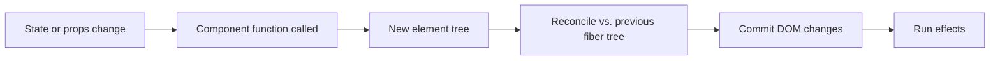

Senior React interviews invariably contain at least one "explain how React works under the hood" question. The expectation is not a recitation of the fiber source code but a clean mental model that explains why your code does what it does. This chapter gives that model in four ideas: **render**, **reconcile**, **commit**, **schedule**.

> **Acronyms used in this chapter.** API: Application Programming Interface. CPU: Central Processing Unit. DOM: Document Object Model. JS: JavaScript. JSX: JavaScript XML. RSC: React Server Components. SSR: Server-Side Rendering. UI: User Interface.

## Render is calling functions

A React component is a function from props to a tree of _elements_ — plain JavaScript objects. Calling the component function is called a **render**.

```tsx
function Greeting({ name }: { name: string }) {
  return <p>Hello, {name}</p>;
}

// React.createElement under the hood — what JSX compiles to:
const element = {
  type: "p",
  props: { children: ["Hello, ", "Ada"] },
};
```

Rendering does not touch the Document Object Model (DOM). It produces a description of what the DOM should look like. This is the single most important distinction to internalise; almost every "why did this re-render?" confusion in interviews and code reviews comes from conflating render (calling the function) with mutation (changing the DOM).

A render happens when:

- The component mounts for the first time.
- Its state changes — that is, `setState` was called, even with a value equal to the previous one in the cases React cannot prove are equal.
- Its parent renders, unless the child is memoised away with `React.memo` or one of its variants.
- A subscribed context value changes (any component reading the context via `useContext` re-renders).

## Reconciliation diffs old against new

After a render, React compares the new element tree against the previous one and computes the minimal set of DOM operations needed. This process is called **reconciliation**. The internal data structure that holds this work is the **fiber tree** — a doubly linked tree of fibers, where each fiber represents one component instance and stores its hooks, its previous render output, and pointers to its parent, child, and sibling.



Two rules of the diff are worth memorising because interviewers ask about them directly:

1. **Different types means full subtree replacement.** Going from `<Tabs>` to `<Modal>` in the same slot unmounts everything inside the previous tree and mounts a fresh tree, even if the leaves are visually identical. This is also the reason that wrapping a tree in a different element type can reset its state.
2. **Keys are how React identifies siblings across renders.** Without a stable key, reordering a list re-mounts the components and discards their state.

```tsx
{
  items.map((item, index) => <Item key={index} {...item} />);
}
```

Using `index` as a key here is a classic bug: insert at the front of the list and React reuses the wrong DOM nodes, because position-0-after-insert is structurally identical to position-0-before-insert from `index`'s perspective. Use the item's stable identifier instead:

```tsx
{
  items.map((item) => <Item key={item.id} {...item} />);
}
```

## Commit is the only phase that mutates the DOM

After reconciliation, React enters the **commit phase** and applies the computed DOM operations in one synchronous batch. The commit phase is also when:

- DOM refs are set — `ref.current` becomes the new node (or `null` for an unmounting node).
- `useLayoutEffect` callbacks run synchronously, before the browser paints.
- `useEffect` callbacks are _scheduled_ to run after paint.

The split between `useLayoutEffect` and `useEffect` matters in interviews. Use `useLayoutEffect` only for measurements that must complete before the browser paints — for example, positioning a tooltip relative to an element that has just changed size. Otherwise prefer `useEffect`, which does not block painting and is the cause of fewer dropped frames in production.

```tsx
function Tooltip({
  targetRef,
  label,
}: {
  targetRef: React.RefObject<HTMLElement>;
  label: string;
}) {
  const tooltipRef = useRef<HTMLDivElement | null>(null);
  useLayoutEffect(() => {
    const target = targetRef.current;
    const tooltip = tooltipRef.current;
    if (!target || !tooltip) return;
    const rect = target.getBoundingClientRect();
    tooltip.style.top = `${rect.bottom + 4}px`;
    tooltip.style.left = `${rect.left}px`;
  });
  return (
    <div ref={tooltipRef} role="tooltip">
      {label}
    </div>
  );
}
```

The position must be set before the user sees the tooltip; using `useEffect` here would briefly paint the tooltip at `(0, 0)` before correcting it on the next frame.

## Scheduling: concurrent rendering and priorities

Modern React (version 18 and later) renders **concurrently**. The runtime can:

- Start rendering a tree, **pause**, let the browser handle a high-priority event such as user input, and then resume the render.
- **Discard** a render in progress because newer state arrived; the partially-rendered fibers are thrown away and the work restarts.
- Render two versions of a tree simultaneously — `useDeferredValue` returns the previous value until the latest one finishes rendering, which is how React keeps an input responsive while a heavy filtered list updates in the background.

Concurrent rendering is opted into through application programming interfaces (APIs) such as `startTransition`, `useDeferredValue`, and `<Suspense>`. The full coverage is in [Suspense and concurrent rendering](./03-suspense-concurrent.md). For the mental model, the takeaway is: **render is no longer guaranteed to be synchronous, atomic, or final**.

```tsx
import { startTransition, useState } from "react";

function Search({ filter }: { filter: (q: string) => Result[] }) {
  const [query, setQuery] = useState("");
  const [results, setResults] = useState<Result[]>([]);

  return (
    <input
      value={query}
      onChange={(e) => {
        setQuery(e.target.value); // urgent: keep the input snappy
        startTransition(() => {
          // Heavy state update — React can interrupt and discard this render.
          setResults(filter(e.target.value));
        });
      }}
    />
  );
}
```

The two state updates cooperate: the `query` update is urgent and React must commit it on the next frame so the user sees their keystroke; the `results` update is wrapped in `startTransition` so React knows it is interruptible and can discard a partial render if the user types another character.

## Why this matters in interviews

A substantial amount of senior React knowledge falls out of the four ideas. The table below maps the most common interviewer questions to the phase that explains them:

| Question they ask                                                         | Answer rooted in…                                                                          |
| ------------------------------------------------------------------------- | ------------------------------------------------------------------------------------------ |
| "Why is my child re-rendering?"                                           | **Render**: the parent re-rendered and there is no memoisation in the way.                 |
| "Why did my list animation break after a sort?"                           | **Reconcile**: the keys are not stable.                                                    |
| "Why does this `useEffect` see stale state?"                              | **Render** plus closures: the effect captured the value from the render that scheduled it. |
| "Why does my modal flicker on open?"                                      | **Commit**: the read-then-write happened across a paint. Use `useLayoutEffect`.            |
| "How do you keep the input responsive while filtering ten thousand rows?" | **Schedule**: `useDeferredValue` or `startTransition`.                                     |

> **Note:** When asked "how does React work?", structure the answer as render → reconcile → commit → schedule. Two minutes, four ideas, no source-code recitation required.

## Key takeaways

- React renders are pure function calls that produce element trees. They do not mutate the DOM.
- Reconciliation diffs trees by **type** (different type means full subtree replacement) and by **key** (use stable identifiers, not array indices).
- The commit phase is the only one that mutates the DOM. It runs `useLayoutEffect` synchronously and schedules `useEffect` to run after paint.
- React 18 and later schedules renders concurrently; renders can be paused, discarded, or deferred via `startTransition`, `useDeferredValue`, and `<Suspense>`.
- Most "weird React behaviour" reduces to one of those four phases. Articulating which phase is involved is the senior signal.

## Common interview questions

1. Walk me through what happens between `setState` being called and the DOM updating.
2. Why is using array index as a `key` problematic?
3. When would you reach for `useLayoutEffect` instead of `useEffect`?
4. What does `startTransition` do, and what problem is it solving?
5. Two sibling components with the same props — one re-renders, one does not. What could cause that?

## Answers

### 1. Walk me through what happens between `setState` being called and the DOM updating.

`setState` does not synchronously update the DOM. It schedules a render: React enqueues the new state value on the component's fiber, marks the fiber as needing to render, and yields back to the event handler. After every event handler completes (or after a microtask in the case of asynchronous updates), React picks up the scheduled work, calls the component function with the new state to produce a new element tree, runs reconciliation against the previous fiber tree to compute the minimal DOM operations, applies those operations in the commit phase, runs `useLayoutEffect` callbacks synchronously, schedules `useEffect` callbacks for after paint, and returns control to the browser to paint.

**How it works.** The four phases are render (call the function), reconcile (diff the trees), commit (mutate the DOM and run refs and layout effects), and schedule (defer post-paint effects). Each phase is observable: a console log in the component body fires during render; a `useLayoutEffect` log fires during commit before paint; a `useEffect` log fires after paint. The schedule phase is where concurrent React differs from legacy React — a render in progress can be paused, resumed, or discarded if newer state arrives.

```tsx
function Counter() {
  const [c, setC] = useState(0);
  console.log("render", c); // each render
  useLayoutEffect(() => console.log("layout")); // commit, pre-paint
  useEffect(() => console.log("paint")); // post-paint
  return <button onClick={() => setC(c + 1)}>{c}</button>;
}
```

**Trade-offs / when this fails.** The model assumes a single update; React batches multiple updates inside the same event handler into one render, which is why `setC(c + 1); setC(c + 1)` produces one render and increments by one rather than two. The cure is the updater form `setC((prev) => prev + 1)`, which queues a function rather than a value and applies them in order during the next render. See [chapter 3.2](./02-hooks-deep-dive.md) for the full discussion.

### 2. Why is using array index as a `key` problematic?

Keys identify a child across renders so that React can match new elements to existing fibers and preserve their state. Array indices are unstable across reorderings: inserting an element at position zero shifts every existing element's index by one, so React matches the _content_ at index zero of the new list to the _previous content_ at index zero of the old list, even though those are now different items. The result is that the wrong fibers are reused, internal state (a half-typed input, a focused element, the scroll position of a virtualised child) ends up associated with the wrong row.

**How it works.** During reconciliation, React walks the new element list and looks up each child in the previous list by key. If keys are stable identifiers, the lookup finds the same fiber and React updates its props rather than tearing down and re-mounting. If keys are array indices, the lookup finds whatever fiber happened to occupy that index previously, even if the content has changed entirely. The fiber's hooks and DOM state are preserved; the props are updated; the user sees stale state.

```tsx
// Bug: inserting "C" at the front swaps which fibers belong to A and B.
items = ["A", "B"];
items = ["C", "A", "B"];

// With key={index}: index 0 was "A", is now "C" — React updates that fiber's props,
// but if the fiber holds an internal input value, that value is now associated with "C".
// With key={item.id}: each item keeps its fiber across the insertion.
```

**Trade-offs / when this fails.** Indices are acceptable when the list is static, sorted only at the source, and never re-ordered or filtered — for example, the rendering of a constant array of column headers. They are also acceptable when the children carry no internal state that the user would notice. The general guidance is to use a stable identifier from the data; if no such identifier exists, mint one when the data is created and persist it for the life of the item.

### 3. When would you reach for `useLayoutEffect` instead of `useEffect`?

Reach for `useLayoutEffect` when the effect must read the current DOM layout and write changes that the user must not see in their pre-modification state. Typical cases are positioning a tooltip relative to its anchor after the anchor's size has changed, applying a focus-ring offset that depends on a measured element, and adjusting a scroll position to keep a target visible after a layout change. The browser will not paint between the commit and the layout effect, so any visual jump that `useEffect` would have produced is invisible to the user.

**How it works.** Both effects run after the commit. `useLayoutEffect` runs synchronously, blocking the browser from painting until the callback returns. `useEffect` is scheduled with the rendering microtask and runs after the next paint, so the user sees the post-commit DOM briefly before the effect runs. For most work — data fetching, event-listener subscription, analytics — the user does not see a difference and `useEffect` is the right choice because it does not block painting.

```tsx
useLayoutEffect(() => {
  const rect = anchorRef.current!.getBoundingClientRect();
  tooltipRef.current!.style.top = `${rect.bottom + 4}px`;
  tooltipRef.current!.style.left = `${rect.left}px`;
});
```

**Trade-offs / when this fails.** `useLayoutEffect` runs on the server in legacy React 17 with no warning, which is harmless; in modern React (18 and later) with Server-Side Rendering, the runtime emits a warning because the effect cannot run server-side and the layout therefore cannot be measured. The fix is to gate the layout effect on a `typeof window !== "undefined"` check, or to use `useIsomorphicLayoutEffect` from a library, or to restructure so the layout calculation happens after hydration.

### 4. What does `startTransition` do, and what problem is it solving?

`startTransition` marks a state update as non-urgent. The render that the update triggers is interruptible — the runtime can pause it to handle a higher-priority event such as user input, and the runtime can discard the partial render entirely if newer state arrives. The effect is that the input remains responsive even when the consequent state update triggers a heavy render that would otherwise block the main thread for several hundred milliseconds.

**How it works.** Inside the transition callback, `setState` calls are tagged with the transition priority. When the scheduler decides what to render next, urgent updates (default-priority state, user input, default `setState` outside a transition) win; transition updates yield to them. The user sees the urgent update commit on the next frame, while the transition update continues rendering in the background until either it commits or it is superseded by a newer transition.

```tsx
import { startTransition, useState } from "react";

function Search({ filter }: { filter: (q: string) => Result[] }) {
  const [query, setQuery] = useState("");
  const [results, setResults] = useState<Result[]>([]);
  return (
    <input
      value={query}
      onChange={(e) => {
        setQuery(e.target.value); // urgent
        startTransition(() => setResults(filter(e.target.value))); // interruptible
      }}
    />
  );
}
```

**Trade-offs / when this fails.** A transition does not make the rendering work cheaper; it only makes it interruptible. If a single render still costs a hundred milliseconds and runs once per keystroke, the page will still feel slow even if the input echoes promptly. The complementary technique is to make the work itself cheaper through memoisation or virtualisation. The pattern also fails for updates that are observably tied to user input (animations, drag-and-drop) — those should remain at default priority. See [chapter 3.3](./03-suspense-concurrent.md) for the full discussion of `startTransition` and `useDeferredValue`.

### 5. Two sibling components with the same props — one re-renders, one does not. What could cause that?

The most common cause is that one of the siblings is wrapped in `React.memo` and receives only props that pass the shallow-equality check, so React skips its render when the parent re-renders. The other sibling is unwrapped and re-renders along with the parent. Other plausible causes are: one sibling reads a context that changed and the other does not; one sibling holds local state that just changed and the other does not; one sibling is inside a `<Suspense>` boundary that is resuspending while the other is not.

**How it works.** Default React re-renders every descendant when a component renders. `React.memo(Component)` wraps a component and short-circuits the render when the new props are shallowly equal to the previous ones. Context subscription is an additional re-render trigger that bypasses memoisation: a memoised component that calls `useContext(X)` re-renders whenever `X` changes, regardless of whether its props changed. Local state is the third trigger; a child with its own state can re-render independently of its parent.

```tsx
const Cheap = React.memo(function Cheap(props: { label: string }) {
  console.log("Cheap render", props.label);
  return <div>{props.label}</div>;
});

function Expensive({ label }: { label: string }) {
  console.log("Expensive render", label);
  return <div>{label}</div>;
}

// Parent re-renders with the same `label` value.
// Cheap: skipped (memo shallow-equality holds).
// Expensive: re-renders.
```

**Trade-offs / when this fails.** `React.memo` only guards against parent-driven re-renders; a memoised component still renders when its own state changes, when a subscribed context changes, when its key changes, or when an effect triggers a state update inside it. Memoisation also costs the equality check on every parent render, so wrapping every component in `React.memo` is counter-productive — it adds work without removing renders for the components that are cheap anyway. The senior framing is to memoise hot paths only and to leave the cheap leaves alone.

## Further reading

- React documentation: ["Render and Commit"](https://react.dev/learn/render-and-commit) and ["You Might Not Need an Effect"](https://react.dev/learn/you-might-not-need-an-effect).
- Dan Abramov, ["React as a UI Runtime"](https://overreacttodayinhistory.com/posts/react-as-a-ui-runtime/).
- Mark Erikson, ["A (Mostly) Complete Guide to React Rendering Behavior"](https://blog.isquaredsoftware.com/2020/05/blogged-answers-a-mostly-complete-guide-to-react-rendering-behavior/).
