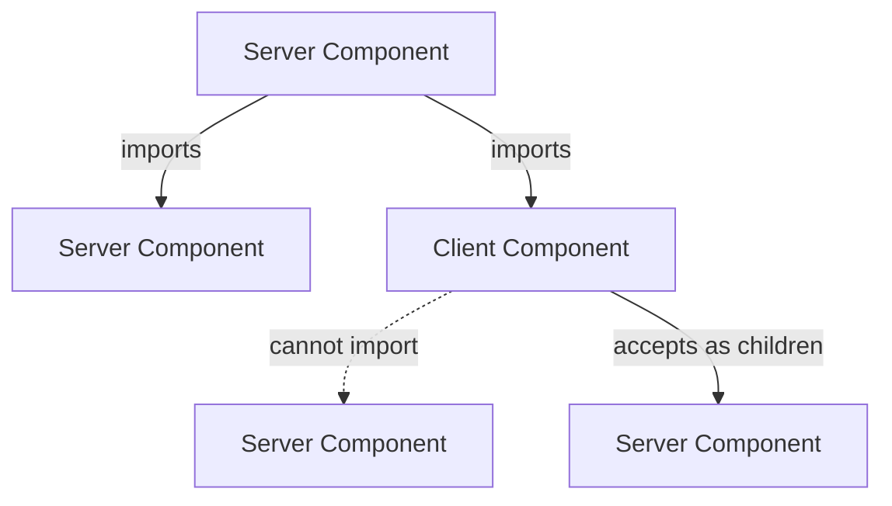

React Server Components (RSC) are the most consequential change in React in years and the topic that interviewers asking about modern React want to discuss. The mental model is short to state, but the consequences ripple through data fetching, bundle size, and the architecture of the application.

> **Acronyms used in this chapter.** API: Application Programming Interface. CSS: Cascading Style Sheets. DB: Database. DOM: Document Object Model. HTML: HyperText Markup Language. JS: JavaScript. JSX: JavaScript XML. RSC: React Server Components. SSR: Server-Side Rendering. UI: User Interface.

## The mental model in one paragraph

A **server component** runs on the server, has no state, can be `async`, and returns serialized JSX. A **client component** runs in the browser (and pre-renders on the server during SSR), has state and effects, and is shipped as JS to the client. **Server components can render client components, but client components can only render server components passed as `children` props.** That is the entire model.

```tsx
// Default in Next.js App Router: server component
export default async function PostPage({ params }: { params: { id: string } }) {
  const post = await getPost(params.id);     // direct DB call, no API needed
  return (
    <article>
      <h1>{post.title}</h1>
      <Markdown content={post.body} />
      <LikeButton postId={post.id} />        {/* client component */}
    </article>
  );
}
```

```tsx
"use client";                                 // marks this and all imports as client
import { useState } from "react";

export function LikeButton({ postId }: { postId: string }) {
  const [liked, setLiked] = useState(false);
  return <button onClick={() => setLiked(true)}>{liked ? "❤" : "🤍"}</button>;
}
```

## What server components can do that client components cannot

Server components have four capabilities that no client component has. They can `await` directly in the component body, which collapses an entire layer of "fetch in `useEffect`, store in `useState`, render after load" boilerplate into a single line. They can read from the database, the file system, or any server-only resource without exposing the access path to the client, which removes the need to build an internal application programming interface for read-only data. They can use server-only secrets such as `process.env.STRIPE_SECRET_KEY` because the source never reaches the browser bundle. They can render large dependencies — a Markdown parser, a syntax highlighter, a date-formatting library — and emit only the resulting HTML, without shipping the dependency code to the browser at all.

## What server components cannot do

Server components also have four sharp limitations. They cannot call any of the hooks that depend on client-side reactivity (`useState`, `useEffect`, `useReducer`, and the React-19 client hooks). They cannot use browser application programming interfaces such as `window`, `document`, or `localStorage` because the server runtime does not have those globals. They cannot attach event handlers (`onClick`, `onChange`, `onSubmit`) because event handling requires the JavaScript that ships with a client component. They cannot read context values via `useContext`, with rare framework-specific exceptions. If a component needs any one of those, that component must be marked `"use client"`.

## The composition rule



A client component **cannot import** a server component, but it **can accept one as a `children` prop** rendered by a server component. This is how you compose interactivity around server-rendered content.

```tsx
// Server component
<ClientLayout>
  <ServerSideFeed />     {/* server component as children */}
</ClientLayout>
```

```tsx
"use client";
export function ClientLayout({ children }: { children: ReactNode }) {
  const [open, setOpen] = useState(true);
  return open ? <div>{children}</div> : null;
}
```

This pattern lets you isolate interactivity to small leaves while keeping the data-heavy parts on the server.

## When to use each

Default to **server**. Reach for **client** only when one of the following applies:

- The component needs local state (`useState`, `useReducer`).
- The component needs effects (`useEffect`, `useLayoutEffect`).
- The component must call browser application programming interfaces.
- The component has event handlers.
- The component depends on a Document Object Model-touching library such as a charting toolkit or a drag-and-drop library.

The useful rule of thumb is to start with every component as a server component and to mark a *leaf* `"use client"` the moment one of the above is needed. Avoid pre-emptively marking entire trees as client; the goal is to keep the client boundary as small as possible so the JavaScript bundle stays small and the data-fetching layer remains on the server.

## Data fetching in RSC

In RSC, fetching is just calling `await`. No `useEffect`, no `useQuery`, no loading states (you suspend instead).

```tsx
export default async function Dashboard({ userId }: { userId: string }) {
  // In parallel — kick off both before awaiting either.
  const userPromise = getUser(userId);
  const projectsPromise = getProjects(userId);

  const [user, projects] = await Promise.all([userPromise, projectsPromise]);

  return (
    <>
      <Header user={user} />
      <ProjectList projects={projects} />
    </>
  );
}
```

In Next.js, `fetch` is automatically deduplicated within a single render tree, so calling `getUser(id)` from two places in the tree results in one HTTP request.

## Server Actions

Server Actions are **functions you define on the server and call from a client component**, framed as form actions or as plain function calls. The framework handles serialization and the round-trip.

```tsx
// app/actions.ts
"use server";
import { revalidateTag } from "next/cache";

export async function createPost(formData: FormData) {
  const title = String(formData.get("title"));
  await db.post.insert({ title });
  revalidateTag("posts");
}
```

```tsx
"use client";
import { createPost } from "./actions";

export function NewPostForm() {
  return (
    <form action={createPost}>
      <input name="title" required />
      <button>Create</button>
    </form>
  );
}
```

This is mutation without an API. We go deeper in [Next.js Server Actions](../04-nextjs/04-server-actions.md).

## Bundle implications

Every `"use client"` boundary is a JavaScript bundle that ships to the browser. The four levers that reduce client-side JavaScript are: keep client components small and at the leaves of the tree (the parent stays server-rendered, the interactive control inside it ships); move state to the lowest component that needs it (state lifted into a parent forces the parent to become a client component); render large content such as Markdown or syntax-highlighted code on the server (the parser stays out of the browser bundle); and use the `children` prop pattern to compose server content inside client wrappers (the wrapper ships, the children stay server-rendered).

## Common confusions

Three confusions are common enough in interviews to be worth calling out explicitly.

- **`"use client"` does not mean "client only".** Client components also run on the server during Server-Side Rendering to produce the initial HTML; they hydrate on the client afterwards. The directive marks the boundary at which client behaviour begins, not the location of execution.
- **`"use server"` is for Server Actions, not Server Components.** Server components do not need a directive — they are the default in every RSC framework. The `"use server"` directive marks a function (or a file of functions) as a Server Action that the framework can invoke from a client component.
- **Context does not cross the server/client boundary.** A `<Context.Provider>` rendered inside a client component wraps client descendants only; server components above or alongside the provider cannot read the context. The fix when shared data needs to flow is to pass the data as a prop, not to add a context.

## Key takeaways

- Default to server components; mark leaves `"use client"` when you need state, effects, browser APIs, or event handlers.
- Server components can render client components; client components cannot import server components but can render them as `children`.
- Data fetching in RSC is `await` directly. Kick off in parallel at the top of the tree.
- Server Actions are how you mutate without a hand-rolled API.
- Every `"use client"` boundary ships JS — keep them small and at leaves.

## Common interview questions

1. Walk me through what runs where: server component imports client component imports server component — what happens?
2. Why can a client component not import a server component, but it can render one as children?
3. How do you fetch two things in parallel in a server component?
4. What does `"use server"` do? When do you use it?
5. How do server components affect bundle size?

## Answers

### 1. Walk me through what runs where: server component imports client component imports server component — what happens?

The server component runs on the server, calls its function, and produces a serialised tree that includes the client component as a placeholder marked with the client component's bundle URL and the props it was passed. The placeholder also embeds the rendered output of any server component passed to the client component as `children`. The browser receives the serialised tree, downloads the client component's bundle, hydrates the client component with its props and `children` placeholder, and renders the result. The server component nested inside the client component as `children` was already rendered server-side; the browser does not re-render it, it only places the pre-rendered output.

**How it works.** The boundary between a server component and a client component is a serialisation boundary. Props passed across the boundary must be serialisable by the framework (strings, numbers, arrays, plain objects, server-rendered React elements). Functions cannot cross the boundary — a server component cannot pass an `onClick` handler to a client component because functions do not serialise. The `children` prop is the exception that handles the most common need: a client wrapper can compose server content inside itself by accepting that content as `children`.

```tsx
// Server component
import { ClientLayout } from "./ClientLayout";
import { ServerSideFeed } from "./ServerSideFeed";

export default async function Page() {
  return (
    <ClientLayout>
      <ServerSideFeed /> {/* server-rendered, passed as children */}
    </ClientLayout>
  );
}
```

**Trade-offs / when this fails.** The hidden hazard is forgetting that a `"use client"`-marked file makes every component exported from that file a client component, including any nested helper components. A common mistake is to put both an interactive control and a presentational sibling in the same client file; the presentational sibling now ships JavaScript even though it does not need to. The mitigation is to keep the client file narrow — one client component per file when bundle size matters.

### 2. Why can a client component not import a server component, but it can render one as children?

A client component cannot import a server component because the import would require the bundler to include the server component's source in the client bundle, which would defeat the entire purpose of RSC — server-only dependencies, secrets, and large libraries would leak into the browser. The framework therefore forbids the import statement at build time. Rendering a server component as `children` works because the `children` is a serialised React element produced on the server before the client component receives it; the client component holds a reference to the server-rendered output, not to the source of the server component.

**How it works.** Imports are resolved at build time and the bundler bundles every imported module. A client component that imports a server component would force the bundler to bundle the server component, with all of its server-only dependencies. The `children` prop is resolved at render time and the parent (a server component) renders the server child to a serialised React element before passing it to the client wrapper, so no source code crosses the boundary.

```tsx
// Server: composes server content inside a client wrapper.
<ClientWrapper>
  <ServerComponent /> {/* rendered on the server, passed as a serialised element */}
</ClientWrapper>

// Client: would be a build error.
"use client";
import { ServerComponent } from "./ServerComponent"; // BAD: forbidden
```

**Trade-offs / when this fails.** The pattern requires the parent to know which server content the client wrapper needs, which limits composition. The standard mitigation is the "slot" pattern: the client wrapper accepts named slot props (`<ClientWrapper sidebar={…} main={…} />`) so the parent can pass server content into multiple positions. The pattern fails for components that genuinely need a child render-prop callback, because callbacks cannot cross the boundary; the workaround is to lift the callback into a server component and pass the resolved data instead.

### 3. How do you fetch two things in parallel in a server component?

Start both requests synchronously at the top of the component body — by calling the fetch functions without `await` — then `await` both with `Promise.all`. Each call returns a `Promise` immediately, and both requests are in flight before the `await`. The naive shape (`const a = await fetchA(); const b = await fetchB();`) creates a waterfall: B does not start until A resolves, doubling the wall-clock time.

**How it works.** A `fetch` call (or any async function call) returns a `Promise` immediately and starts the underlying work asynchronously. The work continues regardless of whether anyone is `await`ing the `Promise`. Pairing two such calls and then `await`ing them with `Promise.all` lets both round-trips overlap.

```tsx
export default async function Dashboard({ userId }: { userId: string }) {
  const userPromise = getUser(userId);          // starts immediately
  const projectsPromise = getProjects(userId);  // starts immediately
  const [user, projects] = await Promise.all([userPromise, projectsPromise]);
  return <><Header user={user} /><ProjectList projects={projects} /></>;
}
```

**Trade-offs / when this fails.** `Promise.all` rejects on the first failure — if the user fetch fails, the projects fetch's result is discarded even if it succeeded. The fix is `Promise.allSettled` when both results are independently meaningful, paired with explicit error handling per result. The pattern fails when one fetch genuinely depends on the other (the projects endpoint requires the user's tenant identifier), in which case the sequential await is the correct shape and the fix is to combine the two endpoints on the server side into a single one.

### 4. What does `"use server"` do? When do you use it?

`"use server"` marks a function — or a whole file of functions — as a Server Action that can be invoked from a client component. The framework generates a per-action remote-procedure-call endpoint, sends the arguments from the client to the server, runs the function on the server, and returns the result to the caller. The use case is mutation: a form submission that should update the database and revalidate cached pages, a "delete this" button on a server-rendered list, an upload handler that needs to write to S3.

**How it works.** When the bundler sees `"use server"` at the top of a file (or inside a function body), it replaces the marked function in the client bundle with a stub that issues a POST to the framework-generated endpoint. The server runtime imports the original function and runs it when the endpoint is called. The framework handles serialisation of arguments and return values; revalidation of cached pages is opt-in via APIs such as Next.js's `revalidatePath` and `revalidateTag`.

```ts
// app/actions.ts
"use server";
export async function createPost(formData: FormData) {
  const title = String(formData.get("title"));
  await db.post.insert({ title });
  revalidateTag("posts");
}
```

```tsx
// app/new-post.tsx
"use client";
import { createPost } from "./actions";
export function NewPostForm() {
  return <form action={createPost}><input name="title" /><button>Create</button></form>;
}
```

**Trade-offs / when this fails.** A Server Action is a public endpoint — the framework generates a route for every marked function, and any client (not just the application's own UI) can call it. Every action must therefore validate its arguments and check authorisation independently, exactly as a hand-written API endpoint would. The pattern is wrong for read-only data fetching, which should remain inside server components; Server Actions exist for mutation.

### 5. How do server components affect bundle size?

Server components reduce client-side JavaScript by removing the component code and its dependencies from the client bundle. A page that displays a Markdown document used to ship the Markdown parser, the syntax highlighter, and the rendering library to the browser; with RSC the document renders on the server and the browser receives only the HTML. The reduction is largest for content-heavy pages where the rendering work depends on heavy libraries, and smallest for highly interactive pages where most components must be client components anyway.

**How it works.** The bundler only includes a module in the client bundle when a client component imports it. A server component is excluded entirely. The framework's serialised RSC payload travels from server to client as a stream of element descriptors, which are typically smaller than the JavaScript that would have produced them. The framework hydrates only the client components, not the server components, so the runtime cost on the client is also smaller.

```tsx
// Server component: ships zero JS.
import MarkdownIt from "markdown-it";
const md = new MarkdownIt();
export default async function PostBody({ source }: { source: string }) {
  return <article dangerouslySetInnerHTML={{ __html: md.render(source) }} />;
}
```

**Trade-offs / when this fails.** The reduction depends on the client/server split being aggressive. A page that marks every component `"use client"` ships the same bundle as a pre-RSC page. The senior pattern is to push the `"use client"` boundary to the leaves and to keep the parents server-rendered, which is the opposite of the pre-RSC mental model where everything was a client component by default. The pattern also requires the team to internalise the serialisation boundary — the most common reason a JavaScript-only library "does not work" in RSC is that someone tried to import it from a server component when it actually needed a client wrapper.

## Further reading

- React docs: [Server Components](https://react.dev/reference/rsc/server-components), [Server Functions](https://react.dev/reference/rsc/server-functions).
- Dan Abramov, ["The Two Reacts"](https://overreacted.io/the-two-reacts/).
- Next.js docs: [Server Components](https://nextjs.org/docs/app/getting-started/server-and-client-components).
