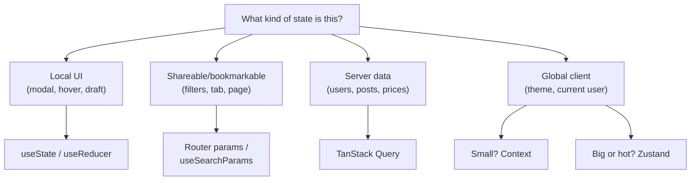

There is no "best React state library". There is the right tool for each *kind* of state. The senior answer to almost every state question begins by asking **what kind of state is this**, then picks the cheapest tool that fits.

> **Acronyms used in this chapter.** API: Application Programming Interface. CRUD: Create, Read, Update, Delete. JSON: JavaScript Object Notation. RTK: Redux Toolkit. RSC: React Server Components. SPA: Single-Page Application. SSR: Server-Side Rendering. SWR: Stale-While-Revalidate. UI: User Interface. URL: Uniform Resource Locator.

## The four kinds of state

| Kind | Where it lives | Right tool |
| --- | --- | --- |
| **Component-local** UI state (modal open, hover, form draft) | One component | `useState`, `useReducer` |
| **URL state** (current tab, filters, search) | The URL | Router params + `useSearchParams` |
| **Server cache** (data from APIs) | Server, mirrored in cache | TanStack Query, RTK Query, SWR |
| **Global client state** (theme, current user, feature flags) | App-wide | Context for cheap; Zustand / Jotai for non-trivial |

Most "we need a state library" conversations are actually "we conflated server cache with global state". Once those two are separated, the global piece is usually small enough that Context (or no library at all) suffices.

## Server cache: TanStack Query

TanStack Query (formerly React Query) is the default in 2026 for server-state management on the client. It is designed around the principle that **server data is a cache, not state you own**: the canonical copy lives on the server, the client mirrors it, and the local copy is stale by default until refresh.

```tsx
const { data, isPending, error } = useQuery({
  queryKey: ["users", userId],
  queryFn: () => fetchUser(userId),
  staleTime: 60_000,
});
```

The library provides five capabilities that hand-written `fetch` plus `useState` would not. **Caching** is keyed by `queryKey`, so the same key returns the same data without re-fetching. **Deduplication** ensures that two components requesting the same key share one in-flight request, eliminating the common "two widgets each fetch the user object" waste. **Background refetching** on window focus, network reconnect, and a configurable interval keeps the cache fresh without coupling the component to the refresh policy. **Mutations** with optimistic updates and automatic rollback let the UI respond immediately while the server confirms in the background. **Pagination and infinite query** primitives turn cursor-based and page-based APIs into ergonomic React patterns.

```tsx
const queryClient = useQueryClient();
const { mutate } = useMutation({
  mutationFn: (input: Input) => api.post("/items", input),
  onMutate: async (input) => {
    await queryClient.cancelQueries({ queryKey: ["items"] });
    const previous = queryClient.getQueryData<Item[]>(["items"]);
    queryClient.setQueryData<Item[]>(["items"], (old = []) => [...old, { id: "tmp", ...input }]);
    return { previous };
  },
  onError: (_err, _input, ctx) => {
    queryClient.setQueryData(["items"], ctx?.previous);
  },
  onSettled: () => queryClient.invalidateQueries({ queryKey: ["items"] }),
});
```

The optimistic-update pattern (cancel → snapshot → set → invalidate on settle) is the canonical shape that senior interviewers expect to hear. The four steps are: cancel any in-flight queries for the affected key so they cannot overwrite the optimistic state; snapshot the current cached value so it can be restored on failure; set the optimistic value as the new cached value; and on settlement, invalidate the key so the next render re-fetches the canonical data from the server.

> **Note:** In Next.js App Router, prefer fetching in server components and passing data down. Use TanStack Query only for client-side reactive data that needs caching, refetching, or mutation flows.

## Global client state

If it's truly global, **truly client**, and **doesn't change often**, Context is fine:

```tsx
const ThemeContext = createContext<{ theme: Theme; setTheme: (t: Theme) => void } | null>(null);
```

If the global state changes frequently and many components subscribe to it, Context becomes a performance hazard: every component reading the context re-renders whenever any field of the context value changes, regardless of which field that component actually used. At that point reach for Zustand or Jotai, both of which expose a selector-based subscription API that re-renders only the consumers whose selected slice changed.

### Zustand

```ts
import { create } from "zustand";

type Store = { count: number; inc: () => void; reset: () => void };

export const useCounter = create<Store>((set) => ({
  count: 0,
  inc: () => set((s) => ({ count: s.count + 1 })),
  reset: () => set({ count: 0 }),
}));
```

```tsx
// Only re-renders if count changes
const count = useCounter((s) => s.count);
```

Selectors are the defining feature: components subscribe to slices of the store rather than the whole store, so a change to one slice does not re-render consumers of unrelated slices. The bundle size is approximately one kilobyte.

### Redux Toolkit

Reach for Redux Toolkit (RTK) when one of three conditions holds. The application benefits from time-travel debugging in complex flows, which Redux DevTools provide out of the box and which is genuinely useful in heavy enterprise applications with many cooperating reducers. The team is large enough that a formal action/reducer/effect architecture is the right consistency mechanism, and the developers want a single shape across the codebase rather than a per-feature judgement call. Or the application already uses Redux and would benefit from RTK Query as a server-cache solution; TanStack Query has more momentum, but RTK Query is the right shape when the project is already inside the Redux ecosystem.

```ts
const counterSlice = createSlice({
  name: "counter",
  initialState: { value: 0 },
  reducers: {
    inc: (s) => { s.value += 1; },        // Immer makes mutation safe
    reset: (s) => { s.value = 0; },
  },
});

export const store = configureStore({ reducer: { counter: counterSlice.reducer } });
```

The historic "boilerplate" complaint about Redux is largely solved by RTK; `createSlice` and `configureStore` collapse the action/reducer/store wiring into a few lines. The real cost today is conceptual rather than syntactic: Redux is a substantially larger thing to learn than Zustand, and the team is paying for that complexity even on the simple slices.

## URL state: the underrated default

If a piece of state should be **shareable, bookmarkable, or restorable on refresh**, it belongs in the URL.

```tsx
// React Router v6+
const [params, setParams] = useSearchParams();
const tab = params.get("tab") ?? "overview";

// Next.js App Router
const params = useSearchParams();
const tab = params.get("tab") ?? "overview";
```

For typed, schema-validated URL state with serialization helpers, libraries like `nuqs` (Next.js) or `react-router`'s loader pattern make this ergonomic.

## Forms

Forms are usually *local* state with a *server-cache* mutation when submitted. Use **React Hook Form** for non-trivial forms — uncontrolled inputs by default mean fewer re-renders, and it pairs naturally with Zod for schema validation.

```tsx
const { register, handleSubmit, formState: { errors } } = useForm<FormValues>({
  resolver: zodResolver(formSchema),
});

return (
  <form onSubmit={handleSubmit(onSubmit)}>
    <input {...register("email")} aria-invalid={!!errors.email} />
    {errors.email && <p role="alert">{errors.email.message}</p>}
    <button>Submit</button>
  </form>
);
```

We cover this fully in [Forms](./06-forms.md).

## Decision tree



## Key takeaways

- Most state debates dissolve once you classify the state. Server cache is not global state.
- TanStack Query for server data; the optimistic update pattern (cancel → snapshot → set → invalidate) is canonical.
- URL state is underrated — anything bookmarkable belongs there.
- Context is fine for cheap, stable globals. Reach for Zustand when many components subscribe to fast-changing global state.
- RTK earns its keep in big enterprise apps; in new greenfield UI, Zustand is usually the right shape.

## Common interview questions

1. How do you decide between Context, Zustand, and Redux for a new feature?
2. Why is Context a performance hazard for fast-changing values?
3. Walk me through implementing optimistic UI for a "like" button with TanStack Query.
4. When does a piece of state belong in the URL?
5. What is the difference between TanStack Query and Redux/RTK Query?

## Answers

### 1. How do you decide between Context, Zustand, and Redux for a new feature?

The decision is driven by two questions: how often does the value change, and how many components subscribe to it. Context is the right choice for stable, infrequently-changing globals (the current theme, the locale, the authenticated user identity) where the re-render cost on change is acceptable because changes are rare. Zustand is the right choice when many components subscribe to a fast-changing global value (the current playback position in a media player, the cursor position in a collaborative editor, the live count of unread notifications) because its selector-based subscription avoids the universal re-render that Context would trigger. Redux Toolkit is the right choice when the application benefits from a formal action/reducer/effect architecture across many features and the team values the consistency it imposes.

**How it works.** Every Context consumer re-renders when the Context value's reference changes, regardless of which field the consumer reads. Zustand's `useStore(selector)` re-renders only when the selector's return value changes — implemented internally with `useSyncExternalStore` for tearing-free reads. Redux Toolkit uses the same selector pattern via `useSelector`, plus the action/reducer machinery that gives time-travel debugging and the predictable update flow.

```tsx
// Context — every consumer re-renders on any field change.
<UserContext.Provider value={{ user, theme, locale }}>{children}</UserContext.Provider>

// Zustand — only consumers of the changed selector re-render.
const theme = useApp((s) => s.theme);
```

**Trade-offs / when this fails.** Context can still be made performant by splitting it: one Context per concern (`UserContext`, `ThemeContext`, `LocaleContext`) so a change to one does not re-render consumers of the others. Zustand can hide complexity in deep object stores that are hard to reason about across features; the cure is to keep stores small and feature-scoped. Redux is overkill for a small application but earns its keep when the team grows past the size where ad-hoc state patterns drift apart. The senior signal is to articulate the trade-off, not to dogmatically advocate for one tool.

### 2. Why is Context a performance hazard for fast-changing values?

Context propagates by value identity, not by deep equality. When the value passed to `<Context.Provider>` changes — even if only one field of the value changed — every component that calls `useContext(Context)` re-renders. For a fast-changing value such as a counter that increments many times per second, the re-render storm reaches every consumer, including consumers that did not read the changed field. The cost grows linearly with the number of consumers, and the consumers may themselves trigger re-renders of their children.

**How it works.** React tracks Context subscriptions per-fiber. On each provider value change, React schedules a re-render for every subscribed fiber. There is no per-field selector mechanism in plain Context: the consumer always reads the whole value object. The standard mitigations are to split the Context into smaller Contexts so changes are scoped, to memoise the provider value so unchanged renders do not produce new references, and to extract `useSyncExternalStore`-based selectors via a helper such as `use-context-selector` for the cases where splitting is impractical.

```tsx
const value = useMemo(() => ({ user, theme, locale }), [user, theme, locale]);
<AppContext.Provider value={value}>{children}</AppContext.Provider>
```

**Trade-offs / when this fails.** Memoising the provider value is not a complete fix: as soon as one of the dependencies changes, the new object propagates and every consumer re-renders. The right tool for a value that genuinely changes many times per second and is read by many components is a state library with selector subscriptions (Zustand, Jotai, Redux). The senior framing is "Context is a transport, not a state store" — use it to provide a stable handle to a store that itself implements selector-based subscription.

### 3. Walk me through implementing optimistic UI for a "like" button with TanStack Query.

The pattern has four steps and is the canonical "optimistic update" recipe interviewers expect. First, in `onMutate` cancel any in-flight queries for the affected key so they cannot overwrite the optimistic state. Second, snapshot the current cached value via `getQueryData` and return it from `onMutate` as the rollback context. Third, set the optimistic value via `setQueryData`. Fourth, on `onError` restore the snapshot from the rollback context, and on `onSettled` invalidate the key so the next render re-fetches the canonical data from the server.

**How it works.** TanStack Query exposes a callback at each lifecycle stage of a mutation. `onMutate` runs before the request fires; its return value is passed as the third argument to `onError` and `onSettled`. The cancel-snapshot-set-invalidate sequence ensures the cache moves through three deterministic states: optimistic during the mutation, restored on failure, refreshed on success. The user sees the like immediately and the UI reverts cleanly if the server rejects the request.

```ts
useMutation({
  mutationFn: (postId: string) => api.post(`/posts/${postId}/like`, {}),
  onMutate: async (postId) => {
    await qc.cancelQueries({ queryKey: ["posts", postId] });
    const previous = qc.getQueryData<Post>(["posts", postId]);
    qc.setQueryData<Post>(["posts", postId], (p) => p && { ...p, likes: p.likes + 1 });
    return { previous };
  },
  onError: (_err, postId, ctx) => {
    if (ctx?.previous) qc.setQueryData(["posts", postId], ctx.previous);
  },
  onSettled: (_data, _err, postId) => qc.invalidateQueries({ queryKey: ["posts", postId] }),
});
```

**Trade-offs / when this fails.** The pattern assumes the mutation is independent of other in-flight mutations on the same key; rapid-fire clicks produce a stack of in-flight optimistic updates whose rollbacks may interleave incorrectly if naively implemented. The mitigation is to debounce the mutation (the second click waits for the first to settle) or to model the action as a counter rather than an increment (the request body is the new value, not a delta). The pattern is also wrong for actions whose server-side effect cannot be inferred from the client; for those, a "pending" indicator is more honest than an optimistic update.

### 4. When does a piece of state belong in the URL?

State belongs in the URL when it should be **shareable, bookmarkable, or restorable on refresh**. The canonical examples are search filters, the active tab in a tab group, the page number of a paginated list, the sort order, and the open state of a permalink-able modal (such as a "share" dialog with a unique identifier). The test is: if the user copied this URL and pasted it into a new tab, would they expect to see the same view? If the answer is yes, the state belongs in the URL.

**How it works.** Modern routers expose `useSearchParams` (React Router v6 and later, Next.js App Router) and a setter that updates the URL via `history.pushState` or `replaceState`. Reading is synchronous via `params.get(key)`. The pattern is to read the parameter as the source of truth and to write to it via the setter on user interaction; component state for the same value is unnecessary because the URL is already the canonical store.

```tsx
const [params, setParams] = useSearchParams();
const tab = params.get("tab") ?? "overview";
return (
  <Tabs value={tab} onValueChange={(next) => {
    const p = new URLSearchParams(params);
    p.set("tab", next);
    setParams(p);
  }} />
);
```

**Trade-offs / when this fails.** URL state is awkward for very large or sensitive values — the URL has length limits and is logged everywhere. The right cure is to keep the URL small (an opaque identifier rather than the full state) and to derive the rest from a fetched resource. The pattern is also wrong for ephemeral UI state that should not be shareable, such as the open state of a hover-revealed tooltip; that belongs in component state. For typed, schema-validated URL state with serialisation helpers, libraries such as `nuqs` (Next.js) or React Router's loader pattern are ergonomic.

### 5. What is the difference between TanStack Query and Redux/RTK Query?

TanStack Query is a server-state library: its data model is "this query key returned this data; here is when it expires; here is how to refetch it". It does not impose an action/reducer architecture and does not aim to manage client state. RTK Query is a thinner server-cache layer built on top of Redux Toolkit: its data is stored in the Redux store and exposed via auto-generated hooks, but the underlying machinery is Redux's reducer graph. TanStack Query is the right choice for a new application that needs server-state caching without committing to Redux; RTK Query is the right choice for an application that already uses Redux and would benefit from a unified store.

**How it works.** TanStack Query stores its cache in an in-memory `QueryClient` and exposes hooks (`useQuery`, `useMutation`, `useInfiniteQuery`) that read and write that cache. RTK Query generates a Redux slice per API definition; queries are dispatched as Redux actions and the cache is part of the Redux store. The user-facing hooks look similar, but the underlying machinery differs in that TanStack Query has its own scheduler and devtools while RTK Query reuses the Redux ecosystem.

```ts
// TanStack Query
const { data } = useQuery({ queryKey: ["users", id], queryFn: () => fetchUser(id) });

// RTK Query
const { data } = api.useGetUserQuery(id);
```

**Trade-offs / when this fails.** TanStack Query has more momentum in 2026 (more contributors, more middleware, more React-ecosystem integration) and is the default recommendation for greenfield. RTK Query has the advantage of unified store debugging when the application already uses Redux, and the cost of also requiring the team to know Redux. The pattern is wrong to reach for either when the application has no server state — for example, a pure offline-first single-page application — in which case neither library earns its keep and a simple `fetch` plus local state is the right shape.

## Further reading

- TanStack Query [practical usage docs](https://tanstack.com/query/latest/docs/framework/react/overview).
- Kent C. Dodds, ["Application state management with React"](https://kentcdodds.com/blog/application-state-management-with-react).
- Daishi Kato, ["Microstate management"](https://github.com/dai-shi/microstate-management) on Zustand-style libraries.
