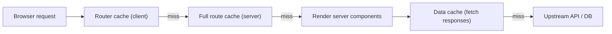

The App Router's caching model is the source of more "wait, why is this stale?" interview questions than any other Next.js topic. The mental model is layered but learnable, and a senior candidate is expected to be able to draw the four caches from memory and explain how each one is invalidated.

> **Acronyms used in this chapter.** API: Application Programming Interface. CDN: Content Delivery Network. CMS: Content Management System. DB: Database. HTML: HyperText Markup Language. ISR: Incremental Static Regeneration. LCP: Largest Contentful Paint. RSC: React Server Components. SLA: Service-Level Agreement. SSG: Static Site Generation. SSR: Server-Side Rendering. URL: Uniform Resource Locator.

## Fetch in a server component

```tsx
export default async function Page() {
  const res = await fetch("https://api.example.com/users", { next: { revalidate: 60 } });
  const users = await res.json();
  return <UserList users={users} />;
}
```

That's it. No `getServerSideProps`, no API route in front of an external API. The framework augments `fetch` with caching options.

## The four caches

Next.js maintains four conceptually distinct caches. Senior interviews expect you to name them.

| Cache | What it stores | Where | Invalidated by |
| --- | --- | --- | --- |
| **Request memoization** | Identical `fetch` calls within a single request | Per-request | Request ends |
| **Data cache** | `fetch` responses across requests | Server-wide | `revalidate`, `revalidateTag`, `revalidatePath` |
| **Full route cache** | Pre-rendered HTML & RSC payload | Server-wide | Same as data cache + redeploy |
| **Router cache** | Client-side cache of RSC payloads | Browser | Navigation, `router.refresh()` |



## Static vs. dynamic rendering

Each route is either **statically rendered** (HTML generated at build, cached) or **dynamically rendered** (HTML generated per request). Next.js infers this from what your code touches.

A route becomes dynamic if it:

- Reads `cookies()`, `headers()`, or `searchParams` from `next/headers` / page props.
- Calls `fetch(url, { cache: "no-store" })`.
- Sets `export const dynamic = "force-dynamic"`.

If your page reads cookies (because it's authenticated), it's automatically dynamic. If it doesn't, it's static — fast for free.

## Controlling fetch behaviour

```ts
// Cache forever (default for fetch)
fetch(url);

// Revalidate at most every 60 seconds
fetch(url, { next: { revalidate: 60 } });

// No caching — every request hits the upstream
fetch(url, { cache: "no-store" });

// Tag-based invalidation
fetch(url, { next: { tags: ["users"] } });
```

In Next.js 15+, the default for `fetch` is **uncached** in line with web standards. To opt into caching, set `cache: "force-cache"` or use `next.revalidate`. (If you're on 14 or earlier, the default was cached. Always read the version's docs.)

## Tag-based invalidation

The killer feature: tag your fetches, then invalidate by tag from anywhere.

```tsx
// Read
const res = await fetch("/api/users", { next: { tags: ["users"] } });

// Invalidate from a Server Action or webhook
import { revalidateTag } from "next/cache";

export async function createUser(formData: FormData) {
  await db.user.insert(/* ... */);
  revalidateTag("users");                  // every fetch tagged "users" is now stale
}
```

This means a write in one place invalidates every read of that data, regardless of where it's rendered. No more "I added a post but the homepage is stale" bugs.

## `unstable_cache` for non-fetch work

When you're not using `fetch` (DB calls, expensive computations), wrap with `unstable_cache`:

```tsx
import { unstable_cache } from "next/cache";

const getUserById = unstable_cache(
  async (id: string) => db.user.findUnique({ where: { id } }),
  ["user-by-id"],
  { revalidate: 60, tags: ["users"] },
);
```

The cache key is the second argument array. Add anything that affects the result (for example, an additional locale argument) so cache keys are unique.

## Static + dynamic in one route

Mix them. Render the page statically, then have a small dynamic island fetched at request time.

```tsx
// Static shell
export default function Page() {
  return (
    <article>
      <ProductDetails />               {/* static, pre-rendered */}
      <Suspense fallback={<Skeleton />}>
        <PriceForUser />               {/* dynamic, streams when ready */}
      </Suspense>
    </article>
  );
}

async function PriceForUser() {
  const userId = (await cookies()).get("user_id")?.value;
  const price = await getPriceForUser(userId);   // dynamic
  return <p>{price}</p>;
}
```

This is **partial pre-rendering** in essence — fast LCP for the static shell, dynamic data streamed in.

## Revalidation strategies — the framing senior candidates typically present

| Strategy | Use case |
| --- | --- |
| **No cache** (`cache: "no-store"`) | Per-request data: current user, real-time prices |
| **Time-based** (`revalidate: 60`) | Tolerates staleness; for example blog posts revalidating hourly |
| **Tag-based** (`tags + revalidateTag`) | Writes happen in the application; invalidate explicitly |
| **`revalidatePath`** | Path-scoped invalidation; useful from webhooks |
| **On-demand from webhook** | Upstream Content Management System publish webhook calls a route that runs `revalidateTag` |

When asked about caching strategy in an interview, structure the answer around four dimensions: the read pattern (how often the data is read and from how many places), the write pattern (how often it changes and from where), the freshness Service-Level Agreement (how stale is acceptable), and the cost (origin call price, latency budget). The right strategy is the one that satisfies all four — picking on any single dimension is the most common cause of the wrong answer.

## Avoiding waterfalls

Server components let you `await`. Multiple sequential awaits in one component create a waterfall. Fix by kicking off requests in parallel:

```tsx
// BAD: waterfall
const user = await getUser(id);
const posts = await getPosts(user.id);
const projects = await getProjects(user.id);

// OK: parallel
const userP = getUser(id);
const postsP = userP.then((u) => getPosts(u.id));
const projectsP = userP.then((u) => getProjects(u.id));
const [user, posts, projects] = await Promise.all([userP, postsP, projectsP]);
```

For independent fetches, simply kick them off with no await before `Promise.all`:

```tsx
const [users, posts] = await Promise.all([fetch("/users"), fetch("/posts")]);
```

## Key takeaways

- The four caches are the per-request `fetch` memoisation cache (deduplicates identical calls within a single render), the server-wide data cache (stores `fetch` responses across requests, invalidated by `revalidate`, `revalidateTag`, or `revalidatePath`), the full route cache (stores pre-rendered HTML and React Server Components payloads, invalidated like the data cache plus on redeploy), and the client router cache (stores RSC payloads in the browser, invalidated by navigation or `router.refresh()`).
- `fetch` is uncached by default in Next.js 15+, aligning with the Web Fetch standard; the application opts in with `cache: "force-cache"` or `next: { revalidate: N }`.
- Tag-based invalidation via `revalidateTag` is the cleanest pattern for any application that writes its own data: every read carries a tag, and the write invalidates by tag from the Server Action, mutation handler, or webhook.
- Wrap non-fetch async work — database calls, expensive computations, third-party SDK calls — with `unstable_cache` to inherit the same caching and tag-invalidation surface as `fetch`.
- Mix static shells with dynamic Suspense islands so the Largest Contentful Paint is dictated by the static portion and per-request data streams in afterwards.
- Avoid waterfalls by kicking off parallel fetches before any `await`, then `Promise.all` the results; sequential `await`s on independent calls is the most common cause of slow App Router pages.

## Common interview questions

1. Name the four caches in App Router and what invalidates each.
2. What changed about `fetch` defaults between Next.js 14 and 15?
3. Walk me through tag-based invalidation: how would you wire a write to invalidate every read of that data?
4. When would you reach for `unstable_cache`?
5. How do you keep an LCP-critical static shell while still showing per-user data?

## Answers

### 1. Name the four caches in App Router and what invalidates each.

The four caches are the request memoisation cache, the data cache, the full route cache, and the router cache. The request memoisation cache deduplicates identical `fetch` calls within a single server render — it lives only for the duration of one request and is invalidated automatically when the request ends. The data cache stores `fetch` responses across requests on the server and is invalidated by time-based revalidation, by `revalidateTag`, or by `revalidatePath`. The full route cache stores the pre-rendered HTML and the React Server Components payload for static routes; it is invalidated by the same mechanisms as the data cache plus a fresh deployment. The router cache stores RSC payloads in the browser to make navigation feel instant; it is invalidated when the user navigates back to a route after a configurable timeout, when the application calls `router.refresh()`, or when a Server Action triggers a revalidation.

**How it works.** The four caches form a layered hierarchy: a browser request first checks the router cache, then the full route cache, then the data cache, and finally falls through to the upstream API or database if every layer misses. Each layer has its own invalidation surface, which is what makes the model both powerful (every layer can be invalidated independently) and confusing (a developer who understands only one layer will be surprised by stale reads from another).

```text
Browser request -> Router cache -> Full route cache -> Render server components
                                                          -> Data cache (fetch responses)
                                                          -> Upstream API / DB
```

**Trade-offs / when this fails.** The model assumes every read is either a `fetch` (which the framework can intercept) or wrapped in `unstable_cache` (which the developer opts into). Reads that bypass both — direct database SDK calls, file-system reads, third-party SDK calls — are not cached and will hit the upstream on every render. The cure is to wrap them in `unstable_cache` with appropriate tags.

### 2. What changed about `fetch` defaults between Next.js 14 and 15?

In Next.js 14 and earlier, `fetch` in a server component defaulted to **cached** with no expiration; the framework cached the response indefinitely until something explicitly invalidated it. In Next.js 15+, `fetch` defaults to **uncached**, aligning with the Web Fetch standard's behaviour. The application now opts into caching with `cache: "force-cache"` or `next: { revalidate: N }`.

**How it works.** The change makes the framework's behaviour match a developer's intuition: when reading a fresh API response with `fetch`, the developer expects to actually call the upstream. The 14-and-earlier behaviour was surprising because it cached aggressively by default and required `cache: "no-store"` to actually fetch. The 15-and-later behaviour is the safer default; the application explicitly declares which reads are cacheable.

```ts
// Next.js 15+: opt in to caching explicitly.
fetch(url);                                          // uncached
fetch(url, { cache: "force-cache" });                // cached forever
fetch(url, { next: { revalidate: 60 } });            // ISR with 60s revalidation
fetch(url, { next: { tags: ["users"] } });           // tag-based invalidation
```

**Trade-offs / when this fails.** The change is a breaking shift for applications upgrading from 14. Routes that were quietly cached can become much slower and more expensive after the upgrade because every render now hits the upstream. The cure is to audit every server-component `fetch` during the upgrade, classify each as either truly per-request (leave uncached) or cacheable (add `cache: "force-cache"` or `next.revalidate`), and verify with the framework's logging that the resulting behaviour is intentional.

### 3. Walk me through tag-based invalidation: how would you wire a write to invalidate every read of that data?

The pattern has two halves. Every read of the data is tagged with a string that identifies the data set; every write that mutates the data calls `revalidateTag` with the same string. The framework remembers which cached responses carry which tags, and when `revalidateTag("users")` is called, every cached response carrying the `"users"` tag is marked stale. The next render that depends on any of those reads will fetch fresh data from the upstream.

**How it works.** The tag is registered at fetch time as part of the cache key. The framework's tag index is server-wide (not per-request), so an invalidation call from any Server Action, route handler, or webhook handler reaches every cached response across the application. The mechanism is independent of which page the read came from, which is what makes the pattern compose: a write in one route invalidates every read of that data in every other route.

```ts
// Read — tag every fetch of users.
const res = await fetch("https://api.example.com/users", {
  next: { tags: ["users"] },
});

// Write — invalidate every cached response tagged "users".
"use server";
import { revalidateTag } from "next/cache";

export async function createUser(formData: FormData) {
  await db.user.insert({ /* ... */ });
  revalidateTag("users");
}
```

**Trade-offs / when this fails.** The pattern requires the team to discipline themselves around tag naming — overly broad tags invalidate too much, overly narrow tags miss invalidations. The recommended practice is a flat namespace of resource-and-id tags (`user:123`, `posts`, `org:456:members`) rather than scattered single-purpose tags. The pattern fails for data not fetched via `fetch` or `unstable_cache`; for those, the cache layer never sees the read and the invalidation has nothing to invalidate.

### 4. When would you reach for `unstable_cache`?

`unstable_cache` is the right choice whenever the cached operation is not a `fetch` call — typically a database SDK call, a third-party SDK call (Stripe, Algolia, an internal RPC client), or an expensive pure computation that the framework cannot otherwise intercept. The wrapper inherits the same caching surface as `fetch`: time-based revalidation, tag-based invalidation, and integration with `revalidateTag` and `revalidatePath`.

**How it works.** `unstable_cache` takes three arguments: the async function to memoise, an array of strings forming part of the cache key, and an options object with `revalidate` (seconds) and `tags` (string array). The framework hashes the function's arguments together with the key array to produce the final cache key, so calls with different arguments produce different cache entries.

```ts
import { unstable_cache } from "next/cache";

const getUserById = unstable_cache(
  async (id: string, locale: string) => db.user.findUnique({ where: { id } }),
  ["user-by-id"],                          // base key — combined with arguments
  { revalidate: 60, tags: ["users"] },     // 60s TTL, invalidated by `users` tag
);

const user = await getUserById("u_123", "en"); // cache key includes "u_123" and "en"
```

**Trade-offs / when this fails.** The `unstable_` prefix is a reminder that the API is still subject to change. The wrapper's cache key is sensitive to argument shape; passing a fresh object (such as `new Date()`) on every call defeats the cache silently. The cure is to limit arguments to primitives and known-stable references and to verify cache hits in development with the framework's logging.

### 5. How do you keep an LCP-critical static shell while still showing per-user data?

The pattern is to render the page statically and wrap the per-user piece in a `<Suspense>` boundary, then fetch the per-user data inside the Suspense boundary's component. The static shell renders immediately because nothing in it depends on the request; the per-user component reads cookies (which marks only that subtree as dynamic) and streams in when its data resolves.

**How it works.** The framework's render distinguishes static and dynamic at the segment-and-Suspense-boundary level, not at the page level. A page can therefore be statically generated for everything outside its Suspense boundaries while the dynamic content streams in afterwards. The shell ships from the Content Delivery Network and dictates Largest Contentful Paint; the dynamic content arrives a few hundred milliseconds later but does not delay the initial paint.

```tsx
// Static shell — pre-rendered, fast LCP.
export default function Page() {
  return (
    <article>
      <ProductDetails />            {/* static, pre-rendered */}
      <Suspense fallback={<PriceSkeleton />}>
        <PriceForUser />            {/* dynamic, streams when ready */}
      </Suspense>
    </article>
  );
}

// Dynamic island — reads cookies, fetched per request.
async function PriceForUser() {
  const userId = (await cookies()).get("user_id")?.value;
  const price = await getPriceForUser(userId);
  return <p>{price}</p>;
}
```

**Trade-offs / when this fails.** The pattern requires the per-user data to be genuinely independent of the static shell; if the shell needs the per-user data to render correctly (for example, hiding a section based on the user's plan), the page cannot be split this way and must be entirely dynamic. The pattern is now formalised as Partial Pre-Rendering in newer Next.js releases, which makes the same mental model first-class.

## Further reading

- Next.js: [Caching](https://nextjs.org/docs/app/building-your-application/caching), [`revalidateTag`](https://nextjs.org/docs/app/api-reference/functions/revalidateTag).
- Vercel blog: ["Partial Prerendering"](https://vercel.com/blog/partial-prerendering-with-next-js-creating-a-new-default-rendering-model).
