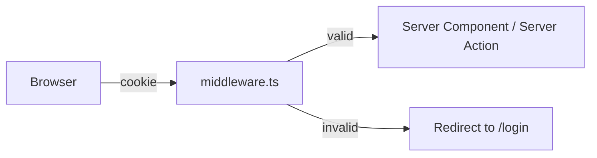

Authentication in Next.js is one of the most-asked topics in senior interviews because it touches every layer of the framework: cookies, middleware, server components, Server Actions, and route handlers. The full conceptual coverage of authentication and authorisation lives in [Part 10: Authentication & Authorization](../10-auth/index.md); this chapter is the Next.js-specific wiring around that material.

For applications that use Next.js only as a Backend-for-Frontend for a Single-Page Application elsewhere, or for the parts of the application that run client-side and need their own session lifecycle, see [Part 10 chapter 8: React client authentication](../10-auth/08-react-client.md).

> **Acronyms used in this chapter.** API: Application Programming Interface. BFF: Backend-for-Frontend. CSRF: Cross-Site Request Forgery. DB: Database. IdP: Identity Provider. JS: JavaScript. JWKS: JSON Web Key Set. JWT: JSON Web Token. MAU: Monthly Active Users. OIDC: OpenID Connect. OTP: One-Time Password. OAuth: Open Authorization. PKCE: Proof Key for Code Exchange. SAML: Security Assertion Markup Language. SPA: Single-Page Application. SSO: Single Sign-On. UI: User Interface. URL: Uniform Resource Locator. XSS: Cross-Site Scripting.

## Picking an auth layer

| Option | Best for | Trade-off |
| --- | --- | --- |
| **Auth.js** (formerly NextAuth) | Self-hosted application, OAuth providers, low-touch integration | The application owns the user store; less polished UI primitives |
| **Clerk / Kinde / Stack Auth** | Authentication, UI, and user management as a single managed service | Vendor lock-in and per-Monthly-Active-User pricing |
| **Cognito** | AWS-native shop, federated identity to other AWS services | Setup complexity and console-heavy configuration |
| **Custom session + database** | Total control, simple email/password flow | The team owns every aspect, including the security model |

For most green-field consumer-facing applications, Clerk is the fastest path to a polished sign-in flow. For business-to-business and enterprise applications that need SAML, audit logs, and tenant-scoped administration, Auth.js paired with a SSO-capable vendor (or a vendor with first-class enterprise SSO) is typically the right answer. For AWS-native shops or applications that need to call other AWS services using the user's federated identity, Cognito remains the right choice despite its setup overhead.

## Where session lives

The pattern that senior candidates are expected to advocate is the session token stored in an `HttpOnly`, `Secure`, `SameSite=Lax` (or `Strict`) cookie issued by the server. Never in `localStorage`. The reason is concrete: any JavaScript executing on the same origin can read `localStorage`, which is the exact threat model that Cross-Site Scripting exploits, while `HttpOnly` cookies are invisible to JavaScript and cannot be exfiltrated by a successful XSS attack on the page.



## Auth.js (NextAuth) skeleton

```ts
// auth.ts
import NextAuth from "next-auth";
import GitHub from "next-auth/providers/github";
import Credentials from "next-auth/providers/credentials";
import { z } from "zod";

export const { handlers, auth, signIn, signOut } = NextAuth({
  providers: [
    GitHub,
    Credentials({
      credentials: { email: {}, password: {} },
      authorize: async (raw) => {
        const { email, password } = z
          .object({ email: z.string().email(), password: z.string().min(8) })
          .parse(raw);
        return await verifyCredentials(email, password); // returns User | null
      },
    }),
  ],
  callbacks: {
    authorized: async ({ request, auth }) => {
      const isProtected = request.nextUrl.pathname.startsWith("/dashboard");
      return !isProtected || !!auth;
    },
  },
});
```

```ts
// app/api/auth/[...nextauth]/route.ts
export { GET, POST } from "@/auth";
```

```ts
// middleware.ts
export { auth as middleware } from "@/auth";
export const config = {
  matcher: ["/dashboard/:path*"],
};
```

The `authorized` callback in `auth.ts` is what middleware calls — it returns `true` to allow, `false` to redirect to `/api/auth/signin`.

### Reading the session in a server component

```tsx
import { auth } from "@/auth";

export default async function Page() {
  const session = await auth();
  if (!session) return null;
  return <p>Hello {session.user?.name}</p>;
}
```

### Sign in/out

```tsx
"use client";
import { signIn, signOut } from "next-auth/react";

<button onClick={() => signIn("github")}>Sign in with GitHub</button>
<button onClick={() => signOut()}>Sign out</button>
```

## Authorization in Server Actions

The discipline that senior candidates are expected to articulate is unequivocal: every Server Action checks the session, and every Server Action checks the caller's authorisation against the resource being mutated.

```ts
"use server";
import { auth } from "@/auth";

export async function deletePost(id: string) {
  const session = await auth();
  if (!session?.user) throw new Error("Unauthorized");
  const post = await db.post.findUnique({ where: { id } });
  if (post?.authorId !== session.user.id) throw new Error("Forbidden");
  await db.post.delete({ where: { id } });
}
```

Middleware-level authentication gates the page, but it does not gate the Server Action. Anyone with the action's hashed identifier — which is publicly served in the JavaScript bundle — can call it. Server Actions are public endpoints. The authorisation check therefore must live inside the action body, not in the surrounding component or in the middleware. (Discussed in more detail in [Server Actions: Security](./04-server-actions.md#security-server-actions-are-public-endpoints).)

## Cognito-specific notes

When the application sits in front of Cognito (the typical AWS-native setup), the flow is as follows. The Hosted UI handles the OAuth and OpenID Connect flow and redirects back to the application with an authorisation code. The application exchanges the code for tokens (ID token, access token, refresh token) using the Token endpoint. The tokens are stored in `HttpOnly` cookies and never exposed to JavaScript. The ID token's signature is validated against the Cognito JSON Web Key Set on every request that needs to trust the user's identity.

```ts
// Skeleton of the code-exchange step on the server.
async function exchangeCodeForTokens(code: string) {
  const res = await fetch(`${COGNITO_DOMAIN}/oauth2/token`, {
    method: "POST",
    headers: { "Content-Type": "application/x-www-form-urlencoded" },
    body: new URLSearchParams({
      grant_type: "authorization_code",
      code,
      client_id: process.env.COGNITO_CLIENT_ID!,
      redirect_uri: process.env.COGNITO_REDIRECT_URI!,
    }),
  });
  return res.json() as Promise<{ id_token: string; access_token: string; refresh_token: string }>;
}
```

Use a library where one fits: `aws-amplify` for the SPA path, or a custom OAuth client plus JWKS verification (for example, `jose`'s `createRemoteJWKSet`) for the server-side cookie path. The full Cognito chapter is [Part 12.7](../12-aws/07-cognito.md).

## Sign-in flows worth knowing for interviews

| Flow | When |
| --- | --- |
| **OAuth 2.0 Authorization Code + PKCE** | The default for Single-Page Applications and mobile in 2026 — no client secret in the browser |
| **OpenID Connect** | OAuth 2.0 plus an identity token; this is what "sign in with Google" actually is |
| **Magic link / One-Time Password** | Passwordless flow via email or SMS code |
| **Passkeys (WebAuthn)** | Phishing-resistant; increasingly the consumer default |
| **SAML 2.0** | Enterprise Single Sign-On; Okta, Azure Active Directory, Google Workspace |

Auth.js supports OAuth and Credentials out of the box; passkeys via the `@simplewebauthn` adapter; SAML via vendor-specific or self-hosted Identity Providers.

## Common bugs

- **Storing JSON Web Tokens in `localStorage`.** Readable by any JavaScript on the same origin, which is the exact threat model XSS exploits. Use `HttpOnly` cookies.
- **Forgetting `SameSite=Lax` (or `Strict`) on the session cookie.** Cross-Site Request Forgery risk on form submits originating from other origins.
- **Authentication check only in middleware.** Server Actions and route handlers are independent attack surfaces and must check the session themselves.
- **No refresh-token rotation.** Long-lived sessions become a substantial liability if a token leaks; rotation invalidates the leaked token on the next refresh.
- **Logging the `Authorization` header or cookie values.** The fastest way to put session tokens in the log aggregator and the easiest credential leak to make.

## Key takeaways

- For most new Next.js applications: Auth.js for self-hosted, Clerk for "authentication as a service", Cognito for AWS-native shops needing federated identity.
- Sessions live in `HttpOnly`, `Secure`, `SameSite=Lax` (or `Strict`) cookies, never in `localStorage`.
- Middleware gates pages; Server Actions also gate themselves because they are public endpoints reachable by anyone with the hashed identifier from the JavaScript bundle.
- Every Server Action validates its inputs (with Zod or equivalent) and authorises the caller against the specific resource being mutated.
- Know the OAuth 2.0 Authorization Code with Proof Key for Code Exchange flow at the level of "which party calls which endpoint, in what order, and what each step proves about the caller's identity".

## Common interview questions

1. Where would you put a Next.js app's session token, and why not `localStorage`?
2. How does middleware enforce auth? What does it not protect?
3. Walk me through the OAuth 2.0 Authorization Code + PKCE flow.
4. Trade-offs of Clerk vs. Auth.js?
5. How would you add SSO via SAML to a Next.js app?

## Answers

### 1. Where would you put a Next.js app's session token, and why not `localStorage`?

The session token belongs in an `HttpOnly`, `Secure`, `SameSite=Lax` (or `Strict`) cookie issued by the server. `HttpOnly` makes the cookie invisible to JavaScript, so a successful Cross-Site Scripting attack on the page cannot read the cookie and exfiltrate the session. `Secure` ensures the cookie is sent only over Hypertext Transfer Protocol Secure, preventing leakage on plaintext networks. `SameSite=Lax` (or `Strict`) prevents the cookie from being attached to most cross-site requests, which is the cornerstone defence against Cross-Site Request Forgery.

`localStorage` fails on the most important dimension: it is readable by any JavaScript executing on the same origin. A single successful XSS — a stored comment that smuggles a `<script>` past the sanitiser, a compromised third-party script, a misconfigured Content Security Policy — gives the attacker every active session token, with no further interaction required. Cookie-bound tokens marked `HttpOnly` are not reachable by any JavaScript code, so the same XSS leaks far less.

```ts
// Set the cookie on login — Next.js Route Handler example.
import { cookies } from "next/headers";

(await cookies()).set({
  name: "session",
  value: token,
  httpOnly: true,
  secure: true,
  sameSite: "lax",
  path: "/",
  maxAge: 60 * 60 * 8, // 8 hours
});
```

**Trade-offs / when this fails.** The cookie approach requires CSRF defences for any state-changing request that does not pass through the framework's Server Actions (which provide CSRF protection by default). The cure is to use double-submit tokens or origin checks for any state-changing route handler. The pattern is also less convenient for purely client-side applications that need to attach tokens to API calls explicitly; for those, see the [React client authentication chapter](../10-auth/08-react-client.md) for the in-memory token pattern.

### 2. How does middleware enforce auth? What does it not protect?

Middleware enforces authentication by inspecting the request's cookies (or headers) before the route is matched, and either short-circuiting the response with a redirect (typically to `/login`) or falling through to the route by returning `NextResponse.next()`. The framework calls middleware for every request that matches the configured `matcher`, so middleware is the right place to apply uniform page-level access control.

Middleware does not protect three things. It does not protect Server Actions, because Server Actions register their own HTTP endpoints that any client with the hashed identifier (publicly served in the JavaScript bundle) can invoke directly. It does not protect `route.ts` API handlers unless the middleware's matcher explicitly includes the API path. And it does not protect against authorisation issues — middleware can verify "the caller has a session" but not "the caller is allowed to mutate this specific resource", because the resource information is not available until the route handler runs.

```ts
// middleware.ts — page-level authentication only.
export function middleware(request: NextRequest) {
  if (request.nextUrl.pathname.startsWith("/dashboard")) {
    const session = request.cookies.get("session")?.value;
    if (!session) return NextResponse.redirect(new URL("/login", request.url));
  }
  return NextResponse.next();
}

// Server Action — its own authentication AND authorization check.
"use server";
export async function deletePost(id: string) {
  const session = await auth();
  if (!session) throw new Error("Unauthorized");
  const post = await db.post.findUnique({ where: { id } });
  if (post?.authorId !== session.userId) throw new Error("Forbidden");
  await db.post.delete({ where: { id } });
}
```

**Trade-offs / when this fails.** Relying on middleware as the only authentication layer is the classic Next.js authorisation bypass. The cure is to treat middleware as a coarse first line ("you must be signed in to see any dashboard page") and to have every Server Action and `route.ts` handler perform its own authentication and resource-level authorisation independently.

### 3. Walk me through the OAuth 2.0 Authorization Code + PKCE flow.

The Authorization Code flow with Proof Key for Code Exchange has six steps. First, the client generates a random `code_verifier` (a 43-128 character random string) and computes its SHA-256 hash to produce the `code_challenge`. Second, the client redirects the user to the Identity Provider's authorisation endpoint, including the `code_challenge`, the `client_id`, the requested scopes, the `redirect_uri`, and a `state` value. Third, the user authenticates with the Identity Provider and consents to the requested scopes. Fourth, the IdP redirects the user back to the `redirect_uri` with an authorisation code and the `state` value. Fifth, the client posts the code, the original `code_verifier`, the `client_id`, and the `redirect_uri` to the IdP's token endpoint. Sixth, the IdP verifies that `SHA-256(code_verifier) == code_challenge`, validates the code, and issues an access token (and optionally a refresh token and an ID token).

**How it works.** PKCE protects against an attacker who intercepts the authorisation code (typically by snooping a redirect on a public network or via a malicious application registered on the same redirect URI on a mobile device). Without PKCE, the attacker could exchange the intercepted code for tokens. With PKCE, the attacker also needs the `code_verifier`, which never leaves the client and is sent only over the back channel to the token endpoint.

```ts
// Step 1: generate verifier and challenge (in the client).
const verifier = base64url(crypto.getRandomValues(new Uint8Array(32)));
const challenge = base64url(await crypto.subtle.digest("SHA-256", new TextEncoder().encode(verifier)));

// Step 2: redirect to authorisation endpoint.
const authUrl = `${IDP}/authorize?response_type=code&client_id=${CLIENT}&redirect_uri=${REDIRECT}&scope=openid profile&state=${state}&code_challenge=${challenge}&code_challenge_method=S256`;
window.location.href = authUrl;

// Step 5: exchange code + verifier for tokens (back at the redirect URI).
const res = await fetch(`${IDP}/oauth2/token`, {
  method: "POST",
  headers: { "Content-Type": "application/x-www-form-urlencoded" },
  body: new URLSearchParams({
    grant_type: "authorization_code",
    code, code_verifier: verifier,
    client_id: CLIENT, redirect_uri: REDIRECT,
  }),
});
```

**Trade-offs / when this fails.** PKCE is the default for any client that cannot keep a secret (Single-Page Applications, mobile applications). Server-side clients with a confidential client secret can use the original Authorization Code flow without PKCE, though PKCE is harmless and increasingly recommended even for confidential clients as defence in depth. The pattern fails when the redirect URI is not properly bound to the client (registered on the IdP); that allows an attacker to register a malicious client with the same identifier on a different redirect, which the IdP can prevent by enforcing exact redirect URI matching.

### 4. Trade-offs of Clerk vs. Auth.js?

Clerk is a managed authentication service that bundles authentication, user management, organisations, sessions, and pre-built UI components. The trade-off is per-Monthly-Active-User pricing, vendor lock-in (the user store lives in Clerk's database), and dependence on a third party for authentication availability. The benefit is speed: a green-field application can have polished sign-in, sign-up, password reset, social login, and multi-factor authentication working in an afternoon.

Auth.js is a library that runs inside the application. The team owns the user store (typically in their own database via an adapter), implements the UI, handles the sign-in and sign-up flows, and is responsible for the security of the implementation. The trade-off is engineering time: a few days of integration work, ongoing maintenance burden, and the team takes on the security review of the entire authentication path. The benefit is no vendor cost, no third-party dependency, and full control over the user model and the data.

**How it works.** Clerk runs its own authentication infrastructure, hosts the user database, and exposes React components (`<SignIn />`, `<UserButton />`) that integrate with the Next.js application. Auth.js runs entirely inside the application's process, persists sessions and users in an adapter-configured database, and exposes hooks (`auth()`, `signIn()`, `signOut()`) that the application uses directly.

```tsx
// Clerk: a few lines and the UI is done.
import { SignIn } from "@clerk/nextjs";
export default function Page() { return <SignIn />; }

// Auth.js: more code, more control.
import { signIn } from "@/auth";
export default function Page() {
  return <form action={async () => { "use server"; await signIn("github"); }}><button>Sign in</button></form>;
}
```

**Trade-offs / when this fails.** Clerk is the wrong choice when the application has strict data-residency requirements, when MAU pricing makes the unit economics fail at scale, or when the application needs to do unusual things to the user model (custom fields tied to the auth flow, multi-tenant isolation that does not fit Clerk's organisation model). Auth.js is the wrong choice when the team does not have the appetite to own authentication security or when time-to-market is the dominant constraint.

### 5. How would you add SSO via SAML to a Next.js app?

The pragmatic approach is to integrate with a SAML-capable Identity Provider through Auth.js (which supports custom providers), through a vendor with first-class SAML support (Auth0, WorkOS, Stack Auth), or by placing a SAML proxy (such as `samlify` behind a custom route handler) in front of the application. The application itself rarely implements SAML directly because the protocol is intricate and security-sensitive — there are well-known attacks (XML signature wrapping, XSW attacks) that a hand-rolled implementation can fall prey to.

**How it works.** SAML 2.0 has the application redirect the user to the corporate Identity Provider with a SAML authentication request, the IdP authenticates the user against the corporate directory (Active Directory, Google Workspace, Okta), the IdP returns a signed SAML assertion to a configured Assertion Consumer Service URL on the application, and the application validates the assertion's signature against the IdP's public certificate before establishing a session.

```ts
// app/api/saml/acs/route.ts — Assertion Consumer Service skeleton via WorkOS.
import { WorkOS } from "@workos-inc/node";
const workos = new WorkOS(process.env.WORKOS_API_KEY!);

export async function POST(req: Request) {
  const formData = await req.formData();
  const samlResponse = formData.get("SAMLResponse") as string;
  const profile = await workos.sso.getProfileAndToken({
    code: samlResponse,
    clientId: process.env.WORKOS_CLIENT_ID!,
  });
  await createSessionForUser(profile.profile.email);
  return Response.redirect(new URL("/dashboard", req.url));
}
```

**Trade-offs / when this fails.** Implementing SAML from scratch is a project, not a feature; the recommended approach is always to use a library or vendor. The pattern also requires per-customer configuration (each enterprise customer's IdP has its own metadata and certificate), which is an administrative surface the application must expose. The pattern fails when the application has too few enterprise customers to justify the integration effort; for those, a service like WorkOS or Stack Auth (which charges per SAML connection, not per user) is the cost-effective choice.

## Further reading

- [Auth.js docs](https://authjs.dev/).
- [OWASP Authentication Cheat Sheet](https://cheatsheetseries.owasp.org/cheatsheets/Authentication_Cheat_Sheet.html).
- This book's [Authentication & Authorization](../10-auth/index.md) part.
