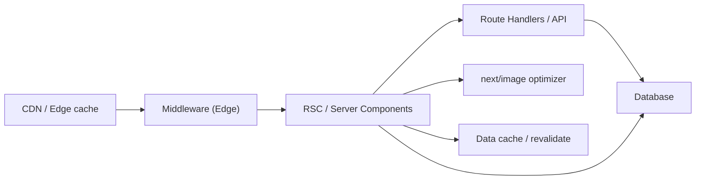

Next.js is the most opinionated of the meta-frameworks about how it expects to be deployed, and it is the area where senior interviews most often probe whether the candidate understands the trade-offs between hosted and self-managed approaches.

> **Acronyms used in this chapter.** API: Application Programming Interface. CDK: Cloud Development Kit. CDN: Content Delivery Network. CSP: Content Security Policy. DB: Database. HSTS: HyperText Transfer Protocol Strict Transport Security. IAM: Identity and Access Management. ISR: Incremental Static Regeneration. JS: JavaScript. PR: Pull Request. RDS: Relational Database Service. RSC: React Server Components. RUM: Real User Monitoring. SSR: Server-Side Rendering.

## Three realistic targets

| Target | What it is | Pros | Cons |
| --- | --- | --- | --- |
| **Vercel** | The first-party platform | Zero config; full feature support; preview URLs per PR; Edge + Node automatic; integrated analytics | Vendor lock-in; per-build/per-bandwidth pricing |
| **Self-hosted Node** (Docker + a load balancer) | `next start` on your servers | Full control; existing infra reuse; predictable cost | You own the build pipeline, the CDN, ISR cache, image optimizer, and Edge surface |
| **AWS via OpenNext** | Adapter that compiles Next.js to Lambda + S3 + CloudFront + DynamoDB | AWS-native; pairs with the rest of your AWS stack; uses Cognito/RDS naturally | Adapter has a release cadence; some Vercel-only features lag (e.g. ISR semantics) |

Two more targets are less common but worth knowing. Cloudflare Workers via `@opennextjs/cloudflare` provides an Edge-everywhere model with the constraint that Node-only APIs are unavailable; this is the right choice for applications that benefit from running every route at a Point of Presence and that do not depend on Node-specific libraries. Static export (`output: "export"`) is the right choice when the application uses no Server-Side Rendering, no Server Actions, no API routes, and no Image Optimization; the build emits a folder of static files that can be served from any object store or static-file Content Delivery Network.

## The deployment surface

A Next.js app at runtime is more than HTML + JS:



When self-hosting, you have to provide each of those pieces. When using Vercel, they're set up for you.

## Vercel deployment basics

The default flow is straightforward. Pushing to any branch creates a preview deployment with its own preview URL. Pushing to `main` (or whichever branch is configured as production) triggers a production deploy. Routes that read cookies or headers are deployed as server functions; the rest are statically generated and served with Incremental Static Regeneration semantics. Image optimisation runs on Vercel's image Content Delivery Network. The data cache and `revalidateTag` are backed by Vercel's distributed cache.

Two operational details surprise people on first deploy. First, function regions matter — server functions run in the project's configured region by default. A database in `eu-west-1` paired with a function in `iad1` (Vercel's US-East default) means every query crosses the Atlantic, adding 80 milliseconds of latency to every database call; the cure is to colocate the function region with the database region. Second, Edge functions do not have access to most Node Application Programming Interfaces — libraries that pull in `crypto`, `fs`, or native modules will fail to deploy on Edge. The cure is to either use only Web Standard APIs in Edge functions or to pin the route to the Node runtime explicitly.

## Self-hosting with Docker

Use the `output: "standalone"` build to get a tiny Node bundle:

```js
// next.config.js
module.exports = {
  output: "standalone",
};
```

```dockerfile
# Dockerfile
FROM node:20-alpine AS deps
WORKDIR /app
COPY package.json pnpm-lock.yaml ./
RUN corepack enable && pnpm install --frozen-lockfile

FROM node:20-alpine AS builder
WORKDIR /app
COPY . .
COPY --from=deps /app/node_modules ./node_modules
RUN corepack enable && pnpm build

FROM node:20-alpine AS runner
WORKDIR /app
ENV NODE_ENV=production
COPY --from=builder /app/.next/standalone ./
COPY --from=builder /app/.next/static ./.next/static
COPY --from=builder /app/public ./public
EXPOSE 3000
CMD ["node", "server.js"]
```

Self-hosting still requires the team to provide three pieces that Vercel handles. First, a Content Delivery Network in front of the application for static asset caching — typically CloudFront, Fastly, or Cloudflare — so that the application's `_next/static/*` assets and any cached HTML responses are served from a Point of Presence near the user rather than from the origin. Second, an image optimiser if the application uses `next/image`; either configure a third-party loader (Cloudinary, ImageKit) or run an optimiser service. The default optimiser uses the `sharp` library and works server-side, but the CPU cost lands on the origin and can dominate the function's resource usage at scale. Third, cache storage for `revalidateTag` and the data cache; without an external store such as Redis or a managed key-value service, each instance maintains its own in-memory cache and the caches drift out of sync across a multi-instance deploy, leading to inconsistent reads depending on which instance handles the request.

## OpenNext (AWS)

[OpenNext](https://opennext.js.org/) compiles a Next.js build into a set of AWS primitives that mirror the pieces Vercel provides. A Lambda function handles Server-Side Rendering for dynamic routes. A second Lambda function runs the image optimiser. A third Lambda function handles revalidation and Incremental Static Regeneration. An S3 bucket stores the static assets and the pre-rendered HTML and React Server Components payloads. A CloudFront distribution sits as the front door, routing each request to the right backend. A DynamoDB table stores the ISR cache and the data cache, providing consistent state across all Lambda invocations.

Deploy with SST or AWS Cloud Development Kit:

```ts
// SST v2+
new NextjsSite(stack, "Web", {
  path: ".",
  customDomain: "app.example.com",
});
```

This is the recommended path senior candidates typically advocate for AWS-native shops. Cognito, the Relational Database Service, DynamoDB, and S3 are all reachable with native Identity and Access Management roles, with no cross-vendor secrets to manage and no additional egress between vendors. The trade-off is the operational complexity of an AWS deployment versus Vercel's zero-configuration model — but in an organisation already invested in AWS, the operational complexity is a fixed cost the team has already paid.

## Configuration that often comes up in interviews

```js
// next.config.js
module.exports = {
  output: "standalone",                  // for Docker
  images: {
    remotePatterns: [{ protocol: "https", hostname: "cdn.example.com" }],
    formats: ["image/avif", "image/webp"],
  },
  experimental: {
    serverActions: { bodySizeLimit: "5mb" },
    // ppr: "incremental",                // partial pre-rendering, opt-in per route
  },
  async headers() {
    return [
      {
        source: "/:path*",
        headers: [
          { key: "X-Content-Type-Options", value: "nosniff" },
          { key: "Referrer-Policy", value: "strict-origin-when-cross-origin" },
          { key: "Permissions-Policy", value: "camera=(), microphone=()" },
        ],
      },
    ];
  },
  async redirects() {
    return [{ source: "/old", destination: "/new", permanent: true }];
  },
  async rewrites() {
    return [{ source: "/api/legacy/:path*", destination: "https://legacy.example.com/:path*" }];
  },
};
```

The `headers()` function is the application's Content Security Policy and HSTS surface — setting them here ensures they apply globally regardless of which route handles the request. (More on CSP in [Security: XSS & CSP](../11-security-and-privacy/02-xss-csp.md).)

## Observability after deploy

Whatever target the application uses, four observability concerns should be addressed from day one. First, source maps must be uploaded to the error tracker (Sentry, Datadog) so that production stack traces are readable rather than minified noise. Second, Web Vitals should be collected via the `web-vitals` library (or the framework's `useReportWebVitals`) for Real User Monitoring of Core Web Vitals (Largest Contentful Paint, Interaction to Next Paint, Cumulative Layout Shift). Third, server-side logs must be structured as JSON, tied to a request identifier propagated via HTTP headers (typically `x-request-id` or `traceparent`), and shipped to a log aggregator. Fourth, distributed tracing via OpenTelemetry should be enabled for any application that calls slow services or has a Node backend; the spans sink into Datadog, Honeycomb, or Tempo and let the team trace a single user request across every component it touches.

```ts
// app/layout.tsx — wire web-vitals to the analytics endpoint.
"use client";
import { useReportWebVitals } from "next/web-vitals";

useReportWebVitals((metric) => {
  navigator.sendBeacon("/api/vitals", JSON.stringify(metric));
});
```

The full observability story is covered in [Production Concerns: Observability](../07-production-concerns/03-observability.md).

## Key takeaways

- Three realistic targets exist: Vercel (the easiest path with zero configuration), self-hosted Node behind Docker and a load balancer (the most control), and AWS via OpenNext (the best fit for AWS-native shops with existing infrastructure investments).
- Self-hosting means owning the Content Delivery Network, the image optimiser, and the cache store separately; without external cache storage, multi-instance deployments suffer from inconsistent reads.
- OpenNext is the recommended path senior candidates typically advocate for AWS deployment of App Router applications, because it integrates naturally with Cognito, RDS, DynamoDB, and IAM.
- Use `output: "standalone"` to produce a small Docker image containing only the runtime dependencies the application actually needs.
- Set Content Security Policy, HSTS, and other security headers in `next.config.js#headers()` so they apply globally regardless of which route handles the request.
- Ship source maps, Real User Monitoring (Web Vitals), and structured logs from the first deploy; observability added later is always more painful than observability designed in.

## Common interview questions

1. What does Vercel give you that you'd have to build yourself when self-hosting?
2. Walk me through deploying a Next.js app to AWS using OpenNext.
3. Why does the deployment region of a Next.js function relative to the database matter?
4. What does `output: "standalone"` change about the build?
5. Where do you set CSP headers in a Next.js app?

## Answers

### 1. What does Vercel give you that you'd have to build yourself when self-hosting?

Vercel provides six pieces of infrastructure that self-hosting requires the team to assemble independently. A global Content Delivery Network in front of every static asset and every cacheable HTML response. An image optimisation service that handles the responsive `srcset` generation, modern format negotiation, and per-variant caching. A distributed data cache that backs `revalidateTag`, `revalidatePath`, and the framework's `fetch` cache across all instances. A region-aware function deployment model that lets a single project run server functions at multiple Points of Presence. Per-pull-request preview deployments wired to the version control system. Real User Monitoring integration with the framework's `useReportWebVitals` and a built-in dashboard.

**How it works.** Vercel runs the framework's standalone build behind its own runtime, which translates the framework's deployment manifest into the appropriate compute, cache, and routing primitives on Vercel's infrastructure. The integration is opaque from the application's perspective — the application uses the framework's APIs (`revalidateTag`, `next/image`, `useReportWebVitals`) and Vercel translates each into the underlying primitive.

```text
Self-hosted equivalent (rough):
  Static assets ........ S3 + CloudFront / R2 / GCS + Cloud CDN
  Image optimisation ... sharp on origin OR Cloudinary / ImageKit
  Data cache ........... Redis / Upstash / DynamoDB
  Multi-region compute . Lambda@Edge / Cloudflare Workers / multiple ECS regions
  Preview deploys ...... GitHub Actions + per-branch CDK / Terraform stack
  Web Vitals RUM ....... DataDog RUM / Sentry / custom endpoint + dashboard
```

**Trade-offs / when this fails.** Vercel's pricing scales per build minute and per gigabyte of bandwidth, which can exceed the cost of a self-hosted equivalent at high traffic. The cure is to model the actual costs at the application's expected scale and choose accordingly. Vercel also has data-residency limitations for regulated industries; the cure is to use OpenNext on AWS or to self-host in the required region.

### 2. Walk me through deploying a Next.js app to AWS using OpenNext.

OpenNext compiles the Next.js build into AWS primitives that mirror what Vercel provides. The build emits three Lambda functions — one for Server-Side Rendering of dynamic routes, one for the image optimiser, one for revalidation and ISR — plus an S3 bucket for static assets, a CloudFront distribution as the front door, and a DynamoDB table for the ISR and data caches. The team deploys the resulting infrastructure with SST or the AWS Cloud Development Kit, which produce the CloudFormation stack and wire the components together.

**How it works.** When a request reaches CloudFront, the distribution's behaviours route the request based on the path: static assets are served from S3, image-optimisation requests go to the image Lambda, dynamic page requests go to the SSR Lambda, and revalidation requests go to the revalidation Lambda. The SSR Lambda uses the framework's standalone build to render the route, reads from the data cache backed by DynamoDB, and writes back updated cache entries on revalidation.

```ts
// SST v2+ — declare the site as a single construct.
import { NextjsSite } from "sst/constructs";

new NextjsSite(stack, "Web", {
  path: ".",
  customDomain: "app.example.com",
  environment: {
    DATABASE_URL: rds.connectionString,
    AUTH_SECRET: process.env.AUTH_SECRET!,
  },
});
```

**Trade-offs / when this fails.** OpenNext follows the framework's release cadence with a small lag, so the latest framework features may not be supported on the day they ship — for example, partial pre-rendering took a few releases to land in OpenNext. The cure is to pin the framework version to one OpenNext supports and to follow the OpenNext changelog. The pattern also has a cold-start cost that Vercel hides better; the cure is provisioned concurrency on the SSR Lambda for latency-sensitive routes.

### 3. Why does the deployment region of a Next.js function relative to the database matter?

A Next.js server component or Server Action that queries the database does so synchronously in the request's critical path. If the function runs in `iad1` (US East) and the database is in `eu-west-1` (Ireland), every query crosses the Atlantic, adding approximately 80 milliseconds of round-trip latency per query. A page that makes five database calls is 400 milliseconds slower for that reason alone — before any rendering, before any external API calls, before any other latency contributors.

**How it works.** The function's region is the location of the compute that runs the route's render. The database's region is the location of the storage that serves the query. The latency between the two is dominated by the geographic distance and by the speed of light through fibre — there is no software optimisation that can compress 80 milliseconds of physics. The cure is colocation: place the function and the database in the same region, even if that means choosing a non-default region for the project.

```ts
// next.config.js — pin server functions to the database region.
module.exports = {
  experimental: {
    serverActions: { allowedOrigins: ["app.example.com"] },
  },
  // Region is configured per-platform — Vercel: project settings;
  // OpenNext: SST stack region; self-hosted: deployment region of choice.
};
```

**Trade-offs / when this fails.** Colocation works for single-region applications. Multi-region applications need either a geographically distributed database (with read replicas in each function's region and a write region for consistency) or an architecture that confines database access to a single backend tier called by the framework's edge functions. The pattern fails when the database is geographically far from every function region, in which case the cure is to add a regional read replica or to redesign the data access layer to batch and parallelise queries.

### 4. What does `output: "standalone"` change about the build?

`output: "standalone"` produces a Node.js application bundle in `.next/standalone/` that contains only the runtime dependencies the application actually uses, copied directly into the bundle. The standard build, by contrast, requires the entire `node_modules` directory at runtime, which can be hundreds of megabytes for a typical application. The standalone bundle is a few megabytes to tens of megabytes, depending on the application — small enough to fit in a Lambda function or a minimal Docker image without the overhead of the full dependency tree.

**How it works.** The build traces the dependency graph from the application's entry points, identifies the modules actually imported (transitively), and copies only those modules into the standalone directory. The output includes a `server.js` entry point that wraps the framework's runtime, a copy of every dependency the runtime needs, and the application's compiled `.next/` artefacts. The `.next/static/` directory and the `public/` directory are still served separately, typically from a CDN.

```dockerfile
# Multi-stage build using the standalone output.
FROM node:20-alpine AS builder
WORKDIR /app
COPY . .
RUN corepack enable && pnpm install --frozen-lockfile && pnpm build

FROM node:20-alpine AS runner
WORKDIR /app
ENV NODE_ENV=production
COPY --from=builder /app/.next/standalone ./
COPY --from=builder /app/.next/static ./.next/static
COPY --from=builder /app/public ./public
EXPOSE 3000
CMD ["node", "server.js"]
```

**Trade-offs / when this fails.** The dependency tracer occasionally misses dynamic imports or files that are required at runtime via path rather than via `require()`. The cure is the `outputFileTracingIncludes` option in `next.config.js`, which lets the application explicitly include additional files. The pattern also assumes the runtime image has the same Node.js version as the build image; mismatches between native module ABIs (such as `sharp` for image optimisation) can cause runtime failures.

### 5. Where do you set CSP headers in a Next.js app?

The recommended location is the `headers()` function in `next.config.js`, which lets the application set HTTP headers globally for every matching request regardless of which route handles it. The `headers()` function returns a list of header rules, each with a `source` glob and an array of header objects, and the framework applies the rules at the request handling layer.

**How it works.** The framework reads the `headers()` function at build time and registers the corresponding header rules in the routing layer. When a request matches a rule's `source`, the framework appends the configured headers to the response. The pattern works for static and dynamic routes alike, which is why it is the right place for security headers that must apply uniformly.

```js
// next.config.js — global Content Security Policy.
module.exports = {
  async headers() {
    return [{
      source: "/:path*",
      headers: [
        {
          key: "Content-Security-Policy",
          value: "default-src 'self'; script-src 'self' 'nonce-PLACEHOLDER'; style-src 'self' 'unsafe-inline'; img-src 'self' data: https:; connect-src 'self' https://api.example.com",
        },
        { key: "Strict-Transport-Security", value: "max-age=63072000; includeSubDomains; preload" },
        { key: "X-Content-Type-Options", value: "nosniff" },
        { key: "Referrer-Policy", value: "strict-origin-when-cross-origin" },
      ],
    }];
  },
};
```

**Trade-offs / when this fails.** The static `headers()` function cannot generate a per-request nonce; for a strict CSP that requires a unique nonce per response, the application must instead set the header in middleware (which has access to the request) and propagate the nonce to the rendered components via a request header. The cure is the `cspHeader` pattern recommended in the Next.js documentation, which generates the nonce in middleware and reads it in server components via `headers()` from `next/headers`. See [Security: XSS & CSP](../11-security-and-privacy/02-xss-csp.md) for the full discussion.

## Further reading

- Next.js: [Self-hosting](https://nextjs.org/docs/app/building-your-application/deploying), [Headers](https://nextjs.org/docs/app/api-reference/next-config-js/headers).
- [OpenNext](https://opennext.js.org/) docs.
- [SST Next.js construct](https://sst.dev/).
