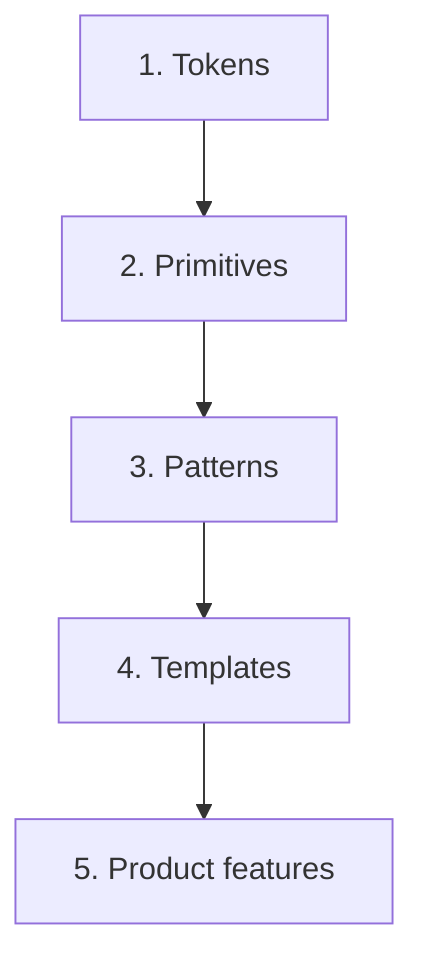

A design system is the contract between design and engineering — the shared vocabulary, set of primitives, and operational practices that let multiple product teams build consistent user interfaces without re-deciding the same questions over and over. At senior level, the candidate will be asked how they would build or evolve one, and the answer involves substantially more than "Storybook plus a button component".

> **Acronyms used in this chapter.** API: Application Programming Interface. ARIA: Accessible Rich Internet Applications. CSS: Cascading Style Sheets. JSON: JavaScript Object Notation. JS: JavaScript. PR: Pull Request. UI: User Interface. WAI: Web Accessibility Initiative.

## The five layers



The five layers form a hierarchy where each layer composes the one below it. Tokens are the lowest layer — colours, spacing scale, border radii, shadows, typography sizes — and serve as the single source of truth for every visual decision in the system. Primitives are the second layer — `Button`, `Input`, `Select`, `Dialog` — implemented as headless or lightly-styled components that consume tokens. Patterns are the third layer — `Card`, `Form`, `EmptyState` — composed from primitives to express recurring solutions to common needs. Templates are the fourth layer — `DashboardLayout`, `SettingsTemplate` — page-level assemblies that wire patterns into a coherent screen shape. Product features are the fifth layer — the actual screens, application-specific code that consumes the templates and patterns.

Most "we have a design system" conversations stop at layer 2 (tokens plus primitives). The investment compounds substantially when layers 3 and 4 are also part of the system, because patterns and templates eliminate the most repetitive product-engineering work and give the design team a vocabulary for communicating about composite UI shapes rather than only individual primitives.

## Tokens, the senior way

Tokens are JSON-shaped, framework-agnostic, and turned into CSS custom properties at build time.

```ts
// tokens/colors.ts
export const colors = {
  brand: {
    50: "oklch(95% 0.04 250)",
    500: "oklch(70% 0.15 250)",
    900: "oklch(35% 0.18 250)",
  },
  text: {
    primary: "oklch(20% 0.02 250)",
    muted: "oklch(50% 0.02 250)",
  },
} as const;
```

Convert to CSS:

```css
:root {
  --color-brand-500: oklch(70% 0.15 250);
  --color-text-primary: oklch(20% 0.02 250);
}

[data-theme="dark"] {
  --color-text-primary: oklch(95% 0.02 250);
}
```

Three concrete benefits make CSS custom properties preferable to Syntactically Awesome Style Sheets variables or JavaScript constants. Runtime theming is trivial — switching themes is a single attribute change on the document root, with no rebuild and no JavaScript hydration cost. The values compose with modern CSS functions like `color-mix`, `oklch from`, and `light-dark()`, which lets the design system express derived colours (hover states, disabled states, semitransparent overlays) declaratively. The values are accessible from every styling layer — Tailwind reads them via its `theme()` configuration, CSS Modules reads them with `var()`, vanilla CSS reads them directly, JavaScript reads them via `getComputedStyle()` — so the system has one source of truth that every consumer agrees on.

Use Style Dictionary, Theo, or a small custom script to generate per-platform output (CSS, iOS, Android, Figma) from the same JSON source. The point of the multi-platform generation is that the design team can change a token in one place and see the change propagate to every platform at the next build.

## Naming tokens: semantic, not literal

Don't name tokens after their value (`--color-blue-500`). Name them after their purpose (`--color-action-default`). Then theming becomes "swap the value", not "rename half the codebase".

| ❌ Literal | ✅ Semantic |
| --- | --- |
| `--color-blue-500` | `--color-action-default` |
| `--color-red-500` | `--color-danger-default` |
| `--space-16` | `--space-md` |
| `--font-16` | `--font-body` |

A useful two-tier model: **primitive tokens** (the literal palette) feed **semantic tokens** (purpose-named).

## Primitives: headless + variants

Build primitives with a headless lib (Radix, React Aria) for behavior and a styling layer (Tailwind, CSS Modules, Vanilla Extract) for visuals.

```tsx
import { Slot } from "@radix-ui/react-slot";
import { cva, type VariantProps } from "class-variance-authority";

const buttonVariants = cva(
  "inline-flex items-center justify-center font-medium",
  {
    variants: {
      variant: {
        primary: "bg-brand-500 text-white hover:bg-brand-600",
        secondary: "bg-gray-100 text-gray-900 hover:bg-gray-200",
        ghost: "bg-transparent text-gray-900 hover:bg-gray-50",
      },
      size: {
        sm: "h-8 px-3 text-sm",
        md: "h-10 px-4 text-base",
      },
    },
    defaultVariants: { variant: "primary", size: "md" },
  },
);

type Props = VariantProps<typeof buttonVariants> &
  React.ButtonHTMLAttributes<HTMLButtonElement> & {
    asChild?: boolean;
  };

export function Button({ asChild, variant, size, className, ...props }: Props) {
  const Comp = asChild ? Slot : "button";
  return <Comp className={buttonVariants({ variant, size, className })} {...props} />;
}
```

This is the shadcn/ui pattern. The team owns the source code, can change anything, and gets type-safe variants.

## Documentation

Storybook is the de facto standard for design-system documentation. Two practices that distinguish a senior implementation from a beginner one are worth naming. First, the stories double as visual regression tests via Chromatic or Loki — every story is a snapshot, and any visual change is surfaced in a Pull Request before it merges. Second, MDX documentation lives alongside the stories in the same file or directory, so the reference documentation stays in sync with the implementation by virtue of co-location rather than by anyone's discipline.

```md
ximport { Meta, Story, ArgsTable } from "@storybook/blocks";
import * as ButtonStories from "./Button.stories";

<Meta of={ButtonStories} />

# Button

Use the button to trigger actions. For navigation, use `<Link>`.

<Story of={ButtonStories.Primary} />
<ArgsTable of={ButtonStories.Primary} />
```

For static reference docs (color palette, spacing scale), generate them from the tokens — never hand-maintain a "design tokens" page that drifts.

## Versioning

Treat the design system like the library it is. Use Semantic Versioning rigorously: breaking changes bump the major number, backward-compatible additions bump the minor number, and bug fixes bump the patch number. Generate the changelog automatically from Pull Request labels using Changesets (the de facto standard tool for monorepo-friendly versioning), so the changelog is always in sync with the actual changes shipped. Provide codemods for major-version migrations — for example, when renaming `<Button kind="primary">` to `<Button variant="primary">`, ship a `jscodeshift` script that consumers can run against their codebase. Surface deprecation warnings in development mode for at least one full minor-version cycle before removing a deprecated API, so consumers have a runway to migrate.

If the team cannot easily roll back a major bump because product teams have already started consuming new APIs, the team moved too fast — the design system's bump cycle should give consumers time to upgrade at their own pace.

## Composition vs. configuration

The hardest part of a design system: when to add a new variant vs. when to push composition.

| Use a new variant | Push to composition |
| --- | --- |
| Used by 80%+ of consumers | Only used by one team |
| Visually consistent with existing variants | A different shape |
| Likely to be reused | A one-off |

When in doubt, **leave it out**. Variants are easy to add later, hard to remove once shipped.

## Accessibility is not a feature, it is the floor

Every primitive in the design system ships with the correct Accessible Rich Internet Applications roles and properties for its semantics, with keyboard support consistent with the Web Accessibility Initiative's [WAI-ARIA Authoring Practices](https://www.w3.org/WAI/ARIA/apg/), with focus management on open and close (focus trapping in modals, focus restoration when a popover closes), and with visible focus indicators that the consumer's theme cannot accidentally remove.

If the design system skips this work, every downstream product team must reinvent it for themselves — and they will reinvent it badly because the depth of expertise required to do this work correctly is substantial. This is exactly why headless libraries (Radix, React Aria) exist: they centralise the accessibility work so the design-system author can build on top of a solved problem rather than re-solving it for every primitive.

## Key takeaways

- The five layers are tokens, primitives, patterns, templates, and products; the most-cited "design system" investments stop at the second layer, but the compounding wins live in layers three and four.
- Tokens are JSON-shaped at the source and generated to CSS custom properties for the web; name them semantically (by purpose) rather than literally (by value).
- Two-tier tokens — a primitive palette feeding semantic tokens — make theming and white-labelling tractable; the consumer themes by remapping semantic tokens to different primitive values.
- Headless behaviour libraries combined with a styling layer (`cva` plus Tailwind, or CSS Modules) is the recommended default for design-system primitives.
- Storybook plus Chromatic provides documentation and visual regression testing; MDX documentation lives alongside the stories.
- Version with Semantic Versioning and Changesets; ship codemods for breaking changes and surface deprecation warnings for at least one minor cycle before removal.
- Accessibility is built into every primitive, not added afterwards; this is the single largest reason to use a headless library rather than rolling primitives from scratch.

## Common interview questions

1. What goes in a token vs. a component prop?
2. Why is "name the token by purpose, not value" the senior advice?
3. When do you add a new variant vs. tell the consumer to compose?
4. How would you communicate a breaking change in a design system used by twelve teams?
5. Why do most design systems use a headless primitive layer (Radix or React Aria) instead of building from scratch?

## Answers

### 1. What goes in a token vs. a component prop?

A token expresses a value that is part of the design language — a colour, a spacing unit, a border radius, a typography size — that should be consistent across the entire system. A component prop expresses a configuration of a specific component instance — a variant, a size, an icon, a label — that the consumer chooses per use. The line between the two is "is this value part of the system's vocabulary, or is it specific to this component's instance?".

**How it works.** Tokens are defined once at the system level, generated to CSS custom properties, and consumed by every primitive that needs them. Component props are defined per primitive, take values from a closed set (typically expressed as a TypeScript union), and resolve to combinations of tokens internally. The senior practice is "props select tokens" — the `variant: "primary"` prop on `<Button>` resolves internally to the `--color-action-default` token, and the consumer never names the token directly.

```ts
// Token (system-level): the system's definition of "default action colour".
:root { --color-action-default: oklch(70% 0.15 250); }

// Component (with a variant prop that selects the token):
const buttonVariants = cva("...", {
  variants: {
    variant: {
      primary: "bg-[--color-action-default] text-white",
      danger: "bg-[--color-danger-default] text-white",
    },
  },
});
```

**Trade-offs / when this fails.** The pattern fails when a consumer needs a one-off colour that does not exist in the token set; the cure is to first ask whether the colour should be added to the system (if it represents a recurring pattern) or whether the consumer should override locally with a CSS class (if it is genuinely one-off). The senior framing is "if you find yourself adding ten one-offs, you have ten new tokens".

### 2. Why is "name the token by purpose, not value" the senior advice?

Naming tokens by purpose (`--color-action-default`, `--color-danger-default`) decouples the token name from the token's current value. When the design team decides to change the brand colour from blue to teal, the system's authors update the value (`oklch(70% 0.15 250)` → `oklch(70% 0.15 180)`) and every consumer of `--color-action-default` automatically picks up the new colour. Naming by value (`--color-blue-500`) couples the name to the value, so the colour change requires either renaming half the codebase or accepting that `--color-blue-500` now resolves to a teal value (which is much more confusing than the alternative).

**How it works.** The recommended pattern is two tiers: a primitive layer that names raw colours by their visual characteristics (`--blue-500`, `--red-500`), and a semantic layer that names purposes and maps to primitives (`--color-action-default: var(--blue-500)`). Consumers reference only the semantic tokens; theming and white-labelling change the semantic-to-primitive mapping without touching consumer code.

```css
:root {
  /* Primitive tokens — the palette. */
  --blue-500: oklch(70% 0.15 250);
  --teal-500: oklch(70% 0.15 180);

  /* Semantic tokens — what consumers reference. */
  --color-action-default: var(--blue-500);
  --color-danger-default: var(--red-500);
}

[data-theme="rebrand"] {
  --color-action-default: var(--teal-500);   /* rebrand: rewire the semantic. */
}
```

**Trade-offs / when this fails.** The two-tier model adds a small amount of indirection that is visible when a single product team ships a one-off feature; the cure is to write the indirection into the design system's contributor guide so the pattern is consistent. The pattern fails when the team mixes literal and semantic naming arbitrarily; the cure is to grep for literal names (`--color-blue-`) periodically and migrate them to semantic equivalents.

### 3. When do you add a new variant vs. tell the consumer to compose?

Add a new variant when the variation is broadly applicable across the system — used by 80% or more of consumers, visually consistent with the existing variants, and likely to be reused. Tell the consumer to compose when the variation is specific to one team's product, visually different from the system's vocabulary, or genuinely a one-off that does not justify becoming a system-level concept. The default when in doubt is to leave the variant out — variants are easy to add later when demand is proven, and hard to remove once consumers have started using them.

**How it works.** A variant added to a primitive becomes a permanent part of the system's API and a maintenance burden — every future change to the primitive must consider the variant, the documentation must show it, the visual regression suite must cover it. Composition lets the consumer assemble the variation from existing primitives without adding to the system's surface area. The senior heuristic is to track requests for new variants and add them only after the third independent request from different teams.

```tsx
// Variant — system-level addition (only if broadly useful).
<Button variant="primary" size="md" />
<Button variant="primary" size="md" loading />          // new variant if many teams need this

// Composition — per-product assembly without bloating the system.
<Button variant="primary" size="md" disabled={loading}>
  {loading ? <Spinner /> : "Save"}
</Button>
```

**Trade-offs / when this fails.** The pattern fails when the team adds variants every time a designer asks; the cure is a process where variant requests are batched and reviewed in a periodic design-system meeting. The pattern also fails in the opposite direction — refusing to add genuinely useful variants and forcing every team to compose the same workaround; the cure is to actually track requests and add the variant once demand is clearly established.

### 4. How would you communicate a breaking change in a design system used by twelve teams?

Communicate breaking changes via four channels in concert. First, a major-version release with a Changesets-generated changelog that lists every breaking change and why. Second, a codemod (a `jscodeshift` script) that consumers can run to migrate their code automatically; the codemod handles the mechanical changes so the consumers only have to review the diff. Third, deprecation warnings in development mode for at least one minor cycle before the major bump, so consumers see the deprecation in their console long before they have to act on it. Fourth, a written migration guide in the design system's documentation site, with before-and-after examples and an explanation of why the change was needed.

**How it works.** The release pipeline runs Changesets to compute the version bump from the accumulated changes, generates the changelog, publishes the new package version, and (with a small extension) opens a Pull Request against each consumer repository running the codemod. The deprecation warnings are simple `console.warn` calls inside the deprecated APIs that the production build strips out so they do not affect end users.

```ts
// Deprecation warning (one minor cycle before removal).
export function OldButton(props: OldButtonProps) {
  if (process.env.NODE_ENV === "development") {
    console.warn("[ds] OldButton is deprecated; use Button.");
  }
  return <Button {...props} />;
}
```

**Trade-offs / when this fails.** The pattern requires investment in tooling (Changesets, codemods, an automated PR pipeline) that pays back at scale but feels like overhead for a small team. The pattern fails when the design system ships breaking changes without warning; the cure is the deprecation discipline plus the codemod, which together mean consumers can upgrade on their own schedule rather than under pressure. The senior framing is "the design system is a product whose users are the product teams; treat their migration cost as a real cost".

### 5. Why do most design systems use a headless primitive layer (Radix or React Aria) instead of building from scratch?

Building accessible primitives from scratch is substantially harder than it looks. The keyboard navigation patterns (arrow keys in a menu, Home and End in a tab list, Tab and Shift+Tab in a dialog with focus trapping), the ARIA roles and properties (announced correctly by every screen reader), the focus management (restoring focus when a dialog closes, moving focus to the right element when a menu opens), and the edge cases (right-to-left layouts, `Esc` to close, click-outside-to-dismiss with proper event propagation) together form a body of work that takes years of dedicated effort to get right. Headless libraries centralise this work and let the design system focus on the parts that actually differentiate it — the visual language, the composition patterns, the product-specific shapes.

**How it works.** A headless library (Radix UI, React Aria) implements the behaviour and accessibility, exposing components or hooks that the design system author wraps with the system's styling. The design system inherits the years of accessibility expertise embedded in the library and contributes only the visual layer.

```tsx
// Build on top of Radix — inherit accessibility, add styling.
import * as Dialog from "@radix-ui/react-dialog";

export function ConfirmDialog({ children }: { children: React.ReactNode }) {
  return (
    <Dialog.Root>
      <Dialog.Trigger asChild>{children}</Dialog.Trigger>
      <Dialog.Portal>
        <Dialog.Overlay className="fixed inset-0 bg-black/50" />
        <Dialog.Content className="fixed top-1/2 left-1/2 -translate-x-1/2 -translate-y-1/2 bg-white p-6 rounded-md">
          <Dialog.Title>Confirm</Dialog.Title>
          {/* ... */}
        </Dialog.Content>
      </Dialog.Portal>
    </Dialog.Root>
  );
}
```

**Trade-offs / when this fails.** The pattern adds an external dependency the team must keep current and may have to fork in unusual cases. The pattern fails when the team's needs diverge from the headless library's opinions in a deep way (a non-standard interaction model, a constrained DOM shape that the library does not support); the cure is usually to contribute the change upstream rather than fork. The senior framing is "the design system's value is in the visual language and the composition patterns; the accessibility plumbing is solved-problem territory and should be borrowed".

## Further reading

- Brad Frost, [Atomic Design](https://atomicdesign.bradfrost.com/) — the original five-layer framing.
- Nathan Curtis, ["Naming Tokens in Design Systems"](https://medium.com/eightshapes-llc/naming-tokens-in-design-systems-9e86c7444676).
- [shadcn/ui](https://ui.shadcn.com/) — exemplar of the "own the code" pattern.
- [Style Dictionary](https://amzn.github.io/style-dictionary/).
