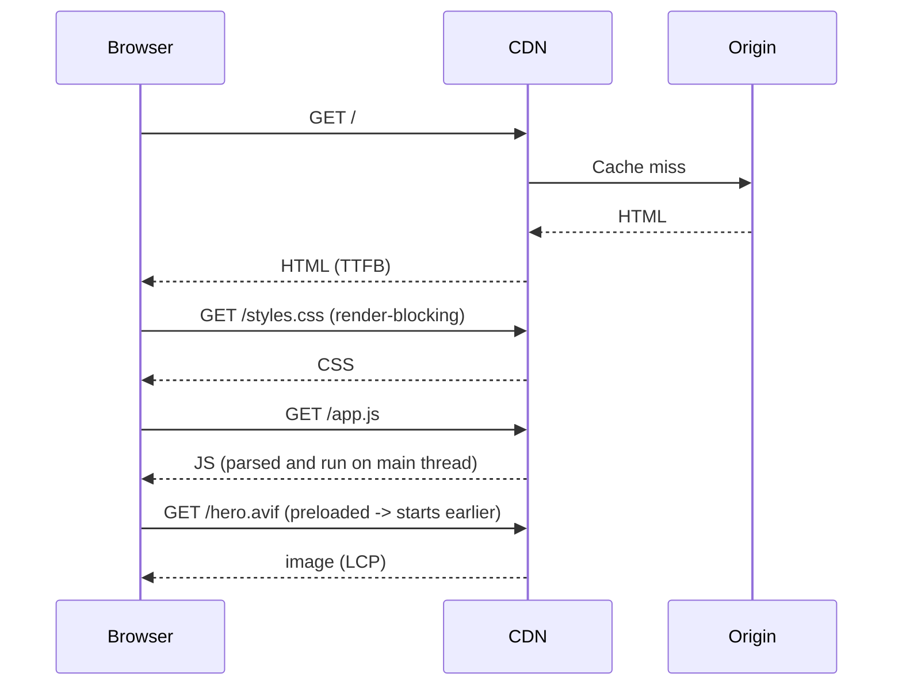

Senior performance interviews start with Core Web Vitals because they are the metrics Google uses for search ranking, the metrics the rest of the organisation reports against, and the shared vocabulary the team uses to discuss performance. A senior frontend candidate is expected to know them by name, recall the threshold values without looking, and have a debugging procedure ready for the moment the production dashboard turns red.

> **Acronyms used in this chapter.** API: Application Programming Interface. AVIF: AV1 Image File Format. CDN: Content Delivery Network. CI: Continuous Integration. CLS: Cumulative Layout Shift. CSS: Cascading Style Sheets. DNS: Domain Name System. DOM: Document Object Model. FID: First Input Delay. INP: Interaction to Next Paint. ISR: Incremental Static Regeneration. JS: JavaScript. LCP: Largest Contentful Paint. RUM: Real User Monitoring. SQL: Structured Query Language. SSG: Static Site Generation. TLS: Transport Layer Security. TTFB: Time to First Byte. UI: User Interface. WOFF2: Web Open Font Format 2. XHR: XMLHttpRequest.

## The four metrics that matter

| Metric | What | Good | Needs work | Poor |
| --- | --- | --- | --- | --- |
| **LCP** (Largest Contentful Paint) | Time until the largest above-the-fold element renders | < 2.5s | 2.5–4s | > 4s |
| **INP** (Interaction to Next Paint) | Worst observed interaction latency in the session | < 200ms | 200–500ms | > 500ms |
| **CLS** (Cumulative Layout Shift) | Sum of unexpected layout shift scores | < 0.1 | 0.1–0.25 | > 0.25 |
| **TTFB** (Time to First Byte) | Server response time | < 800ms | 800–1800ms | > 1800ms |

Interaction to Next Paint replaced First Input Delay in March 2024. The new metric is materially harsher than the old one because it captures the worst interaction latency observed across the entire session, not just the first interaction; an application that handles the first click in 50 milliseconds but the seventeenth click in 800 milliseconds has good FID and bad INP, which more accurately reflects the user's lived experience.

## LCP — the hero image problem

LCP is almost always one of three things: the hero image, the main heading, or a content block above the fold. The fix is the same shape regardless:

1. **Identify the LCP element** in DevTools' Performance panel (PerformanceObserver `largest-contentful-paint` entries).
2. **Preload it** so the browser starts fetching before HTML parsing reveals the ``.
3. **Avoid blocking** with render-blocking CSS or JS in front of it.

```html
<!-- Preload the hero -->
<link rel="preload" as="image" href="/hero.avif" fetchpriority="high"
      imagesrcset="/hero-800.avif 800w, /hero-1600.avif 1600w" imagesizes="100vw">

<!-- Reserve space to avoid CLS -->

```

In Next.js, set `priority` on the `<Image>` for the LCP image. Don't set it on others — the optimization is real but only for the *one* important image.

## INP — the long-task problem

Interaction to Next Paint is high when event handlers run long synchronous JavaScript and block the browser from painting the response. Four fixes address the most common causes. Yield to the browser between chunks of work using `await new Promise((r) => setTimeout(r, 0))` (the universally-supported approach) or `await scheduler.yield()` (the modern Chromium-and-Firefox approach), so the browser can paint the in-progress response before the next chunk runs. Move heavy work to a Web Worker — parsing, sorting, building a search index — so the main thread stays free to respond to interactions. Use React's concurrent features (`useDeferredValue`, `startTransition`) so the render work triggered by a state update is interruptible and does not block subsequent interactions. Debounce keystrokes for handlers that update derived state, so a fast typist does not trigger a derivation on every character.

```ts
// Manual yielding
async function processAll(items: Item[]) {
  for (let i = 0; i < items.length; i++) {
    process(items[i]);
    if (i % 50 === 0) await new Promise((r) => setTimeout(r, 0));
  }
}

// Modern equivalent (Chromium)
async function processAllModern(items: Item[]) {
  for (const item of items) {
    process(item);
    if ("scheduler" in window && "yield" in window.scheduler) {
      await window.scheduler.yield();
    }
  }
}
```

## CLS — the reservation problem

Cumulative Layout Shift quantifies the visual disturbance caused by content that loads after layout starts: images without dimensions push subsequent content down when they finally arrive, fonts swapping in change the metrics of every glyph on the page, advertisements injected after render shove the article half a viewport down. The fix in every case is the same — reserve the space the late-arriving content will occupy, before it arrives.

The four practical interventions: set explicit `width` and `height` attributes on every image and iframe (or use the modern `aspect-ratio` CSS property), reserve space for advertisements and third-party embeds with explicit `min-height` declarations, declare web fonts with `font-display: swap` together with `size-adjust` and `ascent-override` descriptors so the fallback font's metrics match the loaded font's metrics and no shift occurs at swap time, and add new content above existing content only in response to an explicit user action such as expanding a row, never automatically on data load.

```css
@font-face {
  font-family: "Inter";
  src: url("/fonts/inter.woff2") format("woff2");
  font-display: swap;
  size-adjust: 107%;
  ascent-override: 90%;
}
```

## TTFB — the server problem

Time to First Byte is largely outside the frontend's direct control, but the frontend influences it in three ways. Cache aggressively at the Content Delivery Network using long `max-age` directives for immutable assets and Incremental Static Regeneration or Static Site Generation for content that changes infrequently. Avoid uncached origin trips for navigation requests by ensuring no document request triggers expensive Structured Query Language queries against a live database — the rendered output of a navigation should usually come from cache, not a fresh database query. Use Edge functions for middleware-level responses such as authentication checks and geolocation rewrites, so the request never has to traverse the entire continent to reach an origin in another region.

## The loading waterfall



Two senior optimizations on this waterfall:

1. **Preconnect to known third-party origins** (analytics, fonts) early so DNS/TLS aren't on the critical path.

   ```html
   <link rel="preconnect" href="https://fonts.gstatic.com" crossorigin>
   <link rel="dns-prefetch" href="https://api.example.com">
   ```

2. **Inline critical CSS** for the above-the-fold content; defer the rest.

## Bundle and code-splitting strategy

A senior frontend engineer is expected to articulate four levels of code splitting. Route-level splitting, where each route loads only its own JavaScript, is automatic in Next.js but must be explicit in single-page applications using `React.lazy` or the framework's lazy-route APIs. Component-level lazy loading delays the JavaScript for modal dialogs, heavy chart libraries, and tab panels until the user actually opens them. Library-level dynamic imports use the `import("...")` expression to defer the load of large dependencies — `pdf-lib`, `xlsx`, video editors — until the user reaches the feature that needs them. Tree shaking is the bundler's removal of unused exports; it works correctly only when the source library declares `"sideEffects": false` in its `package.json`, so check that the libraries the team depends on are tree-shakeable before assuming the bundler will trim them.

```ts
const ChartPanel = React.lazy(() => import("./ChartPanel"));

export function Dashboard() {
  return (
    <Suspense fallback={<Skeleton />}>
      <ChartPanel />
    </Suspense>
  );
}
```

Run a bundle analysis on every deploy. `@next/bundle-analyzer` and `rollup-plugin-visualizer` produce a treemap that shows which dependencies are responsible for the largest portions of the bundle; the most common surprise is a single utility library that pulled in a transitive dependency the team did not intend to ship.

## Image optimization, fully

Image optimization is multidimensional, and each dimension matters. Serve modern formats — AVIF first, WebP as a fallback for older Safari, JPEG or PNG only as a last-resort legacy fallback — because the modern formats compress 30 to 60 percent smaller than JPEG at equivalent perceived quality. Use responsive `srcset` together with the `sizes` attribute so the browser picks the resolution that matches the actual rendered size on the user's device, avoiding both pixelation on retina displays and over-fetching on small screens. Lazy-load below-the-fold images with `loading="lazy"` and eagerly load the LCP image with `fetchpriority="high"`. Set `width` and `height` attributes on every image to prevent layout shift when the image arrives. Do not ship hero images at 4000 pixels wide when most viewports are under 2000 pixels; the largest source in the `srcset` should match the largest viewport the design supports.

## Font optimization

Font optimization has five high-leverage interventions. Self-host the font files instead of loading them from a third-party Content Delivery Network — this eliminates an additional Domain Name System lookup and Transport Layer Security handshake on the critical path, and avoids the privacy concern of sending every visitor's IP address to the font provider. Subset the font by character range (a Latin-only subset saves approximately 70 percent on most multilingual fonts). Declare `font-display: swap` so text is visible immediately in the fallback font and swaps to the loaded font when it arrives. Use variable fonts to ship one file instead of separate files per weight. Preload the WOFF2 file used for above-the-fold copy so it arrives in time to render with the right metrics from the first paint.

```html
<link rel="preload" href="/fonts/inter-var.woff2" as="font"
      type="font/woff2" crossorigin>
```

## RUM vs. lab

- **Lab**: Lighthouse, WebPageTest. Reproducible, controlled environment. Use for regression detection in CI.
- **RUM** (Real User Monitoring): web-vitals lib reporting to your backend. Reflects what real users on real networks experience.

Both matter. Lab tells you what's possible; RUM tells you what's actually happening in the long tail.

```ts
import { onLCP, onINP, onCLS, onTTFB } from "web-vitals";

function send(metric) {
  navigator.sendBeacon("/rum", JSON.stringify(metric));
}

onLCP(send);
onINP(send);
onCLS(send);
onTTFB(send);
```

## A senior performance loop

When asked "the page is slow, what do you do?":

1. **Reproduce** — what device, what network, what flow?
2. **Measure** — Lighthouse for lab, RUM data for real-user. Identify which metric is poor.
3. **Diagnose** — Performance panel, Network tab, Coverage tab. What's the bottleneck?
4. **Fix** — most fixes are in 4–5 categories: image, font, bundle, server, layout.
5. **Verify** — re-run lab, watch RUM trend.
6. **Prevent regression** — Lighthouse CI budget; alert on RUM degradation.

## Key takeaways

The four Core Web Vitals — LCP, INP, CLS, TTFB — are the shared vocabulary and the thresholds (2.5 seconds, 200 milliseconds, 0.1, 800 milliseconds) should be memorised. LCP is almost always the hero image; preload it, reserve its space with `width` and `height`, and avoid render-blocking resources in front of it. INP is fixed by yielding to the browser between chunks of work, moving heavy computation to a Web Worker, and using React's concurrent features to keep render work interruptible. CLS is fixed by reserving the space late-arriving content will occupy, before it arrives. Lab measurements (Lighthouse) detect regressions in CI; RUM (real-user monitoring with the `web-vitals` library) reveals what actual users on actual networks experience. Bundle analysis on every deploy catches accidental dependency bloat; pursue route-level, component-level, and library-level splitting. Self-host fonts, subset them, declare `font-display: swap`, and preload the WOFF2 used for above-the-fold text.

## Common interview questions

1. What replaced FID, and why?
2. The page LCP is 4s on mobile. Walk me through your debugging.
3. How does `priority` on `<Image>` actually help?
4. What's the difference between RUM and lab measurements?
5. A user reports "everything feels laggy after I scroll for a while." Where do you start?

## Answers

### 1. What replaced FID, and why?

Interaction to Next Paint (INP) replaced First Input Delay (FID) as a Core Web Vital in March 2024 because FID measured only the first interaction in the session and only its input delay (the time from user input until the handler started running), which systematically understated the latency users actually experienced. INP measures the worst observed interaction in the session and includes the full latency from input through handler execution to the next paint, which is a far better proxy for how the application actually feels to use.

**How it works.** INP listens to every interaction in the session — clicks, taps, keystrokes — and records the latency from the input event to the next paint that visually responds to it. The reported INP is the worst (or the 98th percentile for sessions with many interactions) of these measurements. The threshold for "good" is 200 milliseconds, which is the rough upper bound for an interaction to feel instantaneous.

```ts
import { onINP } from "web-vitals";
onINP((metric) => {
  navigator.sendBeacon("/rum", JSON.stringify(metric));
});
```

**Trade-offs / when this fails.** INP is harder to optimize than FID because it requires keeping every interaction fast, not just the first one. The most common cause of bad INP in a React application is a synchronous re-render of a large tree triggered by a state update; the fix is to wrap the update in `startTransition` so React can interrupt it for higher-priority work. INP also picks up handlers blocked on synchronous third-party scripts, so the audit must include the analytics, advertisement, and consent-management scripts the team has loaded.

### 2. The page LCP is 4s on mobile. Walk me through your debugging.

I would proceed in five steps: reproduce, identify the LCP element, identify what blocks it, fix the blockers, and verify with both lab and real-user data. The most common root causes are a large unoptimised hero image, a render-blocking JavaScript or CSS resource in front of the image, and a slow Time to First Byte caused by a non-cached server response.

**How it works.** The first step is to reproduce the slow LCP on a representative device — Chrome DevTools' device emulation with a "Slow 4G" network throttle is a reasonable approximation for a mobile user on a poor connection. The Performance panel's "Largest Contentful Paint" marker identifies the actual element responsible. The Network panel shows what loaded before that element and how long each request took. The most common findings: the hero image is a 2 megabyte JPEG instead of a 200 kilobyte AVIF, the LCP image is fetched after a chain of render-blocking JavaScript, or the server's TTFB alone consumes 2 seconds of the budget.

```html
<link rel="preload" as="image" href="/hero.avif" fetchpriority="high"
      imagesrcset="/hero-800.avif 800w, /hero-1600.avif 1600w" imagesizes="100vw">
```

**Trade-offs / when this fails.** The procedure assumes the LCP element is consistent across users; if the LCP element varies (for example, because different users see different hero images based on personalisation), the fix may require server-side changes to identify and preload the correct image per request. The procedure also assumes the team has access to a real device; emulated mobile in DevTools often understates the central-processing-unit cost of JavaScript on actual mobile hardware, so the real-user-monitoring data is the final arbiter.

### 3. How does `priority` on `<Image>` actually help?

The `priority` prop on Next.js's `<Image>` component does three things: it adds a `<link rel="preload" as="image">` tag to the document head so the browser starts fetching the image during HTML parsing rather than waiting for the `` tag to be discovered; it sets the `fetchpriority="high"` attribute on the rendered `` so the browser allocates more bandwidth to it; and it disables lazy loading for that image. The combined effect is that the LCP image starts loading as early as possible in the navigation.

**How it works.** Without `priority`, the browser only learns about the image after it has parsed the HTML and reached the `` tag, which on a mobile connection may be hundreds of milliseconds after the response started arriving. With `priority`, the preload tag is in the `<head>` and the browser starts the image fetch in parallel with the parse.

```tsx
<Image
  src="/hero.avif"
  width={1600}
  height={900}
  alt="..."
  priority
  fetchPriority="high"
/>
```

**Trade-offs / when this fails.** `priority` should be set on exactly one image per page — the LCP image — because if it is set on every image, the browser cannot distinguish which one matters most and the optimisation degrades to nothing. The setting also costs bandwidth on slow connections (the LCP image is fetched at the cost of other resources), so the decision to use it should be made per-page based on which image is the LCP. If the LCP element is text rather than an image, `priority` does nothing useful and the optimisation should be applied to the font instead.

### 4. What's the difference between RUM and lab measurements?

Lab measurements are reproducible synthetic measurements taken in a controlled environment — Lighthouse running in a continuous-integration pipeline, WebPageTest running from a known location with a known device emulation. Real User Monitoring (RUM) is the measurement of what actual users on actual devices and networks experience, collected by a script in the production application and reported back to the team's analytics endpoint. Both are necessary; neither is sufficient.

**How it works.** Lab measurements detect regressions deterministically: the same page and the same code produce the same score every time, so a Lighthouse score that drops by 10 points in CI is a regression in the code, not noise in the measurement. RUM measurements reveal the long tail: the user on a 3-year-old Android phone in a poor network area whose experience is 5 times worse than the lab measurement, the user whose third-party advertisement script blocks rendering for 4 seconds.

```ts
import { onLCP, onINP, onCLS, onTTFB } from "web-vitals";
const send = (metric: { name: string; value: number; id: string }) =>
  navigator.sendBeacon("/rum", JSON.stringify(metric));
onLCP(send); onINP(send); onCLS(send); onTTFB(send);
```

**Trade-offs / when this fails.** Lab measurements miss everything that depends on real-user variability — third-party scripts, network conditions, device performance — so a perfect Lighthouse score is consistent with terrible RUM data. RUM measurements miss everything that depends on the test environment — pre-deployment performance, a regression in a feature flag that has not yet rolled out — so RUM alone cannot prevent a regression from reaching production. The team needs both: lab in CI for regression prevention, RUM in production for the long tail.

### 5. A user reports "everything feels laggy after I scroll for a while." Where do you start?

I would suspect Interaction to Next Paint, specifically a memory-pressure or main-thread-pressure problem that worsens over time. The most common culprits are an event-listener leak (handlers accumulate on every scroll, and a click eventually triggers thousands of them), a state-update storm in a list component that re-renders every visible item on every scroll, and a third-party script that runs progressively more work as the page grows.

**How it works.** I would open the application in Chrome DevTools, scroll for the duration the user described, then start a Performance recording and trigger the interaction. The recording reveals which long task is responsible for the dropped frames; the Memory panel reveals whether retained DOM nodes are growing without bound. The fix depends on the diagnosis — virtualization for the list-rendering case, removing the leaking listener for the listener-leak case, deferring the third-party script for the third-party case.

```ts
function useThrottledScroll(handler: () => void) {
  useEffect(() => {
    let ticking = false;
    const onScroll = () => {
      if (ticking) return;
      ticking = true;
      requestAnimationFrame(() => { handler(); ticking = false; });
    };
    window.addEventListener("scroll", onScroll, { passive: true });
    return () => window.removeEventListener("scroll", onScroll);
  }, [handler]);
}
```

**Trade-offs / when this fails.** The investigation assumes the problem is reproducible locally; if it is not, the team needs RUM data with a session-replay tool (such as Sentry Session Replay or Datadog RUM) to see what the user was doing when the lag started. The investigation also assumes the team has the budget to instrument and measure; if the team only has the user's report and no telemetry, the investigation is limited to hypotheses.

## Further reading

- [web.dev/vitals](https://web.dev/articles/vitals).
- [`web-vitals` library](https://github.com/GoogleChrome/web-vitals).
- Addy Osmani, ["The Cost of JavaScript"](https://medium.com/@addyosmani/the-cost-of-javascript-in-2023-9c9e0a40b7af) — annual update worth re-reading.
