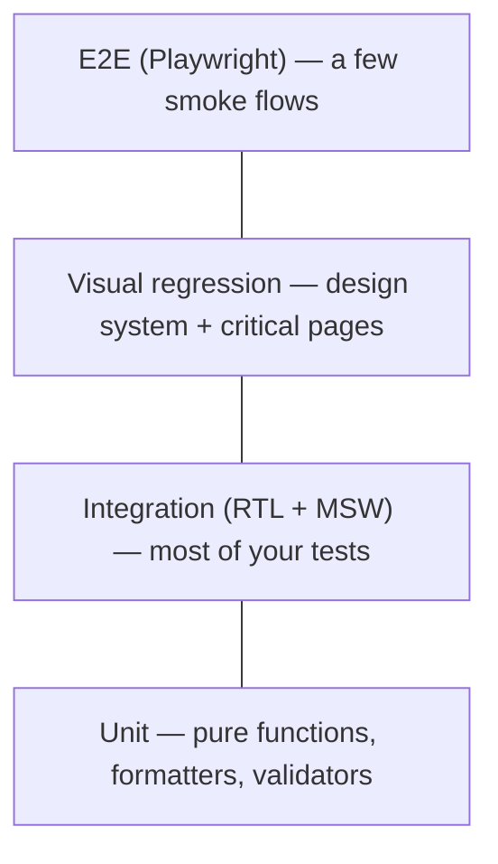

The React-specific introduction lives in [Modern React → Testing](../03-react/08-testing-intro.md). This chapter takes the senior-level systems view: what to test at which layer, what intentionally not to test, and how to wire the suite into Continuous Integration so it catches real regressions without becoming a maintenance burden that slows the team down.

> **Acronyms used in this chapter.** A11y: Accessibility (the "11" stands for the eleven letters between "a" and "y"). API: Application Programming Interface. CI: Continuous Integration. CSS: Cascading Style Sheets. DOM: Document Object Model. E2E: End-to-End. HTTP: Hypertext Transfer Protocol. JSDOM: JavaScript DOM (a Node.js implementation of the DOM). JSX: JavaScript Syntax Extension. MSW: Mock Service Worker. PR: Pull Request. RTL: React Testing Library. SVG: Scalable Vector Graphics. UI: User Interface. URL: Uniform Resource Locator. YAML: Yet Another Markup Language (or YAML Ain't Markup Language).

## The pyramid (and the trophy)

The classic test pyramid prescribes many fast unit tests, fewer integration tests, and a small number of End-to-End tests. Kent C. Dodds's "testing trophy" inverts the proportions for frontend code: most of the value comes from integration tests, because frontend correctness is overwhelmingly about the integration of multiple components, the network layer, and the user interaction model — and those concerns are not adequately covered by either pure-function unit tests or full-browser End-to-End tests.



Pick the level that's cheapest to write and most stable for the thing you want to verify.

## Layer 1: Unit tests

For pure functions: formatters, validators, reducers, math.

```ts
import { describe, it, expect } from "vitest";
import { formatCurrency } from "./format";

describe("formatCurrency", () => {
  it.each([
    [1234.5, "USD", "en-US", "$1,234.50"],
    [1234.5, "EUR", "de-DE", "1.234,50 €"],
  ])("formats %s %s in %s as %s", (n, currency, locale, expected) => {
    expect(formatCurrency(n, currency, locale)).toBe(expected);
  });
});
```

Don't unit-test React components in the "test internal state" sense — that's a Layer 2 concern.

## Layer 2: Integration tests (RTL + MSW)

This is where most of the test value lives. Render a component (or a small tree), interact with it, assert what the user sees. Mock HTTP at the network layer with **MSW**.

```tsx
import { render, screen } from "@testing-library/react";
import userEvent from "@testing-library/user-event";
import { http, HttpResponse } from "msw";
import { setupServer } from "msw/node";
import { UserProfile } from "./UserProfile";

const server = setupServer(
  http.get("/api/users/:id", ({ params }) =>
    HttpResponse.json({ id: params.id, name: "Ada Lovelace" })),
);

beforeAll(() => server.listen());
afterEach(() => server.resetHandlers());
afterAll(() => server.close());

it("loads and displays the user", async () => {
  render(<UserProfile id="1" />);
  expect(await screen.findByRole("heading", { name: /ada lovelace/i })).toBeInTheDocument();
});

it("shows a retry button when the request fails", async () => {
  server.use(http.get("/api/users/:id", () => HttpResponse.json({}, { status: 500 })));

  const user = userEvent.setup();
  render(<UserProfile id="1" />);

  await user.click(await screen.findByRole("button", { name: /retry/i }));
});
```

Mock Service Worker is preferable to `vi.mock("./api")` for three reasons. The component executes real `fetch` code, so the contract being tested is the Uniform Resource Locator, the Hypertext Transfer Protocol method, the request body, and the response — which is exactly the contract the backend cares about. The same handlers can power Storybook stories, development-mode mocking, and Cypress or Playwright tests, so the mock definitions are not duplicated across environments. Refactors that change *how* the team wraps `fetch` (changing from a custom client to `ky` to TanStack Query, for example) do not break the tests, because the tests assert against the network contract, not the implementation.

## Layer 3: End-to-end tests (Playwright)

Reserve E2E for **critical user journeys**: sign-up, checkout, the one-page-must-not-break flow. Don't build a full E2E suite — the maintenance cost grows quadratically.

```ts
import { test, expect } from "@playwright/test";

test("sign-up flow", async ({ page }) => {
  await page.goto("/signup");
  await page.getByLabel(/email/i).fill("ada@example.com");
  await page.getByLabel(/password/i).fill("secret123!");
  await page.getByRole("button", { name: /create account/i }).click();
  await expect(page).toHaveURL("/onboarding");
});
```

End-to-End tests should run against either a real backend in a dedicated test environment or a deterministic mock backend (the choice depends on whether the goal is integration testing across the full stack or front-end-only validation). They should use stable, accessible selectors — `getByRole`, `getByLabel`, `getByText` — rather than CSS class names or generated identifiers, because class names change with every refactor of the styling solution. They should be retryable but not flaky; a flaky test that passes on retry destroys team trust faster than any other failure mode, and the right response to a flaky test is to quarantine it immediately, then either fix the underlying race condition or delete the test. They should include accessibility checks via `@axe-core/playwright` so that an accessibility regression on a critical journey fails the build alongside a functional regression.

```ts
import AxeBuilder from "@axe-core/playwright";

test("home page is accessible", async ({ page }) => {
  await page.goto("/");
  const results = await new AxeBuilder({ page }).analyze();
  expect(results.violations).toEqual([]);
});
```

## Visual regression

Screenshot your design system primitives and critical pages. Diff against baseline on every PR. Catches CSS changes and unintended visual regressions that snapshot-of-DOM tests don't.

Tools: **Chromatic** (Storybook-native, hosted), **Percy**, **Loki**, **Playwright's built-in `toHaveScreenshot`**.

```ts
test("dashboard matches snapshot", async ({ page }) => {
  await page.goto("/dashboard");
  await expect(page).toHaveScreenshot("dashboard.png", { maxDiffPixelRatio: 0.01 });
});
```

Visual diffs are noisy if you're not careful: dynamic data, animations, system fonts. Mask dynamic regions and use deterministic data.

## Component-level Playwright

Playwright now has `@playwright/experimental-ct-react` — render React components in a real browser, run real Playwright assertions. Useful when JSDOM lies (for example, tests of components that depend on real layout, scrolling, or viewport size).

```ts
import { test, expect } from "@playwright/experimental-ct-react";
import { Modal } from "./Modal";

test("traps focus", async ({ mount, page }) => {
  await mount(<Modal open><button>Inside</button></Modal>);
  await page.keyboard.press("Tab");
  await expect(page.locator("button", { hasText: "Inside" })).toBeFocused();
});
```

## Contract tests (Pact-style)

If your frontend talks to a backend you don't own, or to multiple backends, **consumer-driven contracts** prevent the "we agreed on the schema, but they shipped a breaking change" failure mode.

The frontend writes a contract (this is the request I send, this is the response I expect). The backend's CI runs against the contract; if it can't satisfy it, the build fails.

Tools: **Pact**. Worth it for multi-team backends; overkill for monorepos.

## Accessibility in CI

Run `axe-core` in:

- **Component tests** with `jest-axe`.
- **E2E tests** with `@axe-core/playwright`.
- **Storybook** with `@storybook/addon-a11y`.

Catch rules: contrast, missing labels, role conflicts. Manual screen-reader testing remains required for full coverage; automation catches ~30% of real issues.

## What NOT to test

A senior testing strategy is as much about discipline regarding what to skip as about what to cover. Do not test implementation details — internal component state, lifecycle method ordering, the exact shape of prop objects — because these tests break on every refactor without catching any user-visible regression. Do not test third-party libraries; the team should assume React, Next.js, and Vitest work as documented and concentrate testing effort on the team's own code. Do not test trivial code such as `function add(a, b) { return a + b; }` because the cost of writing the test exceeds the probability of a bug. Do not test generated artifacts (type definitions, OpenAPI client code, Scalable Vector Graphics snapshots no one reviews) because a regression there indicates the generator is broken, not the generated output. Do not snapshot full component trees, because such snapshots drift over time, get regenerated without thought during routine refactors, and quickly stop catching anything meaningful.

## Coverage

Aim for approximately 70 percent coverage as a smoke check, and do not pursue 100 percent. Coverage measures which lines of code executed during the test run, not whether the assertions made about that execution were meaningful — a test that calls a function but does not assert anything about its output contributes to coverage without contributing to safety. Use coverage to identify unexpected gaps (an entire module that has no tests at all), not as a primary quality metric.

## CI test layout

A typical setup:

```yaml
# .github/workflows/test.yml
jobs:
  unit-and-integration:
    runs-on: ubuntu-latest
    steps:
      - uses: actions/checkout@v4
      - uses: pnpm/action-setup@v4
      - run: pnpm install --frozen-lockfile
      - run: pnpm typecheck
      - run: pnpm lint
      - run: pnpm test:unit -- --coverage

  e2e:
    runs-on: ubuntu-latest
    steps:
      - uses: actions/checkout@v4
      - uses: pnpm/action-setup@v4
      - run: pnpm install --frozen-lockfile
      - run: pnpm exec playwright install --with-deps chromium
      - run: pnpm build
      - run: pnpm test:e2e

  visual:
    runs-on: ubuntu-latest
    steps:
      - uses: actions/checkout@v4
      - uses: pnpm/action-setup@v4
      - run: pnpm install --frozen-lockfile
      - run: pnpm chromatic --exit-zero-on-changes
```

Runtime budget: unit + integration < 2 min, E2E < 5 min, visual on a separate workflow that's allowed to take longer.

## Key takeaways

The testing trophy concentrates effort where the value is: integration tests using React Testing Library and Mock Service Worker carry most of the safety, with a thin layer of End-to-End tests for critical journeys and unit tests for pure functions. Mock Hypertext Transfer Protocol traffic at the network boundary with Mock Service Worker so the same handlers are reused across tests, Storybook, and development-mode mocking. Reserve End-to-End tests for the user journeys that absolutely must not break and quarantine flaky tests immediately to preserve team trust. Add visual regression for the design system and the critical pages. Accessibility checks in Continuous Integration catch approximately 30 percent of real issues, so manual screen-reader passes remain required. Treat coverage as a smoke check at around 70 percent rather than as a goal in itself.

## Common interview questions

1. Where does most of your test value come from in a frontend codebase?
2. Why MSW instead of stubbing fetch?
3. When is an E2E test the right tool? When is it the wrong one?
4. How would you wire accessibility checks into CI?
5. A snapshot test breaks. How do you decide whether to update it or fix the regression?

## Answers

### 1. Where does most of your test value come from in a frontend codebase?

The integration layer — components rendered with React Testing Library and the network mocked with Mock Service Worker — produces the most value per line of test code in a typical frontend codebase. This layer exercises the actual user-visible behaviour (a click on a button triggers a fetch, the response renders into the DOM, and the right text appears for the user) without coupling the test to internal implementation details such as which custom hook or which state-management library happens to be in use today.

**How it works.** A unit test of a reducer asserts that a state transition function produces the right new state for a given action; that is useful for pure logic but says nothing about whether the user can actually see the result. An integration test of the component that consumes the reducer renders the component, dispatches the action through a real user interaction, and asserts that the user sees the right text — which is the property the team actually cares about. A full End-to-End test is more comprehensive but costs orders of magnitude more in runtime, infrastructure, and flakiness.

```tsx
import { render, screen } from "@testing-library/react";
import userEvent from "@testing-library/user-event";

it("adds an item when the user clicks Add", async () => {
  const user = userEvent.setup();
  render(<TodoList />);
  await user.type(screen.getByLabelText(/new task/i), "Buy milk");
  await user.click(screen.getByRole("button", { name: /add/i }));
  expect(screen.getByText("Buy milk")).toBeInTheDocument();
});
```

**Trade-offs / when this fails.** The integration layer is poor at catching pure-logic bugs (a date-formatting edge case, a currency-rounding error) because the assertions are about visible behaviour, not internal correctness. For those cases, write a unit test of the pure function. The integration layer also cannot validate cross-page flows (a sign-up that spans three pages, an authentication flow with a redirect to an Identity Provider); for those, the team needs End-to-End tests.

### 2. Why MSW instead of stubbing fetch?

Mock Service Worker intercepts requests at the network layer rather than mocking the `fetch` function or the team's API client, which means the test exercises the real fetch code, the real request serialization, the real response deserialization, and the real error handling. The contract being tested is the URL, the HTTP method, the request body, and the response — which is exactly the contract the backend honours, so the test fails when the backend changes the contract and passes when the contract is met regardless of how the frontend wraps `fetch`.

**How it works.** When a `fetch` call leaves the application code, it traverses the team's wrapper (which may add an `Authorization` header, a request identifier, or retry logic), reaches the network, and is intercepted by Mock Service Worker before any real network traffic is generated. The handler returns a synthetic response, which the team's wrapper then unwraps and the application code processes as if the response had come from the real backend. The same handler files can be loaded in Storybook and in development mode, giving the team a single source of truth for the mock backend.

```ts
import { http, HttpResponse } from "msw";

export const handlers = [
  http.get("/api/users/:id", ({ params }) =>
    HttpResponse.json({ id: params.id, name: "Ada Lovelace" })),
  http.post("/api/sessions", async ({ request }) => {
    const body = await request.json();
    return HttpResponse.json({ token: "abc" });
  }),
];
```

**Trade-offs / when this fails.** Mock Service Worker is overkill when the team has a small number of pure-function tests that do not need to make network calls; in those cases, a direct mock of the dependency is simpler. Mock Service Worker also requires careful management of handler scope — a handler set for one test that leaks into the next test produces confusing failures, which is why the canonical setup includes `server.resetHandlers()` in `afterEach`.

### 3. When is an E2E test the right tool? When is it the wrong one?

End-to-End tests are the right tool for critical user journeys that span multiple pages, multiple services, or both — sign-up, checkout, password reset, the core "user does the thing the application exists to do" flow. They are the wrong tool for everything else: testing the rendering of an individual component, the behaviour of a single form, the response of a single API call. The cost of an End-to-End test is roughly 100 times the cost of an integration test in terms of runtime, infrastructure, and ongoing maintenance, so the team should write the smallest possible number of them.

**How it works.** End-to-End tests run a real browser against a real backend (or a deterministic mock backend), traverse the actual application as a user would, and assert against the visible result. They catch problems that no other test layer can catch: a misconfigured Content Security Policy that breaks the actual page in a real browser, a backend deployment that broke the contract, a routing change that left an orphaned page. They are also the slowest, flakiest, and most expensive tests in the suite.

```ts
import { test, expect } from "@playwright/test";

test("sign-up flow", async ({ page }) => {
  await page.goto("/signup");
  await page.getByLabel(/email/i).fill("ada@example.com");
  await page.getByLabel(/password/i).fill("secret123!");
  await page.getByRole("button", { name: /create account/i }).click();
  await expect(page).toHaveURL("/onboarding");
});
```

**Trade-offs / when this fails.** End-to-End tests fail most often because of flakiness — a race condition between the test and the page, a slow backend, a network glitch — and the team's response to flakiness determines whether the suite is useful. The right response is to quarantine the flaky test immediately (move it to a separate suite that does not block deploys), then either fix the underlying race condition or delete the test. Letting flaky tests block deploys destroys team trust; letting them stay in the suite without action means the team starts ignoring failures, which destroys the value of the entire suite.

### 4. How would you wire accessibility checks into CI?

Accessibility checks belong at three layers in a Continuous Integration pipeline. Component tests use `jest-axe` (or its Vitest equivalent) to fail the build when a component renders with detectable accessibility violations. End-to-End tests use `@axe-core/playwright` to check the assembled pages for violations that only emerge from the integration. Storybook uses `@storybook/addon-a11y` so designers and developers see violations during interactive development before any code is committed.

**How it works.** The `axe-core` rules engine inspects the rendered DOM and applies the Web Accessibility Initiative — Accessible Rich Internet Applications rules. It catches the deterministic, machine-detectable subset of accessibility issues: missing form labels, insufficient colour contrast, conflicting ARIA roles, missing alternative text on informative images, headings out of order. The same engine runs at all three layers, so a violation introduced in a component fails the component test in the team's local development environment, fails the build in Continuous Integration, and is flagged in Storybook before the code is even committed.

```ts
import { test, expect } from "@playwright/test";
import AxeBuilder from "@axe-core/playwright";

test("home page is accessible", async ({ page }) => {
  await page.goto("/");
  const results = await new AxeBuilder({ page })
    .withTags(["wcag2a", "wcag2aa"])
    .analyze();
  expect(results.violations).toEqual([]);
});
```

**Trade-offs / when this fails.** Automated accessibility checks catch approximately 30 percent of real accessibility issues; the remaining 70 percent — focus order, screen-reader announcement quality, keyboard interaction logic, semantic correctness of headings — require manual testing with an actual screen reader (NVDA on Windows, VoiceOver on macOS, JAWS in some enterprises) and keyboard-only navigation. The senior framing in interviews is "automation is the floor, not the ceiling".

### 5. A snapshot test breaks. How do you decide whether to update it or fix the regression?

The decision rule is to read the diff and ask "is this change intentional and visible to the user, or is this an unintended regression?". If the diff matches an intended change (the team intentionally renamed a class, added an attribute, restructured the markup to fix a bug), update the snapshot. If the diff is an unintended consequence of an unrelated change (a refactor that should not have changed the markup did), the snapshot caught a regression and the underlying code should be fixed.

**How it works.** Snapshot tests provide value only when someone reads the diff and makes this decision; a workflow that auto-regenerates snapshots without review provides no safety. The team's discipline — every snapshot change reviewed in the Pull Request, with an explicit comment on why the change was intentional — is what makes snapshots useful.

```bash
pnpm test -- -u
git diff
git add __snapshots__/
```

**Trade-offs / when this fails.** Full-component-tree snapshots fail the discipline test in practice: they drift on every routine change, the diffs are too large to read, and reviewers learn to rubber-stamp the regenerations. The right scope for a snapshot is a small, stable artifact — the rendered output of a formatter, a compiled CSS class string, the JSON shape of an API response — where any change is significant. Inline-snapshot tests (`toMatchInlineSnapshot`) make the discipline easier because the expected output lives in the test file and the diff is local.

## Further reading

- Kent C. Dodds, ["Write tests. Not too many. Mostly integration."](https://kentcdodds.com/blog/write-tests).
- [Playwright docs](https://playwright.dev/).
- [MSW docs](https://mswjs.io/).
- [Pact](https://docs.pact.io/) for contract testing.
