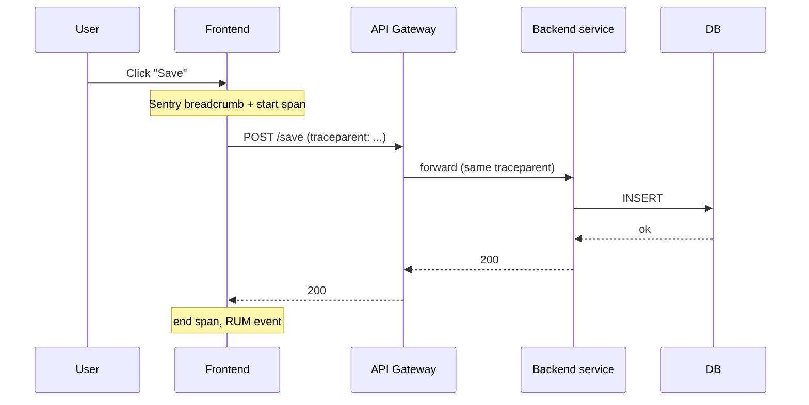

The team cannot fix what it cannot see. Senior frontend engineers ship code with observability built in from the first commit, treating errors, real-user performance, structured logs, and distributed tracing across the frontend-to-backend boundary as features of the application rather than as afterthoughts retrofitted in response to incidents. This chapter is the operational baseline that an experienced engineer brings to every production application.

> **Acronyms used in this chapter.** APM: Application Performance Monitoring. API: Application Programming Interface. BE: Backend. CI: Continuous Integration. DB: Database. DNS: Domain Name System. DSN: Data Source Name (the Sentry project identifier). DOM: Document Object Model. FE: Frontend. HTTP: Hypertext Transfer Protocol. INP: Interaction to Next Paint. OTel: OpenTelemetry. P75: 75th percentile. PII: Personally Identifiable Information. RUM: Real User Monitoring. SSN: Social Security Number. UI: User Interface. URL: Uniform Resource Locator. W3C: World Wide Web Consortium.

## The four signals

| Signal | Tool | Question it answers |
| --- | --- | --- |
| **Errors** | Sentry, Datadog Errors, Bugsnag | *Did anything break?* |
| **Metrics / RUM** | web-vitals → Datadog/Honeycomb/your backend | *How's the user experience?* |
| **Logs** | Browser console -> backend (rare) + server logs | *What happened, in order?* |
| **Traces** | OpenTelemetry, Datadog APM, Honeycomb | *Where did the time go?* |

## Errors

Wire Sentry at the root of the app:

```ts
import * as Sentry from "@sentry/react";

Sentry.init({
  dsn: import.meta.env.VITE_SENTRY_DSN,
  environment: import.meta.env.MODE,
  release: import.meta.env.VITE_RELEASE,
  tracesSampleRate: 0.1,
  replaysSessionSampleRate: 0.0,
  replaysOnErrorSampleRate: 1.0,
  integrations: [Sentry.browserTracingIntegration(), Sentry.replayIntegration()],
});
```

Two things must happen for Sentry to be useful in production. The team must upload source maps on every build — without them, every stack trace points into minified output (`app.abc123.js:1:42:42`) and is functionally illegible; the Sentry build plugins for Vite, Next.js, and webpack handle the upload automatically when configured. The team must tag every release with a stable identifier (`release: "1.4.2"` or a Git short hash), so a regression introduced in a particular release is filterable in the dashboard and can be correlated with the deployment timeline.

### Catching what Sentry doesn't auto-catch

Sentry's auto-instrumentation captures errors that bubble to `window.onerror` and unhandled promise rejections. The team still needs to capture errors that auto-instrumentation cannot reach: errors thrown inside event handlers that the team's code catches before they propagate (wrap them in `try/catch` and call `Sentry.captureException`), errors in asynchronous code that runs outside React's render tree (Web Workers, `BroadcastChannel` message handlers, top-level `setTimeout` callbacks), and React render errors that an Error Boundary intercepts (the boundary's `componentDidCatch` is the right place to call `Sentry.captureException` so the boundary fallback renders and the error is reported).

```tsx
import { ErrorBoundary } from "react-error-boundary";

<ErrorBoundary
  FallbackComponent={ErrorView}
  onError={(error, info) => Sentry.captureException(error, { extra: info })}
>
  <App />
</ErrorBoundary>
```

### Filtering noise

Out-of-the-box Sentry is noisy and the noise drowns out signal unless the team filters it. Three categories of noise account for the majority of false-positive volume: browser extension errors (stack frames whose paths start with `chrome-extension://` or `moz-extension://`, which originate in code the team did not write), network errors that are not the team's responsibility (Domain Name System failures on the user's side, advertisement-blocker-induced request failures), and bot traffic (crawler user-agents that trigger errors the team will never reproduce in a real session).

```ts
Sentry.init({
  // ...
  beforeSend(event, hint) {
    if (hint?.originalException?.message?.match(/ResizeObserver loop/)) return null;
    return event;
  },
  ignoreErrors: ["ResizeObserver loop limit exceeded", /Loading chunk \d+ failed/],
});
```

The "Loading chunk failed" pattern is the classic deploy-during-active-user error — handle it by reloading the page.

## RUM with web-vitals

Send Core Web Vitals from real users to your backend (or a vendor).

```ts
import { onLCP, onINP, onCLS, onTTFB, onFCP } from "web-vitals";

function send(metric) {
  const body = JSON.stringify({
    name: metric.name,
    value: metric.value,
    id: metric.id,
    rating: metric.rating,
    navigationType: metric.navigationType,
    url: location.pathname,
    release: import.meta.env.VITE_RELEASE,
  });
  // sendBeacon survives page unload; fetch with keepalive is the fallback
  if (navigator.sendBeacon) {
    navigator.sendBeacon("/rum", body);
  } else {
    fetch("/rum", { method: "POST", body, keepalive: true });
  }
}

[onLCP, onINP, onCLS, onTTFB, onFCP].forEach((fn) => fn(send));
```

Slice by **route**, **device class** (`navigator.connection?.effectiveType`), and **release** to find regressions.

In Next.js, use `useReportWebVitals` instead.

## Logs from the frontend

The default position is to *not* ship logs from the browser to a log aggregator. Browser logs are voluminous, expensive to store and index, and almost never what the team actually wants to see — what the team typically needs is errors (Sentry), real-user metrics (the `web-vitals` library), and distributed traces (OpenTelemetry).

The exception is when the team needs to debug a specific class of issue that is not visible to the other three signals — for example, the WebSocket reconnection logic in a real-time chat application, where the sequence of events leading to a failed reconnection is the diagnostic signal. In that case, wire a structured logger that ships to a backend with a per-session identifier, scope it tightly to the feature being debugged, and treat it as a temporary tool that is removed once the issue is understood. Avoid always-on browser logging.

```ts
function log(level: "info" | "warn" | "error", message: string, context: object) {
  fetch("/logs", {
    method: "POST",
    body: JSON.stringify({
      level, message, context,
      sessionId: getSessionId(),
      ts: Date.now(),
      ua: navigator.userAgent,
    }),
    keepalive: true,
  });
}
```

## Distributed tracing FE → BE

Stamp every outgoing request with a trace header so the backend's APM can stitch the frontend interaction to the backend trace.

```ts
import { trace, context, propagation } from "@opentelemetry/api";

async function fetchWithTrace(input: string, init: RequestInit = {}) {
  const headers = new Headers(init.headers);
  propagation.inject(context.active(), headers, {
    set: (carrier, key, value) => carrier.set(key, value),
  });
  return fetch(input, { ...init, headers });
}
```

The header standard is **W3C `traceparent`**:

```text
traceparent: 00-4bf92f3577b34da6a3ce929d0e0e4736-00f067aa0ba902b7-01
```

Most APMs (Datadog, Honeycomb, New Relic) understand this and link the FE span to the BE trace automatically.

## Session replay

Tools such as Sentry Session Replay, LogRocket, and FullStory record Document Object Model mutations, console output, and network activity, then let an engineer watch a reproduction of what the user saw at the moment an error occurred. The debugging value is substantial — many bugs that are impossible to reproduce locally become trivial to understand when the team can watch the user's session — but the privacy implications must be managed carefully. Mask Personally Identifiable Information by default: Social Security Number fields, password fields, credit card fields, and any other field flagged as sensitive should be replaced with placeholders in the replay. Sample sessions rather than recording every user, both to control cost and to limit privacy exposure. Document the recording in the privacy policy and the consent user interface so users are aware that interactions may be captured.

The cost-effective senior default is `replaysSessionSampleRate: 0.0` and `replaysOnErrorSampleRate: 1.0` — record nothing by default, but record everything around an error so the team has the context to debug it.

## Alerting

Good alerts share three properties: they are pageable (the on-call engineer should wake up for an error rate above a defined threshold per minute, an Interaction-to-Next-Paint 75th percentile above 500 milliseconds sustained for ten minutes, a deploy-related regression detected within minutes of a release), actionable (the alert links to the trace, the release, the offending commit), and owned (a specific team is paged with a defined response procedure, not a generic frontend channel that no one watches).

Bad alerts share three antipatterns: random noise (the error count went up by one — natural variation, not a regression), measurement-noise alerts (the Lighthouse score dropped by 0.5 — within the variance of a lab measurement), and customer-irrelevant pages (anything that wakes the on-call engineer on a Saturday for an issue with no customer impact). The team's alert hygiene is what determines whether the on-call rotation is sustainable; over-alerting trains the on-call engineer to dismiss alerts, and the moment a real incident arrives, it is dismissed too.

## A request's full trace



When this works, an INP regression in the UI links straight to the slow DB query. That's the senior story you want to tell.

## Key takeaways

The four signals — errors via Sentry, real-user metrics via the `web-vitals` library, distributed traces via OpenTelemetry, and logs (rarely from the frontend) — should be wired in early in the project lifecycle, not retrofitted in response to an incident. Source-map upload and stable release tagging are non-negotiable preconditions for Sentry to repay its cost; without them, every stack trace points into minified code. Use `navigator.sendBeacon` for real-user metrics so the report survives the page unload that follows the worst sessions. Propagate the W3C `traceparent` header on every outgoing request so the team's Application Performance Monitoring system can stitch the frontend interaction to the backend trace and the database query. Sample session replay on errors only and mask Personally Identifiable Information by default. Alerts must be pageable, actionable, and owned; filter noise aggressively to preserve the on-call rotation's sustainability.

## Common interview questions

1. What does Sentry need to give you a useful stack trace in production?
2. How do you ship Core Web Vitals from real users to your backend?
3. How do you connect a slow click in the browser to a slow query in the database?
4. When would you ship browser logs to your log aggregator, and when not?
5. Trade-offs of session replay?

## Answers

### 1. What does Sentry need to give you a useful stack trace in production?

Sentry needs three things to produce a useful stack trace from minified production code: source maps uploaded for the exact build that is running in production, a stable release identifier that matches the release tag attached to the source maps, and the source maps either kept private (uploaded directly to Sentry from the build pipeline) or hosted with appropriate authentication so attackers cannot trivially recover the original source from a public bucket.

**How it works.** When an error fires in production, Sentry receives a stack trace pointing into minified code (`app.abc123.js:1:42:42`). It looks up the source map for the release identifier the application sent, applies the source map to the trace, and presents the original file, line number, and function name. Without the source map, the trace is functionally illegible; with the wrong source map (because the release identifier did not match), the trace points at the wrong lines and is actively misleading.

```ts
import * as Sentry from "@sentry/react";

Sentry.init({
  dsn: import.meta.env.VITE_SENTRY_DSN,
  release: import.meta.env.VITE_RELEASE,
  environment: import.meta.env.MODE,
});
```

```bash
sentry-cli sourcemaps upload \
  --release "$VITE_RELEASE" \
  --url-prefix "~/assets" \
  ./dist/assets
```

**Trade-offs / when this fails.** Source maps in a public bucket leak the original source code to anyone who can read the bundle, which is often unacceptable for proprietary code; the cure is to upload directly to Sentry and either omit the maps from the deployed bundle or serve them only to authenticated requests. Source maps for the wrong release produce traces that point at the wrong lines, which is worse than no trace at all because the team will spend time chasing a phantom regression; the cure is to make the build pipeline atomic — every build produces a unique release identifier, the source map upload is part of the same build job, and a deploy never references a release whose source maps did not upload successfully.

### 2. How do you ship Core Web Vitals from real users to your backend?

Use the official `web-vitals` library, register a listener for each metric (LCP, INP, CLS, TTFB, FCP), and send the report to a backend endpoint using `navigator.sendBeacon` so the report survives a page unload. Slice the data on the backend by route, device class, and release identifier so regressions are diagnosable.

**How it works.** The `web-vitals` library hooks into the Performance Observer API and reports each metric as the browser computes its final value — for INP, that may be at any point during the session as a worse interaction is observed; for LCP and CLS, the value is finalised when the page becomes hidden. The library guarantees the report fires before the page unloads, which is the moment most metrics finalise. `navigator.sendBeacon` is the right transport because it queues the request with the browser and continues delivery even after the page is gone; a regular `fetch` is cancelled by the unload.

```ts
import { onLCP, onINP, onCLS, onTTFB, onFCP } from "web-vitals";

const send = (metric: { name: string; value: number; id: string }) => {
  const body = JSON.stringify({
    ...metric,
    url: location.pathname,
    release: import.meta.env.VITE_RELEASE,
    connection: (navigator as any).connection?.effectiveType,
  });
  if (navigator.sendBeacon) navigator.sendBeacon("/rum", body);
  else fetch("/rum", { method: "POST", body, keepalive: true });
};

[onLCP, onINP, onCLS, onTTFB, onFCP].forEach((fn) => fn(send));
```

**Trade-offs / when this fails.** Sending raw events for every user is expensive at scale; the team should either sample (record a fraction of sessions and extrapolate) or aggregate on the client (compute a per-session summary and send one report per session). The data is also subject to ad-blocker filtering, so the absolute volume is an underestimate; relative trends remain meaningful. The reports also do not carry user identifiers, which is intentional from a privacy perspective but means the team cannot drill into a specific user's experience without correlating with another data source.

### 3. How do you connect a slow click in the browser to a slow query in the database?

Propagate the W3C `traceparent` header on every outgoing request from the browser, configure the backend's Application Performance Monitoring tool to extract the same header from incoming requests, and ensure the backend's database driver is instrumented so the spans for database queries appear under the same trace identifier. The result is a single distributed trace that begins in the browser and ends at the database row, viewable end-to-end in the team's observability tool.

**How it works.** The `traceparent` header carries a trace identifier (shared across the entire request) and a parent span identifier (the immediate caller). When the frontend starts a span for a user interaction, it injects `traceparent` into the headers of every outgoing `fetch` call. The backend reads the header, treats the frontend span as the parent of its own work, and propagates the same identifier to downstream services and the database driver. The Application Performance Monitoring tool reconstructs the full tree from the spans submitted by each tier.

```ts
import { trace, context, propagation } from "@opentelemetry/api";

async function fetchWithTrace(input: string, init: RequestInit = {}) {
  const headers = new Headers(init.headers);
  propagation.inject(context.active(), headers, {
    set: (carrier, key, value) => carrier.set(key, value),
  });
  return fetch(input, { ...init, headers });
}
```

**Trade-offs / when this fails.** Distributed tracing requires every tier to be instrumented; a single un-instrumented service in the chain breaks the trace at that point and the team gets two disconnected traces. The pattern also adds the `traceparent` header to every request, which is a small but real bandwidth cost and is leaked to any downstream service that logs request headers; the team should ensure that traffic to third-party services either does not include the header or that the header is rotated frequently enough that it does not become a tracking identifier.

### 4. When would you ship browser logs to your log aggregator, and when not?

The default position is to *not* ship browser logs to the log aggregator, because the volume is enormous, the storage and indexing cost is real, and the value-per-log is much lower than for backend logs. The exception is when the team is debugging a specific class of issue — WebSocket reconnection logic, a complex client-side state machine, a rare timing-dependent bug — where the sequence of client-side events leading to the failure is the diagnostic signal. In those cases, scope the logging tightly, attach a per-session identifier so logs from the same session can be reconstructed, and treat it as a temporary measure that is removed once the issue is understood.

**How it works.** A scoped logger writes structured records (level, message, context, session identifier, timestamp, user agent) and ships them to a backend endpoint with `keepalive: true` so they survive page unload. The backend writes them to the log aggregator with appropriate retention policies — typically days, not months, because the volume is too high to retain long-term.

```ts
function log(
  level: "info" | "warn" | "error",
  message: string,
  context: object,
) {
  fetch("/logs", {
    method: "POST",
    headers: { "Content-Type": "application/json" },
    body: JSON.stringify({
      level, message, context,
      sessionId: getSessionId(),
      ts: Date.now(),
      ua: navigator.userAgent,
    }),
    keepalive: true,
  });
}
```

**Trade-offs / when this fails.** Always-on browser logging produces costs that often surprise the team — a single chatty `info` log fired on every interaction can produce gigabytes of log volume per day on a popular application. The fix is to be deliberate about what is logged, use `error`-level logs sparingly (those should go to Sentry instead, which is purpose-built for them), and remove debug-scope loggers as soon as the underlying issue is resolved. The pattern also leaks user behaviour to the team's logs, which has privacy implications that must be addressed in the privacy policy.

### 5. Trade-offs of session replay?

Session replay produces extraordinary debugging value — many bugs that are impossible to reproduce locally become trivial to understand when the team can watch the exact sequence of interactions that triggered them — but carries real costs in storage, performance, and privacy that must be managed deliberately. The senior framing is "session replay is a powerful tool that requires intentional configuration; it is not a feature to enable globally and forget about".

**How it works.** Session replay tools record Document Object Model mutations, console output, and network activity client-side, then ship a compressed reproduction to the vendor's backend. Playback re-runs the recording in a sandboxed iframe to reconstruct what the user saw. The recording can be sampled (record a fraction of sessions) and gated (record only sessions that triggered an error). The default cost-effective configuration is `replaysSessionSampleRate: 0.0` and `replaysOnErrorSampleRate: 1.0` — record nothing by default, but record the context around every error.

```ts
Sentry.init({
  dsn: import.meta.env.VITE_SENTRY_DSN,
  integrations: [
    Sentry.replayIntegration({
      maskAllText: true,
      blockAllMedia: true,
    }),
  ],
  replaysSessionSampleRate: 0.0,
  replaysOnErrorSampleRate: 1.0,
});
```

**Trade-offs / when this fails.** The privacy exposure is the most significant concern — without explicit masking, the recording captures every keystroke including passwords and credit card numbers, which is a regulatory violation in most jurisdictions. The standard configuration is to mask all text by default and explicitly allow specific elements that are safe to record, never the inverse. Session replay also imposes a runtime cost on the user's browser (the recording library captures every Document Object Model mutation) and a bandwidth cost (the recording is uploaded to the vendor); both are real but typically acceptable on modern devices and networks. The team should also document session replay in the privacy policy and the consent user interface so users are informed that interactions may be captured.

## Further reading

- [`web-vitals` library](https://github.com/GoogleChrome/web-vitals).
- [Sentry React docs](https://docs.sentry.io/platforms/javascript/guides/react/).
- [W3C Trace Context](https://www.w3.org/TR/trace-context/).
- [OpenTelemetry JS](https://opentelemetry.io/docs/instrumentation/js/).
