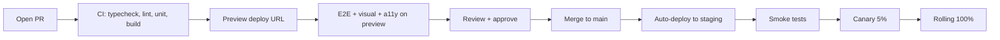

Senior interviews probe whether the candidate has internalised the deploy/release split: shipping code to production is not the same act as releasing a feature to users. Feature flags are how an experienced team separates the two so that deployments become routine and risk-controlled, while releases become deliberate, gradual, and reversible without a redeploy.

> **Acronyms used in this chapter.** A11y: Accessibility. API: Application Programming Interface. CD: Continuous Deployment. CI: Continuous Integration. CSS: Cascading Style Sheets. E2E: End-to-End. INP: Interaction to Next Paint. P75: 75th percentile. PM: Product Manager. PR: Pull Request. RSC: React Server Components. SSR: Server-Side Rendering. URL: Uniform Resource Locator. UX: User Experience. YAML: YAML Ain't Markup Language.

## A complete CI/CD pipeline for a Next.js app



## GitHub Actions skeleton

```yaml
name: CI
on:
  pull_request:
  push:
    branches: [main]

jobs:
  build:
    runs-on: ubuntu-latest
    steps:
      - uses: actions/checkout@v4
      - uses: pnpm/action-setup@v4
      - uses: actions/setup-node@v4
        with: { node-version: 20, cache: pnpm }
      - run: pnpm install --frozen-lockfile
      - run: pnpm turbo lint typecheck test build
      - uses: actions/upload-artifact@v4
        with: { name: build, path: apps/web/.next }

  e2e:
    needs: build
    runs-on: ubuntu-latest
    steps:
      - uses: actions/checkout@v4
      - uses: pnpm/action-setup@v4
      - run: pnpm install --frozen-lockfile
      - run: pnpm exec playwright install --with-deps chromium
      - uses: actions/download-artifact@v4
        with: { name: build, path: apps/web/.next }
      - run: pnpm --filter web start &
      - run: pnpm test:e2e
```

A few touches that distinguish a senior pipeline. Cache the pnpm store using `actions/setup-node`'s built-in cache so dependency installation does not repeat the full network fetch on every job. Use Turborepo or Nx caching for the meaningful speedup; remote caching shares cache hits across Pull Requests, so a build done on one engineer's branch is free on the next branch that has the same inputs. Run End-to-End tests against the actual production build (`pnpm start`), not against the development server (`next dev`), because the development server has different optimisation and caching behaviour and a passing test there does not guarantee the production behaviour.

## Preview deployments

Every Pull Request receives its own deployment Uniform Resource Locator. Vercel, Netlify, and Cloudflare Pages provide this out of the box; self-hosted setups achieve the same by deploying each branch to a per-branch subdomain (for example `pr-1234.preview.example.com`).

Three reasons preview deployments are worth the operational cost. Designers and Product Managers review the actual running feature on a real environment, not screenshots, so feedback is grounded in the experience the user will have. End-to-End tests and visual regression tests run against real conditions on the preview, so a passing build provides genuine confidence rather than the partial confidence of a local-only test. Bug reports from internal reviewers include the exact preview Uniform Resource Locator, so reproduction is trivial and triage is fast.

## Branch strategy

The two senior options:

| Strategy | When |
| --- | --- |
| **Trunk-based development** | Most product teams; small PRs, ship to main multiple times a day |
| **GitFlow** (release branches) | Software with explicit release versions (libraries, mobile, enterprise) |

For typical web applications in 2026, the canonical pattern is trunk-based development plus feature flags plus canary deploys. GitFlow's long-lived release branches are operational baggage when the team is deploying to production continuously and using feature flags for the release decision.

## Semantic-release / Changesets

For libraries, automate version bumps and changelogs from PR labels or changeset files.

```yaml
# .github/workflows/release.yml
name: Release
on:
  push: { branches: [main] }

jobs:
  release:
    runs-on: ubuntu-latest
    steps:
      - uses: actions/checkout@v4
      - uses: pnpm/action-setup@v4
      - run: pnpm install --frozen-lockfile
      - run: pnpm build
      - uses: changesets/action@v1
        with:
          publish: pnpm publish -r
        env:
          NPM_TOKEN: ${{ secrets.NPM_TOKEN }}
          GITHUB_TOKEN: ${{ secrets.GITHUB_TOKEN }}
```

Conventional Commits (`feat:`, `fix:`, `chore:`) plus `semantic-release` is an alternative; Changesets is more flexible in monorepos.

## Canary and blue-green deploys

The two patterns worth knowing have different operational profiles. Blue-green deploy maintains two identical production environments labelled blue and green; the team deploys the new version to the currently-idle environment, runs smoke tests, and swaps traffic when ready. Rollback is a traffic swap back to the previous environment, which is fast and reliable. The cost is doubling the infrastructure footprint, which is acceptable for stateless front-end deployments and increasingly affordable on serverless platforms. Canary deploy ships the new version to a small percentage of traffic (typically one to five percent), monitors the error rate and performance metrics on that slice, and gradually ramps the percentage to one hundred if the metrics remain healthy. The blast radius of a bad deploy is bounded by the canary percentage at the moment the regression appears.

Most modern platforms (AWS App Runner, Google Cloud Run, Vercel) automate canary as a deploy step. The team should wire its error rate and Interaction-to-Next-Paint 75th percentile as canary gates: if either degrades beyond a defined threshold during the canary window, the platform rolls back automatically rather than waiting for human intervention.

## Deploy/release split — the framing senior candidates typically present

A *deploy* is the act of shipping code to a server. A *release* is the act of exposing a feature to a user. The two are conceptually separable and should be operationally separable.

Conflating them produces three pathologies. Deploys become risky because every code change is also a feature change, so the team becomes reluctant to deploy small improvements between feature releases. Rollbacks are coarse because the only mechanism for hiding a bad feature is to revert the entire deploy, which also reverts every other change in the same release. Coordinated launches require deploy timing, so feature releases become tied to deploy windows and the marketing team negotiates with the engineering team for a midnight deploy slot.

Feature flags split the two. The team deploys continuously, multiple times per day, with each deploy carrying many small code changes; flags release the features themselves when they are ready, gradually, to specific user cohorts, and provide a kill-switch for instantaneous rollback of an individual feature without redeploying.

## Feature flags

The four kinds and what they do:

| Flag type | Purpose | Lifetime |
| --- | --- | --- |
| **Release** | Hide unfinished work in production | Days–weeks |
| **Experiment** | A/B test a variant | Weeks–months |
| **Permission** | Gate a feature behind plan/role | Long-lived |
| **Operational** | Kill switch for a risky path | Long-lived |

```ts
import { useFlag } from "@unleash/proxy-client-react";

function CartPage() {
  const newCheckout = useFlag("new-checkout");
  return newCheckout ? <NewCheckout /> : <LegacyCheckout />;
}
```

### Tools

LaunchDarkly is the enterprise default — expensive but full-featured, with sophisticated targeting rules, percentage rollouts, audit logs that satisfy compliance requirements, and an extensive ecosystem of integrations. Unleash is the open-source alternative, self-hostable for teams that prefer to keep flag evaluation on their own infrastructure. GrowthBook is open-source with a strong focus on A/B testing and statistical analysis of experiments. PostHog combines flags, product analytics, and session replay in a single product, which is operationally convenient for smaller teams that want fewer vendors.

### Server-side versus client-side evaluation

Server-side evaluation is the right choice when flag values must be authoritative and must not be visible to the client (for example, a flag that gates access to an experimental feature based on the user's subscription tier; the client must not be able to read the flag and unlock the feature on its own). The server resolves the flag during the request and returns the resolved value as part of the server-rendered page, with no client-side evaluation. Client-side evaluation is the right choice when the team needs real-time updates as the user interacts with the page and the flag values are not sensitive (for example, a flag that controls which copy variant a marketing experiment shows).

For Server-Side Rendering and React Server Components applications, the recommended pattern is to evaluate flags at the edge during server render and pass the resolved values to client components as props. This prevents the "flicker on flag load" User Experience problem in which the page renders briefly with the default variant before the client-side flag library evaluates and switches to the chosen variant.

### Avoiding flag debt

The trap is shipping a flag, never removing it, and accumulating hundreds of dead toggles that bloat the codebase and confuse new contributors. Three mitigations work in practice. Set an expiration date on every flag at creation and review the expired flags weekly with the team. Run a "graveyard" automation that opens cleanup Pull Requests for flags older than a defined threshold (six weeks for release flags, longer for permission flags). Configure a linter rule that flags references to retired flag keys so a flag removal cannot leave dangling references in the code.

## Rolling back

The senior expectation is that the team can roll back any production change in under five minutes. The mechanism depends on what is being rolled back. A code rollback is a redeploy of the previous artifact — not a `git revert` followed by a fresh build, because the build itself takes time and may fail; the team should cache deployable artifacts so the previous one is available for instant redeploy. A feature rollback is a flip of the feature flag — instantaneous, no deploy required. A data migration rollback is the most fraught: either a reverse migration (which the team must have written and tested) or a backwards-compatible deploy strategy (the schema change is deployed first as an additive change, the application is deployed against the new schema, and only after both are stable is the old column removed).

Practice rollback in staging — at least once before the team ever needs to do it in production. Teams that have not rolled back successfully in staging cannot do it confidently in production, and the moment a real incident requires it is the worst time to discover the procedure is broken.

## Observability hooks in CI

Three automatic checks are worth wiring into the Continuous Integration pipeline. Lighthouse CI runs against the preview deployment with an explicit performance budget per route, so a regression that pushes Largest Contentful Paint above the threshold fails the build. A bundle-size diff comment on Pull Requests shows the byte impact of the change, so a Pull Request that accidentally adds 200 kilobytes is visible during code review. Accessibility checks running `axe` against the preview deployment fail the build when violations are introduced, so accessibility regressions are caught at the same time as functional regressions.

```ts
import { useFeatureFlag } from "@/lib/flags";

export function FeatureFlagWrapper(props: {
  flag: string;
  children: React.ReactNode;
  fallback?: React.ReactNode;
}) {
  const enabled = useFeatureFlag(props.flag);
  return enabled ? <>{props.children}</> : <>{props.fallback ?? null}</>;
}
```

```yaml
- uses: treosh/lighthouse-ci-action@v11
  with:
    urls: |
      https://pr-${{ github.event.number }}.preview.example.com/
    budgetPath: ./.lighthouse/budget.json
    uploadArtifacts: true
```

## Key takeaways

Trunk-based development plus preview deployments plus canary releases is the modern default for a typical web team in 2026. Cache aggressively in Continuous Integration — the Turborepo remote cache, the pnpm content-addressable store, the Playwright browser binaries — so the time from commit to merge feedback stays short. Use `hidden-source-map` source maps and upload to the error tracker as part of every release, atomically tied to the deploy. Deploy is not the same act as release; feature flags split the two and turn high-risk launches into routine deploys plus deliberate flag flips. The four flag kinds — release, experiment, permission, operational — have different lifetimes and warrant different governance. Maintain an under-five-minute rollback path for every kind of change (code, feature, data) and practise it before the team needs it.

## Common interview questions

1. Why is "deploy/release split" the framing senior candidates typically present?
2. Walk me through a canary deploy and what its automatic rollback gates would be.
3. Trade-offs of LaunchDarkly versus Unleash versus GrowthBook?
4. Server-side versus client-side flag evaluation: when each?
5. How do you prevent flag debt?

## Answers

### 1. Why is "deploy/release split" the framing senior candidates typically present?

The deploy/release split is the framing because it cleanly resolves three operational pathologies that arise when the two acts are conflated. When a deploy is also a release, deploys become high-stakes events that the team is reluctant to do; when releases require deploys, rollbacks are coarse and risky; when both are tied, marketing and engineering schedules become entangled. Splitting the two via feature flags turns deploys into routine, low-risk events (multiple per day) and releases into deliberate, granular, instantly-reversible decisions.

**How it works.** A deploy ships code to production behind a feature flag set to `false` for everyone. The feature is in production, exercised by the deploy pipeline's smoke tests, observable by the team — but invisible to users. A release flips the flag to `true` for a small cohort, monitors the metrics, and gradually expands the cohort. A bad release is a flag flip back to `false`, instantaneously, with no deploy involved.

```ts
import { useFlag } from "@unleash/proxy-client-react";

export function CartPage() {
  const newCheckout = useFlag("new-checkout");
  return newCheckout ? <NewCheckout /> : <LegacyCheckout />;
}
```

**Trade-offs / when this fails.** The split adds the operational cost of running a flag system (LaunchDarkly's expense, the operational burden of self-hosting Unleash, the accumulation of dead flags over time) and the engineering cost of building features behind flags from the start. It also requires discipline to remove flags after a release stabilises; a team that ships flags but never removes them ends up with a codebase that is harder to read than one without flags. The cure is the flag-debt automation described above and a team norm that flag removal is part of the feature's definition of done.

### 2. Walk me through a canary deploy and what its automatic rollback gates would be.

A canary deploy ships the new version to a small percentage of production traffic (typically one to five percent), monitors the canary's metrics against the baseline for a defined window (typically ten to thirty minutes), and either ramps up to one hundred percent if the metrics are healthy or rolls back automatically if they degrade. The automatic rollback gates should be the metrics that most reliably indicate user-visible harm: the HTTP 5xx error rate, the application-level error rate (Sentry events per minute), the Interaction-to-Next-Paint 75th percentile, and any business-critical metric the team has defined (checkout success rate, sign-up completion rate).

**How it works.** The deploy platform routes a defined percentage of incoming requests to the new version's instances and the remaining percentage to the previous version's instances. A monitoring loop compares the metrics from each cohort; if the canary cohort's error rate exceeds the baseline by a defined threshold, the platform reverts the routing and the canary version is taken out of service. If the metrics remain within tolerance for the defined window, the platform progresses to the next ramp percentage (typically 5 percent → 25 percent → 50 percent → 100 percent) until the new version is serving all traffic.

```yaml
canary:
  initial_percentage: 5
  ramp_steps: [5, 25, 50, 100]
  step_duration: 10m
  rollback_gates:
    - metric: error_rate
      threshold: 1.5x_baseline
    - metric: inp_p75
      threshold: 1.2x_baseline
```

**Trade-offs / when this fails.** Canary deploys assume the metrics are sensitive enough to detect a regression within the canary window; a regression that only manifests on a small subset of users (a specific browser, a specific feature flag combination) may not show up in the aggregate canary metrics, and the team will discover it only after the full ramp. The cure is to use targeted canaries that select cohorts likely to exercise the changed code path. Canary deploys also assume the previous version can be re-routed to instantly; if the rollback requires a database migration to be undone, the canary cannot complete the rollback automatically and the team must intervene.

### 3. Trade-offs of LaunchDarkly versus Unleash versus GrowthBook?

LaunchDarkly is the enterprise default — sophisticated targeting rules, audit logs that satisfy compliance, fast global edge evaluation, an extensive integration ecosystem — and is correspondingly expensive (typically priced per monthly active user, which becomes substantial at scale). Unleash is the open-source alternative, self-hostable on the team's own infrastructure, with a simpler feature set but no per-user pricing; the trade-off is the operational burden of running it. GrowthBook is also open-source and focuses heavily on A/B testing and statistical analysis of experiments, which is the right pick when the team's primary use of flags is experimentation rather than release-gating.

**How it works.** All three implement the same core abstraction — a flag with a name, a default value, and a set of targeting rules that resolve to a value per user — but differ in their hosting model, their pricing, and their feature depth. LaunchDarkly evaluates flags at globally distributed edges with millisecond latency; Unleash typically evaluates either client-side after a polled fetch or server-side at the team's own infrastructure; GrowthBook is similar to Unleash but with a richer experimentation surface.

```ts
const flags = await ldClient.allFlagsState({ key: userId });
const newCheckout = flags.getFlagValue("new-checkout");
```

**Trade-offs / when this fails.** LaunchDarkly's price is the most common reason teams choose alternatives; at scale (millions of monthly active users), the monthly cost can rival a small engineering team's salary, which is hard to justify when an open-source alternative would suffice. Unleash's operational burden is the most common reason teams choose LaunchDarkly; running a flag service with the reliability that production deploys depend on is non-trivial. GrowthBook's experimentation focus is the wrong fit for teams whose primary use of flags is release-gating; for those teams, the experimentation features are unused weight.

### 4. Server-side versus client-side flag evaluation: when each?

Server-side evaluation is the right choice when flag values must be authoritative (a flag that gates access to a feature based on the user's subscription tier; the client must not be able to read the flag and unlock the feature) or when the flag affects what is rendered on the server (the SSR/RSC case where the server must know the flag value to produce the correct HTML). Client-side evaluation is the right choice when the flag values are not sensitive and the team needs real-time updates as the user interacts with the page (a flag that controls a marketing copy variant; the team can flip it and see the change reflected immediately for new visitors).

**How it works.** Server-side evaluation runs the flag SDK in the server (the Next.js Route Handler, the Express middleware) with the user identifier extracted from the session; the resolved value is either rendered into the HTML or returned as a header. Client-side evaluation runs the flag SDK in the browser; the SDK polls the flag service for updates or maintains a streaming connection. For SSR/RSC applications, the recommended hybrid is to evaluate server-side during the render pass and pass the resolved value to client components as a prop, which prevents the "flicker on flag load" UX problem.

```ts
// Server-side evaluation in a Next.js Route Handler.
import { getFlags } from "@/lib/flags";

export async function GET() {
  const flags = await getFlags(getUserFromSession());
  return Response.json({ newCheckout: flags["new-checkout"] });
}
```

**Trade-offs / when this fails.** Server-side evaluation requires a round trip to the flag service on every render, which adds latency to the critical path; the cure is to cache flag values per user with a short Time-to-Live or to use an Edge runtime with the flag SDK co-located with the request. Client-side evaluation leaks the resolved flag values to the client, which is unacceptable for sensitive flags; the cure is to use server-side evaluation for any flag that gates access to a feature. The hybrid pattern (server-side resolution, client-side prop) is the right default for SSR/RSC applications because it avoids the flicker without leaking sensitive state.

### 5. How do you prevent flag debt?

Three practices, applied together. Set an expiration date on every flag at creation, recorded in the flag service's metadata; review expired flags weekly with the team and either remove them or extend the expiration with an explicit reason. Run a "graveyard" automation that opens cleanup Pull Requests for flags older than the defined threshold (six weeks is a reasonable default for release flags); the Pull Request removes both the flag check from the code and the flag definition from the service. Configure a linter rule that flags references in the code to flag keys that no longer exist in the service, so a flag removal cannot leave dangling references.

**How it works.** Flag debt accumulates because removing a flag is a low-priority task (the feature works, the flag is unused, no one feels the cost) and because the cost is diffuse (the codebase becomes harder to read by a small amount with each dead flag). The three practices above turn the cost from diffuse to concrete: the expiration date forces a decision, the automation does the mechanical work, and the linter prevents regressions.

```ts
// Linter rule using ESLint.
module.exports = {
  rules: {
    "no-retired-flags": {
      meta: { type: "problem" },
      create(context) {
        const retired = new Set(["old-checkout", "deprecated-search"]);
        return {
          CallExpression(node) {
            if (node.callee.name === "useFlag" &&
                retired.has(node.arguments[0]?.value)) {
              context.report({ node, message: `Flag '${node.arguments[0].value}' is retired.` });
            }
          },
        };
      },
    },
  },
};
```

**Trade-offs / when this fails.** The practices fail when the team treats them as optional; an automation that opens cleanup Pull Requests is useless if the Pull Requests sit unreviewed. The cure is a team norm that flag cleanup Pull Requests are reviewed within a defined service-level objective (one week is a reasonable target) and that flag removal is part of the feature's definition of done at the original creation. The practices also fail for permission flags and operational flags, which are intentionally long-lived; those flags should be marked as "permanent" in the service's metadata so the cleanup automation does not flag them.

## Further reading

- Pete Hodgson, ["Feature Toggles"](https://martinfowler.com/articles/feature-toggles.html) on martinfowler.com.
- [Trunk Based Development](https://trunkbaseddevelopment.com/).
- [LaunchDarkly](https://launchdarkly.com/) and [Unleash](https://www.getunleash.io/) docs.
