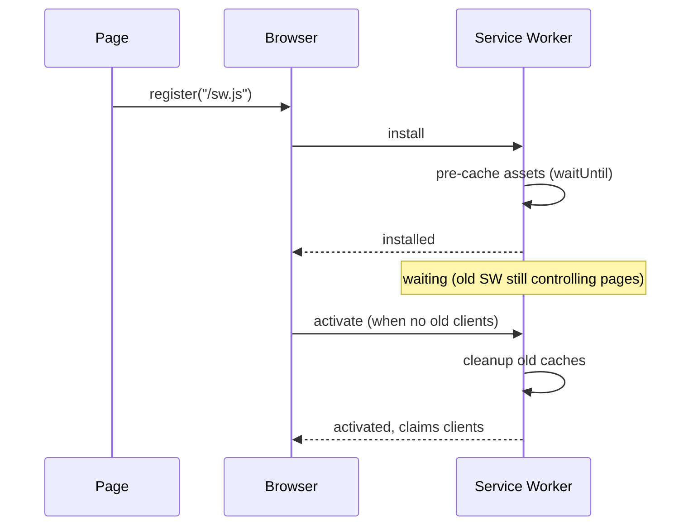

Progressive Web Application (PWA) used to be a marketing positioning; what matters today is the set of underlying browser capabilities — service workers, install prompts, offline caches, background synchronization — that the term encompassed. Senior interviews probe whether the candidate understands the service worker lifecycle and the caching strategies, not the marketing label.

> **Acronyms used in this chapter.** API: Application Programming Interface. CRDT: Conflict-free Replicated Data Type. CDN: Content Delivery Network. CSS: Cascading Style Sheets. DB: Database. HTML: Hypertext Markup Language. HTTPS: Hypertext Transfer Protocol Secure. iOS: Apple's mobile operating system. JS: JavaScript. MVP: Minimum Viable Product. PWA: Progressive Web Application. SW: Service Worker. UI: User Interface. URL: Uniform Resource Locator. UX: User Experience. VAPID: Voluntary Application Server Identification.

## What makes a Progressive Web Application today

The minimum requirements form a short checklist. The application must be served over Hypertext Transfer Protocol Secure, because service workers refuse to register on insecure origins. The application must include a web app manifest (`manifest.webmanifest`) so the browser can present an "Install" prompt and launch the application in a standalone window. The application must register a service worker that handles offline behaviour. The application must have a responsive User Interface that works correctly on mobile devices, since installation is most commonly used in the mobile context.

That checklist is the floor; the interesting design choices live in the service worker's caching strategy and the offline data model.

## The service worker lifecycle



The lifecycle to internalise has four phases. During *install*, the service worker pre-caches the assets the application needs to operate offline; the install handler must call `event.waitUntil(...)` with the caching promise so the install does not complete until the cache is fully populated. During *wait*, a newly-installed service worker remains in the waiting state until the previous service worker's controlled clients all close, unless the new service worker explicitly calls `self.skipWaiting()` to take over immediately. During *activate*, the new service worker cleans up obsolete caches from previous versions; calling `self.clients.claim()` causes the new service worker to take control of existing clients without requiring a navigation. During *fetch*, the service worker intercepts every network request from controlled clients and applies the team's caching strategy.

The most common deploy bug in this lifecycle is omitting `skipWaiting()` and `clients.claim()`: users continue running the previous week's service worker until every tab is closed, which can mean weeks of stale code in production for users who keep tabs open.

```ts
// Registration in the application code.
if ("serviceWorker" in navigator) {
  window.addEventListener("load", () => {
    navigator.serviceWorker.register("/sw.js", { scope: "/" });
  });
}
```

## Caching strategies

| Strategy | When |
| --- | --- |
| **Cache only** | Fingerprinted static assets (`/assets/app.abc123.js`) |
| **Network only** | Things that must be fresh and online (POST, real-time data) |
| **Cache first, fallback to network** | Static-ish assets, fonts, images |
| **Network first, fallback to cache** | HTML / app shell — fresh when online, available when offline |
| **Stale-while-revalidate** | Lists, dashboards — show cached, refresh in background |

```ts
// sw.ts (excerpt)
self.addEventListener("fetch", (event: FetchEvent) => {
  const { request } = event;

  if (request.mode === "navigate") {
    // network first, cache fallback for HTML
    event.respondWith(
      fetch(request)
        .then((response) => {
          const copy = response.clone();
          caches.open("html-v1").then((c) => c.put(request, copy));
          return response;
        })
        .catch(() => caches.match(request).then((r) => r ?? caches.match("/offline.html")!)),
    );
    return;
  }

  if (request.url.includes("/assets/")) {
    // cache first for fingerprinted static assets
    event.respondWith(
      caches.match(request).then((cached) => cached ?? fetch(request).then((res) => {
        const copy = res.clone();
        caches.open("static-v1").then((c) => c.put(request, copy));
        return res;
      })),
    );
  }
});
```

For production applications, use Workbox instead of writing this code by hand. Workbox encapsulates the standard caching strategies, handles cache expiration with Time-to-Live and entry-count limits, and manages the service worker update flow including the skip-waiting handshake. The hand-written code above is shown for the mental model; the production-grade equivalent in Workbox is approximately five lines of configuration.

## The web app manifest

```json
{
  "name": "Senior FE Interview Prep",
  "short_name": "FE Prep",
  "start_url": "/?utm_source=pwa",
  "display": "standalone",
  "background_color": "#0c0f14",
  "theme_color": "#2e7df6",
  "icons": [
    { "src": "/icons/192.png", "sizes": "192x192", "type": "image/png" },
    { "src": "/icons/512.png", "sizes": "512x512", "type": "image/png", "purpose": "any maskable" }
  ]
}
```

Linked from HTML:

```html
<link rel="manifest" href="/manifest.webmanifest">
<meta name="theme-color" content="#2e7df6">
```

The browser uses this to offer install (Android Chrome shows a prompt; iOS requires "Add to Home Screen" manually). On install, the app launches in its own window without the browser chrome.

## Background sync

When a network request fails because the user is offline, the application can register a background sync so the request is retried automatically when the network returns. This is the difference between a feature that fails noisily on flaky connections and a feature that buffers user intent and applies it when conditions allow.

```ts
// In the page
const registration = await navigator.serviceWorker.ready;
await registration.sync.register("send-queued-messages");

// In the service worker
self.addEventListener("sync", (event: SyncEvent) => {
  if (event.tag === "send-queued-messages") {
    event.waitUntil(sendQueuedMessages());
  }
});
```

Background sync requires HTTPS, a service worker, and is supported in Chromium browsers. Safari doesn't support it; fall back to retrying on next page load.

## Push notifications

Push notifications are out of scope for most interviews but worth understanding in outline. The flow has four steps: request permission with `Notification.requestPermission()`, obtain a push subscription with `registration.pushManager.subscribe(...)` (which returns the endpoint and the cryptographic keys the server needs to send messages), transmit the subscription to the team's backend, and have the backend deliver pushes using Voluntary Application Server Identification-signed Web Push.

iOS supports Web Push only when the application is installed to the home screen, which is a substantial constraint for any team that supports iOS. The user-experience principle is to never request notification permission on first page load; ask only when the user opts into a feature that demonstrably benefits from notifications, because a permission request without context is almost always declined.

## Offline-first sync

True offline-first applications — Notion, Linear, Figma — use a local database on the device and synchronize changes to the server in the background, presenting an experience that feels identical online and offline. The architecture is substantially heavier than the cache-and-fall-back-to-network approach of a typical Progressive Web Application, but it is the only architecture that delivers the responsiveness those applications are known for.

| Library | What it does |
| --- | --- |
| **Replicache / Reflect** | Optimistic mutations, server reconciliation, real-time sync |
| **PowerSync** | Postgres → SQLite on device, bi-directional sync |
| **RxDB** | Reactive client DB with multi-backend sync adapters |
| **Yjs** + **y-websocket** | CRDT for collaborative documents |

The pattern is consistent across these libraries. Mutations write to the local database and to an outbox queue simultaneously. The User Interface re-renders from the local database immediately, providing optimistic feedback regardless of network state. The outbox queue drains to the server in the background as connectivity allows. The server pushes other users' changes back over a persistent connection; the local database merges incoming changes using a Conflict-free Replicated Data Type or a last-write-wins policy depending on the data model.

This is heavy machinery and is only worth the cost for applications where offline operation is a core part of the value proposition: note-taking applications, mobile-first productivity tools, field-data collection where the user is regularly out of network range.

## Common bugs

Five operational issues account for most service worker incidents. Stale service workers persisting after a deploy — the fix is to call `skipWaiting()` and `clients.claim()` in the install and activate handlers respectively, combined with a versioned cache name so the new service worker can identify and remove the old caches. Hypertext Markup Language cached forever — the fix is to never use the cache-first strategy for navigation requests, since stale HTML traps users on a previous version of the application. Service worker scope incorrectly configured — the registration must occur at `/sw.js` (or another path at the application root) for application-wide scope; registering under a subpath limits the scope to that subpath and breaks offline navigation elsewhere. Cookies lost in service-worker-handled requests — the fix is to pass `credentials: "include"` to the `fetch` call inside the service worker and to refrain from stripping cookies from intercepted requests. iOS-specific limitations — Apple's mobile operating system imposes a ~50 megabyte service worker storage limit and evicts caches aggressively under storage pressure, so the team should not assume persistent caches survive across app sessions on iOS.

## When to skip Progressive Web Application

Three project shapes do not benefit from the Progressive Web Application investment. A landing page or marketing site that does not require offline operation — the additional complexity of registering a service worker, configuring caching strategies, and handling the update flow is overhead with no offsetting user benefit. An application whose users predominantly live behind a corporate proxy that strips service workers — many corporate networks block service worker registration as a matter of policy, and the team should not invest in features the audience cannot use. A Minimum Viable Product — install prompts and offline caching are appropriate after product-market fit has been demonstrated, not before, because the operational cost of running a Progressive Web Application is real and only worth paying for an application users want to keep installed.

## Key takeaways

A Progressive Web Application is the combination of Hypertext Transfer Protocol Secure, a web app manifest, a service worker, and a responsive User Interface; the interesting design choices live in the service worker's caching strategy. The five caching strategies (cache only, network only, cache first, network first, stale-while-revalidate) should be picked per request type, not applied globally. Always call `skipWaiting()` and `clients.claim()` in the activate handler with a versioned cache name so deploys propagate cleanly. Use Workbox for production; do not hand-write service worker logic for non-trivial applications. Background sync is valuable where supported and should be paired with a graceful fallback for Safari. Offline-first synchronization with Replicache, PowerSync, or Yjs is heavy machinery suitable only for applications where offline operation is core to the product.

## Common interview questions

1. Walk me through the service worker lifecycle.
2. Which caching strategy for HTML, JS, fonts? Why each?
3. What problem does `skipWaiting()` solve? What's the trade-off?
4. When would you reach for a library like Replicache versus just queueing fetches?
5. What does the web app manifest enable that an iOS bookmark doesn't?

## Answers

### 1. Walk me through the service worker lifecycle.

The lifecycle has four phases. First, *install*: when the page calls `navigator.serviceWorker.register("/sw.js")`, the browser downloads the script and runs the install handler. The handler typically pre-caches the assets the application needs offline, wrapped in `event.waitUntil(...)` so the install does not complete until the cache is ready. Second, *wait*: a newly-installed service worker enters a waiting state and does not yet control any clients; it waits there until all clients controlled by the previous service worker close, unless the new service worker calls `self.skipWaiting()`. Third, *activate*: the new service worker runs its activate handler, typically cleaning up obsolete caches; calling `self.clients.claim()` causes the new service worker to take control of existing clients without requiring a navigation. Fourth, *fetch*: the active service worker intercepts network requests from controlled clients and applies the team's caching strategy.

**How it works.** The wait phase exists to prevent a deploy from breaking pages that are mid-interaction with the previous version; the previous service worker continues to serve those pages until they navigate away or close. This is a safety mechanism but is also the source of the most common deploy bug — without `skipWaiting()` and `clients.claim()`, users who keep tabs open continue running the previous version indefinitely.

```ts
self.addEventListener("install", (event: ExtendableEvent) => {
  event.waitUntil(caches.open("static-v2").then((c) =>
    c.addAll(["/", "/app.js", "/styles.css"])));
  self.skipWaiting();
});

self.addEventListener("activate", (event: ExtendableEvent) => {
  event.waitUntil(
    caches.keys().then((keys) =>
      Promise.all(keys.filter((k) => k !== "static-v2").map((k) => caches.delete(k))))
      .then(() => self.clients.claim()),
  );
});
```

**Trade-offs / when this fails.** Calling `skipWaiting()` removes the safety mechanism that the wait phase provides; if the new service worker is incompatible with the previous version's HTML, in-flight pages may break. The cure is to design service worker updates as backwards-compatible (the new service worker should be able to serve assets requested by the previous version), and to test the update flow in staging with long-lived tabs.

### 2. Which caching strategy for HTML, JS, fonts? Why each?

The right strategy differs by resource type. For the application's Hypertext Markup Language (the navigation responses), use *network first with cache fallback*: the browser tries the network first to get the latest version, and only falls back to the cache when offline. This guarantees fresh content when online while preserving offline navigation; the cache-first alternative would trap users on stale HTML even when they have connectivity. For fingerprinted JavaScript bundles (`/assets/app.abc123.js`), use *cache only* (or cache first): once a fingerprinted asset is cached, it never changes — the fingerprint guarantees uniqueness — so the network round trip is wasted effort. For fonts, use *cache first*: fonts rarely change, are large, and benefit substantially from cache hits.

**How it works.** Each strategy maps to a few lines in the fetch handler. Cache first checks the cache, returns the cached response if present, falls back to fetching and caching on miss. Network first attempts the fetch, caches and returns the response on success, falls back to the cache on network error. Stale-while-revalidate returns the cached response immediately for responsiveness while fetching the network response in the background to update the cache for next time.

```ts
async function networkFirst(request: Request): Promise<Response> {
  try {
    const response = await fetch(request);
    const cache = await caches.open("html-v1");
    cache.put(request, response.clone());
    return response;
  } catch {
    const cached = await caches.match(request);
    return cached ?? caches.match("/offline.html") as Promise<Response>;
  }
}
```

**Trade-offs / when this fails.** Network first imposes the cost of a network round trip on every navigation, which adds latency on slow connections; the cure is to add a short timeout (one second) before falling back to the cache, so a slow network does not block the response indefinitely. Cache first for fonts can pin the user to an old font version after a redesign; the cure is to fingerprint font filenames so each version is a distinct cache entry. Stale-while-revalidate produces inconsistent responses across users and between the same user's requests at different times, which is acceptable for non-critical data but problematic for anything that the user might compare across pages.

### 3. What problem does `skipWaiting()` solve? What's the trade-off?

`skipWaiting()` solves the problem of users running an old service worker indefinitely after a deploy. By default, a new service worker enters the waiting state and does not take control of any clients until all clients controlled by the previous service worker close — which, for users who keep tabs open for days, can mean weeks of stale code. `skipWaiting()` causes the new service worker to take control immediately, so the deploy propagates to all users on their next page load.

**How it works.** The call is made in the install handler, typically as `self.skipWaiting()`. It tells the browser to bypass the waiting state and proceed directly to activate, where `self.clients.claim()` then takes control of existing clients. The combination is the canonical pattern for any service worker that wants to deploy cleanly.

```ts
self.addEventListener("install", () => {
  self.skipWaiting();
});

self.addEventListener("activate", (event: ExtendableEvent) => {
  event.waitUntil(self.clients.claim());
});
```

**Trade-offs / when this fails.** The trade-off is that the new service worker takes control while existing pages may be in the middle of an interaction that the previous service worker was handling; if the new service worker's caches are not backwards-compatible with the previous version's expectations (for example, the new service worker has removed an asset the old page is still requesting), the old page may break. The cure is to design service worker updates as backwards-compatible — the new service worker should still be able to serve resources requested by the previous version of the application — and to test the update flow with long-lived tabs in staging. For applications where this risk is unacceptable, an alternative is to omit `skipWaiting()` and instead show the user a banner inviting them to reload when a new version is available, putting the control in the user's hands.

### 4. When would you reach for a library like Replicache versus just queueing fetches?

Reach for Replicache (or PowerSync, or RxDB, or Yjs) when offline operation is a core feature of the product and the application has a non-trivial data model: collaborative documents, kanban boards, note-taking applications, anything where the user expects to make many edits offline and have them synchronized to the server and to other users when connectivity returns. Reach for a simpler "queue fetches and replay" approach when the application is occasionally offline (a typical Progressive Web Application), the data model is simple (a list of pending mutations rather than a fully-materialised local view), and the user's expectation is "things I do offline will be sent when I'm back online" rather than "the app feels exactly the same offline as online".

**How it works.** A library like Replicache maintains a local IndexedDB database that mirrors a subset of the server's data, computes a delta against the server's state on each sync, and applies remote changes to the local database while sending local mutations to the server. The user interface reads from the local database and re-renders on every change, regardless of network state. A simpler queue-and-replay approach instead intercepts mutating fetch calls, stores them in IndexedDB when the user is offline, and replays them when the network returns; the read path still goes to the server, so the offline experience is degraded compared with the local-first approach.

```ts
// Simple queue approach.
const DB_NAME = "outbox";

async function enqueueMutation(mutation: { url: string; init: RequestInit }) {
  const db = await openDB(DB_NAME);
  await db.put("mutations", { ...mutation, id: crypto.randomUUID() });
}

async function drainOutbox() {
  const db = await openDB(DB_NAME);
  const all = await db.getAll("mutations");
  for (const mutation of all) {
    try {
      await fetch(mutation.url, mutation.init);
      await db.delete("mutations", mutation.id);
    } catch { /* try again next time */ }
  }
}
```

**Trade-offs / when this fails.** Replicache and similar libraries are heavy machinery — they require backend cooperation (the server must implement a "pull" endpoint that returns the delta since a given client state), they require a CRDT or a conflict-resolution policy, and they require ongoing operational attention. For a small team, the cost is significant. The simpler queue-and-replay approach is much cheaper to operate but provides a substantially worse offline experience because the read path is still server-bound. The decision is essentially "is offline operation a core feature" — if yes, pay the cost of Replicache; if no, the simpler queue is appropriate.

### 5. What does the web app manifest enable that an iOS bookmark doesn't?

The web app manifest enables the browser to present an "Install" experience that produces an application-like artifact on the user's device — a launcher icon, a standalone window without browser chrome, a splash screen on launch, and operating-system integration such as a name in the application switcher. An iOS bookmark, in contrast, opens the page in Safari with all the browser chrome visible; the user is reading a web page, not running an application.

**How it works.** The manifest file declares the application's name, icons, theme colour, background colour, start URL, and display mode. When the browser detects a manifest plus a service worker plus other quality signals (the user has interacted with the site, it loads over Hypertext Transfer Protocol Secure), it offers an install prompt. On install, the browser registers the application with the operating system as a first-class artifact — Android Chrome creates a launcher icon and a WebAPK (a real Android package), iOS Safari adds an icon to the home screen and launches the application in standalone mode.

```json
{
  "name": "Senior FE Interview Prep",
  "short_name": "FE Prep",
  "start_url": "/?utm_source=pwa",
  "display": "standalone",
  "background_color": "#0c0f14",
  "theme_color": "#2e7df6",
  "icons": [
    { "src": "/icons/192.png", "sizes": "192x192", "type": "image/png" },
    { "src": "/icons/512.png", "sizes": "512x512", "type": "image/png", "purpose": "any maskable" }
  ]
}
```

**Trade-offs / when this fails.** iOS treats installed Progressive Web Applications as second-class citizens — limited service worker storage, no Web Push (until the application is installed to home screen), no background sync — so the experience differs from native applications in ways the user may notice. The manifest also does not solve the discoverability problem; users must discover the application through the browser's install prompt or a manual instruction, which is a much higher friction path than installing from an app store. The senior framing is "the manifest gives the team a substantial chunk of native-application user experience without the app-store distribution overhead, and is worth the investment for applications users return to repeatedly".

## Further reading

- [web.dev: Progressive Web Apps](https://web.dev/explore/progressive-web-apps).
- [Workbox docs](https://developer.chrome.com/docs/workbox/).
- Jake Archibald, ["The Service Worker Cookbook"](https://serviceworke.rs/).
