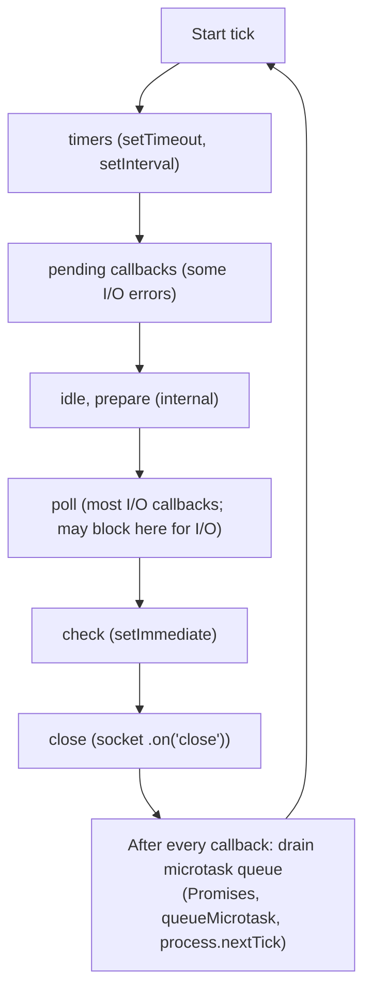

The runtime is the single most-asked Node.js topic in senior interviews. The candidate is not expected to recite the libuv source code, but to articulate the model — what runs when, what blocks what, what guarantees the platform makes — in two clear minutes.

> **Acronyms used in this chapter.** API: Application Programming Interface. CJS: CommonJS. CPU: Central Processing Unit. ESM: ECMAScript Modules. GC: Garbage Collection. HTTP: Hypertext Transfer Protocol. I/O: Input/Output. P99: 99th percentile. TCP: Transmission Control Protocol. TS: TypeScript. URL: Uniform Resource Locator.

## The event loop, with phases

Node.js's event loop runs in *phases*, each with its own queue of callbacks. Understanding the phase order is what separates a senior answer from "it's just an event loop".



Two facts a senior candidate is expected to know. First, `process.nextTick` callbacks run before any other microtask, including Promise continuations; this is an operational hazard because a recursive `nextTick` starves the rest of the loop and the application stops responding to anything else. The use case is genuinely narrow — deferring work to the end of the current operation but before any other I/O — and the team should reach for `queueMicrotask` (which respects the standard Promise ordering) by default. Second, `setImmediate` runs in the next iteration's check phase, after the poll phase, while `setTimeout(fn, 0)` runs in the next iteration's timers phase. The order between them when called from the main script is unspecified; called from inside an Input/Output callback, `setImmediate` always wins because the next phase after poll is check, not timers.

```js
fs.readFile("file", () => {
  setTimeout(() => console.log("timeout"), 0);
  setImmediate(() => console.log("immediate"));
  // Always: immediate, then timeout
});
```

## Microtasks vs. macrotasks

Same model as the browser, with the addition of `process.nextTick`:

1. `process.nextTick` callbacks (drained first).
2. Promise callbacks (`.then`, `await` continuations).
3. The next phase callback runs.

```js
console.log("1");
process.nextTick(() => console.log("2"));
Promise.resolve().then(() => console.log("3"));
setImmediate(() => console.log("4"));
console.log("5");
// Output: 1, 5, 2, 3, 4
```

## Streams

Node.js's stream Application Programming Interface is the bridge between synchronous code and asynchronous, chunked Input/Output. The model has four types of streams. *Readable* streams are read from — Hypertext Transfer Protocol request bodies, file reads. *Writable* streams are written to — Hypertext Transfer Protocol responses, file writes. *Duplex* streams are both — Transmission Control Protocol sockets. *Transform* streams are duplex streams that transform their input — gzip compression via `zlib.createGzip()`.

The senior-level pattern is `pipeline` for backpressure-aware composition. `pipeline` propagates errors from any stage to the consumer, respects backpressure (a slow writer pauses the fast reader so memory does not balloon), and cleans up every stream's resources on completion or error.

```ts
import { pipeline } from "node:stream/promises";
import { createReadStream, createWriteStream } from "node:fs";
import { createGzip } from "node:zlib";

await pipeline(
  createReadStream("input.txt"),
  createGzip(),
  createWriteStream("input.txt.gz"),
);
```

`pipeline` propagates errors and respects backpressure (slow writer pauses fast reader). Hand-rolled `pipe` chains often leak in error paths — use `pipeline`.

For modern code, use **Web Streams** (`ReadableStream`/`TransformStream`) when interoperating with `fetch` and the platform.

## ESM vs. CommonJS

| | ESM | CommonJS |
| --- | --- | --- |
| Syntax | `import`/`export` | `require`/`module.exports` |
| File ext | `.mjs` or `"type": "module"` | `.cjs` or default |
| Loading | Async, static | Sync, dynamic |
| Top-level `await` | Yes | No |
| Bindings | Live (importer sees re-assignment) | Snapshot |
| Tree shaking | Yes (static structure) | Hard |
| `__dirname` | Not defined; use `import.meta.url` | Defined |

For new code in 2026, the recommendation is ECMAScript Modules. Set `"type": "module"` in `package.json` and import with explicit file extensions:

```ts
import { add } from "./math.js";   // note the .js even when source is .ts
```

Why use the `.js` extension even when the source files are TypeScript? Because the TypeScript compiler does not rewrite import paths during emit; the emitted `.js` files contain the same `import` statements the source had, so the source must already reference `./math.js` for the emitted output to resolve. The `tsx` runtime and Vite handle this rewrite transparently in development, but `tsc` itself does not.

## Worker threads vs. cluster vs. child processes

| Tool | When |
| --- | --- |
| **Worker threads** | CPU-bound work in the same process: parsing, image manipulation, hashing |
| **Cluster** | Multi-process HTTP server using all CPU cores; shares the listening port |
| **child_process.spawn** | Run an external program (ffmpeg, git) and pipe its I/O |
| **child_process.fork** | Spawn another Node process with a message channel |

For most applications in 2026, the team does not manage workers directly — instead it runs multiple containers behind a load balancer, leaving the orchestrator to scale across cores and machines. Worker threads earn their keep when the application has a single process performing Central Processing Unit-bound work that would otherwise block the event loop, such as image manipulation or cryptographic hashing on large payloads.

```ts
import { Worker } from "node:worker_threads";

const worker = new Worker(new URL("./hash.worker.js", import.meta.url));
worker.postMessage({ data: "hello" });
worker.on("message", (digest) => console.log(digest));
```

## Buffers and binary

`Buffer` is Node's pre-Web-Crypto take on binary data. In modern code, prefer `Uint8Array` and `crypto` web standards where possible.

```ts
// Old
Buffer.from("hello", "utf-8");

// Modern
new TextEncoder().encode("hello");
```

The Buffer API still wins for very-low-level cases (Node-specific encodings like `latin1`, `hex`, `base64url`); for HTTP bodies in modern frameworks, prefer streams or `Uint8Array`.

## `AbortController`

Same primitive as the browser. Most modern Node APIs accept a `signal`:

```ts
const controller = new AbortController();
const timer = setTimeout(() => controller.abort(), 5_000);

try {
  const res = await fetch("https://api.example.com/slow", { signal: controller.signal });
} finally {
  clearTimeout(timer);
}
```

`fs/promises`, `setTimeout/setInterval`, `events.on`, and most of the modern Node API surface accept `AbortSignal`.

## Error handling

Two patterns are operational hazards. Unhandled promise rejections crash the process by default in Node.js 20 and later, so every promise the team creates must either be awaited inside a `try` block or chained with `.catch` to a handler. The `uncaughtException` event handler that attempts to keep the process alive is the second hazard: when an unhandled exception fires, the process is in an unknown state — internal invariants may be violated, file handles may be leaked, asynchronous continuations may execute against corrupted variables — and the only safe action is to log the error and exit. The process manager (Kubernetes, ECS, systemd, PM2) restarts the process from a clean state.

```ts
process.on("uncaughtException", (err) => {
  logger.fatal({ err }, "uncaught");
  process.exit(1);
});
```

## Performance: the senior toolbox

A small kit of tools handles the majority of Node.js performance investigations. The built-in `node --prof` flag combined with `--prof-process` generates a Central Processing Unit profile suitable for identifying hot functions. The `clinic` family of tools (Clinic Doctor, Clinic Bubbleprof, Clinic Flame) provides higher-level visualisations layered on the same data. The `autocannon` Hypertext Transfer Protocol load testing tool is essential for reproducing the load conditions under which the regression manifests; combining it with `--prof` reveals which functions consume the most time under load. The `0x` and `flamebearer` tools generate flamegraphs that make hot paths visible at a glance.

A common interview question is "your endpoint's 99th percentile latency is two seconds — what do you do?". The senior answer is procedural: reproduce the regression under load (so the measurement is repeatable), profile under that load (so the dominant hot spot is identified empirically), fix the actual cause (synchronous code in a hot loop, blocking Input/Output, Garbage Collection pressure from large allocations) rather than guessing, and verify with the same load test (so the team knows the fix worked).

## Key takeaways

The event loop runs in phases; microtasks (Promise continuations) and `process.nextTick` callbacks drain between every callback. Always use `pipeline` rather than chained `.pipe()` calls so backpressure is honoured and errors propagate cleanly. ECMAScript Modules are the default for new code in 2026; remember the `.js` import suffix when source files are TypeScript. Worker threads handle in-process Central Processing Unit-bound work; multiple processes handle Hypertext Transfer Protocol fan-out across cores. `AbortController.signal` is the modern cancellation primitive and works across most modern Node.js Application Programming Interfaces. Do not catch `uncaughtException` and continue executing; log the error and exit so the process manager can restart from a clean state.

## Common interview questions

1. Walk me through what happens between `setTimeout(fn, 0)` and `fn` actually running.
2. Difference between `setImmediate`, `setTimeout(fn, 0)`, and `process.nextTick`?
3. Why is `pipeline` preferred over chained `.pipe()` calls?
4. ESM versus CJS — when does the difference bite you in production?
5. When would you reach for worker threads versus multiple processes?

## Answers

### 1. Walk me through what happens between `setTimeout(fn, 0)` and `fn` actually running.

The call to `setTimeout(fn, 0)` registers `fn` in the timers phase queue with an effective delay of one millisecond (Node.js clamps the minimum delay). The current synchronous code continues executing until the call stack is empty. Once the stack empties, the event loop processes any pending microtasks — Promise continuations and `process.nextTick` callbacks — until the microtask queue is empty. The loop then proceeds through its phases: timers (where it checks whether any timer has elapsed and runs the corresponding callbacks), pending callbacks, idle/prepare, poll, check, and close. The next iteration's timers phase finds the elapsed timer and invokes `fn`. Between every individual callback in any phase, the microtask queue is drained again.

**How it works.** The event loop is fundamentally a phase-walker that processes one callback queue at a time. The `setTimeout` callback is added to the timers queue and waits for the loop to reach that phase. The minimum-delay clamping means even `setTimeout(fn, 0)` is not literally zero-delay; for sub-millisecond scheduling, `queueMicrotask` runs in the current iteration's microtask queue, and `setImmediate` runs in the next iteration's check phase.

```js
setTimeout(() => console.log("timer"), 0);
queueMicrotask(() => console.log("microtask"));
console.log("sync");
// Output: sync, microtask, timer
```

**Trade-offs / when this fails.** `setTimeout(fn, 0)` is not a "run as soon as possible" primitive; it is a "run in the next timers phase" primitive, which is at least one full event-loop iteration away. For "as soon as possible" semantics in user code, `queueMicrotask` is the right choice; for "after Input/Output completes in this iteration", `setImmediate` is the right choice. The pattern fails most often when developers conflate the three primitives and assume they have similar semantics.

### 2. Difference between `setImmediate`, `setTimeout(fn, 0)`, and `process.nextTick`?

`process.nextTick` runs at the end of the current operation, before any other microtask, before any Promise continuation, before any phase advance. `setTimeout(fn, 0)` runs in the next iteration's timers phase, with a minimum delay of one millisecond. `setImmediate` runs in the next iteration's check phase, which is after the poll phase. The ordering between `setTimeout(fn, 0)` and `setImmediate` when called from the main script is unspecified (the loop's first iteration may start in either phase); inside an Input/Output callback, `setImmediate` always runs first because the loop is in poll and the next phase is check.

**How it works.** The three primitives target different phases of the loop. `process.nextTick` is the highest-priority and runs before microtasks. `queueMicrotask` runs in the standard microtask queue. `setTimeout` runs in timers. `setImmediate` runs in check. The differences matter when ordering is important — for example, when scheduling a callback that must run after the current Input/Output completes but before any other Input/Output is processed, `setImmediate` is the right choice.

```js
import fs from "node:fs";
fs.readFile("file", () => {
  setTimeout(() => console.log("timeout"), 0);
  setImmediate(() => console.log("immediate"));
  // Always: immediate, then timeout
});
```

**Trade-offs / when this fails.** `process.nextTick` is an operational hazard because a recursive `nextTick` starves the rest of the loop; the application stops responding to anything because the loop never advances past the microtask drain. The cure is to use `process.nextTick` only for the narrow case of deferring work to the end of the current operation, and to prefer `queueMicrotask` for the standard case. The pattern also fails when developers reach for `setTimeout(fn, 0)` to "yield to other work"; on Node.js, `setImmediate` is the correct primitive for that intent because it runs after Input/Output, not before.

### 3. Why is `pipeline` preferred over chained `.pipe()` calls?

`pipeline` is preferred for three reasons that all reduce to "it handles error and lifecycle concerns correctly". First, errors from any stage in the pipeline propagate to the consumer (the awaited Promise rejects); chained `.pipe()` calls require manual `error` handlers on every intermediate stream and the team usually misses one. Second, `pipeline` cleans up every stream's resources on completion or error (closes file descriptors, releases buffers); chained `.pipe()` calls leak resources when an error occurs midway. Third, `pipeline` respects backpressure correctly across the entire chain; manual chaining is correct in simple cases but easy to get wrong when transforms or branching are involved.

**How it works.** `pipeline` accepts a sequence of streams and an optional callback (or returns a Promise in `node:stream/promises`). It wires each stream's output to the next stream's input, attaches error handlers to each stream that propagate to the consumer, and tracks the streams' lifecycle so cleanup happens even if any stream errors or closes early.

```ts
import { pipeline } from "node:stream/promises";
import { createReadStream, createWriteStream } from "node:fs";
import { createGzip } from "node:zlib";

await pipeline(
  createReadStream("input.txt"),
  createGzip(),
  createWriteStream("input.txt.gz"),
);
```

**Trade-offs / when this fails.** `pipeline` requires the streams it operates on to follow the standard error-emitting and close-emitting conventions; some legacy streams that do not emit errors correctly may not be cleaned up properly. The cure is to wrap legacy streams in a `Readable.from(...)` or to migrate them to the modern stream interface. The pattern also is slightly more verbose than a fluent `.pipe().pipe()` chain in the trivial case, but the verbosity is the price of correctness.

### 4. ESM versus CJS — when does the difference bite you in production?

The difference bites in three concrete situations. First, when consuming a CommonJS-only library from an ECMAScript Modules application: the import either succeeds with a default-export-only shape (which often does not match what the library's documentation suggests) or fails with a "named export not found" error, depending on how the library is structured. Second, when a top-level `await` is needed: ECMAScript Modules support it, CommonJS does not. Third, when bundling for older environments that only support CommonJS, the ECMAScript Modules code must be transpiled, which adds build complexity.

**How it works.** CommonJS evaluates modules synchronously, executes them top-to-bottom, and exports a single `module.exports` value. ECMAScript Modules evaluate asynchronously, support static analysis (which enables tree-shaking), and export named bindings that are live (re-assignment in the exporter is visible to importers). The two systems coexist because Node.js maintains backwards compatibility, but the seams between them are where bugs hide.

```ts
// ESM importing a CJS module — common surprise.
import pkg from "cjs-only-lib";
const { someExport } = pkg;
```

**Trade-offs / when this fails.** The most painful production bite is a library that is published as CommonJS but documents its API as if it were ECMAScript Modules; the team writes `import { fn } from "lib"` and the import either fails or returns `undefined`. The cure is to inspect the library's `package.json` (`"type"`, `"main"`, `"exports"`) before consuming it, and to wrap CommonJS-only libraries with a thin ECMAScript Modules adapter when they appear in the dependency tree. The other common bite is the `.js` extension requirement in ECMAScript Modules: an import that works under `tsx` (which rewrites paths) fails under raw `node` if the source path lacks the extension.

### 5. When would you reach for worker threads versus multiple processes?

Reach for worker threads when the team has a single Node.js process performing Central Processing Unit-bound work that would otherwise block the event loop, and the work needs to share memory or a fast communication channel with the main thread. Reach for multiple processes — typically run as multiple containers behind a load balancer in 2026 — for Hypertext Transfer Protocol fan-out across cores, for fault isolation (a process crash takes down only that process), and for any case where the workers do not need shared memory.

**How it works.** A worker thread runs in the same Node.js process as the main thread but on a separate event loop with its own V8 isolate; the main thread and the worker communicate via `postMessage` and can share `SharedArrayBuffer` for high-throughput data. A separate process has its own everything — memory, file descriptors, environment — and communicates with other processes through the network (Hypertext Transfer Protocol, gRPC) or through interprocess channels (`child_process.fork` provides a message channel).

```ts
import { Worker } from "node:worker_threads";

const worker = new Worker(new URL("./hash.worker.js", import.meta.url));
worker.postMessage({ data: "hello" });
worker.on("message", (digest) => console.log(digest));
```

**Trade-offs / when this fails.** Worker threads do not isolate faults — an out-of-memory error in a worker can affect the parent process — and they share the V8 garbage collector, so a worker doing memory-intensive work can pause the main thread's event loop. The cure for fault-sensitive scenarios is to use separate processes. Worker threads also have non-trivial startup cost; they are not appropriate for short-lived tasks where the startup cost exceeds the work cost. For most modern deployments in 2026, the team should reach for the orchestrator's scaling primitives (Kubernetes, ECS) before reaching for worker threads, and use worker threads only when the work is genuinely best done in-process.

## Further reading

- [Node.js: The Event Loop](https://nodejs.org/en/docs/guides/event-loop-timers-and-nexttick).
- Bert Belder, ["Everything you need to know about Node.js event loop"](https://www.youtube.com/watch?v=PNa9OMajw9w).
- [Clinic.js](https://clinicjs.org/).
