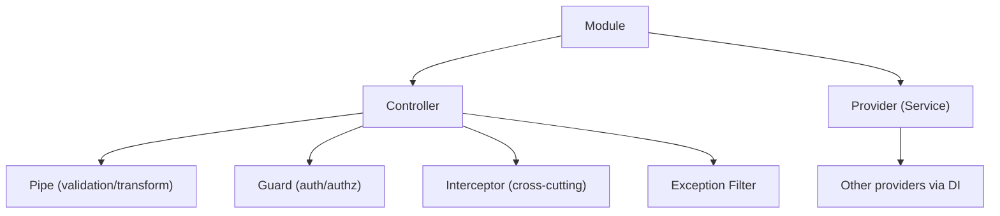

NestJS is the framing senior candidates typically present as the right pick when the team values opinionated structure, Dependency Injection, and a familiar architectural pattern from Angular or the Java Spring ecosystem. It is heavier than Express or Fastify, and the additional weight pays back in large, long-lived codebases with strict architectural conventions where the structural enforcement is worth more than the framework cost.

Under the hood, NestJS uses Express by default and supports Fastify as an alternative adapter, so the team retains the underlying performance choice while benefiting from Nest's higher-level abstractions.

> **Acronyms used in this chapter.** API: Application Programming Interface. CORS: Cross-Origin Resource Sharing. DI: Dependency Injection. DTO: Data Transfer Object. HTTP: Hypertext Transfer Protocol. JWT: JSON Web Token. RxJS: Reactive Extensions for JavaScript. UI: User Interface. URL: Uniform Resource Locator. UUID: Universally Unique Identifier.

## The pieces



A *module* is the unit of organisation in NestJS; it imports other modules, declares the controllers it owns, and declares the providers it makes available for Dependency Injection. A *controller* declares the routes for the module and serves as a thin adapter layer between Hypertext Transfer Protocol and the services that contain the business logic. A *provider* is any injectable artifact — a service, a repository, a helper — that NestJS's Dependency Injection container can supply to consumers. A *pipe* transforms and validates input on the way into a handler. A *guard* returns true or false for the question "is this request allowed", typically used for authentication and authorisation. An *interceptor* wraps the handler execution and is the right place for cross-cutting concerns such as logging, caching, and response transformation. A *filter* maps thrown errors to Hypertext Transfer Protocol responses, providing a centralised place to control how exceptions become responses.

## Setup

```ts
// src/app.module.ts
import { Module } from "@nestjs/common";
import { TasksModule } from "./tasks/tasks.module.js";

@Module({
  imports: [TasksModule],
})
export class AppModule {}
```

```ts
// src/main.ts
import { NestFactory } from "@nestjs/core";
import { ValidationPipe } from "@nestjs/common";
import { AppModule } from "./app.module.js";
import { env } from "./env.js";

async function bootstrap() {
  const app = await NestFactory.create(AppModule, { cors: true });
  app.useGlobalPipes(new ValidationPipe({ whitelist: true, transform: true }));
  await app.listen(env.PORT);
}
bootstrap();
```

`ValidationPipe` is registered globally and runs the `class-validator` rules on every Data Transfer Object the controllers declare. The `whitelist: true` option strips properties from the input that the Data Transfer Object does not declare, which is a useful default to prevent over-posting attacks.

## Module + service + controller

```ts
// src/tasks/tasks.module.ts
import { Module } from "@nestjs/common";
import { TasksController } from "./tasks.controller.js";
import { TasksService } from "./tasks.service.js";

@Module({
  controllers: [TasksController],
  providers: [TasksService],
})
export class TasksModule {}
```

```ts
// src/tasks/tasks.service.ts
import { Injectable, NotFoundException } from "@nestjs/common";
import { randomUUID } from "node:crypto";
import type { CreateTaskDto, UpdateTaskDto, ListTasksQueryDto } from "./tasks.dto.js";

type Task = {
  id: string;
  title: string;
  description?: string;
  status: "open" | "in_progress" | "done";
  createdAt: string;
  updatedAt: string;
};

@Injectable()
export class TasksService {
  private store: Task[] = [];

  list({ status, page, pageSize }: ListTasksQueryDto) {
    const all = this.store.filter((t) => !status || t.status === status);
    const start = (page - 1) * pageSize;
    return { items: all.slice(start, start + pageSize), total: all.length };
  }

  get(id: string): Task {
    const t = this.store.find((x) => x.id === id);
    if (!t) throw new NotFoundException("Task not found");
    return t;
  }

  create(dto: CreateTaskDto): Task {
    const now = new Date().toISOString();
    const task: Task = {
      id: randomUUID(),
      ...dto,
      status: dto.status ?? "open",
      createdAt: now,
      updatedAt: now,
    };
    this.store.push(task);
    return task;
  }

  update(id: string, dto: UpdateTaskDto): Task {
    const t = this.get(id);
    Object.assign(t, dto, { updatedAt: new Date().toISOString() });
    return t;
  }

  delete(id: string): void {
    const i = this.store.findIndex((t) => t.id === id);
    if (i < 0) throw new NotFoundException("Task not found");
    this.store.splice(i, 1);
  }
}
```

```ts
// src/tasks/tasks.controller.ts
import {
  Body, Controller, Delete, Get, HttpCode, Param, ParseUUIDPipe,
  Patch, Post, Query,
} from "@nestjs/common";
import { TasksService } from "./tasks.service.js";
import { CreateTaskDto, UpdateTaskDto, ListTasksQueryDto } from "./tasks.dto.js";

@Controller("tasks")
export class TasksController {
  constructor(private readonly tasks: TasksService) {}

  @Get()
  list(@Query() query: ListTasksQueryDto) {
    return this.tasks.list(query);
  }

  @Post()
  create(@Body() dto: CreateTaskDto) {
    return this.tasks.create(dto);
  }

  @Get(":id")
  get(@Param("id", ParseUUIDPipe) id: string) {
    return this.tasks.get(id);
  }

  @Patch(":id")
  update(@Param("id", ParseUUIDPipe) id: string, @Body() dto: UpdateTaskDto) {
    return this.tasks.update(id, dto);
  }

  @Delete(":id")
  @HttpCode(204)
  delete(@Param("id", ParseUUIDPipe) id: string) {
    this.tasks.delete(id);
  }
}
```

## Data Transfer Objects with `class-validator`

The idiomatic NestJS Data Transfer Object uses decorators from the `class-validator` library to declare validation rules on each property of a class. This keeps the validation rules co-located with the property declarations and makes the Data Transfer Object directly inspectable by tooling that reads the decorators. Teams that prefer Zod can use `nestjs-zod` to bridge Zod schemas into the NestJS validation pipeline; the team should pick one approach and apply it consistently throughout the codebase rather than mixing the two.

```ts
// src/tasks/tasks.dto.ts
import { IsEnum, IsInt, IsOptional, IsString, Length, Min, Max } from "class-validator";
import { Type } from "class-transformer";

export class CreateTaskDto {
  @IsString()
  @Length(1, 200)
  title!: string;

  @IsOptional()
  @IsString()
  @Length(0, 2000)
  description?: string;

  @IsOptional()
  @IsEnum(["open", "in_progress", "done"])
  status?: "open" | "in_progress" | "done";
}

export class UpdateTaskDto {
  @IsOptional() @IsString() @Length(1, 200) title?: string;
  @IsOptional() @IsString() @Length(0, 2000) description?: string;
  @IsOptional() @IsEnum(["open", "in_progress", "done"]) status?: "open" | "in_progress" | "done";
}

export class ListTasksQueryDto {
  @IsOptional() @IsEnum(["open", "in_progress", "done"]) status?: "open" | "in_progress" | "done";

  @IsOptional() @Type(() => Number) @IsInt() @Min(1)
  page: number = 1;

  @IsOptional() @Type(() => Number) @IsInt() @Min(1) @Max(100)
  pageSize: number = 20;
}
```

The `@Type(() => Number)` decorator from `class-transformer` coerces query string values (which arrive as strings) into numbers before validation runs; without the coercion, `IsInt` would reject every query parameter because the raw value is always a string.

## Guards (authentication and authorisation)

```ts
import { CanActivate, ExecutionContext, Injectable, UnauthorizedException } from "@nestjs/common";

@Injectable()
export class AuthGuard implements CanActivate {
  canActivate(context: ExecutionContext): boolean {
    const req = context.switchToHttp().getRequest();
    const token = req.cookies?.session;
    if (!token) throw new UnauthorizedException();
    req.user = verifySessionToken(token);
    return true;
  }
}
```

Apply at any level — global, per-controller, per-route:

```ts
@UseGuards(AuthGuard)
@Controller("tasks")
export class TasksController {/* ... */}
```

## Interceptors

Interceptors wrap handler execution. Use them for logging, caching, transforming responses.

```ts
@Injectable()
export class LoggingInterceptor implements NestInterceptor {
  intercept(context: ExecutionContext, next: CallHandler) {
    const start = Date.now();
    const req = context.switchToHttp().getRequest();
    return next.handle().pipe(
      tap(() => Logger.log(`${req.method} ${req.url} ${Date.now() - start}ms`)),
    );
  }
}
```

## Pipes

Pipes transform/validate parameters. The built-ins (`ParseIntPipe`, `ParseUUIDPipe`, `ValidationPipe`) cover most cases. Custom pipes are easy:

```ts
@Injectable()
export class TrimPipe implements PipeTransform {
  transform(value: any) {
    if (typeof value === "string") return value.trim();
    if (typeof value === "object" && value !== null) {
      for (const k of Object.keys(value)) {
        if (typeof value[k] === "string") value[k] = value[k].trim();
      }
    }
    return value;
  }
}
```

## Exception filters

```ts
@Catch()
export class HttpExceptionFilter implements ExceptionFilter {
  catch(exception: unknown, host: ArgumentsHost) {
    const ctx = host.switchToHttp();
    const res = ctx.getResponse();
    const status = exception instanceof HttpException ? exception.getStatus() : 500;
    const payload = exception instanceof HttpException
      ? exception.getResponse()
      : { type: "about:blank", title: "Internal server error", status: 500 };
    res.status(status).json(payload);
  }
}
```

Apply globally with `app.useGlobalFilters(new HttpExceptionFilter())`.

## OpenAPI

```ts
import { DocumentBuilder, SwaggerModule } from "@nestjs/swagger";

const config = new DocumentBuilder()
  .setTitle("Tasks API")
  .setVersion("0.1.0")
  .build();

const document = SwaggerModule.createDocument(app, config);
SwaggerModule.setup("docs", app, document);
```

Decorate DTOs with `@ApiProperty()` and routes with `@ApiOperation()` for richer docs.

## Testing

```ts
import { Test } from "@nestjs/testing";
import { TasksController } from "./tasks.controller.js";
import { TasksService } from "./tasks.service.js";

describe("TasksController", () => {
  let controller: TasksController;
  let service: TasksService;

  beforeEach(async () => {
    const module = await Test.createTestingModule({
      controllers: [TasksController],
      providers: [TasksService],
    }).compile();
    controller = module.get(TasksController);
    service = module.get(TasksService);
  });

  it("creates a task", () => {
    const created = controller.create({ title: "Write the chapter" });
    expect(created.title).toBe("Write the chapter");
    expect(service.list({ page: 1, pageSize: 10 }).items).toContainEqual(created);
  });
});
```

For HTTP-level tests, `@nestjs/testing` + `supertest`.

## Microservices

NestJS has first-class support for non-Hypertext-Transfer-Protocol transports — gRPC, NATS, RabbitMQ, Kafka — through its microservice abstraction. This is useful when the team wants a single programming model spanning Hypertext Transfer Protocol services and message-driven workers, so the same module/provider/controller pattern applies whether the entry point is a web request or a queue message.

## When NestJS is the right pick

NestJS is the right pick under four conditions. The team is migrating from Angular and wants the same Dependency Injection and module patterns on the backend. The team values strict structure (modules, providers, decorators) over flexibility because the codebase is large enough that conventions matter more than per-developer preferences. The team is building a long-lived enterprise codebase with many engineers where the structural enforcement reduces onboarding cost and prevents architectural drift. The team needs built-in Dependency Injection for testability without inventing its own injection framework.

## When it is overkill

NestJS is overkill in three project shapes. A small service with three endpoints does not justify the framework's weight. A solo developer or small team where the structure tax (writing modules, providers, decorators for trivial code) exceeds the structure benefit. A serverless function where the cold-start time matters; NestJS's bootstrap involves a substantial initialisation pass and is heavy for sub-second cold-start budgets.

## Key takeaways

The NestJS model is modules plus Dependency Injection plus decorators. Controllers stay thin and services stay thick — the business logic lives in providers, and the controller's job is to delegate to them. Pipes validate, guards authorise, interceptors wrap, and filters map errors; each cross-cutting concern has a dedicated mechanism rather than being mixed into the handler. The default Data Transfer Object pattern uses `class-validator` decorators; `nestjs-zod` is the modern alternative for teams that already use Zod. NestJS is heavy for tiny services and serverless cold starts but at home in long-lived enterprise applications where the structure pays back over time.

## Common interview questions

1. Compare Nest's pipes, guards, interceptors, and filters — what does each do?
2. Walk me through the lifecycle of a request through Nest.
3. Why decorator-based DTOs and not Zod? Trade-offs?
4. When is NestJS overkill?
5. How do you mock a provider in a Nest test?

## Answers

### 1. Compare Nest's pipes, guards, interceptors, and filters — what does each do?

The four mechanisms address distinct concerns and run at distinct points in the request lifecycle. Pipes transform and validate input to handler parameters; they run after the request is routed but before the handler executes, and a pipe that throws prevents the handler from running. Guards return a boolean answer to "is this request allowed"; they run before pipes and are the right place for authentication and authorisation, with a `false` return or a thrown exception preventing the handler from running. Interceptors wrap the handler execution with `before` and `after` hooks; they are the right place for cross-cutting concerns such as logging, caching, and response transformation, and they can modify the response stream as it leaves. Filters map thrown exceptions to Hypertext Transfer Protocol responses; they run when an exception escapes the handler and are the centralised place to control how exceptions become responses.

**How it works.** The request lifecycle is: incoming request → middleware → guards → interceptors (before) → pipes → handler → interceptors (after) → response. A failure at any earlier stage short-circuits the request. The framework provides typed extension points (`CanActivate`, `PipeTransform`, `NestInterceptor`, `ExceptionFilter`) that the team implements and applies at any scope (global, per-controller, per-route).

```ts
@UseGuards(AuthGuard)
@UseInterceptors(LoggingInterceptor)
@UseFilters(HttpExceptionFilter)
@Controller("tasks")
export class TasksController { /* handlers here */ }
```

**Trade-offs / when this fails.** The four mechanisms can feel like overlapping ways to do similar things; the team must internalise which mechanism is appropriate for which concern. A guard is the right place for "should this request proceed", an interceptor is the right place for "wrap the handler with cross-cutting behaviour", and a pipe is the right place for "transform or validate this single argument". Conflating them produces code that is correct but architecturally muddled.

### 2. Walk me through the lifecycle of a request through Nest.

A request arrives at the underlying Express or Fastify adapter. Global middleware runs first, then per-controller middleware. Guards run next; a `false` return or thrown exception aborts. Interceptors wrap the rest of the lifecycle with their `before` hook. Pipes run on each handler parameter to transform and validate the input. The handler executes and produces a return value. Interceptors' `after` hook runs, potentially transforming the return value. Exception filters intercept any thrown exception and translate it into a response. The response is serialised and sent.

**How it works.** Each phase is implemented by the framework's request execution context. The execution context exposes the underlying request and response objects, the matched handler, and metadata declared via decorators. The framework iterates through each registered participant in order and short-circuits on failure.

```ts
@Injectable()
export class LoggingInterceptor implements NestInterceptor {
  intercept(context: ExecutionContext, next: CallHandler) {
    const start = Date.now();
    const req = context.switchToHttp().getRequest();
    return next.handle().pipe(
      tap(() => Logger.log(`${req.method} ${req.url} ${Date.now() - start}ms`)),
    );
  }
}
```

**Trade-offs / when this fails.** The lifecycle is rich and the team must understand the order to debug effectively; a guard that depends on data set by middleware will not work because middleware does not have access to the typed execution context that guards do. The cure is to learn the order and to test the participants in isolation when the integrated behaviour is unclear.

### 3. Why decorator-based DTOs and not Zod? Trade-offs?

Decorator-based Data Transfer Objects with `class-validator` are the idiomatic NestJS choice because the framework's Dependency Injection system, its `ValidationPipe`, and its OpenAPI generator all integrate with the decorator metadata directly; a class with `@IsString()` and `@Length(1, 200)` decorators is consumed by every NestJS subsystem without additional bridging. Zod schemas with `nestjs-zod` are the modern alternative; the trade-off is whether the team values the per-property decorator declaration (which keeps validation rules close to the field they validate, in the same syntax the rest of the framework uses) over the Zod schema declaration (which is more concise, supports more powerful composition, and shares directly with the frontend).

**How it works.** Decorator-based Data Transfer Objects work because TypeScript's `experimentalDecorators` and `emitDecoratorMetadata` flags emit the decorator calls and the type metadata at runtime. The `ValidationPipe` reads the decorators from the Data Transfer Object class and runs the validators against the request data. Zod-based Data Transfer Objects via `nestjs-zod` use a different mechanism — the schema is compiled to a class-like artifact that the `ValidationPipe` can consume.

```ts
import { IsString, Length, IsOptional, IsEnum } from "class-validator";

export class CreateTaskDto {
  @IsString() @Length(1, 200) title!: string;

  @IsOptional() @IsString() @Length(0, 2000) description?: string;

  @IsOptional() @IsEnum(["open", "in_progress", "done"])
  status?: "open" | "in_progress" | "done";
}
```

**Trade-offs / when this fails.** Decorator-based Data Transfer Objects depend on TypeScript's decorator metadata, which is an experimental TypeScript feature that may change in future versions. They also do not share directly with frontend code that does not use the same decorator setup; the schema must be re-declared on the frontend or generated through a separate pipeline. The cure for the sharing problem is `nestjs-zod`, which uses Zod schemas that are directly consumable by frontend code. The cure for the decorator-experimental concern is to accept the dependency or migrate to `nestjs-zod` if the experimental status is unacceptable.

### 4. When is NestJS overkill?

NestJS is overkill when the project's structural needs do not justify the framework's weight. A small service with three endpoints does not benefit from modules, providers, and decorators; the simpler framework (Express, Fastify) ships the same Application Programming Interface in less code with a faster cold start. A solo developer or a small team that does not need enforced structure pays a tax (writing the modules, the providers, the decorators) without receiving the benefit. A serverless function with a tight cold-start budget is poorly served by NestJS because the framework's bootstrap involves substantial initialisation; for sub-second cold starts, a leaner framework (or no framework at all) is more appropriate.

**How it works.** NestJS's value is in enforcing architectural conventions across a large codebase with many engineers; the framework's modules, providers, and decorators give the team a shared vocabulary and a shared layout that reduces onboarding cost and prevents architectural drift. The cost of those conventions is real for projects that do not need them.

```ts
// A trivial service in Express — three lines.
app.get("/health", (_req, res) => res.send({ ok: true }));

// The NestJS equivalent — module + controller + provider, ~30 lines.
```

**Trade-offs / when this fails.** The decision can be deferred — the team can start with a leaner framework and migrate to NestJS when the architectural needs emerge. The migration cost is non-trivial but is bounded; the team must rewrite the controllers and adopt the module structure but the business logic typically transfers without changes. The cure is to be honest about the project's structural needs at the outset and to revisit the decision as the project grows.

### 5. How do you mock a provider in a Nest test?

Use `Test.createTestingModule` from `@nestjs/testing` to construct a module with the controller under test and a mocked version of the service. The mocking is done by providing a `useValue` or `useFactory` for the service token, which the testing module supplies in place of the real provider during compilation. The controller's Dependency Injection then receives the mock, and the test asserts on the controller's behaviour without exercising the real service implementation.

**How it works.** The testing module follows the same Dependency Injection rules as the production module, so the mock provider must match the token (the service's class) that the controller injects. The mock can be a plain object with the methods the controller calls or a Jest/Vitest spy object that records calls. After compilation, the test resolves the controller from the module and invokes its handlers directly.

```ts
import { Test } from "@nestjs/testing";

const mockTasksService = {
  create: vi.fn().mockReturnValue({ id: "1", title: "Mocked" }),
};

const module = await Test.createTestingModule({
  controllers: [TasksController],
  providers: [
    { provide: TasksService, useValue: mockTasksService },
  ],
}).compile();

const controller = module.get(TasksController);
expect(controller.create({ title: "anything" })).toEqual({ id: "1", title: "Mocked" });
```

**Trade-offs / when this fails.** The pattern fails when the team mocks too much; a controller test that mocks the service entirely tests only the controller's binding logic, which is rarely the source of bugs. The cure is to mix unit tests of the service (with the service constructed directly) and integration tests of the controller-and-service together (with `Test.createTestingModule` providing both real implementations). The pattern also fails when the mock drifts out of sync with the real service's signature; the cure is to derive the mock's type from the real service's interface so a refactor of the service breaks the test.

## Further reading

- [NestJS docs](https://docs.nestjs.com/).
- [`nestjs-zod`](https://github.com/risenforces/nestjs-zod) for Zod DTOs in Nest.
- Kamil Mysliwiec, [NestJS introduction series on YouTube](https://www.youtube.com/@kamilmysliwiec).
