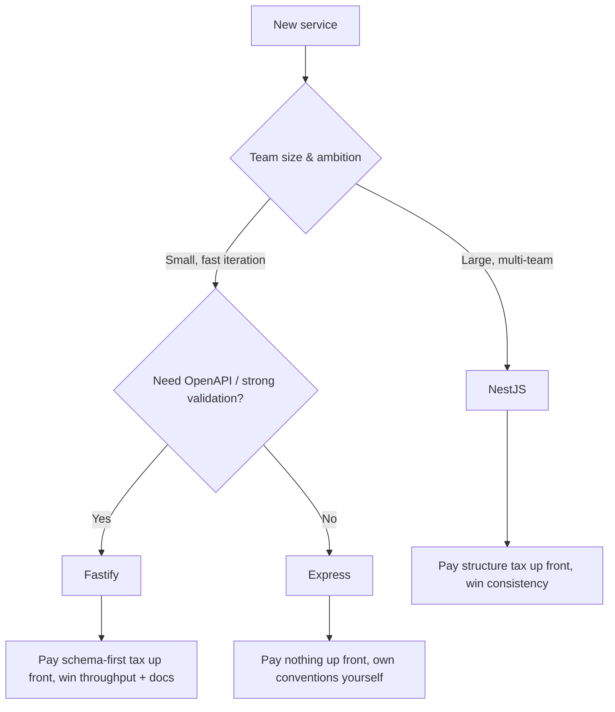

The previous three chapters built the same Tasks Application Programming Interface in Express, Fastify, and NestJS. The trade-offs are now visible side by side rather than discussed abstractly. The senior framing is to pick the framework whose strengths address a concrete project need, not the framework that is fashionable or familiar.

> **Acronyms used in this chapter.** API: Application Programming Interface. CPU: Central Processing Unit. DB: Database. DI: Dependency Injection. DTO: Data Transfer Object. HTTP: Hypertext Transfer Protocol. JS: JavaScript. JSON: JavaScript Object Notation. RFC: Request for Comments. RPS: Requests Per Second. TS: TypeScript.

| Concern | Express | Fastify | NestJS |
| --- | --- | --- | --- |
| Maturity & ecosystem | Largest | Large; growing | Large (Angular-style) |
| Performance (req/s, JSON echo) | ~5–10k | ~30–60k | ~5–10k (Express adapter) |
| Validation built in | No | Yes (JSON Schema / Zod) | Yes (`class-validator` / Zod) |
| OpenAPI built in | No (3rd party) | Yes (with type provider) | Yes (`@nestjs/swagger`) |
| Opinion on structure | None | Light (plugins) | Heavy (modules, DI) |
| Decorators / TS-first | No | Optional | Yes (heavy use) |
| Learning curve | Tiny | Small | Medium-large |
| Cold-start friendliness (Lambda) | Excellent | Excellent | OK (Nest is heavier) |
| Best fit team size | 1–5 | 2–20 | 5+ enterprise |

## When to pick Express

Choose Express when the team needs maximum ecosystem coverage — some legacy middleware exists only for Express and the cost of porting it would exceed the framework's overhead. Choose Express when the team has strong existing Express experience and the workload is straightforward Hypertext Transfer Protocol shape. Choose Express when the project is small and the team does not want a framework opinion fighting its choices. Choose Express when the deployment target is AWS Lambda and cold-start time is part of the user experience budget.

## When to pick Fastify

Choose Fastify when the team wants schema-first validation, type inference, and OpenAPI documentation as a single integrated capability rather than three separately-wired libraries. Choose Fastify when throughput matters and the team has measured that Express's overhead is the bottleneck rather than the database. Choose Fastify when the plugin encapsulation model fits the team's preferred code organisation; the per-plugin scope is a real architectural lever. Choose Fastify when the team values the modern Node.js plus Web Streams native feel that the framework leans into.

## When to pick NestJS

Choose NestJS when the codebase is large enough that consistent structure is a feature rather than a tax — when the team's onboarding cost and architectural drift would be reduced more by enforced conventions than the conventions cost in framework weight. Choose NestJS when multiple teams ship in the same repository and need an opinionated framework to coordinate their work. Choose NestJS when the team is migrating from Angular and wants the same Dependency Injection and module patterns on both sides of the network. Choose NestJS when the team will use the framework's microservices abstraction for non-Hypertext-Transfer-Protocol transports (RabbitMQ, gRPC, Kafka) as well as the Hypertext Transfer Protocol services.

## A senior decision tree



## Things that matter regardless of framework

Seven concerns are framework-agnostic and constitute the floor for any production Node.js service. Validate inputs at the edge with Zod or the framework's equivalent so untrusted data never reaches the service layer in an unvalidated state. Maintain a service layer that is framework-agnostic so controllers stay thin and business logic is portable across framework migrations. Ship distinct `/healthz` and `/readyz` endpoints so the orchestrator can distinguish "process alive" from "process ready to serve traffic". Emit structured JavaScript Object Notation logs with explicit redaction of secret-bearing fields so the team's log aggregator never receives credentials. Propagate the `traceparent` header on every incoming and outgoing request so distributed tracing reconstructs the full request flow. Use the `application/problem+json` error envelope from Request for Comments 7807 so consumers can parse errors uniformly. Generate OpenAPI from the schemas the team already writes rather than maintaining it by hand.

If the team applies all seven, switching frameworks later costs approximately a few days of focused work. Skipping them makes the framework load-bearing — the application cannot move to a different framework without a substantial rewrite.

## Migration strategy: when and how

If the team has outgrown Express, the migration to Fastify or NestJS proceeds in four steps that minimise risk. Adopt Zod for validation while still on Express; the schemas are now framework-independent and ready for the new framework. Pull business logic out of the route handlers into a service layer; controllers should reduce to approximately ten lines each that delegate to the service. Replicate the public Hypertext Transfer Protocol contract in the target framework and use the framework's request injection (`inject` for Fastify, `supertest` for Express, `@nestjs/testing` for NestJS) to verify behaviour matches endpoint by endpoint. Cut over one endpoint at a time behind a feature flag or path-based routing rather than performing a big-bang rewrite that risks correlated failures.

None of these steps require the new framework on day one. The first two are valuable on their own and make the eventual migration trivial when the team decides to do it.

## Key takeaways

Express for small, simple, or legacy projects; Fastify for performance and schema-first development; NestJS for large, structured, or enterprise codebases. Performance is the framework's biggest selling point that matters last — the database is usually the bottleneck and the framework difference is invisible. The service layer plus Zod schemas plus health endpoints plus structured logs plus traces plus Request for Comments 7807 errors plus OpenAPI are framework-agnostic and should be applied regardless of framework choice. Switching frameworks is feasible if the team has not made the framework load-bearing.

## Common interview questions

1. You're hired to build a new service for a team of 30. Which framework, and why?
2. You're at 1k RPS and getting CPU-bound. What's your investigation order?
3. How would you migrate an Express app to Fastify without a big-bang rewrite?
4. What patterns make any backend portable across frameworks?
5. Trade-offs of `class-validator` decorators versus Zod schemas?

## Answers

### 1. You're hired to build a new service for a team of 30. Which framework, and why?

NestJS, with high confidence. A team of thirty needs the structural enforcement that NestJS provides — modules to bound responsibility, providers for explicit Dependency Injection, decorators that make cross-cutting concerns visible at the call site, and conventions that reduce onboarding cost for the inevitable next hire. The team's coordination overhead at thirty engineers is high enough that the framework's structural cost is repaid by the consistency it produces. The decision would shift toward Fastify only if performance is the dominant concern and the team's architectural maturity is high enough to enforce conventions without the framework's help.

**How it works.** NestJS's modules give the team a natural unit of code ownership; one module owns one feature, with explicit imports declaring which other modules it depends on. The Dependency Injection container makes testing tractable because providers can be substituted at the boundary. The decorator-based controllers make the Hypertext Transfer Protocol surface inspectable — a reader can see at a glance which routes a controller declares and which guards apply.

```ts
@Module({
  imports: [AuthModule, DatabaseModule],
  controllers: [TasksController],
  providers: [TasksService, TasksRepository],
})
export class TasksModule {}
```

**Trade-offs / when this fails.** The decision can be wrong if the team is migrating from Express and has built a culture around Express's flexibility; in that case, the team may experience the NestJS conventions as constraining rather than helpful, and the migration cost may exceed the structural benefit. The cure is to evaluate whether the team values structure enough to adopt the framework's opinions, and to consider Fastify with a strong internal architectural standard as an alternative when the answer is no.

### 2. You're at 1k RPS and getting CPU-bound. What's your investigation order?

The investigation proceeds from cheap-to-measure to expensive-to-measure. First, profile the application under load with `node --prof` or Clinic Flame to identify the dominant hot spots; the framework's overhead, the team's serialization, the team's validation, the team's database driver, and the team's business logic are the candidates and the profile reveals which. Second, measure the request lifecycle to identify whether the time is spent in the framework, in synchronous code, or in waiting for downstream services. Third, evaluate whether the framework itself is a meaningful contributor — if Express is consuming a significant fraction of the time, switching to Fastify is a high-leverage change; if the time is entirely in business logic or downstream Input/Output, the framework switch is cosmetic.

**How it works.** The Central-Processing-Unit profile shows hot functions with sample counts; a function that consumes 30 percent of the samples is a 30 percent reduction opportunity if it can be made trivial. The `autocannon` Hypertext Transfer Protocol load testing tool reproduces the load conditions under which the regression manifests, so the profile is taken under the conditions the team is trying to fix.

```bash
node --prof src/index.js &
autocannon -c 100 -d 30 http://localhost:3000/api/tasks
kill %1
node --prof-process isolate-*-v8.log > profile.txt
```

**Trade-offs / when this fails.** The investigation fails when the team jumps to the conclusion (typically "switch to Fastify") before profiling. The performance literature has many cases where teams switched frameworks and the bottleneck moved to the next-slowest layer — the database query, the synchronous JavaScript Object Notation parsing, the unbounded loop in the business logic — leaving the team with a rewritten application and the same performance. The cure is to profile first, identify the actual bottleneck, and intervene at that layer.

### 3. How would you migrate an Express app to Fastify without a big-bang rewrite?

The migration proceeds in four phases that reduce risk by isolating the framework switch from the rest of the work. Phase one: stabilise the Express application for migration by introducing Zod for validation (the schemas become framework-independent), extracting business logic into a service layer (controllers reduce to thin adapters), and ensuring the Hypertext Transfer Protocol contract is fully covered by integration tests so behaviour can be verified after each cut-over. Phase two: stand up the Fastify application alongside the Express application, sharing the same service layer. Phase three: cut over one endpoint at a time behind a path-based router or a feature flag, using the integration tests to verify the Fastify endpoint matches the Express behaviour. Phase four: retire the Express application once every endpoint has been migrated and stable for a defined observation window.

**How it works.** The path-based router (an HAProxy or NGINX configuration in front of both applications) routes per-endpoint traffic to either the Express or the Fastify application, allowing per-endpoint cut-over. The shared service layer means the business logic does not move during the migration; only the Hypertext Transfer Protocol adapter changes.

```nginxlocation /api/tasks {
    proxy_pass http://fastify-app;
}
location /api/users {
    proxy_pass http://express-app;
}
```

**Trade-offs / when this fails.** The pattern fails when the team's tests do not adequately cover the Express behaviour; cut-overs introduce subtle regressions that surface only in production. The cure is to invest in integration test coverage before starting the migration and to use observability (error rates, latency distributions) to detect regressions quickly. The pattern also fails when the team underestimates the work to maintain two applications in parallel; the cure is to set a definite migration deadline and to allocate the engineering capacity to meet it rather than allowing the parallel state to persist indefinitely.

### 4. What patterns make any backend portable across frameworks?

Seven patterns, applied consistently, make a backend portable. A framework-agnostic service layer that knows nothing about the Hypertext Transfer Protocol framework. Schema-defined Data Transfer Objects (Zod or JSON Schema) that decouple validation from the framework's pipeline. Distinct `/healthz` and `/readyz` endpoints with the same semantics regardless of framework. Structured JavaScript Object Notation logs with consistent field names and redaction. `traceparent` header propagation on every incoming and outgoing request. The `application/problem+json` error envelope from Request for Comments 7807. OpenAPI documentation generated from the schemas rather than maintained by hand.

**How it works.** Each pattern lives outside the framework's idiomatic path, so swapping the framework leaves the pattern intact. The service layer is the most important — when the business logic is in plain TypeScript classes that depend on plain interfaces, it migrates verbatim. The schemas are the second most important — when validation is a Zod schema rather than a framework-specific declaration, the validation code does not change.

```ts
// Service layer is plain TypeScript — no framework imports.
export class TaskService {
  constructor(private repo: TaskRepository) {}
  async create(input: CreateTaskInput): Promise<Task> { /* ... */ }
}
```

**Trade-offs / when this fails.** The patterns add a layer of indirection that may feel like overkill for a small service. The cure is to start with the patterns even on small services so the team's habits are consistent across the codebase; the patterns are not free, but the cost is small and the optionality is large.

### 5. Trade-offs of `class-validator` decorators versus Zod schemas?

`class-validator` decorators are the idiomatic choice for NestJS because they integrate with the framework's Dependency Injection, the `ValidationPipe`, and the OpenAPI generator without bridging. Zod schemas are framework-agnostic, share directly with frontend code, support more powerful composition (`pick`, `omit`, `merge`, `extend`), and produce inferred TypeScript types. The trade-off depends on whether the team prioritises framework integration (decorators win) or schema portability and composability (Zod wins).

**How it works.** Decorator-based Data Transfer Objects use TypeScript's experimental decorator metadata to attach validation rules to class properties; the framework reads the metadata at request time and applies the validators. Zod schemas are values (instances of `z.ZodType`) that carry both validation logic and type information, with `parse` and `safeParse` methods invoked explicitly by the application code or by a framework adapter (`fastify-type-provider-zod`, `nestjs-zod`).

```ts
// class-validator
class CreateTaskDto {
  @IsString() @Length(1, 200) title!: string;
}

// Zod
const CreateTaskInput = z.object({
  title: z.string().min(1).max(200),
});
type CreateTaskInput = z.infer<typeof CreateTaskInput>;
```

**Trade-offs / when this fails.** The class-validator approach depends on TypeScript's experimental decorator metadata, which may change in future TypeScript versions; the Zod approach is independent of any TypeScript feature flag. The class-validator approach also requires the schema to be a class, which is a heavier construct than Zod's value-based schemas. The cure is to pick the approach that aligns with the framework — class-validator for NestJS by default, Zod for everything else by default — and to use `nestjs-zod` if the team specifically wants Zod with NestJS for portability reasons.
