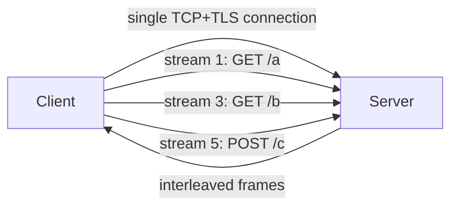
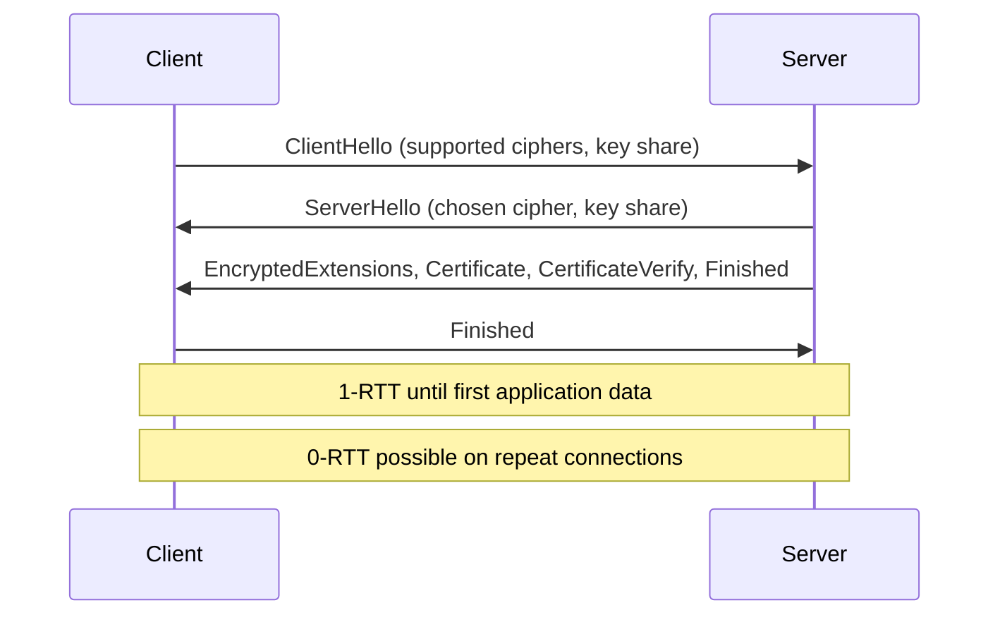
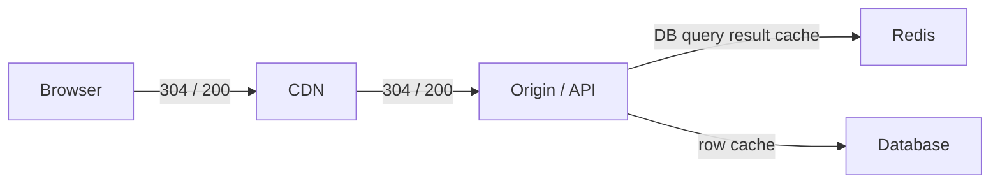

Senior interviews probe whether the candidate understands the network underneath the Application Programming Interface, especially in the context of "why is this slow?" and "what does Transport Layer Security termination cost?".

> **Acronyms used in this chapter.** ACM: AWS Certificate Manager. ALB: Application Load Balancer. API: Application Programming Interface. CDN: Content Delivery Network. CORS: Cross-Origin Resource Sharing. HOL: Head-of-Line. HPACK: Header Compression for HTTP/2. HSTS: HTTP Strict Transport Security. HTTP: Hypertext Transfer Protocol. HTTPS: HTTP Secure. LRU: Least Recently Used. MAC: Message Authentication Code. mTLS: mutual Transport Layer Security. QUIC: Quick UDP Internet Connections. RFC: Request for Comments. RTT: Round-Trip Time. SSE: Server-Sent Events. TCP: Transmission Control Protocol. TLS: Transport Layer Security. UDP: User Datagram Protocol.

## HTTP/1.1

The version most Application Programming Interfaces still negotiate as a baseline. The protocol is text-based and runs over the Transmission Control Protocol. It supports only one request per connection at a time without pipelining (which is universally avoided in practice because of the head-of-line blocking it introduces). The `Connection: keep-alive` header is the default, allowing the same Transmission Control Protocol connection to carry multiple sequential requests. To compensate for the single-request limitation, browsers open up to six parallel connections per origin, which raises the effective parallelism but comes at the cost of six Transport Layer Security handshakes and six congestion windows that warm up independently.

The performance ceiling for HTTP/1.1 is head-of-line blocking. A slow response on connection 1 blocks every subsequent request on that connection until the response completes; the request behind it cannot start, even if it would have been served from cache in microseconds.

## HTTP/2

Released in 2015. The major change is multiplexed binary streams over a single Transmission Control Protocol connection.



The benefits are concrete. Multiplexing puts many requests in flight on one connection, eliminating the per-request connection cost. Header Compression for HTTP/2 (the algorithm is named HPACK) saves bandwidth on the repetitive headers (`Cookie`, `Authorization`, `User-Agent`) that dominate small request sizes. Binary framing is faster to parse than text. Server Push allowed the server to send resources unsolicited, but is now largely deprecated and removed from major browsers because the gains rarely justified the complexity.

The costs are also real. Transmission Control Protocol head-of-line blocking still applies at the transport layer — a single dropped packet stalls every stream on that connection until it is retransmitted. The protocol is more complex to debug than HTTP/1.1 because the binary framing is not human-readable in a packet capture without a decoder.

In 2026, almost every Content Delivery Network serves HTTP/2 by default. Enable it on origin servers too where the runtime supports it.

## HTTP/3

Released in 2022. The major change is that the protocol runs over Quick UDP Internet Connections (QUIC) — itself running over the User Datagram Protocol — instead of the Transmission Control Protocol. QUIC eliminates Transmission Control Protocol head-of-line blocking because each stream is independently flow-controlled at the transport layer; a lost packet blocks only its own stream rather than all streams on the connection.

The benefits include the elimination of Transmission Control Protocol head-of-line blocking so that independent streams are genuinely independent; 0-RTT (zero Round-Trip Time) resumption for repeat connections, which is faster than TLS 1.3 over Transmission Control Protocol; and connection migration, which means switching from Wi-Fi to cellular does not drop the connection because QUIC identifies connections by a connection identifier rather than by the four-tuple of source and destination addresses.

The costs include occasional User Datagram Protocol blocking by corporate firewalls, which forces clients to fall back to HTTP/2; and less mature observability in some monitoring stacks because the encryption boundary has moved into the transport layer, hiding details that older tools relied on.

Cloudflare, Fastly, and AWS CloudFront all support HTTP/3. For most applications, no action is required; the Content Delivery Network negotiates the best version with each client based on what the client supports.

## The TLS 1.3 handshake

The handshake to memorize:



Transport Layer Security 1.3 (Request for Comments 8446) is the modern default. Configurations that accept Transport Layer Security 1.0 or 1.1 should be hardened; both versions are deprecated and have known weaknesses.

The interview-relevant facts are precise. Transport Layer Security provides three properties: confidentiality through encryption, integrity through a Message Authentication Code, and authentication through the server certificate (optionally also a client certificate for mutual Transport Layer Security). The handshake completes in one Round-Trip Time in Transport Layer Security 1.3, half of the two Round-Trip Times that Transport Layer Security 1.2 required. The 0-RTT mode (also called "early data") sends application data in the handshake's first message and is useful for repeat connections, but is vulnerable to replay attacks — use it only for idempotent requests. Perfect Forward Secrecy through Elliptic-Curve Diffie-Hellman Ephemeral key exchange ensures that past sessions cannot be decrypted even if the server's private key leaks later, because the per-session key was never stored.

## HSTS

The `Strict-Transport-Security` header tells browsers "always use HTTP Secure for this domain", upgrading every navigation and every fetch automatically.

```h
ttpStrict-Transport-Security: max-age=31536000; includeSubDomains; preload
```

The `preload` directive opts the domain into Chromium's HSTS preload list, so the protection applies even on the first request from a new browser that has never visited the domain before. Do not enable `preload` until every subdomain is fully HTTP Secure, because removal from the preload list takes weeks and a misconfigured subdomain becomes unreachable in the meantime.

## Certificates

For most applications in 2026, Let's Encrypt via the deployment platform (Vercel, an Application Load Balancer, or CloudFront paired with AWS Certificate Manager) is the right answer. AWS Certificate Manager handles renewal automatically.

For services that need internal mutual Transport Layer Security — both client and server present certificates — use AWS Private Certificate Authority, HashiCorp Vault, or a service mesh's built-in Certificate Authority. Internal mutual Transport Layer Security is the right answer for service-to-service authentication inside a private network and for compliance regimes that require strong cryptographic identity for every workload.

## End-to-end caching layers



Each layer has its own caching mechanism. The browser caches via `Cache-Control`, `ETag`, and `If-None-Match`. The Content Delivery Network uses the same headers plus a configurable cache key that determines which query parameters and which request headers create distinct cache entries. The application layer caches in-process via a Least Recently Used cache or in Redis for cross-process visibility. The database caches query plans and the operating system caches recently read pages of the database files.

Senior performance investigations work down this stack: what does the browser cache hit rate look like? What about the Content Delivery Network? Where exactly is the slow path occurring? Each layer should be measurable independently so the investigation has signal at every step.

## CORS and preflight (the network view)

Cross-Origin Resource Sharing is an application-level browser security feature, but it surfaces visibly in the network tab. There are two request types. Simple requests — `GET` and `POST` with `Content-Type: application/x-www-form-urlencoded`, `text/plain`, or `multipart/form-data` and no custom headers — are sent directly; the browser checks `Access-Control-Allow-Origin` on the response and either exposes or blocks the body. Preflight requests — everything else — trigger an `OPTIONS` request first; the actual request is sent only if the preflight response permits the method, headers, and credentials.

```h
ttpOPTIONS /api/tasks
Origin: https://app.example.com
Access-Control-Request-Method: POST
Access-Control-Request-Headers: content-type, authorization

-> 204 No Content
  Access-Control-Allow-Origin: https://app.example.com
  Access-Control-Allow-Methods: POST
  Access-Control-Allow-Headers: content-type, authorization
  Access-Control-Allow-Credentials: true
  Access-Control-Max-Age: 86400
```

The `Access-Control-Max-Age` header lets browsers cache the preflight response — up to two hours in Chromium — so subsequent same-origin Cross-Origin Resource Sharing requests skip the preflight entirely. Set it generously to avoid the per-request preflight overhead on hot paths.

## Content-Encoding

```h
ttpAccept-Encoding: gzip, deflate, br, zstd
```

Modern compression negotiation supports several algorithms. Brotli (`br`) is the default for static text content because of its strong compression ratio for HyperText Markup Language, CSS, and JavaScript. Zstandard (`zstd`) is the newer contender, with comparable ratios at higher speeds. Servers should support multiple encodings and pick the best the client accepts via `Accept-Encoding` content negotiation.

For Server-Sent Events and WebSocket, compression negotiation is more delicate; some implementations have edge cases that produce incorrect results or memory leaks under sustained load. Test compression behaviour explicitly before enabling it in production for streaming protocols.

## Key takeaways

The senior framing: HTTP/1.1 has head-of-line blocking; HTTP/2 multiplexes streams over a single Transmission Control Protocol connection; HTTP/3 fixes the remaining transport-layer head-of-line blocking by running over Quick UDP Internet Connections. Modern stacks negotiate HTTP/3 down to HTTP/2 down to HTTP/1.1 automatically based on what the client supports. Transport Layer Security 1.3 is the default; reject 1.0 and 1.1. HSTS with `preload` is only safe after every subdomain is fully HTTP Secure. Caching has multiple layers and performance investigations should work top-down. Cross-Origin Resource Sharing preflight should be cached with a generous `Access-Control-Max-Age`. Brotli and Zstandard are the modern compression formats.

## Common interview questions

1. What does HTTP/2 fix that HTTP/1.1 had, and what is still wrong?
2. Walk through a Transport Layer Security 1.3 handshake.
3. Why does HTTP/3 use the User Datagram Protocol, and what is the trade-off?
4. What is HSTS preload and what is the operational hazard?
5. Cross-Origin Resource Sharing preflight: when does it happen, and how can it be avoided on every request?

## Answers

### 1. What does HTTP/2 fix that HTTP/1.1 had, and what is still wrong?

HTTP/2 fixes the per-connection serialisation of HTTP/1.1 by multiplexing many requests over a single Transmission Control Protocol connection through binary framing and stream identifiers. It also adds Header Compression for HTTP/2 (HPACK), which dramatically reduces bandwidth for the repetitive headers that dominate small request sizes. The result is fewer Transport Layer Security handshakes, fewer congestion-window warm-ups, and substantially lower latency for applications that issue many small requests in parallel.

What remains broken is Transmission Control Protocol head-of-line blocking at the transport layer: a single dropped packet stalls every stream on the connection until it is retransmitted, even though the streams are logically independent. HTTP/3 over Quick UDP Internet Connections fixes this by giving each stream its own flow control at the transport layer.

**Trade-offs / when this fails.** HTTP/2 is more complex to debug than HTTP/1.1 because the binary framing requires a decoder. Server Push, originally a major HTTP/2 feature, has been deprecated in browsers because the gains rarely justified the complexity. HTTP/2 multiplexing also makes head-of-line blocking failures more catastrophic when they do occur, because all streams stall together rather than just one connection of six.

### 2. Walk through a TLS 1.3 handshake.

The client sends `ClientHello` containing the supported cipher suites, the supported Transport Layer Security versions, and a key share (a Diffie-Hellman public key for one or more groups). The server responds with `ServerHello` containing the chosen cipher suite, the chosen group, and the server's key share. At this point both sides can derive the session key. The server then sends `EncryptedExtensions`, the certificate chain (`Certificate`), proof of possession of the private key (`CertificateVerify`), and `Finished`, all encrypted under the derived key. The client verifies the certificate, sends its own `Finished`, and the handshake completes in one Round-Trip Time. Application data can flow on the second flight.

**Trade-offs / when this fails.** The 0-RTT (zero Round-Trip Time) mode lets the client send application data with the handshake's first message for repeat connections, but the data is vulnerable to replay attacks because it is sent before the server has authenticated the client's session. Use 0-RTT only for idempotent requests. Certificate verification depends on the client trusting the issuing Certificate Authority; misconfigured chains or expired certificates produce hard browser errors that are difficult to recover from gracefully.

### 3. Why does HTTP/3 use UDP, and what is the trade-off?

HTTP/3 runs over Quick UDP Internet Connections, which itself runs over the User Datagram Protocol because the User Datagram Protocol does not provide the in-order delivery guarantee that causes Transmission Control Protocol head-of-line blocking. With Quick UDP Internet Connections, each stream is independently flow-controlled; a lost packet blocks only its own stream rather than every stream sharing the connection. Quick UDP Internet Connections also moves the cryptographic handshake into the same flight as the connection establishment, reducing the latency for first-byte response on cold connections to one Round-Trip Time including Transport Layer Security.

The trade-off is that the User Datagram Protocol is occasionally blocked by corporate firewalls and middleboxes that have not been updated to recognise Quick UDP Internet Connections. Clients fall back to HTTP/2 in those cases, which works but loses the benefits. Observability tooling for Quick UDP Internet Connections is also less mature than for the Transmission Control Protocol because the encryption boundary has moved into the transport layer, hiding details that older tools relied on for diagnostics.

**Trade-offs / when this fails.** For applications behind a Content Delivery Network that supports HTTP/3, the negotiation is automatic and the application requires no changes. For applications hosted behind older infrastructure or in restrictive corporate networks, the fallback to HTTP/2 is the more common observed protocol regardless of the server's support.

### 4. What is HSTS preload and what is the operational hazard?

HTTP Strict Transport Security tells browsers to upgrade every request to a domain to HTTP Secure. The `preload` directive opts the domain into Chromium's HSTS preload list, which ships with the browser; the protection then applies even on the very first request from a new browser that has never visited the domain before. Without preload, the protection only applies after the browser has seen the `Strict-Transport-Security` header at least once.

The operational hazard is that removal from the preload list takes weeks. If a subdomain is added later that cannot serve HTTP Secure (a third-party integration with no Transport Layer Security support, a legacy internal service), the subdomain becomes unreachable from any browser with the preload list and there is no quick fix. The recommended path is to ship the header without `preload` first, monitor for any subdomains that fail, and only add `preload` after a sustained period (months) of clean operation.

**Trade-offs / when this fails.** Some Application Programming Interface clients that are not browsers do not honour HTTP Strict Transport Security at all, so the header is not a substitute for redirecting plaintext HTTP to HTTP Secure at the load balancer. The `includeSubDomains` directive cascades the protection to every subdomain; this is usually correct but breaks if any subdomain runs on plaintext for legacy reasons.

### 5. CORS preflight: when does it happen, and how can it be avoided on every request?

The preflight (`OPTIONS`) request is sent before any Cross-Origin Resource Sharing request that is not a "simple request". The simple request criteria are restrictive: `GET` or `POST` with `Content-Type` of `application/x-www-form-urlencoded`, `text/plain`, or `multipart/form-data`, and no custom request headers. Almost every Application Programming Interface request fails one of these criteria — `application/json` body, `Authorization` header, `PUT`/`PATCH`/`DELETE` method, or custom headers — and triggers a preflight.

The preflight can be cached using `Access-Control-Max-Age` on the response. A value of `86400` (twenty-four hours) is reasonable for stable Application Programming Interfaces; Chromium caps the value at two hours regardless of what the server sends. Once the preflight is cached, subsequent same-origin Cross-Origin Resource Sharing requests skip the preflight entirely until the cache expires.

```h
ttpAccess-Control-Max-Age: 86400
Access-Control-Allow-Origin: https://app.example.com
Access-Control-Allow-Methods: GET, POST, PUT, DELETE
Access-Control-Allow-Headers: content-type, authorization
```

**Trade-offs / when this fails.** The preflight response must include every header and method the actual request will use; a missing header in the preflight blocks the request. Wildcards (`*`) in `Access-Control-Allow-Origin` cannot be combined with `Access-Control-Allow-Credentials: true` — the browser rejects the response. For credentialled requests, the server must echo the specific origin. Avoid the preflight entirely when possible by serving the Application Programming Interface from the same origin as the application (a reverse proxy on the same domain) or by using a Backend-for-Frontend that forwards the request server-to-server.

## Further reading

- [HTTP/3 explained](https://http3-explained.haxx.se/) by Daniel Stenberg.
- [RFC 8446 — TLS 1.3](https://www.rfc-editor.org/rfc/rfc8446.html).
- [`web.dev` performance fundamentals](https://web.dev/explore/fast).
