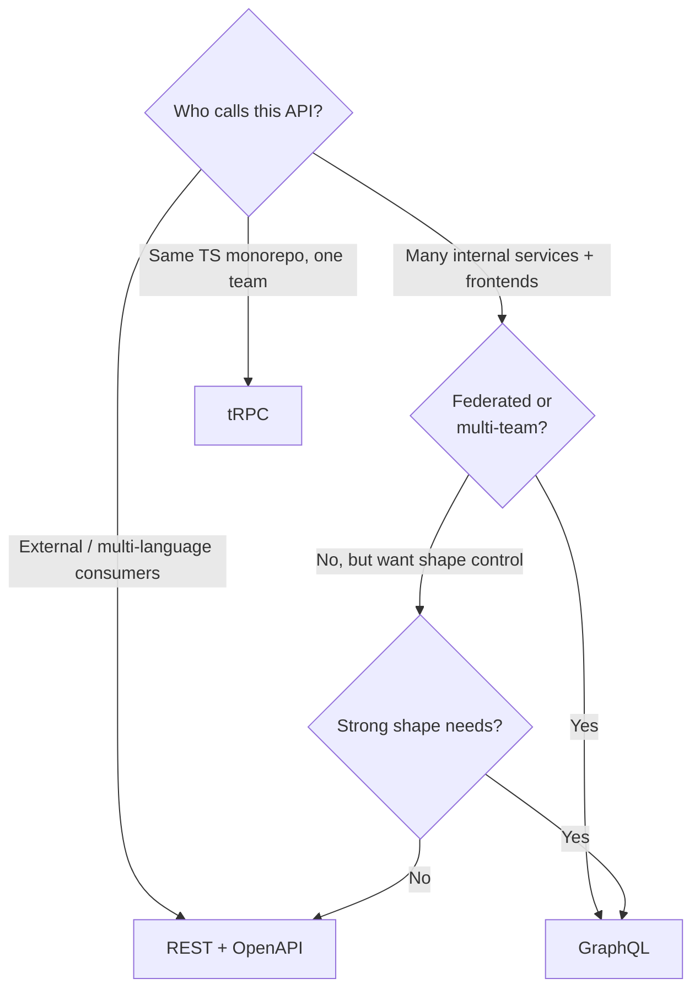

The interview question "why would you use GraphQL?" or "what is tRPC?" calls for a balanced two-minute answer that explains the underlying trade-offs rather than parroting marketing claims.

> **Acronyms used in this chapter.** API: Application Programming Interface. B2B: Business-to-Business. DX: Developer Experience. HTTP: Hypertext Transfer Protocol. JSON: JavaScript Object Notation. REST: Representational State Transfer. RPC: Remote Procedure Call. SaaS: Software as a Service. SDK: Software Development Kit. TS: TypeScript. UI: User Interface. URL: Uniform Resource Locator.

## GraphQL

GraphQL is a typed query language for Application Programming Interfaces. The client sends a query specifying exactly the fields it needs; the server resolves the query against its schema and returns exactly that shape, no more and no less.

```graphql
query {
  task(id: "123") {
    id
    title
    assignee { name }
  }
}
```

```json
{
  "data": {
    "task": { "id": "123", "title": "Write the chapter", "assignee": { "name": "Ada" } }
  }
}
```

### Wins

The benefits address real problems with Representational State Transfer at scale. There is no over-fetching: the client receives only the fields it requested, which matters substantially on slow networks and constrained devices. A single round-trip replaces what would be N Representational State Transfer calls — fetching a task plus its assignee plus its comments plus the comment authors becomes one query rather than four. The typed contract supports schema-driven code generation: TypeScript types for the client are derived from the GraphQL schema, and breaking changes to the schema surface as compile errors in the consumer. Federation enables multiple subgraphs from different teams to be composed into a single unified Application Programming Interface at the gateway, which is the architectural pattern that justifies GraphQL at very large organisations.

### Costs

The costs are equally real. Caching is harder because every query is a `POST /graphql` rather than a unique Uniform Resource Locator; standard Hypertext Transfer Protocol caching by Uniform Resource Locator does not apply, and the team must adopt a client-side cache (Apollo Client, Relay, urql) and consider persisted queries to enable Content Delivery Network caching by query hash. The N+1 query problem appears in the resolver layer when a list field triggers a per-item resolver that makes one database call each; the standard fix is the DataLoader pattern. Authentication and rate-limiting decisions are per-field rather than per-endpoint, which requires more thinking and produces more rule-evaluation overhead. Operational complexity is non-trivial: schema versioning, breaking-change detection, query-depth limits to prevent denial-of-service, and complexity-cost analysis to prevent expensive queries.

### When to reach for GraphQL

GraphQL is the right choice for a frontend that consumes data from many backend services and wants a single typed entry point; a mobile application that needs to minimise bytes over the wire because the user is on a slow connection; a federated architecture across many teams where each team owns a subgraph; and a React Native or native mobile client where the application does not control Hypertext Transfer Protocol caching anyway and so loses less by switching.

### When NOT to

GraphQL is the wrong choice for a small team with one backend and one frontend, where the operational complexity exceeds the benefits; a high-throughput public Application Programming Interface where Hypertext Transfer Protocol caching at the Content Delivery Network layer matters more than query flexibility; and an external Application Programming Interface where consumers expect Representational State Transfer conventions and have tooling oriented around them.

## tRPC

tRPC offers end-to-end type safety between Node.js servers and TypeScript clients without any code generation step. The team writes a router on the server using Zod schemas for input validation; the client calls procedures with full type inference derived directly from the router's TypeScript type. The Application Programming Interface is invisible — there is no schema document, no generated client, just shared TypeScript types.

```ts
// server/router.ts
import { initTRPC } from "@trpc/server";
import { z } from "zod";

const t = initTRPC.create();

export const appRouter = t.router({
  task: t.router({
    list: t.procedure
      .input(z.object({ status: z.enum(["open", "done"]).optional() }))
      .query(async ({ input }) => taskService.list(input)),
    create: t.procedure
      .input(CreateTaskInput)
      .mutation(async ({ input }) => taskService.create(input)),
  }),
});

export type AppRouter = typeof appRouter;
```

```ts
// client/usage.ts
import { createTRPCProxyClient, httpBatchLink } from "@trpc/client";
import type { AppRouter } from "../server/router";

const trpc = createTRPCProxyClient<AppRouter>({
  links: [httpBatchLink({ url: "/api/trpc" })],
});

const tasks = await trpc.task.list.query({ status: "open" });
const created = await trpc.task.create.mutate({ title: "Write the chapter" });
```

### Wins

The benefits are concrete in the right context. Zero code generation: types flow from the server to the client by importing the router's TypeScript type. Zero schema document: the Zod schemas used for runtime validation also serve as the contract. The runtime is tiny compared to a full GraphQL client. The Developer Experience inside a TypeScript-only monorepo is exceptional — autocomplete, refactor-rename, and type errors all flow end-to-end with no extra build step.

### Costs

The costs constrain where tRPC fits. The Application Programming Interface is TypeScript-only; a non-TypeScript consumer (a mobile client, a partner integration, a Python script) cannot easily call a tRPC Application Programming Interface because there is no schema document for the consumer to generate code from. tRPC is not a contract in the cross-team or cross-language sense — both ends must be in the same TypeScript build to share the router type. Debugging in the browser's network tab is awkward because every call goes through `/api/trpc` with a serialised payload, and the request log does not look like Representational State Transfer.

### When to reach for tRPC

tRPC is the right choice for a monorepo where the server and the client are both TypeScript and the same team controls both; a small team that wants type safety without OpenAPI or GraphQL ceremony; and a Next.js application where the Application Programming Interface and the User Interface ship together as one deployable unit.

### When NOT to

tRPC is the wrong choice for public Application Programming Interfaces (no consumer outside the repository can call them ergonomically); multi-language clients (mobile, native, third-party integrations) that need a language-agnostic contract; and teams that need the discoverability of Representational State Transfer or GraphQL for support, debugging, and external partner integration.

## A senior decision tree



## Don't pick on hype

The framing senior candidates typically present is that Representational State Transfer is the default. Reach for GraphQL when the data graph is genuinely complex and federated across many teams. Reach for tRPC when the team owns both ends and both are TypeScript. Do not migrate from Representational State Transfer to GraphQL or tRPC simply because a framework defaults to it; the migration cost is real and the benefits must justify it.

## Migration considerations

Representational State Transfer to GraphQL is a substantial undertaking; pragmatically, an Apollo Federation gateway in front of existing Representational State Transfer services is often the first step, allowing the team to adopt the GraphQL query layer without rewriting the underlying services. Representational State Transfer to tRPC is straightforward if the consumer is TypeScript and is co-located in the same repository — it can be done endpoint by endpoint behind a feature flag, with each migrated endpoint deleted from the Representational State Transfer surface once the tRPC equivalent is stable. GraphQL to Representational State Transfer rarely happens; teams that adopt GraphQL invest enough in the tooling that reversing the decision is uncommon.

## Key takeaways

GraphQL is a typed query language with flexible result shape; caching is harder than Representational State Transfer; the right context is federated, multi-team, multi-frontend stacks. tRPC is zero-code-generation TypeScript-to-TypeScript Remote Procedure Call with excellent Developer Experience inside a monorepo; it does not help non-TypeScript consumers. Representational State Transfer is the default; reach for the alternatives when their specific benefits solve a real problem the team has. Do not migrate on hype.

## Common interview questions

1. What problem does GraphQL solve that Representational State Transfer does not?
2. Why is Hypertext Transfer Protocol caching harder with GraphQL?
3. When would tRPC be the wrong choice?
4. What is the N+1 problem in GraphQL and how does the DataLoader pattern help?
5. Starting a new TypeScript-only Business-to-Business Software-as-a-Service application — Representational State Transfer, GraphQL, or tRPC?

## Answers

### 1. What problem does GraphQL solve that REST does not?

GraphQL solves three problems that Representational State Transfer leaves to the client. First, it eliminates over-fetching: the client requests exactly the fields it needs and the server returns exactly that shape, which matters substantially on slow networks and bandwidth-constrained devices. Second, it eliminates under-fetching round-trips: a single query can traverse the data graph (task → assignee → manager → email) in one request, replacing what would be three or four sequential Representational State Transfer calls. Third, it provides a typed schema that drives client code generation, surfacing breaking changes at the consumer's compile time rather than as runtime errors in production.

**Trade-offs / when this fails.** The benefits are most valuable when the data graph is genuinely complex, when consumers have heterogeneous shape requirements (web wants one set of fields, mobile wants another), and when the team is large enough to justify the operational complexity (schema versioning, query-depth limits, complexity-cost analysis, persistent queries). For a small team with simple data and one frontend, Representational State Transfer is operationally simpler and the benefits of GraphQL do not justify the cost.

### 2. Why is HTTP caching harder with GraphQL?

Standard Hypertext Transfer Protocol caching keys on the request method and Uniform Resource Locator. GraphQL queries are sent as `POST` requests to a single endpoint (`/graphql`) with the query in the body, so the Uniform Resource Locator does not vary by request and Hypertext Transfer Protocol caches treat every query as a cache miss. This breaks the simple Content Delivery Network and browser caching that Representational State Transfer Application Programming Interfaces benefit from automatically.

The standard mitigations are persisted queries (the client sends a hash of a query that the server has already seen and stored, turning the request into a `GET /graphql?queryId=abc123` that caches normally) and a sophisticated client-side cache (Apollo Client, Relay, urql) that normalises responses by entity identifier and shares cached entities across queries. Both mitigations add complexity that Representational State Transfer does not require.

**Trade-offs / when this fails.** Persisted queries require build-time tooling to extract queries and a runtime registry on the server. The client-side cache requires careful schema design (every entity needs a stable `id` field) and a meaningful investment in cache management code. For high-throughput public Application Programming Interfaces where Content Delivery Network caching is the primary scaling lever, Representational State Transfer is the better choice.

### 3. When would tRPC be the wrong choice?

tRPC is the wrong choice in three categories of scenarios. First, public Application Programming Interfaces consumed by external developers — there is no schema document the consumer can generate a client from, and the team cannot expect every consumer to be in the same TypeScript monorepo. Second, multi-language clients — mobile applications in Swift or Kotlin, native applications in Go or Rust, partner integrations in Python or Java cannot consume tRPC ergonomically. Third, teams that need the discoverability of Representational State Transfer or GraphQL for support, debugging, and partner onboarding — every endpoint is a `POST /api/trpc/...` with a serialised payload, which is harder to inspect and document than a self-explanatory `GET /tasks/123`.

**Trade-offs / when this fails.** The fix in each case is to expose a parallel Representational State Transfer surface (typically generated from the same Zod schemas) for external consumers while keeping tRPC for the internal monorepo. This dual exposure adds back some of the ceremony tRPC was supposed to remove, which in turn argues for choosing Representational State Transfer or GraphQL from the start when external consumption is on the roadmap.

### 4. What is the N+1 problem in GraphQL and how does the DataLoader pattern help?

The N+1 query problem appears when a list field's resolver triggers a per-item resolver that makes its own database call. For example, a query for `tasks { id, title, assignee { name } }` returns N tasks; the per-task `assignee` resolver runs once per task and issues N database queries (the +1 is the initial query for the tasks list). The total query count is N+1 instead of two.

The DataLoader pattern solves this by batching and caching within a single request. Instead of issuing one query per assignee, the resolver registers the assignee identifier with a DataLoader; the DataLoader collects all identifiers requested in the current event-loop tick and issues a single batched query (`SELECT * FROM users WHERE id IN (1, 2, 3, ...)`); each resolver then receives its result. The total query count drops to two regardless of N.

```ts
const userLoader = new DataLoader(async (ids) => {
  const users = await db.users.findMany({ where: { id: { in: ids } } });
  return ids.map((id) => users.find((u) => u.id === id));
});
const assigneeResolver = (task) => userLoader.load(task.assigneeId);
```

**Trade-offs / when this fails.** The DataLoader must be created per-request, not per-server, otherwise different users see each other's cached entries. Batching has a small latency cost (a single tick) that is usually invisible. Some N+1 problems span multiple resolvers and require multiple DataLoaders working together; the team must reach for the pattern systematically rather than reactively after the production database catches fire.

### 5. Starting a new TypeScript-only B2B SaaS — REST, GraphQL, or tRPC?

The senior answer depends on the consumer profile. For a Business-to-Business Software-as-a-Service application where the only consumers are the team's own first-party web application (built in the same monorepo) and there is no immediate plan for partner integrations or mobile applications, tRPC is the most productive choice — type safety end-to-end with zero ceremony. For a Software-as-a-Service application that will publish a public Application Programming Interface for customers to integrate with, Representational State Transfer with OpenAPI is the right choice because it serves the broadest range of consumers. For a Software-as-a-Service application that will have many internal teams contributing federated data and many frontends consuming heterogeneous slices, GraphQL is the right architectural fit.

```ts
const router = t.router({ tasks: t.router({ list: t.procedure.query(/* ... */) }) });
export type AppRouter = typeof router;
```

**Trade-offs / when this fails.** Choose tRPC and the team accumulates a public Application Programming Interface need late: the migration cost is real, but smaller than the cost of building OpenAPI from scratch when the customer pressure arrives. Choose GraphQL too early and the team pays the operational complexity (schema versioning, federation, query-depth limits, persisted queries, DataLoader discipline) without the benefits the architecture exists to provide. Default to Representational State Transfer with OpenAPI when in doubt — it is the most flexible position and the fewest doors close from there.

## Further reading

- [Apollo's "REST vs GraphQL"](https://www.apollographql.com/blog/graphql-vs-rest).
- [tRPC documentation](https://trpc.io/).
- Lee Byron, ["GraphQL: A data query language"](https://engineering.fb.com/2015/09/14/core-infra/graphql-a-data-query-language/) — the original Facebook post.
