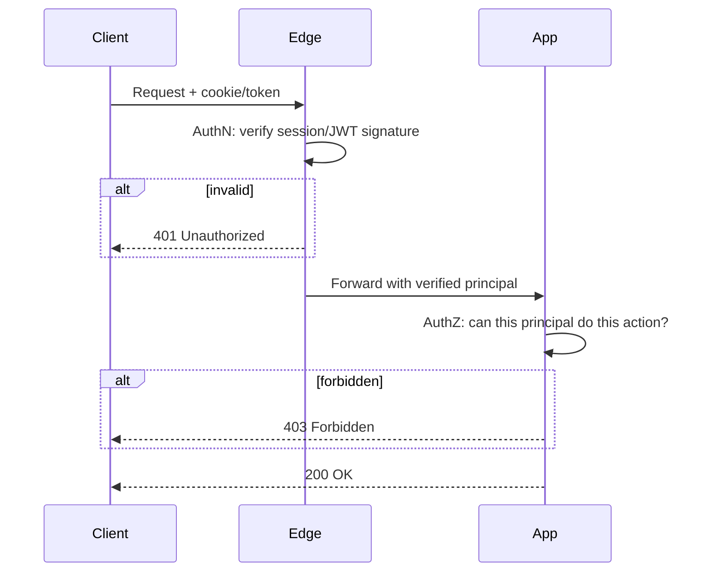

Authentication and authorization are two distinct questions. Mixing them up in an interview is a common mistake that signals incomplete fundamentals.

> **Acronyms used in this chapter.** ABAC: Attribute-Based Access Control. ACL: Access Control List. API: Application Programming Interface. AuthN: Authentication. AuthZ: Authorization. CSRF: Cross-Site Request Forgery. IAM: Identity and Access Management. IP: Internet Protocol. JWT: JSON Web Token. MFA: Multi-Factor Authentication. mTLS: mutual Transport Layer Security. OIDC: OpenID Connect. OTP: One-Time Password. RBAC: Role-Based Access Control. ReBAC: Relationship-Based Access Control. SoD: Separation of Duties. SMS: Short Message Service. TLS: Transport Layer Security. WAF: Web Application Firewall. WebAuthn: Web Authentication. XSS: Cross-Site Scripting.

## Authentication: who are you?

Authentication is the process of verifying a claimed identity. The outputs are a principal — a user, a service, or a device — and a session or token that represents the verified proof of that identity. Subsequent requests carry the session or token rather than re-presenting credentials.

The mechanisms in production use today span a wide range of trust assumptions and operational complexity. Username plus password remains the baseline despite its well-known weaknesses around credential reuse and phishing. Email plus a magic link removes the password from the user's burden but introduces dependence on email delivery as a security boundary. Short Message Service or email One-Time Passwords add a second factor at the cost of latency and the risk of Subscriber Identity Module swap attacks for Short Message Service. OAuth 2.0 and OpenID Connect delegate authentication to a trusted Identity Provider such as Google, GitHub, or Microsoft. Passkeys, built on Web Authentication, eliminate phishing by binding the credential to the origin and the device. Client certificates with mutual Transport Layer Security provide strong cryptographic identity for service-to-service authentication. Application Programming Interface keys are the lightweight default for server-to-server integrations where full Public Key Infrastructure is overkill.

## Authorization: what can you do?

Given a principal, authorization is the process of deciding whether they may perform a particular action on a particular resource. The output is binary: allow or deny.

Several mechanisms address different parts of the authorization problem. Role-Based Access Control assigns each principal one or more roles and grants permissions per role; the canonical example is "administrators may delete any post". Attribute-Based Access Control evaluates per-request attributes of both the principal and the resource; the canonical example is "users may edit posts where `post.author == user.id`". Relationship-Based Access Control models permissions as relationships between principals and resources, exemplified by the Zanzibar paper from Google and implementations such as SpiceDB; the canonical example is "users may read documents in workspaces they belong to". Access Control Lists provide explicit per-resource grant lists, common in file systems and document-sharing systems.

## A typical request, both phases



A status code of `401 Unauthorized` indicates that authentication failed — no credential was presented, or the presented credential was invalid. A status code of `403 Forbidden` indicates that authorization failed — the principal is correctly identified, but they may not perform this action. Returning `403` for a missing token is a common error that confuses clients and complicates retry logic.

## The threat model

A senior candidate is expected to articulate the concrete attacks that the authentication and authorization stack defends against, not merely the protocols in use.

| Threat | Mitigation |
| --- | --- |
| **Credential stuffing** (reused passwords) | Rate limit, MFA, breach-password checks (HaveIBeenPwned API) |
| **Phishing** | Passkeys / WebAuthn; reduce reliance on shared secrets |
| **Session hijacking** | HttpOnly + Secure + SameSite cookies; rotate on privilege change |
| **CSRF** | SameSite cookies + CSRF tokens for cookie-based auth |
| **XSS exfiltrating tokens** | Don't store tokens in localStorage; use HttpOnly cookies |
| **Token replay** | Short-lived access tokens; refresh-token rotation with replay detection |
| **Privilege escalation** | Server-side authorization on every action; never trust the client |
| **Insider abuse** | Audit logs; least privilege; SoD; review |

Variants of "how would you handle X" recur in interviews; the framing senior candidates typically present is the threat first, the mitigation second.

## The senior framing of "is JWT secure?"

JSON Web Token itself is a perfectly serviceable token format. The mistakes commonly made around JSON Web Token are the actual problem. Storing the JSON Web Token in `localStorage` exposes it to any Cross-Site Scripting payload that runs on the origin. Failing to validate the signature — including accepting the notorious `alg: none` value, which several libraries historically did — turns the JSON Web Token into an unsigned plaintext claim. Issuing long-lived access tokens with no revocation pathway means a stolen token works until it expires. Trusting the `exp` claim without server-side verification is a self-inflicted wound. Placing sensitive data in the JSON Web Token payload is a privacy leak because the payload is base64-encoded but not encrypted.

If those mistakes are addressed, JSON Web Token is a sound choice. The senior pattern, when defending JSON Web Token against "but you cannot revoke it", is to say "use opaque session identifiers in `HttpOnly` cookies and a server-side session table — JSON Web Token was never the right tool for that workload, and conflating the two is the actual failure".

## Defense in depth

No single layer should be the only barrier between an attacker and the data. The recommended layered defence has five tiers. The network layer enforces Transport Layer Security, fronts the application with a Web Application Firewall, and applies rate limiting at the edge to absorb credential stuffing. The authentication layer verifies the session or token at the edge or in middleware before the request reaches business logic. The authorization layer enforces permission checks on every action, not just at page load — never trust the client to omit a destructive request just because the User Interface hides the button. The data layer applies per-tenant encryption, row-level security in the database, and audit logging. The logging layer records every privileged action with actor, time, action, resource, and outcome.

## The "principle of least privilege"

Whatever the principal is — a human user, a service, an Identity and Access Management role — grant it the minimum permissions required to do its job and no more. In Amazon Web Services, scope Identity and Access Management policies to specific resources and actions; avoid `Resource: "*"` except in deliberate, audited cases. For application users, do not grant the administrator role when "edit own posts" is the actual requirement. For service tokens, issue a separate token per integration scoped to that integration's needs so that one compromised integration does not yield access to all others.

## Auditing

A senior expectation: every privileged action emits an audit log entry.

```ts
auditLog.write({
  actor: session.userId,
  action: "task.delete",
  resource: { type: "task", id: taskId },
  outcome: "success",
  ip: req.ip,
  userAgent: req.headers["user-agent"],
  ts: new Date().toISOString(),
});
```

Audit logs are append-only, separated from operational logs, and retained for the compliance window that applies to the application. They are the artefact investigators reach for first after an incident, so the log schema must support efficient queries by actor, by resource, and by time range.

## Key takeaways

The senior framing for this chapter: authentication is "who are you" and authorization is "what can you do" — they live in different layers and use different failure codes. Articulate the threat model concretely: credential stuffing, phishing, session hijacking, Cross-Site Request Forgery, Cross-Site Scripting, token replay, and privilege escalation. The choice between JSON Web Token and server-side sessions should be made on revocation needs and scale, not on framework defaults or religion. Defence in depth assumes that every layer might fail. Apply least privilege everywhere and audit every privileged action.

## Common interview questions

1. The difference between authentication and authorization?
2. `401` versus `403` — when each?
3. What is the threat model for a public-facing web application's authentication system?
4. "We use JSON Web Token, so we are secure" — what is wrong with that statement?
5. What is the principle of least privilege and how does it apply to a frontend's Application Programming Interface calls?

## Answers

### 1. The difference between authentication and authorization?

Authentication answers "who are you" by verifying a credential and producing a principal — a verified identity along with a session or token that represents the proof. Authorization answers "what can you do" by deciding whether the verified principal may perform a particular action on a particular resource. The two layers serve different purposes, fail with different status codes (`401` for authentication, `403` for authorization), and live in different parts of the request pipeline (authentication usually at the edge or in middleware; authorization in business-logic services).

**Trade-offs / when this fails.** Conflating the two is a common architectural error: shipping authorization as part of the login flow ("admins log in here, regular users log in there") rather than as a per-action check produces systems where a leaked admin URL is a privilege escalation. Conversely, treating every request as both authentication and authorization (re-checking credentials per call) is wasteful. The correct pattern is verify-once, authorize-per-action.

### 2. 401 versus 403 — when each?

`401 Unauthorized` indicates that authentication failed: no credential was presented, the credential was malformed, the signature did not verify, or the token was expired. The expected client behaviour is to acquire a fresh credential — log in again, refresh the token, prompt for Multi-Factor Authentication. `403 Forbidden` indicates that authentication succeeded but authorization failed: the principal is correctly identified, but they may not perform this action on this resource. The expected client behaviour is to surface the denial to the user, not to retry the authentication path.

**Trade-offs / when this fails.** Returning `403` for a missing token confuses clients that have built retry-on-`401` logic; the client interprets the `403` as a permanent denial and stops trying when a fresh credential would actually work. Returning `401` for an authorization failure invites spurious credential-refresh loops. The two should be consistent across the entire Application Programming Interface surface.

### 3. What is the threat model for a public-facing web app's auth system?

The major threats are concrete and well-catalogued. Credential stuffing — attackers replay password lists from other breaches — is mitigated by rate limiting, Multi-Factor Authentication, and breach-password checks against services such as the HaveIBeenPwned Application Programming Interface. Phishing is mitigated by Passkeys (Web Authentication binds the credential to the origin and cannot be replayed against a phishing domain). Session hijacking is mitigated by `HttpOnly`, `Secure`, `SameSite` cookies and by rotating the session identifier on privilege change. Cross-Site Request Forgery is mitigated by `SameSite=Lax` cookies plus Cross-Site Request Forgery tokens for cookie-based authentication. Cross-Site Scripting exfiltrating tokens is mitigated by storing tokens in `HttpOnly` cookies rather than `localStorage`. Token replay is mitigated by short-lived access tokens and refresh-token rotation with replay detection. Privilege escalation is mitigated by server-side authorization on every action.

**Trade-offs / when this fails.** Each mitigation has costs: Multi-Factor Authentication adds friction, Passkeys require modern browsers and authenticators, refresh-token rotation requires careful handling around the race conditions of multiple tabs. The senior framing is to enumerate the threats explicitly and choose mitigations whose cost is justified by the risk; "we use JSON Web Token" is not a threat-model answer.

### 4. "We use JWT, so we are secure" — what is wrong with that statement?

The statement conflates a token format with a security posture. JSON Web Token is a serialisation format for signed claims; it does not by itself provide secure storage, secure transport, revocation, or refresh. Common mistakes that turn JSON Web Token into a vulnerability include storing the token in `localStorage` where Cross-Site Scripting can read it; accepting the `alg: none` value; failing to validate the issuer and audience claims; using long-lived access tokens with no revocation story; and placing sensitive data in the (unencrypted) payload. A team that says "we use JSON Web Token" without addressing each of these has not described their security posture; they have described their file format.

**Trade-offs / when this fails.** When the team needs revocation (logout, account suspension, key rotation), JSON Web Token is the wrong tool because revocation requires a server-side denylist that erases the stateless benefits of the format. The senior pattern is opaque session identifiers in `HttpOnly` cookies, paired with a server-side session table for revocation; JSON Web Token is reserved for cases where stateless verification matters more than revocation latency.

### 5. The principle of least privilege applied to frontend API calls.

The principle states that a principal should hold the minimum permissions required to do its job and nothing more. For a frontend, this manifests in several places. The session token should be scoped to the user's actual permissions, not the maximum the system allows; an end-user session should not be able to invoke administrative endpoints even if the backend would accept the request, because the User Interface should not have to enforce the limits on its own behalf. Application Programming Interface keys exposed to the browser (for example, Stripe publishable keys, Mapbox tokens) must be the public/restricted variants, never the secret variants. Server-Side Rendering credentials should never be sent to the browser.

```ts
// On the server, scope the session token to the user's actual roles.
const sessionToken = await issueToken({ sub: user.id, roles: user.roles });
// In the browser, honour the principle: never expose admin-only endpoints in the client bundle.
```

**Trade-offs / when this fails.** The principle has a productivity cost: developers must think about scoping rather than reaching for the maximum-permission token. The mitigations are tooling — automated audits that flag wildcard Identity and Access Management policies, code reviews that catch `Resource: "*"`, and runbooks that scope service tokens per integration. The cost of laxity is the magnitude of an eventual breach; the cost of discipline is small once it becomes habit.

## Further reading

- [OWASP Authentication Cheat Sheet](https://cheatsheetseries.owasp.org/cheatsheets/Authentication_Cheat_Sheet.html).
- [OWASP Authorization Cheat Sheet](https://cheatsheetseries.owasp.org/cheatsheets/Authorization_Cheat_Sheet.html).
- Adam Shostack, *Threat Modeling: Designing for Security*.
