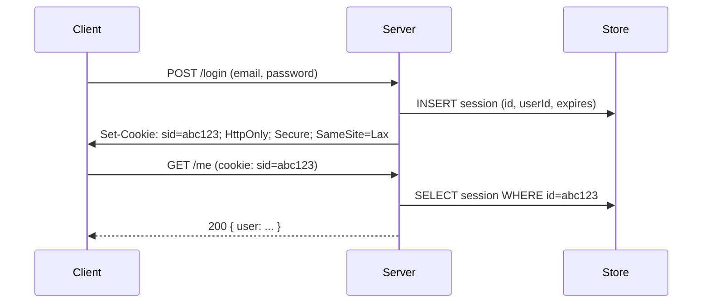
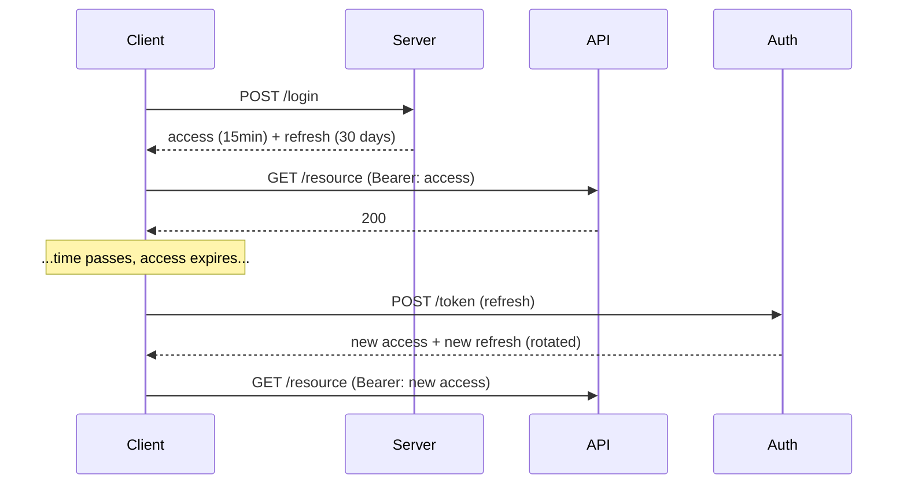

The single most argued authentication question. The framing senior candidates typically present is that server-side sessions are the default for browser applications and JSON Web Token is the right tool when statelessness matters more than revocation latency.

> **Acronyms used in this chapter.** API: Application Programming Interface. CORS: Cross-Origin Resource Sharing. CSRF: Cross-Site Request Forgery. DB: Database. iOS: iPhone Operating System. JSON: JavaScript Object Notation. JWT: JSON Web Token. RLS: Row-Level Security. RS256: RSA Signature with Secure Hash Algorithm 256. SPA: Single-Page Application. UI: User Interface. URL: Uniform Resource Locator. XSS: Cross-Site Scripting.

## Sessions (server-stored)

The server creates an opaque session identifier, stores the associated session record (in Redis, a relational database, or in-memory for trivial deployments), and sends the identifier to the client as a cookie. On every subsequent request, the server looks up the session in the store and resolves the request to a principal.



The benefits are concrete. Revocation is trivial — delete the session row and the identifier becomes invalid on the next request. The cookie itself is small because it carries only the opaque identifier, not user attributes. The server controls everything: logging every active session out for a user is a single database statement (`DELETE FROM sessions WHERE user_id = $1`). Privilege updates apply instantly because the lookup pulls fresh state on every request rather than relying on stale claims embedded in a token.

The costs are equally real but usually manageable. The system is stateful, requiring a session store; Redis or the application database is sufficient and is usually present anyway, so this is rarely a meaningful cost in 2026. Cross-domain authentication is harder because cookies are bound to a registrable domain; a deployment that needs single sign-on across genuinely separate domains needs additional engineering.

## JWT (client-stored, signed)

A JSON Web Token is a signed JSON payload that the client stores and presents on every request. The server verifies the signature on each request without a database lookup, making the verification stateless.

```text
header.payload.signature
```

The benefits favour distributed and federated architectures. The verification is stateless, with no database hit per request. Multiple services can verify the signature using the issuer's public key, with no shared session database required. The token is self-contained, with claims such as the user identifier, role, and scopes embedded in the payload.

The costs are non-trivial. Revocation is hard: a leaked JSON Web Token remains valid until it expires, and the mitigations (short expiry plus refresh tokens, server-side denylist) reintroduce the statefulness that the format was supposed to eliminate. The cookie or header carrying a JSON Web Token is larger than one carrying an opaque session identifier. The format is easy to misuse, and the dominant causes of the "JSON Web Token is insecure" reputation are storing in `localStorage`, accepting `alg: none`, failing to validate `iss` and `aud`, and embedding sensitive data in the (unencrypted) payload.

## Hybrid (the senior default)

Most production systems use server-side session identifiers for the user session and JSON Web Tokens for service-to-service authentication. The browser holds an `HttpOnly` cookie containing an opaque session identifier validated against a session store; the user-facing server, having validated the session, mints short-lived signed JSON Web Tokens for downstream service calls. This combination provides the revocation story of sessions where it matters (user privilege changes are immediate) and the statelessness of JSON Web Token where it matters (microservice calls do not require a shared session database).

## When to actually pick JWT for the user session

There are two genuinely valid reasons to use JSON Web Token for the user-facing session. The first is a distributed system where the user-facing service cannot share a session database with the validating service; even then, a small authentication-introspection endpoint is often simpler than full JSON Web Token. The second is mobile applications without first-class cookie support; even there, the iPhone Operating System and Android cookie jars work for most cases.

## The classic JWT pitfalls

The recurring set of JSON Web Token mistakes is well-catalogued. Accepting the `alg: none` value bypasses signature verification entirely; libraries should be configured with an explicit allowlist of algorithms and reject any token whose `alg` falls outside it. Storing in `localStorage` exposes the token to any Cross-Site Scripting payload that runs on the origin; `HttpOnly` cookies are the correct storage. Long-lived access tokens give attackers a usable window after compromise; one hour is the recommended maximum, with refresh tokens for the longer-lived session. Placing sensitive data in the payload leaks privacy because the payload is base64-encoded but not encrypted — anyone with the token can read every claim. Failing to validate the `iss` and `aud` claims accepts tokens issued by other services or for other audiences. Trusting the `exp` claim without first verifying the signature is a logic error: a forged token can claim any expiry it likes until the signature is checked.

```ts
import { jwtVerify } from "jose";

const { payload } = await jwtVerify(token, getKey, {
  issuer: "https://auth.example.com",
  audience: "tasks-api",
  algorithms: ["RS256"],   // explicitly whitelist
});
```

## Refresh tokens

A pattern that bridges the gap: short-lived access token + long-lived refresh token.



Two senior expectations stand out. First, refresh-token rotation: every refresh issues a new refresh token, and reuse of an old refresh token invalidates the entire family — signing out all devices that share that refresh chain. The pattern catches stolen refresh tokens because the legitimate client and the attacker cannot both successfully refresh; the second attempt fails and triggers the invalidation. Second, refresh tokens are stored server-side as opaque identifiers, not as JSON Web Tokens; this is the only way to make them revocable.

The full pattern is detailed in [Refresh tokens](./05-refresh-tokens.md).

## Cookie-based vs. Bearer-token strategies for SPAs

| Strategy | Pros | Cons |
| --- | --- | --- |
| `HttpOnly` cookie (session or JWT) | XSS can't read it; CSRF mitigated by `SameSite=Lax` | Cookie must be on same registrable domain or you're in CORS pain |
| `Authorization: Bearer ...` from `localStorage` | Works across origins, mobile-friendly | XSS reads it, lost on tab close (unless `localStorage`) |
| `Authorization: Bearer ...` from in-memory | Not persistable; refreshed on page load via cookie-bound refresh | Combined with HttpOnly refresh cookie = a sane pattern |

The recommendation for browser applications in 2026 is `HttpOnly`, `Secure`, `SameSite=Lax` cookies, full stop. The "but JSON Web Token is stateless" argument is rarely the bottleneck for a browser-facing application; the cost of one Redis lookup per request is negligible compared to the network and rendering work that dominates the request budget.

## Multi-tenant scoping

Whichever pattern is chosen, the principal must include the tenant context (organisation identifier, workspace identifier). Every query then filters by the tenant identifier at the data layer, ideally with Row-Level Security so that a bug in application code cannot leak rows across tenants. PostgreSQL's `CREATE POLICY` and the equivalent in modern databases provide the enforcement at the storage layer.

## Key takeaways

The senior framing: server-side sessions are stateful, easy to revoke, and the default for browser applications. JSON Web Token is stateless, hard to revoke, and the right choice for service-to-service authentication. The hybrid pattern — sessions for the user-facing surface, JSON Web Tokens for downstream service calls — is the production default. Always validate the signature, the `iss`, and the `aud` claims; always use `HttpOnly` cookies for browser sessions. Refresh-token rotation with reuse detection is non-negotiable for long-lived sessions. Multi-tenant scoping belongs at the data layer with Row-Level Security, not just in application code.

## Common interview questions

1. When would JSON Web Token be chosen over server-stored sessions?
2. Why is "JSON Web Token in `localStorage`" a recurring operational hazard?
3. What does refresh-token rotation prevent?
4. How can a single user be logged out of every device?
5. Walk through the `alg: none` attack.

## Answers

### 1. When would JWT be chosen over server-stored sessions?

JSON Web Token is the right choice when statelessness matters more than revocation latency. The canonical scenarios are distributed systems where multiple services must verify the principal independently without a shared session database; service-to-service authentication where the calling service mints a short-lived signed token for the downstream call; and federated authentication where an external Identity Provider issues the token and the application's services merely verify it. In each case, the elimination of the per-request session lookup is a real architectural simplification.

**Trade-offs / when this fails.** Revocation is the unavoidable trade-off: a leaked JSON Web Token is valid until it expires, and the mitigations (short expiry plus refresh tokens, server-side denylist) reintroduce the statefulness that JSON Web Token was supposed to eliminate. For browser applications where the session is short-lived and revocation must be immediate (logout, account suspension, privilege change), server-side sessions are the better default.

### 2. Why is "JWT in localStorage" a recurring operational hazard?

`localStorage` is readable from any JavaScript executing on the same origin, which is exactly the threat model that Cross-Site Scripting exploits. A single successful Cross-Site Scripting payload — a stored comment that smuggles a `<script>` past the sanitiser, a compromised third-party script in the page, a misconfigured Content Security Policy — gives the attacker every active session token, with no further user interaction required. `HttpOnly` cookies, by contrast, are not reachable by any JavaScript code, so the same Cross-Site Scripting leaks far less.

```ts
// Anti-pattern: localStorage is readable by every script on the origin.
localStorage.setItem("token", token);
// Senior pattern: server sets an HttpOnly cookie that JavaScript cannot read.
// Set-Cookie: session=...; HttpOnly; Secure; SameSite=Lax
```

**Trade-offs / when this fails.** Cookies are bound to a registrable domain and require Cross-Site Request Forgery defences for any state-changing request not protected by `SameSite`. The cure is to use `SameSite=Lax` (or `Strict` for high-sensitivity applications) plus Cross-Site Request Forgery tokens or origin checks. The `localStorage` shortcut trades a real security property (`HttpOnly`) for a small developer convenience (avoiding cookie ergonomics); the trade is rarely worth it.

### 3. What does refresh-token rotation prevent?

Rotation prevents the indefinite reuse of a stolen refresh token. Without rotation, an attacker who exfiltrates the refresh token can mint access tokens for as long as the refresh token is valid. With rotation, every successful refresh issues a brand-new refresh token and invalidates the old one; if both the legitimate client and the attacker attempt to refresh with the same token, the second attempt fails. The server detects the reuse, invalidates the entire token family, and signs the user out of every device, forcing re-authentication.

```ts
async function refresh(oldRefreshToken: string) {
  const family = await db.refreshFamilies.find(oldRefreshToken);
  if (family.consumed) {
    await db.refreshFamilies.invalidateFamily(family.id);
    throw new Error("Refresh token reused; family invalidated");
  }
  family.consumed = true;
  return issueNewPair(family.userId);
}
```

**Trade-offs / when this fails.** Rotation introduces race conditions when the same refresh token is used twice in quick succession by the same legitimate client (multiple tabs, retries on flaky networks). The fix is a short grace window during which the previous token is also accepted, paired with idempotency on the issuance. Without the grace window, users see spurious sign-outs that erode trust. The trade-off is well worth the security gain.

### 4. How can a single user be logged out of every device?

For server-side sessions, the operation is one database statement: delete every session row for that user (`DELETE FROM sessions WHERE user_id = $1`). The next request from any device fails the session lookup and is rejected. For JSON Web Token without state, the operation is impossible in pure form; the team must either wait for every active token to expire or maintain a server-side denylist of revoked tokens that every request consults. The denylist is checked on every request, which reintroduces the statefulness that JSON Web Token was supposed to avoid. For the hybrid pattern (session for the user, JSON Web Token for downstream), deleting the session at the user-facing layer is sufficient because the next user-driven action will fail to mint a new downstream JSON Web Token.

**Trade-offs / when this fails.** A "log out everywhere" feature that takes longer than a few seconds to take effect produces support tickets. For JSON Web Token-based systems, this requirement is the strongest argument for the hybrid pattern; if the system is truly stateless and "log out everywhere" is required, the denylist is unavoidable and the team has paid the operational cost without the architectural benefit.

### 5. Walk through the `alg: none` attack.

The JSON Web Token specification defines an algorithm header value `none`, originally intended for use cases where the token's integrity is guaranteed by a different mechanism (transport-layer security, for example). Several early JSON Web Token libraries respected the `alg` value blindly: when a token arrived with `alg: none`, the library skipped signature verification and treated the payload as authentic. An attacker could craft a token, set the algorithm to `none`, omit the signature entirely, and present it to the server; the server would accept it and treat the embedded claims (user identifier, role, scopes) as verified.

The mitigation is to configure the verifier with an explicit allowlist of algorithms (`["RS256"]`) and reject every token whose `alg` falls outside it. Modern libraries (`jose`, `jsonwebtoken` with the `algorithms` option) require the allowlist; do not pass a token to a verifier without it.

```ts
import { jwtVerify } from "jose";
const { payload } = await jwtVerify(token, getKey, {
  algorithms: ["RS256"], // never include "none"
  issuer: "https://auth.example.com",
  audience: "tasks-api",
});
```

**Trade-offs / when this fails.** The attack relies on the verifier accepting the algorithm declared in the token rather than enforcing its own choice. The senior pattern is to know which algorithm the issuer uses and to enforce that algorithm at the verifier; the token's `alg` header is a hint, never a directive. The same pattern protects against algorithm-confusion attacks where an attacker switches `RS256` (asymmetric) to `HS256` (symmetric) and uses the public key as the symmetric secret.

## Further reading

- [OWASP JWT Cheat Sheet](https://cheatsheetseries.owasp.org/cheatsheets/JSON_Web_Token_for_Java_Cheat_Sheet.html).
- [Auth0: When to use JWT](https://auth0.com/learn/json-web-tokens) — read the caveats.
- [PostgreSQL row-level security](https://www.postgresql.org/docs/current/ddl-rowsecurity.html).
