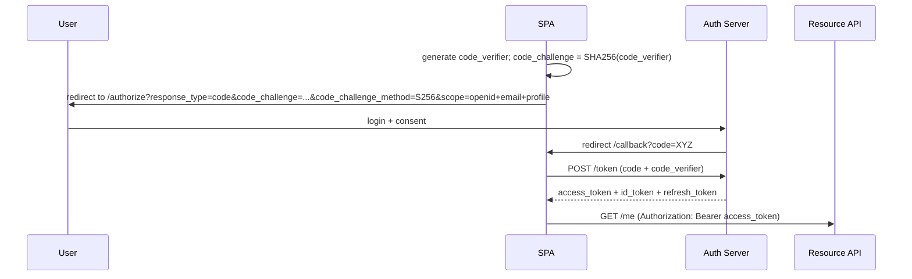

OAuth 2.0 is a protocol for authorization: granting one application access to a resource on behalf of a user. OpenID Connect is a layer built on top of OAuth 2.0 that adds authentication, producing an `id_token` that asserts "this is who the user is" to the requesting client.

Most "Sign in with Google", "Sign in with GitHub", and "Sign in with Microsoft" buttons are OpenID Connect implementations rather than bare OAuth 2.0.

> **Acronyms used in this chapter.** API: Application Programming Interface. AS: Authorization Server. BFF: Backend-for-Frontend. CLI: Command-Line Interface. IdP: Identity Provider. JWKS: JSON Web Key Set. JWT: JSON Web Token. OAuth: Open Authorization. OIDC: OpenID Connect. OS: Operating System. PKCE: Proof Key for Code Exchange. RFC: Request for Comments. S256: SHA-256. SHA: Secure Hash Algorithm. SPA: Single-Page Application. SSR: Server-Side Rendering. TV: Television. URI: Uniform Resource Identifier. URL: Uniform Resource Locator.

## Vocabulary you'll be quizzed on

The OAuth 2.0 specification defines a small but essential set of roles. The resource owner is the user whose data is being accessed. The resource server is the Application Programming Interface that holds the data, for example Google Drive's Application Programming Interface. The client is the application requesting access, which can be a browser-based application, a mobile application, or a server. The authorization server is the system that authenticates the user and issues tokens, for example `accounts.google.com`. The access token is the short-lived credential that the client sends to the resource server. The refresh token is a longer-lived credential used to obtain new access tokens. The `id_token`, defined by OpenID Connect rather than OAuth 2.0, is a JSON Web Token that proves to the client who the user is. The scope is the set of permissions the client is requesting, expressed as space-separated strings such as `read:profile` and `email`.

## Authorization Code Flow with PKCE — the only flow you should use for SPAs

The Implicit Flow is deprecated and should not be used. The Resource Owner Password Credentials grant is deprecated and should not be used. Use the Authorization Code Flow with Proof Key for Code Exchange.



The reason for Proof Key for Code Exchange is that it prevents authorization-code interception attacks. Even if an attacker captures the `code` value — for instance from a redirect log on a shared device or from a malicious browser extension — the attacker cannot exchange it for tokens without the original `code_verifier`, which never leaves the legitimate client.

```ts
// Generate the verifier and challenge in the client.
const codeVerifier = base64UrlEncode(crypto.getRandomValues(new Uint8Array(32)));
const codeChallenge = base64UrlEncode(await sha256(codeVerifier));
sessionStorage.setItem("pkce_verifier", codeVerifier);
location.assign(`${authorizeUrl}?response_type=code&code_challenge=${codeChallenge}&code_challenge_method=S256&...`);
```

## What's an `id_token`?

The `id_token` is a JSON Web Token containing claims about the user, signed by the authorization server.

```json
{
  "iss": "https://accounts.google.com",
  "sub": "10769150350006150715113082367",
  "aud": "your-client-id.apps.googleusercontent.com",
  "exp": 1735689600,
  "iat": 1735686000,
  "email": "user@example.com",
  "email_verified": true,
  "name": "Jane Doe"
}
```

The client must validate the signature against the issuer's JSON Web Key Set, the `iss` (issuer) claim, the `aud` (audience) claim, the `exp` (expiry) claim, and the `nonce` claim it sent in the authorization request. Use an established library; never write the verification by hand.

## Common scopes (OIDC)

The OpenID Connect specification reserves several scope values. The `openid` scope is required for OpenID Connect and signals to the authorization server that an `id_token` should be issued. The `profile` scope requests basic profile claims (name, picture, locale). The `email` scope requests the email address and the `email_verified` boolean. The `offline_access` scope requests a refresh token, allowing the client to obtain new access tokens without further user interaction.

## Server-side flow vs. SPA flow

| Flow | When | Where tokens live |
| --- | --- | --- |
| **Auth Code + PKCE in SPA** | Pure SPA, no backend | In-memory + refresh in `HttpOnly` cookie if you have a backend-for-frontend (BFF) |
| **Auth Code in BFF (recommended)** | Next.js / Remix / SSR | All tokens stay on the server; browser only ever sees a session cookie |
| **Auth Code in mobile app** | Native iOS/Android | Token in OS keychain |

The 2026 frontend default is the Backend-for-Frontend pattern. The browser never touches the access token directly. The Next.js or other server handles the full OpenID Connect flow against the Identity Provider and issues the browser an `HttpOnly` session cookie. The application's downstream Application Programming Interface calls go through the server-side proxy, which attaches the access token from the server-side store. This is what Auth.js implements for you.

## Auth.js example (Next.js App Router)

```ts
// auth.ts
import NextAuth from "next-auth";
import Google from "next-auth/providers/google";

export const { handlers, auth, signIn, signOut } = NextAuth({
  providers: [
    Google({
      clientId: process.env.GOOGLE_CLIENT_ID!,
      clientSecret: process.env.GOOGLE_CLIENT_SECRET!,
      authorization: {
        params: { scope: "openid email profile" },
      },
    }),
  ],
  callbacks: {
    async session({ session, token }) {
      session.user.id = token.sub!;
      return session;
    },
  },
});
```

```ts
// app/api/auth/[...nextauth]/route.ts
export { GET, POST } from "@/auth";
```

```tsx
// app/page.tsx
import { auth, signIn, signOut } from "@/auth";

export default async function Home() {
  const session = await auth();

  if (!session) {
    return (
      <form action={async () => { "use server"; await signIn("google"); }}>
        <button>Sign in with Google</button>
      </form>
    );
  }

  return (
    <div>
      Hi, {session.user.name}.
      <form action={async () => { "use server"; await signOut(); }}>
        <button>Sign out</button>
      </form>
    </div>
  );
}
```

That is the full Backend-for-Frontend-style OpenID Connect integration. Tokens never reach the browser.

## Logout (the part everyone forgets)

OpenID Connect defines an `end_session_endpoint` on the Identity Provider. To log a user out completely, the application must perform two steps. First, delete the local session (the application's `HttpOnly` cookie or server-side session record). Second, redirect the browser to the Identity Provider's end-session endpoint with the `post_logout_redirect_uri` parameter so the Identity Provider can clear its own session and send the user back. Without the second step, the user clicks "log in" and is silently logged back into the same identity — the Identity Provider still considers them logged in. Auth.js handles this automatically; bespoke implementations must remember to issue the second redirect.

## Device flow & client credentials (worth knowing)

Two additional grants are worth recognising even though most frontend applications do not implement them. The Device Authorization Grant is designed for input-constrained devices such as televisions and Command-Line Interfaces; the device displays a short code that the user types into a separate browser to complete the authorization. The Client Credentials grant is designed for machine-to-machine authentication where there is no user; the client itself is the principal and proves identity through its credentials. Frontend roles do not typically build with these grants, but interviewers may ask the candidate to recognise them.

## Common interviewer trap: "OAuth as authentication"

Before OpenID Connect, applications often used the OAuth 2.0 access token as a proxy for "the user is logged in". This is fundamentally wrong: the access token only proves that the client has access to the resource server's Application Programming Interface; it does not prove who the user is. Many production breaches stem from this confusion, where one user's access token was used to log in as a different user because the application trusted the token holder rather than verifying the identity. The correct pattern is to use OpenID Connect — explicitly receive an `id_token` and validate the user's identity from that token's claims.

## Key takeaways

The senior framing: OAuth 2.0 is authorization, OpenID Connect is authentication built on OAuth 2.0 by adding an `id_token` with user identity. For Single-Page Applications, use the Authorization Code Flow with Proof Key for Code Exchange, ideally via a Backend-for-Frontend so the browser never sees the access token. Always validate the `id_token` signature, `iss`, `aud`, `exp`, and `nonce`. Use an established library — Auth.js, `oidc-client-ts`, `openid-client` — and do not roll your own validation. Do not conflate "user has a valid access token" with "user is authenticated". Implement logout against the Identity Provider's end-session endpoint.

## Common interview questions

1. Walk through the Authorization Code Flow with Proof Key for Code Exchange. Why is Proof Key for Code Exchange necessary?
2. What is the difference between OAuth 2.0 and OpenID Connect?
3. Where should access tokens live in a Next.js application?
4. Why is the Implicit Flow deprecated?
5. What is the Backend-for-Frontend pattern and why is it the default for browser applications?

## Answers

### 1. Walk through the Authorization Code Flow with PKCE. Why is PKCE necessary?

The flow has six concrete steps. The client generates a high-entropy random `code_verifier` and computes the SHA-256 hash of it as the `code_challenge`. The client redirects the user's browser to the authorization server's `/authorize` endpoint with the challenge and the requested scopes. The user authenticates with the authorization server and consents to the requested scopes. The authorization server redirects the browser back to the client's registered callback Uniform Resource Identifier with an authorization `code`. The client makes a server-side `POST` to the authorization server's `/token` endpoint with the `code` and the original `code_verifier`. The authorization server hashes the verifier, compares to the stored challenge, and if they match returns the access token, the `id_token`, and optionally a refresh token.

Proof Key for Code Exchange is necessary because the authorization `code` travels through the browser's address bar and may be intercepted (by a malicious browser extension, by a misconfigured logger that records redirects, by a shared device's browser history). Without Proof Key for Code Exchange, an attacker who captures the `code` can exchange it for tokens. With Proof Key for Code Exchange, the attacker also needs the `code_verifier`, which never leaves the client, and the exchange fails.

**Trade-offs / when this fails.** Proof Key for Code Exchange is now mandatory in OAuth 2.1 for all clients. The `code_verifier` must be generated per authorization request (never reused) and stored in a place where Cross-Site Scripting cannot read it (`sessionStorage` is acceptable for the duration of the flow because the verifier becomes worthless after the exchange).

### 2. What is the difference between OAuth 2.0 and OpenID Connect?

OAuth 2.0 is an authorization framework that lets a client obtain access to a resource server's Application Programming Interface on behalf of a user. The output is an access token. OAuth 2.0 says nothing about who the user is; the access token is a bearer credential that proves the holder has access, not the holder's identity. OpenID Connect is a layer built on top of OAuth 2.0 that adds an `id_token`, a JSON Web Token containing claims about the user's identity (`sub`, `email`, `name`, `email_verified`, etc.). When a "Sign in with Google" button uses OpenID Connect, the application receives both the access token (for calling Google Application Programming Interfaces) and the `id_token` (for identifying the user).

**Trade-offs / when this fails.** Using bare OAuth 2.0 for authentication — treating the access token as proof of identity — is the source of multiple historical breaches because the application trusts the token bearer without verifying who they are. Always reach for OpenID Connect when the application needs to identify the user, and always validate the `id_token` rather than trusting the user's claim of identity.

### 3. Where should access tokens live in a Next.js application?

In the Backend-for-Frontend pattern, access tokens live exclusively on the server, stored in the server-side session record (a database row or a Redis entry). The browser holds an `HttpOnly` cookie containing only the opaque session identifier. When the browser triggers a Server Action or a Route Handler that needs to call a downstream Application Programming Interface, the server reads the access token from the session and attaches it to the outbound call. The browser never sees the access token directly.

```ts
import { auth } from "@/auth";
export async function POST(req: Request) {
  const session = await auth();
  if (!session) return new Response("Unauthorized", { status: 401 });
  const upstream = await fetch("https://api.example.com/users/me", {
    headers: { Authorization: `Bearer ${session.accessToken}` },
  });
  return upstream;
}
```

**Trade-offs / when this fails.** For pure-client applications without any server, the access token must live somewhere the browser can reach; the senior pattern is in-memory in a closure-protected variable, with the refresh token in an `HttpOnly` cookie issued by a small authentication endpoint. See the [React client authentication chapter](./08-react-client.md) for the full pattern.

### 4. Why is the Implicit Flow deprecated?

The Implicit Flow returned the access token directly in the authorization response's URL fragment, with no token-exchange step. The fragment is visible in the browser's address bar and may be captured by browser history, by misconfigured loggers, by malicious extensions, or by an attacker who can read the screen. The Implicit Flow was originally introduced because Single-Page Applications could not safely keep a client secret and could not perform the back-channel `POST /token` call from the browser; Cross-Origin Resource Sharing has since made the back-channel call possible from the browser, and Proof Key for Code Exchange has eliminated the requirement for a client secret. Authorization Code with Proof Key for Code Exchange supplants the Implicit Flow with strictly better security properties.

**Trade-offs / when this fails.** Some legacy authorization servers still permit the Implicit Flow for backward compatibility. Avoid it on new applications and migrate existing applications to Authorization Code with Proof Key for Code Exchange when the authorization server supports it.

### 5. What is the BFF pattern and why is it the default for browser applications?

The Backend-for-Frontend pattern places a thin server between the browser and the upstream Application Programming Interfaces. The server holds the access tokens, performs the OpenID Connect flow, and proxies Application Programming Interface calls on behalf of the browser. The browser holds only an `HttpOnly` session cookie that points to the server-side session record. The benefits are concrete: tokens never reach JavaScript, so Cross-Site Scripting cannot exfiltrate them; the browser does not need to perform refresh logic; logout is one server-side delete; and the upstream Application Programming Interfaces can be on different origins without Cross-Origin Resource Sharing complications because the browser only ever talks to the same-origin Backend-for-Frontend.

```ts
// app/api/proxy/[...path]/route.ts
export async function GET(req: Request, { params }: { params: { path: string[] } }) {
  const session = await auth();
  if (!session) return new Response("Unauthorized", { status: 401 });
  return fetch(`https://upstream.example.com/${params.path.join("/")}`, {
    headers: { Authorization: `Bearer ${session.accessToken}` },
  });
}
```

**Trade-offs / when this fails.** The Backend-for-Frontend adds a server hop and operational responsibility. For a pure Single-Page Application with no available server (a static site on a Content Delivery Network), the browser must hold tokens; in that case, follow the in-memory pattern in the [React client authentication chapter](./08-react-client.md). For mobile applications, the Operating System keychain is the equivalent of the Backend-for-Frontend's server-side store.

## Further reading

- [RFC 6749 — OAuth 2.0](https://datatracker.ietf.org/doc/html/rfc6749).
- [RFC 7636 — PKCE](https://datatracker.ietf.org/doc/html/rfc7636).
- [OpenID Connect Core 1.0](https://openid.net/specs/openid-connect-core-1_0.html).
- [Auth.js documentation](https://authjs.dev/).
