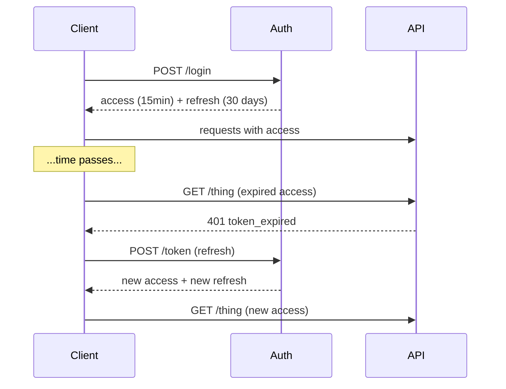

If access tokens in the application live longer than approximately fifteen minutes, this chapter is the bug fix.

> **Acronyms used in this chapter.** API: Application Programming Interface. JWT: JSON Web Token. MITM: Man-In-The-Middle. OAuth: Open Authorization. OS: Operating System. RFC: Request for Comments. SPA: Single-Page Application. SSR: Server-Side Rendering.

## The pattern



The pattern uses two distinct tokens. The access token is short-lived (typically five to fifteen minutes) and is sent on every Application Programming Interface call; a stateless JSON Web Token is fine here because the short lifetime caps the damage from any single leak. The refresh token is long-lived (days to weeks), is exchanged for new access tokens, and must be opaque and stored server-side so that it can be revoked.

## Why bother?

The pattern addresses three real risks. Access tokens leak through logs, error reports, browser extensions, and Man-In-The-Middle interception at edge nodes; a short expiry limits the damage window for any single leak. Privilege changes such as role removal or account suspension take effect at the next refresh rather than "whenever this twenty-four-hour JSON Web Token expires", which keeps the security policy current. Logout becomes meaningful: revoking the refresh token forces every active device to re-authenticate on the next refresh attempt.

## Rotation: the must-have

Every refresh issues a brand-new refresh token, and the old refresh token is invalidated immediately. The pattern eliminates the indefinite reuse window of a static refresh token.

```ts
async function refresh(oldRefreshToken: string) {
  const stored = await db.refreshTokens.findById(oldRefreshToken);
  if (!stored || stored.revoked) {
    throw new Unauthorized();
  }

  if (stored.usedAt) {
    await db.refreshTokens.revokeFamily(stored.familyId);
    throw new Unauthorized("Refresh token reuse detected — all sessions terminated");
  }

  await db.refreshTokens.markUsed(oldRefreshToken);

  const newRefresh = randomToken();
  await db.refreshTokens.insert({
    id: newRefresh,
    familyId: stored.familyId,
    userId: stored.userId,
    expires: addDays(new Date(), 30),
  });

  const newAccess = await signJwt({ sub: stored.userId, exp: in15Min() });
  return { access: newAccess, refresh: newRefresh };
}
```

## Reuse detection

Reuse detection is the defining feature that makes rotation valuable rather than ceremonial. If the same refresh token is presented twice, one of the two presenting parties is an attacker — the legitimate client and the attacker each hold a copy and each tries to refresh. The server cannot know which side stole the token, so it invalidates the entire family of refresh tokens for that user. Every active session is terminated and the user must authenticate again. The pattern is the textbook approach for detecting and containing stolen refresh tokens.

## Storage — where do these tokens live?

In the browser, the refresh token belongs in an `HttpOnly`, `Secure`, `SameSite=Lax` cookie scoped to the authentication endpoint (`Path=/api/auth/refresh`). The narrow path prevents the cookie from being attached to every request, reducing the surface where a Cross-Site Scripting attack could induce its exfiltration via a request the attacker controls. The access token lives in memory in a module variable or, alternatively, in another `HttpOnly` cookie. Neither token may live in `localStorage` or `sessionStorage` because both are accessible to JavaScript on the origin.

On mobile, the refresh token belongs in the Operating System keychain — Keychain on the iPhone Operating System, EncryptedSharedPreferences or Keystore on Android. The access token lives in memory.

## Sliding vs absolute expiry

Three patterns are in production use. Sliding expiry resets the refresh-token lifetime on every successful refresh; active users stay signed in indefinitely as long as they remain active, but a forgotten session can persist forever. Absolute expiry caps the refresh token at a fixed lifetime from the initial login — for example, thirty days regardless of activity — forcing users to re-authenticate on the cadence regardless of their usage pattern. The hybrid pattern (the recommended default) combines the two: sliding within an absolute cap, where the user remains signed in as long as they are active up to a hard cap of, say, ninety days, after which re-authentication is required regardless.

## When to invalidate refresh tokens

Several events should always trigger invalidation. Password change, email change, and any privilege change for sensitive roles invalidate the refresh token to force re-authentication after the security boundary changes. The user clicking "log out everywhere" invalidates every refresh token for the account. Administrator action in response to a suspected breach invalidates affected sessions. And reuse detection automatically invalidates the entire family.

## Don't refresh in the background while idle

A common operational bug is a Single-Page Application that polls `/refresh` every ten minutes even when the tab is hidden, wasting server cycles and keeping sessions alive on abandoned tabs. The correct pattern is to refresh on demand — when an Application Programming Interface call returns `401 Unauthorized` — rather than on a timer. The Page Visibility Application Programming Interface can also be used to suppress refreshes while the tab is hidden.

## Concurrency — two requests racing

If two Application Programming Interface calls fire concurrently and both receive `401`, both will attempt to refresh. Only one refresh should win; the other should wait for the in-flight refresh to complete and reuse its result. The pattern is sometimes called "single-flight" or "request coalescing".

```ts
let refreshPromise: Promise<TokenPair> | null = null;

async function getAccessToken(): Promise<string> {
  if (accessTokenValid()) return accessToken;

  if (!refreshPromise) {
    refreshPromise = doRefresh().finally(() => {
      refreshPromise = null;
    });
  }

  const pair = await refreshPromise;
  return pair.access;
}
```

A single in-flight refresh, awaited by anyone who needs a fresh token.

## Refresh from a Server Component / SSR

Server Components cannot refresh in the browser; they should call the authentication service directly with the refresh cookie and re-issue both cookies on the response. Auth.js handles this automatically. Bespoke implementations should watch for two operational hazards: double `Set-Cookie` headers when both the framework and the application set cookies for the same response, and race conditions on streaming responses where the cookie is set after the response has already been partially flushed.

## Anti-pattern: long-lived JWT as your only token

A single long-lived access token with no refresh token combines all the operational hazards of JSON Web Token with none of the rotation or revocation safeguards. The application now holds a token that cannot be revoked, that cannot be rotated, that has a long damage window if it leaks, and that does not allow privilege changes to take effect promptly. The senior recommendation: either pair the access token with a refresh token following the rotation pattern, or use server-side sessions and skip JSON Web Token entirely.

## Key takeaways

The senior framing for refresh tokens: access tokens are short-lived (five to fifteen minutes), refresh tokens are long-lived, opaque, and server-stored. Rotate the refresh token on every use and detect reuse to invalidate the entire family. Refresh tokens belong in `HttpOnly` cookies in the browser and the Operating System keychain on mobile. Refresh on demand (when an Application Programming Interface call returns `401`) rather than on a timer, and serialise concurrent refreshes through the single-flight pattern. Sliding within an absolute cap is the sane default for refresh-token expiry.

## Common interview questions

1. Why have a refresh token at all?
2. What does "refresh-token rotation with reuse detection" provide?
3. Where should each token live in a browser application?
4. Two requests receive `401` at the same time — what is the correct behaviour?
5. How can "log me out of every device" be implemented?

## Answers

### 1. Why have a refresh token at all?

The refresh token enables the application to issue short-lived access tokens without forcing the user to re-authenticate every few minutes. The split lets the access token be small, stateless, and disposable — verified on every Application Programming Interface call without a database lookup — while the refresh token carries the long-lived authority and is held in a much more carefully protected location. The pattern caps the damage from access-token leakage (logs, error reports, transient compromises), forces privilege changes to take effect quickly, and provides a single revocation point (the refresh token) that can sign the user out of every device.

**Trade-offs / when this fails.** A naive implementation that uses a long-lived access token with no refresh token combines the worst of both: the access token cannot be revoked promptly and a leak gives the attacker a long usable window. A naive implementation that uses a long-lived refresh token with no rotation enables an attacker who exfiltrates the refresh token to mint access tokens indefinitely. The pattern requires both halves to be implemented correctly to deliver its security properties.

### 2. What does refresh-token rotation with reuse detection provide?

Rotation issues a new refresh token on every successful refresh and invalidates the old one. Reuse detection observes that if the same old refresh token is presented twice, one of the two presenting parties is an attacker — the legitimate client and the attacker each hold a copy and each tries to refresh. The server cannot distinguish them, so it invalidates the entire family of refresh tokens for the user, terminating every active session and forcing re-authentication. The combination contains stolen refresh tokens automatically; the attacker's window of use is bounded by the time between the legitimate client's next refresh and the family invalidation.

**Trade-offs / when this fails.** Rotation introduces race conditions when the same refresh token is used twice in quick succession by the same legitimate client (multiple tabs refreshing simultaneously, retries on flaky networks). The mitigation is a short grace window during which the previous token is also accepted, paired with idempotent issuance. Without the grace window, users see spurious sign-outs that erode trust. The mitigation must be implemented carefully because it weakens the reuse-detection guarantee within the grace window.

### 3. Where should each token live in a browser application?

The refresh token belongs in an `HttpOnly`, `Secure`, `SameSite=Lax` cookie scoped to the authentication endpoint via a narrow `Path` (for example, `Path=/api/auth/refresh`). The narrow path prevents the cookie from being attached to other requests where Cross-Site Scripting could induce its exfiltration via a request to an attacker-controlled endpoint. The access token lives in memory in a module-scope variable; the variable is restored from the refresh endpoint on every page load. Neither token may live in `localStorage` or `sessionStorage`, both of which are accessible to JavaScript on the origin and therefore exposed to Cross-Site Scripting.

```ts
res.cookie("refresh", refreshToken, {
  httpOnly: true, secure: true, sameSite: "lax",
  path: "/api/auth/refresh", maxAge: 30 * 24 * 60 * 60 * 1000,
});
```

**Trade-offs / when this fails.** The in-memory access token is lost on page reload, which is why the page must reach the refresh endpoint on load. A page that does not refresh on load forces the user to sign in again on every navigation. For the full pattern, see the [React client authentication chapter](./08-react-client.md).

### 4. Two requests receive 401 at the same time — what is the correct behaviour?

Both requests share a single in-flight refresh through the single-flight (request-coalescing) pattern. The fetch wrapper checks whether a refresh is already in progress and, if so, awaits its result rather than starting a second refresh. If no refresh is in progress, it starts one and stores the promise so subsequent callers can await it. After the refresh completes (success or failure), the stored promise is cleared and the original requests retry with the fresh access token.

```ts
let refreshPromise: Promise<TokenPair> | null = null;
async function getAccessToken() {
  if (accessTokenValid()) return accessToken;
  refreshPromise ??= doRefresh().finally(() => { refreshPromise = null; });
  return (await refreshPromise).access;
}
```

**Trade-offs / when this fails.** Without single-flight, concurrent `401`s produce concurrent refreshes and the server's reuse-detection invalidates the family. The pattern must also handle the case where the refresh itself fails — the in-flight promise rejects, every awaiting request fails together, and the application redirects to login as a single coordinated action.

### 5. How can "log me out of every device" be implemented?

The operation is a single revocation: invalidate every refresh-token family for the user. Once invalidated, every active device's next refresh attempt fails with `401`, the access token expires within its short window, and every session terminates within minutes. The trigger event (user clicking "log out everywhere", administrator action, password change) writes to the database; the read path on every refresh checks the revocation flag.

```ts
await db.refreshFamilies.invalidateAll(userId);
```

**Trade-offs / when this fails.** The latency of the operation is bounded by the access-token lifetime; if access tokens last fifteen minutes, a malicious holder retains access for up to fifteen minutes after the revocation. For higher-stakes applications (banking, sensitive personal data), a denylist of recently revoked sessions at the access-token verification layer can shorten the latency to seconds at the cost of a per-request cache lookup. The trade-off is between revocation latency and verification-path performance; the answer depends on the application's threat model.

## Further reading

- [OAuth 2.0 Threat Model and Security Considerations (RFC 6819)](https://datatracker.ietf.org/doc/html/rfc6819).
- [OAuth 2.0 Security Best Current Practice](https://datatracker.ietf.org/doc/html/draft-ietf-oauth-security-topics).
