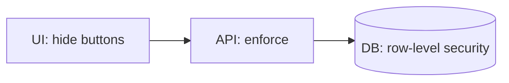

Once the system knows who the user is, the next decision is what the user is allowed to do. Three families of authorization models — Role-Based, Attribute-Based, and Relationship-Based Access Control — cover almost every production system.

> **Acronyms used in this chapter.** ABAC: Attribute-Based Access Control. API: Application Programming Interface. AuthN: Authentication. AuthZ: Authorization. AWS: Amazon Web Services. B2B: Business-to-Business. B2C: Business-to-Consumer. CASL: A JavaScript authorization library. DB: Database. JS: JavaScript. OPA: Open Policy Agent. RBAC: Role-Based Access Control. ReBAC: Relationship-Based Access Control. RLS: Row-Level Security. SaaS: Software-as-a-Service. UI: User Interface. UX: User Experience.

## RBAC — Role-Based Access Control

Users are assigned one or more roles; each role carries a set of permissions. Authorization decisions reduce to a lookup: does the user's role include this permission?

```ts
type Role = "admin" | "editor" | "viewer";

const permissions: Record<Role, Set<string>> = {
  admin: new Set(["task.read", "task.write", "task.delete", "user.manage"]),
  editor: new Set(["task.read", "task.write"]),
  viewer: new Set(["task.read"]),
};

function can(user: { role: Role }, action: string): boolean {
  return permissions[user.role].has(action);
}
```

The benefits are concrete. Reasoning is trivial — the matrix of roles to permissions is small enough to print on a single page. Granting and revoking are simple — change a single role field on the user record. Decisions are cacheable per session because the role rarely changes within a request flow.

The costs appear when permissions become granular. The combinatorial explosion of "editor of THIS project but viewer of THAT one" forces a role-per-resource model that defeats the simplicity that motivated Role-Based Access Control in the first place. Resource-relative permissions ("the user who created this row may edit it") do not model cleanly because the role is global rather than scoped.

The fit is best for small Software-as-a-Service applications and Business-to-Consumer applications with a fixed permission matrix.

## ABAC — Attribute-Based Access Control

Decisions are functions of attributes of the subject (the user), the action (the operation requested), the resource (the target object), and the environment (time of day, network, user-agent). The decision logic is expressed as a policy rather than a permission lookup.

```ts
function canEditTask(user: User, task: Task, env: Env): boolean {
  if (user.id === task.ownerId) return true;
  if (user.role === "admin") return true;
  if (user.org === task.org && user.role === "editor") return true;
  if (env.isOfficeHours === false && task.confidential) return false;
  return false;
}
```

The benefits are expressive power. Owner-can-edit, manager-can-read-direct-reports, no-exports-outside-business-hours, and similar contextual rules express naturally. The model fits regulatory requirements such as time-of-day restrictions and geographic constraints far better than a flat role matrix.

The costs are auditability and performance. Answering "who can read this resource?" requires evaluating the policy against every user, which is expensive at scale. Contradictory rules are easy to write and may interact in subtle ways that only surface for specific attribute combinations. The decision path requires fetching both the resource and the user before evaluation, which can defeat naive caching strategies.

The fit is best for enterprise applications and any system with row-level constraints that depend on resource attributes.

## ReBAC — Relationship-Based Access Control

Permissions follow relationships in a graph. The model was popularised by Google's Zanzibar paper and modern open-source implementations such as SpiceDB and OpenFGA. Authorization decisions reduce to graph traversal: is there a path from the user to the resource through a permitted relationship type?

```text
user:alice  member  group:eng
group:eng   editor  doc:design-doc
```

In this example, Alice can edit the design document because she is a member of the engineering group, which has been granted editor access to the document. The chain `user:alice → group:eng → doc:design-doc` resolves the permission.

The benefits are natural fit for sharing models (Google Docs, Notion, GitHub), scaling to organisations with nested groups and inherited permissions, and a centralised policy engine that yields consistent answers across services regardless of which service raised the question.

The costs are operational. A dedicated authorization service must be deployed and operated. The mental model has a learning curve for teams accustomed to Role-Based or Attribute-Based access control. Network latency on every authorization check matters; high-traffic services need to deploy a local cache or an in-process check that mirrors the central state.

The fit is best for systems with sharing semantics — collaboration tools, document-management applications, multi-tenant Business-to-Business applications.

## Where to enforce

A common slip-up is enforcing authorization only at the User Interface — for example, "the delete button only renders for administrators". The User Interface must hide unauthorised actions to provide a coherent User Experience, but the server must re-check on every request because the browser is in the user's hands and the user (or an attacker who controls the user's environment) can issue any request directly to the Application Programming Interface, bypassing the User Interface entirely.



The three layers of enforcement work together. The User Interface provides affordance — do not display actions the user cannot take, both to avoid confusion and to reduce the attack surface that the application advertises. The Application Programming Interface is the trust boundary — every endpoint checks permission for the action it performs, with the verified principal supplied by the authentication layer. The database is the last resort — Row-Level Security in PostgreSQL prevents bugs in application code from leaking data across tenants or across users.

## Policy as code

Do not scatter `if (user.role === "admin")` checks across the codebase; centralise authorization decisions in a policy module so that audits, tests, and changes have a single point of contact.

```ts
import { defineAbilitiesFor } from "./policy";

export async function canDeleteTask(user: User, taskId: string) {
  const task = await db.tasks.findById(taskId);
  const ability = defineAbilitiesFor(user);
  return ability.can("delete", task);
}
```

A policy library — CASL for JavaScript, Cedar from Amazon Web Services, OpenFGA for graph-based authorization, Open Policy Agent with the Rego language for polyglot organisations — provides three benefits: a single auditable location for the rules, consistent decisions across services that consult the same policy, and test coverage on the policy that is independent of business logic.

## Multi-tenant scoping

In any Business-to-Business application, every query is implicitly scoped to a tenant. Forgetting once produces a cross-tenant data leak that can be catastrophic for compliance and trust. Two strategies are in production use. The application-level strategy requires every repository function to accept a `tenantId` parameter and to include it in every query; this is easy to forget under deadline pressure. The database-level strategy uses PostgreSQL Row-Level Security policies; the application sets a session variable (`SET app.current_tenant = ...`) and the database enforces the scoping at the storage layer, making the protection bug-resistant.

```sql
ALTER TABLE tasks ENABLE ROW LEVEL SECURITY;

CREATE POLICY tasks_tenant_isolation ON tasks
  USING (tenant_id = current_setting('app.current_tenant')::uuid);
```

This is the senior answer to "how do you guarantee tenant isolation?": enforce the constraint at the database layer, not just in application code, so a forgotten `WHERE tenant_id` in a single query cannot leak data across tenants.

## UI: render based on permissions

```tsx
function TaskActions({ task }: { task: Task }) {
  const { user } = useAuth();
  const can = useAbility(user);

  return (
    <>
      {can("update", task) && <button>Edit</button>}
      {can("delete", task) && <button>Delete</button>}
    </>
  );
}
```

Send the per-resource permissions alongside the resource itself in the Application Programming Interface response, so the User Interface does not have to re-implement the policy logic.

```json
{
  "id": "task_1",
  "title": "Ship feature",
  "_permissions": ["read", "update"]
}
```

## Common interviewer trap: confusing AuthN and AuthZ failures

`401 Unauthorized` means "the server does not know who you are"; the appropriate client response is to acquire a fresh credential — re-authenticate, refresh the token, prompt for Multi-Factor Authentication. `403 Forbidden` means "the server knows who you are, but you are not permitted to perform this action"; there is no point in re-authenticating because the principal is already verified. Returning `401` for an authorization failure is a common bug that frustrates clients into infinite refresh loops; returning `403` for a missing token is the inverse bug that breaks retry logic.

## Key takeaways

The senior framing for authorization: Role-Based Access Control is the default for simple permission matrices. Attribute-Based Access Control handles owner, relationship, and contextual rules but is harder to audit. Relationship-Based Access Control fits collaboration tools with sharing semantics. Enforce at the Application Programming Interface and the database; the User Interface is for affordance only. Centralise policy as code; do not scatter `if user.role === "admin"` checks across the codebase. Multi-tenant scoping at the database layer through Row-Level Security is the defence against forgotten `WHERE tenant_id` filters in application code.

## Common interview questions

1. Role-Based Access Control versus Attribute-Based Access Control versus Relationship-Based Access Control — when each?
2. Where should authorization be enforced and why?
3. How can multi-tenant isolation be guaranteed?
4. Walk through a Relationship-Based Access Control permission check (for example, Google Docs sharing).
5. Why is "the User Interface hides the button" insufficient?

## Answers

### 1. RBAC vs ABAC vs ReBAC — when each?

Role-Based Access Control is the right choice when the permission matrix is small, stable, and global — a fixed list of roles each with a fixed set of permissions, applied uniformly to every resource. Most Business-to-Consumer applications and small Software-as-a-Service applications fit this model. Attribute-Based Access Control is the right choice when permissions depend on attributes of the resource (owner, classification level), of the user (department, clearance), of the action (read versus delete), or of the environment (time of day, network); enterprise applications and any system with row-level constraints fit. Relationship-Based Access Control is the right choice when permissions arise from sharing relationships in a graph — Google Docs, GitHub repository access, Notion workspaces — where users gain permissions by being added to groups, projects, or workspaces.

**Trade-offs / when this fails.** Hybrid systems are common: Role-Based for global capabilities ("administrator may delete any post"), Attribute-Based for resource-relative rules ("user may edit posts they created"), and Relationship-Based for sharing semantics ("user may read documents in workspaces they belong to"). The senior pattern is to choose the model that matches the dominant authorization shape and to add the others as needed for specific cases, rather than forcing every rule into one model.

### 2. Where should authorization be enforced and why?

Authorization should be enforced at three layers, with each layer providing defence in depth against bugs in the others. The User Interface enforces affordance — it does not display actions the user cannot take, both for User Experience and to reduce the attack surface that the application advertises. The Application Programming Interface enforces the trust boundary — every endpoint checks permission for the action it performs, with the verified principal supplied by the authentication layer. The database enforces the last resort — Row-Level Security in PostgreSQL prevents bugs in application code from leaking data across tenants or across users.

**Trade-offs / when this fails.** Enforcing only at the User Interface is the most common authorization bug because the browser is in the user's hands; the user (or an attacker who compromises the user's environment) can issue any request directly to the Application Programming Interface, bypassing the User Interface entirely. Enforcing only at the Application Programming Interface is the right minimum bar but leaves the application vulnerable to bugs that forget the check; the database layer catches those bugs before they leak data.

### 3. How can multi-tenant isolation be guaranteed?

The senior answer is to enforce the tenant scoping at the database layer using Row-Level Security policies, not in application code alone. The application sets a session variable (`SET app.current_tenant = ...`) at the start of each request, and the database's Row-Level Security policies filter every query to rows where `tenant_id` matches the session variable. A bug in application code that forgets `WHERE tenant_id = $1` is caught by the database policy, which returns zero rows rather than rows from another tenant.

```sql
ALTER TABLE tasks ENABLE ROW LEVEL SECURITY;
CREATE POLICY tasks_tenant ON tasks
  USING (tenant_id = current_setting('app.current_tenant')::uuid);
```

**Trade-offs / when this fails.** Row-Level Security has a performance cost because every query is rewritten to include the policy predicate; the cost is usually negligible but should be measured. The session variable must be set on the database connection, which means connection pooling needs care to prevent the variable persisting across requests for different tenants. Application-level scoping alone is fragile because every developer must remember the filter on every query; database-level scoping is the senior pattern precisely because it makes the constraint structural rather than discretionary.

### 4. Walk through a ReBAC permission check.

Consider a Google Docs document and the question "may Alice edit this document?". The relationships in the system are: Alice is a member of the engineering group; the engineering group has been granted editor access to the document; the document is owned by Bob. The policy engine evaluates "may Alice edit this document?" by traversing the graph: from Alice via the membership edge to the engineering group, from the engineering group via the editor edge to the document. The path exists, so the answer is yes. If the engineering group only had viewer access, the path for "edit" would not exist and the answer would be no.

```text
user:alice  member  group:eng
group:eng   editor  doc:design-doc
```

**Trade-offs / when this fails.** The graph traversal can become expensive for deeply nested groups or large fan-out (a document shared with the entire organisation). Production Relationship-Based Access Control implementations (SpiceDB, OpenFGA) use caching, materialised views, and precomputed reachability to keep the per-check latency low. The model also requires careful design of the relationship vocabulary; "viewer", "editor", "owner" are obvious, but more complex relationships ("commenter", "approver", "auditor") need explicit modelling.

### 5. Why is "the UI hides the button" insufficient?

The User Interface is rendered in the user's browser, which is fully under the user's control. A user (or an attacker who compromises the user's environment, browser, or network) can issue any Application Programming Interface request directly using `curl`, the browser's developer tools, a script in a browser extension, or a custom client. The button being absent from the User Interface only hides the action's discoverability; it does not prevent the action. A senior framing of the rule: the User Interface advises the user about what they can do; the server enforces what they may do. Treating User Interface enforcement as security is the architectural mistake that produces the largest privilege-escalation bugs.

```ts
// Server-side enforcement; the only layer that actually matters.
app.delete("/tasks/:id", async (req, res) => {
  const user = await authenticate(req);
  const task = await db.tasks.findById(req.params.id);
  if (!can(user, "delete", task)) return res.status(403).json({ error: "forbidden" });
  await db.tasks.delete(task.id);
  res.status(204).send();
});
```

**Trade-offs / when this fails.** The User Interface should still hide unauthorised actions for User Experience and to reduce the attack surface that the application advertises; the failure mode is treating the User Interface enforcement as the only enforcement. The server-side check is non-negotiable; the User Interface check is courtesy.

## Further reading

- [Google Zanzibar paper](https://research.google/pubs/pub48190/).
- [OpenFGA](https://openfga.dev/).
- [Cedar policy language (AWS)](https://www.cedarpolicy.com/).
- [CASL for JavaScript](https://casl.js.org/).
