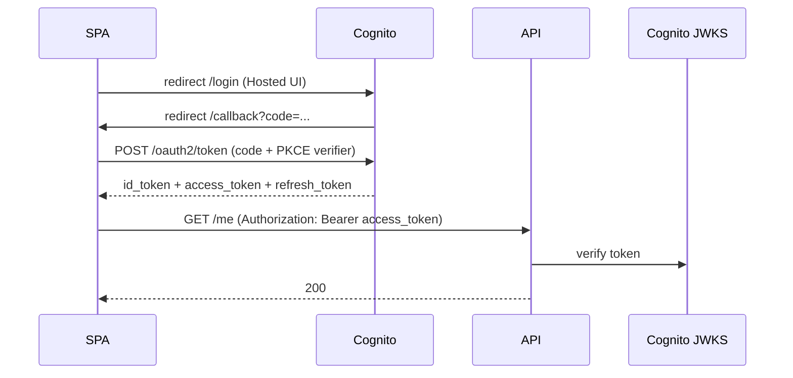

The previous chapters established the rules. This one walks through three production setups; pick the one closest to the team's stack and the patterns transfer to the others. For React-side patterns that complement these — the `useAuth` hook, route guards, the `fetch` wrapper with silent refresh, cross-tab logout, and pure-client Proof Key for Code Exchange flows — see [chapter 8: React client authentication](./08-react-client.md).

> **Acronyms used in this chapter.** API: Application Programming Interface. AWS: Amazon Web Services. BFF: Backend-for-Frontend. CSRF: Cross-Site Request Forgery. DB: Database. DI: Dependency Injection. HS256: HMAC with SHA-256. HTTP: Hypertext Transfer Protocol. IdP: Identity Provider. JWKS: JSON Web Key Set. JWT: JSON Web Token. MFA: Multi-Factor Authentication. OIDC: OpenID Connect. PKCE: Proof Key for Code Exchange. RS256: RSA Signature with Secure Hash Algorithm 256. SaaS: Software-as-a-Service. SPA: Single-Page Application. UI: User Interface.

## 1. Auth.js (NextAuth) in Next.js App Router

Auth.js (formerly NextAuth) handles OpenID Connect flows, session management, Cross-Site Request Forgery protection, and database adapters out of the box. It is the default choice for Next.js applications in 2026.

```bash
pnpm add next-auth@beta
```

```ts
// auth.ts
import NextAuth from "next-auth";
import Google from "next-auth/providers/google";
import Credentials from "next-auth/providers/credentials";
import { DrizzleAdapter } from "@auth/drizzle-adapter";
import { db } from "@/db";
import { verifyPassword } from "@/auth/passwords";
import { z } from "zod";

const credentialsSchema = z.object({
  email: z.string().email(),
  password: z.string().min(8),
});

export const { handlers, auth, signIn, signOut } = NextAuth({
  adapter: DrizzleAdapter(db),
  session: { strategy: "database", maxAge: 30 * 24 * 60 * 60 },
  providers: [
    Google({
      clientId: process.env.GOOGLE_CLIENT_ID!,
      clientSecret: process.env.GOOGLE_CLIENT_SECRET!,
    }),
    Credentials({
      credentials: { email: {}, password: {} },
      async authorize(raw) {
        const parsed = credentialsSchema.safeParse(raw);
        if (!parsed.success) return null;

        const user = await db.query.users.findFirst({
          where: (u, { eq }) => eq(u.email, parsed.data.email),
        });
        if (!user) return null;

        const ok = await verifyPassword(parsed.data.password, user.passwordHash);
        return ok ? { id: user.id, email: user.email, name: user.name } : null;
      },
    }),
  ],
  callbacks: {
    async session({ session, user }) {
      session.user.id = user.id;
      session.user.role = (user as any).role ?? "viewer";
      return session;
    },
  },
});
```

```ts
// app/api/auth/[...nextauth]/route.ts
export { GET, POST } from "@/auth";
```

```ts
// middleware.ts
import { auth } from "@/auth";

export default auth((req) => {
  if (!req.auth && req.nextUrl.pathname.startsWith("/app")) {
    const url = req.nextUrl.clone();
    url.pathname = "/login";
    url.searchParams.set("from", req.nextUrl.pathname);
    return Response.redirect(url);
  }
});

export const config = {
  matcher: ["/app/:path*"],
};
```

```tsx
// app/app/page.tsx
import { auth } from "@/auth";
import { redirect } from "next/navigation";

export default async function AppPage() {
  const session = await auth();
  if (!session) redirect("/login");

  return <h1>Hi, {session.user.name}</h1>;
}
```

What this provides: OpenID Connect plus credentials authentication with rotation and expiry handled by the library; database-backed sessions that are immediately revocable; middleware-level gating so protected routes do not flicker between authenticated and unauthenticated states; and type-safe session access in both Server Components and Client Components.

The costs are real but bounded. The library is opinionated; bending it to unusual flows is harder than starting from a thin custom implementation. The database adapter is required for the `"database"` session strategy, which is the secure default — the alternative `"jwt"` strategy stores everything in the cookie and forfeits revocation.

## 2. Passport + NestJS Guards

The classic Node.js and NestJS pattern. Passport handles authentication strategies (Local, JSON Web Token, Google, GitHub) and NestJS Guards enforce authentication and authorization declaratively on routes through decorators.

```bash
pnpm add @nestjs/passport passport passport-jwt @nestjs/jwt
pnpm add -D @types/passport-jwt
```

```ts
// auth/jwt.strategy.ts
import { Injectable } from "@nestjs/common";
import { PassportStrategy } from "@nestjs/passport";
import { ExtractJwt, Strategy } from "passport-jwt";

@Injectable()
export class JwtStrategy extends PassportStrategy(Strategy) {
  constructor() {
    super({
      jwtFromRequest: ExtractJwt.fromAuthHeaderAsBearerToken(),
      ignoreExpiration: false,
      secretOrKey: process.env.JWT_SECRET!,
      issuer: "https://auth.example.com",
      audience: "tasks-api",
      algorithms: ["HS256"],
    });
  }

  async validate(payload: { sub: string; role: string }) {
    return { id: payload.sub, role: payload.role };
  }
}
```

```ts
// auth/jwt-auth.guard.ts
import { Injectable } from "@nestjs/common";
import { AuthGuard } from "@nestjs/passport";

@Injectable()
export class JwtAuthGuard extends AuthGuard("jwt") {}
```

```ts
// auth/roles.guard.ts
import { CanActivate, ExecutionContext, Injectable } from "@nestjs/common";
import { Reflector } from "@nestjs/core";
import { ROLES_KEY } from "./roles.decorator";

@Injectable()
export class RolesGuard implements CanActivate {
  constructor(private reflector: Reflector) {}

  canActivate(context: ExecutionContext): boolean {
    const required = this.reflector.getAllAndOverride<string[]>(ROLES_KEY, [
      context.getHandler(),
      context.getClass(),
    ]);
    if (!required) return true;
    const { user } = context.switchToHttp().getRequest();
    return required.some((r) => user?.role === r);
  }
}
```

```ts
// auth/roles.decorator.ts
import { SetMetadata } from "@nestjs/common";
export const ROLES_KEY = "roles";
export const Roles = (...roles: string[]) => SetMetadata(ROLES_KEY, roles);
```

```ts
// tasks/tasks.controller.ts
import { Controller, Delete, Param, UseGuards } from "@nestjs/common";
import { JwtAuthGuard } from "../auth/jwt-auth.guard";
import { RolesGuard } from "../auth/roles.guard";
import { Roles } from "../auth/roles.decorator";

@Controller("tasks")
@UseGuards(JwtAuthGuard, RolesGuard)
export class TasksController {
  @Delete(":id")
  @Roles("admin")
  remove(@Param("id") id: string) {
    return this.svc.remove(id);
  }
}
```

What this provides: Guards make authentication and authorization declarative through decorators (`@UseGuards(JwtAuthGuard)`, `@Roles("admin")`) and trivially testable through NestJS's testing utilities. Passport strategies are swappable — Local, JSON Web Token, Google, GitHub — without changing the controllers that consume them. The pattern is Dependency-Injection friendly, so a strategy can depend on a `UsersService` for credential validation or a `RolesService` for authorization decisions.

## 3. AWS Cognito Hosted UI from a SPA

Amazon Cognito provides a hosted login page (no need to build forms), Multi-Factor Authentication, social federation across providers, and JSON Web Token issuance. Senior interviews for Amazon Web Services-heavy roles often probe Cognito specifically because it removes a substantial portion of the authentication implementation burden.



```ts
// auth/cognito.ts
const config = {
  region: "eu-west-1",
  userPoolId: "eu-west-1_AbCdEfGhI",
  clientId: "1example23456789",
  domain: "https://auth.example.com",
  redirectUri: "https://app.example.com/callback",
  scope: "openid email profile",
};

export function loginUrl(state: string, codeChallenge: string) {
  const u = new URL(`${config.domain}/oauth2/authorize`);
  u.searchParams.set("response_type", "code");
  u.searchParams.set("client_id", config.clientId);
  u.searchParams.set("redirect_uri", config.redirectUri);
  u.searchParams.set("scope", config.scope);
  u.searchParams.set("state", state);
  u.searchParams.set("code_challenge", codeChallenge);
  u.searchParams.set("code_challenge_method", "S256");
  return u.toString();
}

export async function exchangeCode(code: string, codeVerifier: string) {
  const r = await fetch(`${config.domain}/oauth2/token`, {
    method: "POST",
    headers: { "Content-Type": "application/x-www-form-urlencoded" },
    body: new URLSearchParams({
      grant_type: "authorization_code",
      client_id: config.clientId,
      code,
      redirect_uri: config.redirectUri,
      code_verifier: codeVerifier,
    }),
  });
  if (!r.ok) throw new Error("Token exchange failed");
  return (await r.json()) as {
    id_token: string;
    access_token: string;
    refresh_token: string;
    expires_in: number;
  };
}
```

```ts
// api/middleware/verify-cognito.ts (Node API)
import { jwtVerify, createRemoteJWKSet } from "jose";

const JWKS = createRemoteJWKSet(
  new URL(
    "https://cognito-idp.eu-west-1.amazonaws.com/eu-west-1_AbCdEfGhI/.well-known/jwks.json"
  )
);

export async function verifyCognitoJwt(token: string) {
  const { payload } = await jwtVerify(token, JWKS, {
    issuer:
      "https://cognito-idp.eu-west-1.amazonaws.com/eu-west-1_AbCdEfGhI",
    algorithms: ["RS256"],
  });
  return payload;
}
```

In production deployments, do not store Cognito's tokens in the Single-Page Application directly; place a thin Backend-for-Frontend (for example, a Next.js route) in front of Cognito so the browser only ever holds an `HttpOnly` session cookie that points to a server-side session containing the actual tokens.

## Picking between them

| Stack | First choice |
| --- | --- |
| Next.js, single application | Auth.js with the database session strategy |
| NestJS API serving multiple clients (web + mobile) | Passport JWT + Guards, with a Backend-for-Frontend for the web client |
| Heavy Amazon Web Services usage, want Hosted UI / Multi-Factor Authentication out of the box | Cognito + Backend-for-Frontend |
| Multi-product Software-as-a-Service, team has scale | Off-the-shelf Identity Provider (Auth0, WorkOS, Clerk) + Backend-for-Frontend |

The framing senior candidates typically present in interviews: "I would use a hosted Identity Provider unless we have a specific reason not to — data residency, cost at scale, or integration depth that the hosted provider does not support. Rolling our own authentication is rarely the differentiator and is consistently the operational hazard."

## Key takeaways

The senior framing for concrete implementations: Auth.js is the default for Next.js with the database session strategy. NestJS Guards make Passport patterns declarative and testable. Cognito's Hosted User Interface paired with a Backend-for-Frontend is the senior pattern for Amazon Web Services-heavy applications. Use a hosted Identity Provider unless there is a strong reason not to. Always validate the JSON Web Token signature against the issuer's JSON Web Key Set with explicit `iss`, `aud`, and `alg` checks.

## Common interview questions

1. How would authentication be wired into a Next.js App Router application today?
2. How do NestJS Guards differ from Express middleware?
3. What is a Backend-for-Frontend and why use one in front of Cognito?
4. How does an Application Programming Interface verify a Cognito-issued JSON Web Token without calling Cognito on every request?
5. When would Auth.js, Cognito, or Auth0 NOT be the right choice?

## Answers

### 1. How would authentication be wired into a Next.js App Router app today?

Install `next-auth` (the Auth.js package), configure providers (Google for OpenID Connect plus optional credentials for username/password), pick a database adapter (Drizzle, Prisma, Kysely) for the secure `database` session strategy, and export the resulting `handlers`, `auth`, `signIn`, and `signOut` from a single `auth.ts` module. Wire the handlers to a catch-all route (`app/api/auth/[...nextauth]/route.ts`). Add a `middleware.ts` that calls `auth()` and redirects unauthenticated users away from protected paths. In Server Components, call `await auth()` to read the session; in Client Components, use the `<SessionProvider>` and `useSession()` hook.

```ts
export const { handlers, auth, signIn, signOut } = NextAuth({
  adapter: DrizzleAdapter(db),
  session: { strategy: "database", maxAge: 30 * 24 * 60 * 60 },
  providers: [Google({ clientId: env.GOOGLE_CLIENT_ID, clientSecret: env.GOOGLE_CLIENT_SECRET })],
});
```

**Trade-offs / when this fails.** The Auth.js library is opinionated; bending it to unusual flows (multi-tenant authentication with per-tenant Identity Providers, complex Multi-Factor Authentication state machines) is harder than starting fresh. For pure-React applications without Next.js, see the [React client authentication chapter](./08-react-client.md) for the equivalent pattern with a hand-rolled `AuthProvider`.

### 2. How do NestJS Guards differ from Express middleware?

NestJS Guards are class-based, decorated authorization gates that run in the NestJS request pipeline before the route handler executes. Each Guard implements a `canActivate(context: ExecutionContext): boolean | Promise<boolean>` method that decides whether the request proceeds. Guards are applied via `@UseGuards(GuardClass)` decorators on controllers or individual handlers, and they integrate with NestJS's reflection metadata system to read decorator-supplied parameters (for example, `@Roles("admin")`). They are also Dependency-Injection-friendly, so a Guard can depend on a `UsersService` or a `PolicyService`.

Express middleware is a function with the signature `(req, res, next) => void`, applied via `app.use(...)` or per-route. Middleware is functional rather than class-based, has no built-in metadata reflection, and is not Dependency-Injection-aware.

**Trade-offs / when this fails.** Guards are tightly coupled to NestJS; they cannot be reused outside the framework. Express middleware is portable across any Express-compatible server. For applications standardising on NestJS, Guards are the better fit; for applications switching frameworks, the framework-agnostic patterns from the [Express](../08-nodejs-backend/03-express.md) and [Fastify](../08-nodejs-backend/04-fastify.md) chapters port more easily.

### 3. What is a Backend-for-Frontend and why use one in front of Cognito?

A Backend-for-Frontend is a thin server placed between the browser and the upstream Application Programming Interfaces. The Backend-for-Frontend handles the OpenID Connect flow against Cognito, stores the resulting tokens server-side, and issues the browser an `HttpOnly` session cookie that points to the server-side session record. When the browser triggers an Application Programming Interface call that requires Cognito-issued credentials, the Backend-for-Frontend reads the access token from the session and attaches it to the outbound call. The browser never sees the access token.

The reason for the pattern is concrete: tokens never reach JavaScript, so Cross-Site Scripting cannot exfiltrate them; the browser does not need to perform refresh logic; logout is a single server-side delete; and Cross-Origin Resource Sharing complications between the Single-Page Application and the upstream Application Programming Interfaces are avoided because the browser only ever talks to the same-origin Backend-for-Frontend.

**Trade-offs / when this fails.** The Backend-for-Frontend adds a server hop and operational responsibility. For static sites with no available server, the in-memory token pattern from the [React client authentication chapter](./08-react-client.md) is the alternative.

### 4. How does an API verify a Cognito-issued JWT without calling Cognito on every request?

The Application Programming Interface fetches Cognito's JSON Web Key Set once (cached for the duration the keys are valid) from the well-known endpoint `https://cognito-idp.<region>.amazonaws.com/<userPoolId>/.well-known/jwks.json`. Each subsequent request validates the incoming JSON Web Token's signature against the cached keys, checks the `iss`, `aud`, and `exp` claims, and rejects tokens that fail any check. Cognito rotates keys periodically; the verifier handles this by detecting an unknown `kid` (key identifier) in the token header and refreshing the cached key set.

```ts
import { jwtVerify, createRemoteJWKSet } from "jose";
const JWKS = createRemoteJWKSet(new URL(`${userPoolUrl}/.well-known/jwks.json`));
const { payload } = await jwtVerify(token, JWKS, {
  issuer: userPoolUrl, algorithms: ["RS256"],
});
```

**Trade-offs / when this fails.** The cache must be process-wide (or shared via Redis) so that key fetches do not happen on every request. Verification happens locally, which is the entire point: Cognito does not see the request, so the per-request latency is dominated by the cryptographic check rather than a network round-trip.

### 5. When would Auth.js, Cognito, or Auth0 NOT be the right choice?

The hosted Identity Provider pattern is wrong when the application has data-residency constraints that the hosted provider cannot meet (regulated industries with strict on-premises requirements); when the cost at scale exceeds the engineering investment of a self-hosted alternative (typically tens of thousands of monthly active users on a tight margin); when the integration depth required exceeds what the hosted provider supports (custom Multi-Factor Authentication state machines, complex per-tenant federation rules, deep customisation of the token claims); or when the application's threat model includes the hosted provider as part of the attack surface (sovereign deployments, defence applications). For everyday Software-as-a-Service applications, the hosted pattern is the senior default precisely because it removes the implementation surface where authentication bugs accumulate.

**Trade-offs / when this fails.** Self-hosting authentication is rarely the differentiating feature of an application; it is, however, consistently the source of incidents. The senior judgement is to weigh the cost of self-hosting (engineering time, ongoing maintenance, security responsibility) against the constraints that motivate it. When in doubt, default to the hosted provider and revisit only when a concrete constraint forces the move.

## Further reading

- [Auth.js documentation](https://authjs.dev/).
- [NestJS Authentication](https://docs.nestjs.com/security/authentication).
- [AWS Cognito User Pools](https://docs.aws.amazon.com/cognito/latest/developerguide/cognito-user-identity-pools.html).
