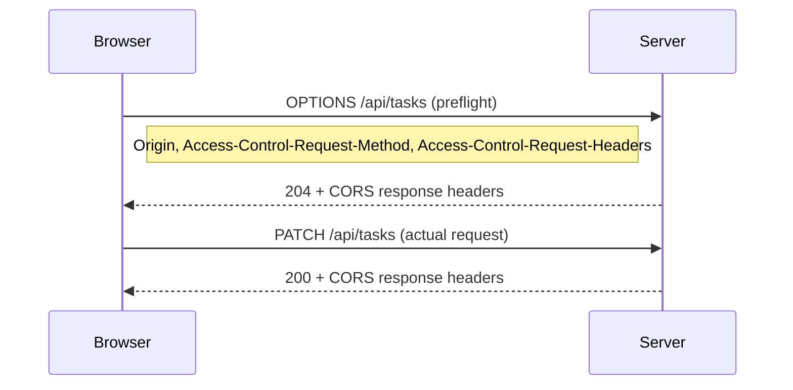

Cross-Origin Resource Sharing is asked in nearly every senior interview. A substantial proportion of candidates explain it incorrectly; understanding the underlying mechanics distinguishes a senior answer from a memorised one.

> **Acronyms used in this chapter.** API: Application Programming Interface. CDN: Content Delivery Network. CORS: Cross-Origin Resource Sharing. CSRF: Cross-Site Request Forgery. HTTP: Hypertext Transfer Protocol. JS: JavaScript. SOP: Same-Origin Policy. URL: Uniform Resource Locator. XHR: XMLHttpRequest. XML: Extensible Markup Language.

## Same-Origin Policy: the underlying rule

A document loaded from `https://app.example.com:443` cannot read responses from any other origin (a different scheme, host, or port) unless that origin explicitly opts in. The policy is enforced by the browser, not by the server, and it applies to the act of reading the response in JavaScript.

Cross-Origin Resource Sharing is the opt-in mechanism by which a server tells the browser "this origin is permitted to read my responses".

> **Note:** the Same-Origin Policy applies to reading the response. Sending the request often happens regardless of the policy. This asymmetry is precisely why Cross-Site Request Forgery attacks succeed without Cross-Origin Resource Sharing being configured: the request is sent and the side-effect occurs even though the attacker cannot read the response.

## "Simple" requests vs preflighted

A simple request does not trigger a preflight. To qualify, the request must satisfy every one of the following constraints: the method must be `GET`, `HEAD`, or `POST`; the only headers set by the application code must be "CORS-safelisted" headers (`Accept`, `Accept-Language`, `Content-Language`, `Content-Type`); the `Content-Type` (if set) must be `application/x-www-form-urlencoded`, `multipart/form-data`, or `text/plain`; and there must be no `ReadableStream` body and no event listeners on `XMLHttpRequest.upload`.

Anything that violates one of these constraints is preflighted: the browser sends an `OPTIONS` request to the target origin first to verify that the actual request is permitted, and only sends the actual request after a positive preflight response.



## Server-side response headers

```h
ttpAccess-Control-Allow-Origin: https://app.example.com
Access-Control-Allow-Methods: GET, POST, PATCH, DELETE
Access-Control-Allow-Headers: Content-Type, Authorization, X-CSRF-Token
Access-Control-Allow-Credentials: true
Access-Control-Expose-Headers: X-Total-Count
Access-Control-Max-Age: 600
```

The semantics of each header are precise. `Access-Control-Allow-Origin` declares the origin permitted to read the response — either a single explicit value or the wildcard `*`. `Access-Control-Allow-Methods` lists the Hypertext Transfer Protocol methods the actual request may use. `Access-Control-Allow-Headers` lists the non-safelisted request headers the client may send (for example, `Authorization`, `Content-Type: application/json`, custom headers). `Access-Control-Allow-Credentials: true` permits cookies or Hypertext Transfer Protocol authentication on the request; it cannot be combined with `Allow-Origin: *`. `Access-Control-Expose-Headers` lists which response headers JavaScript can read (the default safelist exposes only a small set of headers — `Cache-Control`, `Content-Language`, `Content-Type`, `Expires`, `Last-Modified`, `Pragma`). `Access-Control-Max-Age` declares how long the browser may cache the preflight response.

## With credentials

If you want the browser to send cookies on cross-origin requests:

Client:

```ts
fetch("https://api.example.com/me", { credentials: "include" });
```

Server:

```h
ttpAccess-Control-Allow-Origin: https://app.example.com   # explicit, NOT *
Access-Control-Allow-Credentials: true
Vary: Origin                                           # so caches don't mix users
```

Reflecting the request `Origin` is fine if you maintain a whitelist:

```ts
const ALLOWED = new Set([
  "https://app.example.com",
  "https://staging.example.com",
]);

app.use((req, res, next) => {
  const origin = req.header("origin");
  if (origin && ALLOWED.has(origin)) {
    res.setHeader("Access-Control-Allow-Origin", origin);
    res.setHeader("Access-Control-Allow-Credentials", "true");
    res.setHeader("Vary", "Origin");
  }
  next();
});
```

Do not blindly reflect any incoming `Origin` value — that misconfiguration defeats the protection because the application becomes equivalent to `Allow-Origin: *` with credentials, which is what the browser-level prohibition exists to prevent.

## The `Vary: Origin` trap

If the server returns different `Access-Control-Allow-Origin` headers based on the request `Origin`, the response must include `Vary: Origin`. Without it, a Content Delivery Network or browser cache might cache `Access-Control-Allow-Origin: https://app.example.com` and serve it to a subsequent request from `https://attacker.com`. The result is not directly exploitable for credentialled requests because the browser still enforces the credentials check, but it produces inconsistent behaviour across users and breaks legitimate Cross-Origin Resource Sharing flows from other allowed origins.

## Common errors

| Error | Cause | Fix |
| --- | --- | --- |
| "No 'Access-Control-Allow-Origin' header" | Server didn't send the header | Add CORS middleware on the API |
| "Wildcard '*' cannot be used with credentials" | `Allow-Origin: *` + `credentials: include` | Echo specific origin with whitelist |
| "Method PATCH is not allowed" | `Allow-Methods` missing PATCH | Add it |
| "Request header 'authorization' is not allowed" | `Allow-Headers` missing `Authorization` | Add it |
| "Response header 'X-Total-Count' is not exposed" | `Expose-Headers` missing | Add it |
| Preflight returns 405 | App didn't handle `OPTIONS` | Add OPTIONS handler / CORS middleware before routes |

## CORS in each framework

```ts
import cors from "cors";

app.use(cors({
  origin: (origin, cb) => {
    if (!origin || ALLOWED.has(origin)) cb(null, true);
    else cb(new Error("CORS"));
  },
  credentials: true,
  methods: ["GET", "POST", "PATCH", "DELETE"],
  allowedHeaders: ["Content-Type", "Authorization"],
  exposedHeaders: ["X-Total-Count"],
  maxAge: 600,
}));
```

```ts
import cors from "@fastify/cors";

await app.register(cors, {
  origin: (origin, cb) => {
    if (!origin || ALLOWED.has(origin)) cb(null, true);
    else cb(new Error("CORS"), false);
  },
  credentials: true,
});
```

```ts
const app = await NestFactory.create(AppModule);
app.enableCors({
  origin: (origin, cb) => cb(null, !origin || ALLOWED.has(origin)),
  credentials: true,
});
```

```ts
// next.config.js
module.exports = {
  async headers() {
    return [
      {
        source: "/api/:path*",
        headers: [
          { key: "Access-Control-Allow-Credentials", value: "true" },
          { key: "Access-Control-Allow-Origin", value: "https://app.example.com" },
          { key: "Access-Control-Allow-Methods", value: "GET,POST,PATCH,DELETE,OPTIONS" },
          { key: "Access-Control-Allow-Headers", value: "Content-Type, Authorization" },
          { key: "Vary", value: "Origin" },
        ],
      },
    ];
  },
};
```

## Why "just disable CORS" is the wrong instinct

When the team hits a Cross-Origin Resource Sharing error and the first search result suggests setting `Access-Control-Allow-Origin: *`, stop. That advice is the equivalent of "the alarm is annoying, so I unplugged it". Cross-Origin Resource Sharing is doing its job; the correct fix is to allow the specific origin the team controls, not to disable the protection.

The exception is a fully public read-only Application Programming Interface — no credentials, no authentication, intended for arbitrary cross-origin consumption — which can legitimately use `Allow-Origin: *`. Most production Application Programming Interfaces are not that, and the broader the wildcard, the more carefully the team must reason about what an attacker with browser-mediated access could do.

## CORS and `fetch` modes

The `fetch` Application Programming Interface accepts a `mode` option that controls how Cross-Origin Resource Sharing is applied. The `cors` mode (the default for cross-origin requests) follows the specification covered above. The `same-origin` mode causes the request to fail for cross-origin Uniform Resource Locators, which is useful when the application must guarantee that a resource is loaded from its own origin. The `no-cors` mode allows the request but returns an opaque response that JavaScript cannot read; it is used for tracking pixels, service-worker prefetches, and similar fire-and-forget patterns.

## Key takeaways

The senior framing for Cross-Origin Resource Sharing: the policy is the opt-in mechanism around the Same-Origin Policy. Simple requests skip the preflight; anything beyond a constrained subset triggers an `OPTIONS` preflight. `Access-Control-Allow-Origin: *` cannot be combined with `Access-Control-Allow-Credentials: true`. Always send `Vary: Origin` when the response varies by the request origin. Do not blindly reflect arbitrary origins; maintain an explicit allowlist.

## Common interview questions

1. What does the Same-Origin Policy actually restrict?
2. The difference between simple and preflighted requests?
3. Why must `Allow-Origin: *` not be combined with credentials?
4. What is `Vary: Origin` for?
5. Walk through the headers exchanged for a cross-origin `PATCH` with cookies.

## Answers

### 1. What does the Same-Origin Policy actually restrict?

The Same-Origin Policy is a browser-enforced restriction on what a document loaded from one origin (a unique combination of scheme, host, and port) may do with resources from another origin. The policy restricts reading the response of a cross-origin request — the JavaScript that issued the request cannot access the response body, headers (beyond a small safelist), or status. It does not generally restrict sending the request; the browser may still issue the request to the cross-origin server, which is why side-effects can occur (Cross-Site Request Forgery exploits this asymmetry). The policy also restricts reading data from cross-origin DOMs (`window.parent.document.cookie` from an iframe of a different origin) and cross-origin scripts cannot directly inspect each other's variables.

**Trade-offs / when this fails.** The policy is the foundation of web security — without it, any page could read any other page's content, including your bank's logged-in dashboard. The opt-in mechanism (Cross-Origin Resource Sharing) lets servers explicitly permit cross-origin reads when they want to.

### 2. The difference between simple and preflighted requests?

A simple request is one the browser is willing to send directly without checking with the server first. The constraints are restrictive: the method must be `GET`, `HEAD`, or `POST`; only safelisted headers may be set; the `Content-Type` (if set) must be one of three permissive values; no `ReadableStream` body, no `XMLHttpRequest.upload` listeners. Anything that violates any constraint triggers a preflight — an `OPTIONS` request the browser sends to verify the actual request is permitted. The preflight carries `Access-Control-Request-Method` and `Access-Control-Request-Headers` so the server knows what the actual request will look like; the response carries `Access-Control-Allow-Methods` and `Access-Control-Allow-Headers` to permit (or refuse) the actual request.

**Trade-offs / when this fails.** Most real Application Programming Interface requests trigger a preflight because they use `application/json` (a non-simple `Content-Type`), the `Authorization` header (non-safelisted), or non-`GET`/`POST` methods. The preflight adds a round-trip; cache it via `Access-Control-Max-Age` to amortise the cost across many subsequent requests.

### 3. Why must Allow-Origin: * not be combined with credentials?

The combination would mean "any origin may read responses to credentialled requests against this server". An attacker on `evil.com` could issue a `fetch("https://api.example.com/me", { credentials: "include" })`, the browser would attach the user's cookie, the server would respond with the user's data, and `Access-Control-Allow-Origin: *` plus `Access-Control-Allow-Credentials: true` would tell the browser to expose the response body to the attacker's JavaScript. The user's data would be exfiltrated. The browser refuses the combination explicitly to prevent this attack.

The correct pattern for credentialled cross-origin requests is to echo the request `Origin` from an explicit allowlist and pair it with `Access-Control-Allow-Credentials: true`. Each origin must be intentional.

```ts
const ALLOWED = new Set(["https://app.example.com"]);
if (origin && ALLOWED.has(origin)) {
  res.setHeader("Access-Control-Allow-Origin", origin);
  res.setHeader("Access-Control-Allow-Credentials", "true");
  res.setHeader("Vary", "Origin");
}
```

**Trade-offs / when this fails.** A misconfiguration that reflects every incoming `Origin` defeats the protection because the application becomes equivalent to `Allow-Origin: *` with credentials. The allowlist must be enforced; reflecting whatever the request claims is not a defence.

### 4. What is Vary: Origin for?

The `Vary` response header tells caches that the response varies based on the named request header — entries are keyed separately per distinct value. When the server returns different `Access-Control-Allow-Origin` values based on the request `Origin`, `Vary: Origin` ensures that the cache (a Content Delivery Network or the browser's own cache) does not serve a response intended for one origin to a request from another origin. Without `Vary: Origin`, the cache might cache `Access-Control-Allow-Origin: https://app.example.com` and serve it to a subsequent request from `https://other.example.com`; the browser would then refuse the response because the origin does not match, breaking the legitimate Cross-Origin Resource Sharing flow from the other origin.

**Trade-offs / when this fails.** Forgetting `Vary: Origin` is the most common Cross-Origin Resource Sharing-related caching bug. The fix is mechanical — add the header whenever the response varies by `Origin`. Some Content Delivery Networks ignore `Vary` for performance reasons; for Application Programming Interfaces served through such Content Delivery Networks, the safer pattern is to vary by path or to use a Content Delivery Network that honours `Vary` correctly.

### 5. Walk through the headers exchanged for a cross-origin PATCH with cookies.

The `PATCH` method is non-simple, so the browser issues a preflight first. The preflight is an `OPTIONS` request to the same path, carrying `Origin: https://app.example.com`, `Access-Control-Request-Method: PATCH`, and `Access-Control-Request-Headers: content-type, authorization`. The server responds with `204 No Content`, `Access-Control-Allow-Origin: https://app.example.com`, `Access-Control-Allow-Credentials: true`, `Access-Control-Allow-Methods: PATCH`, `Access-Control-Allow-Headers: content-type, authorization`, `Access-Control-Max-Age: 600`, and `Vary: Origin`. The browser caches this preflight for ten minutes. The actual `PATCH` request follows, carrying the cookie and the `Content-Type: application/json` and `Authorization: Bearer ...` headers; the server processes it and responds with `200 OK`, `Access-Control-Allow-Origin: https://app.example.com`, `Access-Control-Allow-Credentials: true`, and the response body. The browser exposes the response to the JavaScript that issued the `fetch`.

```h
ttpOPTIONS /api/tasks/123 HTTP/1.1
Origin: https://app.example.com
Access-Control-Request-Method: PATCH
Access-Control-Request-Headers: content-type, authorization

HTTP/1.1 204 No Content
Access-Control-Allow-Origin: https://app.example.com
Access-Control-Allow-Credentials: true
Access-Control-Allow-Methods: PATCH
Access-Control-Allow-Headers: content-type, authorization
Access-Control-Max-Age: 600
Vary: Origin
```

**Trade-offs / when this fails.** Each header missing from the preflight response causes the actual request to fail. Increase `Access-Control-Max-Age` to reduce preflight overhead on hot paths; the browser caps the value (Chromium caps at two hours regardless of the server's value).

## Further reading

- [MDN: CORS](https://developer.mozilla.org/en-US/docs/Web/HTTP/CORS).
- [Fetch Standard — CORS protocol](https://fetch.spec.whatwg.org/#http-cors-protocol).
- [Web.dev: CORS for the curious](https://web.dev/cross-origin-resource-sharing/).
