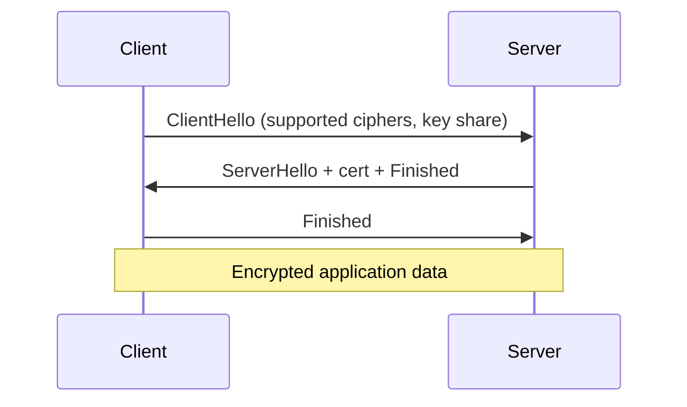
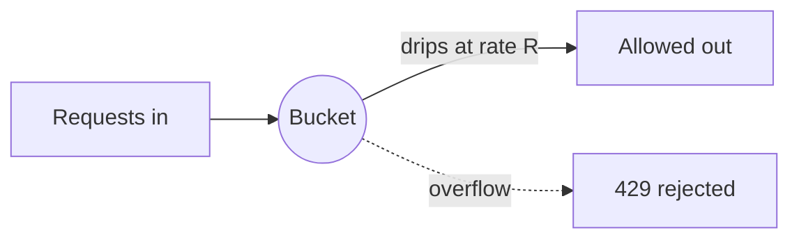
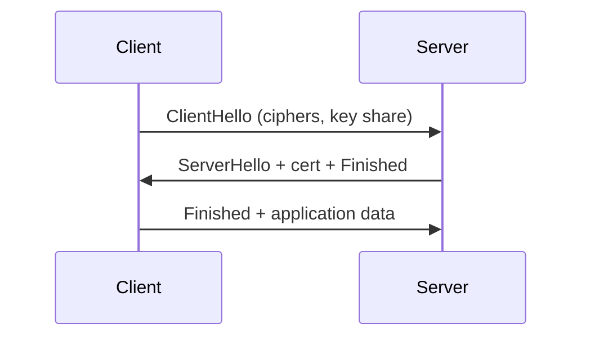

This chapter covers the operational underpinnings of a secure production environment: where secrets live and how they are rotated, how Transport Layer Security protects data in transit, and how rate limiting slows attackers without blocking the legitimate users who pay the bills. Senior engineers are expected to have an opinion on each topic and to be able to defend the choices in production review.

**Acronyms used in this chapter.** Application Programming Interface (API), Authenticated Encryption with Associated Data (AEAD), Carrier-Grade Network Address Translation (CGNAT), Certificate Authority (CA), Continuous Integration (CI), Database (DB), Denial of Service (DoS), Elliptic Curve Diffie-Hellman Ephemeral (ECDHE), Hypertext Transfer Protocol (HTTP), Hypertext Transfer Protocol Secure (HTTPS), HTTP Strict Transport Security (HSTS), Identity and Access Management (IAM), Internet Protocol (IP), JSON Web Key Set (JWKS), JSON Web Token (JWT), Key Management Service (KMS), Large Language Model (LLM), Mutual Transport Layer Security (mTLS), Network Address Translation (NAT), Operating System (OS), Requests Per Second (RPS), Round-Trip Time (RTT), Secure Sockets Layer (SSL), Systems Manager (SSM), Transport Layer Security (TLS).

## Secrets

A secret is any value whose disclosure breaks security: Application Programming Interface keys, database passwords, signing keys, JSON Web Token secrets, encryption keys. Treat any value that grants access to data or compute as a secret and apply the same rigour to it.

### The hierarchy of where not to put secrets

The client-side bundle is the worst home: anyone with browser developer tools can read it. `NEXT_PUBLIC_` environment variables and any "public" environment file are visible to every visitor; they are configuration, never secrets. Git is almost as bad — once a secret is committed, treat it as compromised forever, because the history persists across rewrites and forks; rotate immediately rather than attempting to scrub the history. Container images carry plaintext secrets in their layers when constructed with `ENV API_KEY=...` in a Dockerfile; anyone who can pull the image can extract the value. Continuous Integration logs leak secrets when a `set -x` shell script echoes commands that include the secret value; pipe redaction is necessary. Local `.env` files on disk are acceptable for development but never in production, where they tend to end up readable by every process on the host.

### Where secrets do belong

In Amazon Web Services, secrets live in AWS Secrets Manager or Systems Manager Parameter Store, encrypted by Key Management Service, with Identity and Access Management policies controlling which workloads can read each secret. In non-Amazon-Web-Services environments, HashiCorp Vault is the standard equivalent. For Continuous Integration, GitHub Actions Secrets (or the equivalent in the chosen Continuous Integration provider) hold the values that pipelines need. For team-shared development secrets, Doppler and 1Password Secrets Automation provide auditable distribution.

### Rotation

A secret is only as strong as the most recent rotation. Senior practice rotates database credentials quarterly, with instant rotation on suspected compromise. Signing keys (JSON Web Token) are rotated every ninety days, with multiple active keys served via a JSON Web Key Set so that tokens signed with the previous key continue to validate during the overlap window. Application Programming Interface keys to third parties are rotated every six months, with each rotation logged to the audit trail.

### Detection — leaked secrets in code

TruffleHog and GitGuardian scan repositories for known secret patterns and report matches. Pre-commit hooks (`git-secrets`, `gitleaks`) prevent commits that match known secret patterns from being recorded in the local history. GitHub's secret scanning is enabled by default for public repositories and notifies repository owners and the issuing service when a secret is detected.

### What to do when a secret leaks

Rotate the secret immediately; do not attempt to "make it private later", because the value has already been observed and may already be in use by an attacker. Audit what the leaked secret could have done — read the database query logs, the Application Programming Interface access logs, and any audit trail that records actions performed with the credential. Notify affected parties if user data is implicated, in compliance with the applicable breach-notification regulations. Run a post-mortem on how the leak happened and fix the process; the fix is rarely "the engineer should have been more careful" and almost always "we did not have a tool to prevent this class of mistake".

## TLS

Transport Layer Security is the encryption layer for Hypertext Transfer Protocol. In 2026, anything not on Transport Layer Security is broken by default — modern browsers warn aggressively, search engines deprioritise plaintext sites, and most regulatory frameworks require it.

### The handshake (TLS 1.3, the only version that should run)



Transport Layer Security 1.3 completes a new connection in one Round-Trip Time and a resumed connection in zero Round-Trip Times (the 0-RTT mode); Transport Layer Security 1.2 required two round-trips for a new connection, which is a measurable performance difference for latency-sensitive applications. Transport Layer Security 1.3 also removes the legacy ciphers and key-exchange mechanisms that have been broken in the past two decades, leaving only Authenticated Encryption with Associated Data ciphers and forward-secret key exchange.

### Certificates

A certificate is issued by a Certificate Authority (Let's Encrypt is free and the default for most production deployments), validated against the public Certificate Authority list bundled with browsers and operating systems. Certificates have an expiry — ninety days for Let's Encrypt, which forces automated renewal. Each certificate is tied to specific domains, or to a wildcard such as `*.example.com`. Multi-domain certificates use Subject Alternative Names to cover several hostnames in a single certificate.

### HSTS

Hypertext Transfer Protocol Strict Transport Security tells the browser that the domain is permanently Hypertext Transfer Protocol Secure-only. The header looks like:

```h
ttpStrict-Transport-Security: max-age=31536000; includeSubDomains; preload
```

The `max-age` directive specifies the duration in seconds (here, one year) for which the browser remembers that the domain is Hypertext Transfer Protocol Secure-only. The `includeSubDomains` directive extends the policy to all subdomains. The `preload` directive opts the domain into the Hypertext Transfer Protocol Strict Transport Security Preload List baked into browsers — even the very first request to the site is Hypertext Transfer Protocol Secure-only, defeating Secure Sockets Layer-strip attacks against fresh users. Submit at [hstspreload.org](https://hstspreload.org/); preload is sticky and difficult to reverse, so the team should be confident in long-term Hypertext Transfer Protocol Secure operation before opting in.

### Cipher suites

In 2026, the Transport Layer Security configuration should require Transport Layer Security 1.2 as the minimum (Transport Layer Security 1.3 preferred), permit only Authenticated Encryption with Associated Data ciphers (Advanced Encryption Standard with Galois/Counter Mode, ChaCha20-Poly1305), require Elliptic Curve Diffie-Hellman Ephemeral key exchange for forward secrecy, and forbid Secure Sockets Layer version 3, Transport Layer Security 1.0, Transport Layer Security 1.1, RC4, 3DES, MD5, NULL, and EXPORT cipher suites. The [Mozilla Secure Sockets Layer Configuration Generator](https://ssl-config.mozilla.org/) is the practical answer — pick "modern" or "intermediate" based on the supported client population and copy the configuration into the load balancer.

### Common TLS mistakes

Self-signed certificates in production "just to ship" desensitise users to the browser warning, eroding the value of the warning when a real attack occurs. Mixed content — a Hypertext Transfer Protocol Secure page loading Hypertext Transfer Protocol resources — is blocked by modern browsers because the Hypertext Transfer Protocol resource can be tampered with in transit. Certificate pinning in mobile applications without a rotation strategy breaks the application when the certificate rotates; the team must either avoid pinning or bake in a rotation mechanism. Forgetting to renew the certificate causes outages; set alerts on certificate expiry at thirty days, fourteen days, and seven days before expiration.

### mTLS (mutual TLS)

Mutual Transport Layer Security extends Transport Layer Security so the server also verifies a client certificate. It is used for service-to-service authentication in zero-trust networks, where each service holds a certificate identifying itself and the receiving service verifies the certificate before accepting the request. Frontend applications almost never use Mutual Transport Layer Security directly; the team is most likely to encounter it for the service mesh (Istio, Linkerd) operating between backend services in a Kubernetes cluster.

## Rate limiting

Three operational reasons to rate-limit: to defeat brute force (one thousand password attempts per minute against `/login`); to defeat Denial of Service (a single client sending ten thousand Requests Per Second to expensive endpoints); and to control cost (a Large Language Model proxy that costs one cent per request must not be billed for an attacker's enumeration).

### Strategies

The fixed-window strategy permits one hundred requests per minute starting at the top of the minute; it is simple to implement but tolerates spiky behaviour at window boundaries. The sliding-window strategy permits one hundred requests in any sixty-second window, smoothing the boundary effect at higher implementation cost. The token-bucket strategy regenerates tokens at rate R, consumes one token per request, and allows bursts up to bucket size B; it is the standard choice because it tolerates legitimate bursts while bounding sustained throughput. The leaky-bucket strategy enforces a constant outflow rate, draining the bucket at rate R regardless of incoming volume.



### Where to enforce

Rate limiting at the edge (CloudFront, Cloudflare) catches the bulk of malicious traffic early and cheaply, before the request consumes any backend capacity. Rate limiting at the Application Programming Interface gateway (AWS API Gateway, Kong, Tyk) enforces per-route and per-key limits with finer granularity than the edge can express. Rate limiting at the application (`express-rate-limit`, `@fastify/rate-limit`) is the finest-grained layer, expressing per-user and per-resource policies that the gateway cannot. In production, layer all three.

### Per-what?

Rate-limiting per Internet Protocol address is too coarse (Network Address Translation and Carrier-Grade Network Address Translation cause many users to share an address) and too fine (mobile networks rotate addresses between requests). Rate-limiting per user (Application Programming Interface key or session) is the most useful policy for authenticated endpoints. Rate-limiting per Internet Protocol address plus endpoint is appropriate for unauthenticated endpoints such as `/login`, where there is no user identity yet. Rate-limiting per resource ("one hundred messages per chat per minute") prevents one user from spamming a single resource even within their personal allowance.

### `Retry-After` header

When the server returns `429 Too Many Requests`, it should tell the client when to retry:

```h
ttpHTTP/1.1 429 Too Many Requests
Retry-After: 30
```

A well-behaved client backs off; a misbehaving one ignores the header and continues to receive `429`. The header serves the cooperative case and is informational for the adversarial case.

### Express example

```ts
import rateLimit from "express-rate-limit";

const loginLimiter = rateLimit({
  windowMs: 15 * 60 * 1000,
  max: 5,
  standardHeaders: true,
  legacyHeaders: false,
  message: {
    type: "https://errors.example.com/rate-limited",
    title: "Too many login attempts",
    status: 429,
  },
  keyGenerator: (req) => `${req.ip}:${req.body?.email ?? ""}`,
});

app.post("/login", loginLimiter, loginHandler);
```

For distributed setups with multiple instances, use a Redis-backed store so the limit is global rather than per-instance; otherwise an attacker can rotate across instances to multiply the effective limit.

### Brute-force-specific defences

Rate-limit per Internet Protocol address and per username so the attacker cannot rotate the username to defeat the per-Internet-Protocol limit and cannot rotate the source address to defeat the per-username limit. Apply exponential backoff (one second, two seconds, four seconds, up to sixty seconds) so each successive failed attempt is more expensive than the last. Account lockout (after N failures, lock for M minutes) is a defence but creates a Denial of Service vector if it is permanent or contact-support-only; make it user-resettable. CAPTCHA after N failures helps but interacts poorly with accessibility; use sparingly. Notify the user by email of suspicious activity so legitimate account holders can investigate.

### Do not lock out legitimate users

A common mistake is to lock the account permanently on N failed attempts. An attacker who knows the user's email can lock the user out indefinitely. The better policy is to rate-limit attempts without locking the account; lock the session that is failing (require a fresh login attempt with CAPTCHA); and notify the user of the lockout so they understand the account is not "the site is down".

## Key takeaways

The senior framing for operational security: secrets never live in client bundles, in Git, or in container image layers; rotate secrets on a schedule and immediately on leak. Transport Layer Security 1.3 plus Hypertext Transfer Protocol Strict Transport Security with `preload` plus auto-renewing certificates from Let's Encrypt is the 2026 default. Rate-limit at the edge and at the application layer; use per-Internet-Protocol plus per-user keys. Defend against brute force with exponential backoff, not permanent lockout (which becomes its own Denial of Service vector).

## Common interview questions

1. Where do secrets live in your production environment?
2. What is HSTS and what does `preload` add?
3. Walk through the TLS 1.3 handshake.
4. Token bucket vs sliding window — when each?
5. How do you rate-limit /login without enabling account-lockout DoS?

## Answers

### 1. Where do secrets live in your production environment?

In a typical production deployment on Amazon Web Services, secrets live in AWS Secrets Manager (for credentials that benefit from automated rotation, such as database passwords) or Systems Manager Parameter Store (for less-sensitive configuration values), encrypted by Key Management Service, with Identity and Access Management policies controlling which workload roles can read each secret. The application reads the secret at startup or per-request via the Amazon Web Services Software Development Kit, never persisting the plaintext value to disk. In non-Amazon-Web-Services environments, HashiCorp Vault is the standard equivalent, with similar role-based access controls.

For Continuous Integration, secrets live in GitHub Actions Secrets (or the equivalent), accessible only to workflows on protected branches, never echoed to logs. For team-shared development secrets, Doppler or 1Password Secrets Automation distributes the values to developer machines without exposing them in shared documents. Secrets never live in client bundles (visible to every visitor), in Git (compromised forever once committed), in Dockerfile `ENV` directives (plaintext in the image layer), or in `.env` files on production hosts (readable by every process on the host).

**Trade-offs / when this fails.** Centralised secret stores are a critical dependency — if AWS Secrets Manager is unavailable, the application cannot start. Cache the secret in memory after retrieval, with a refresh interval that detects rotation; do not re-fetch on every request. Audit access to the secret store and alert on unusual read patterns.

### 2. What is HSTS and what does preload add?

Hypertext Transfer Protocol Strict Transport Security is a response header that tells the browser to treat the domain as Hypertext Transfer Protocol Secure-only for a specified duration. After the browser sees the header, it refuses to issue Hypertext Transfer Protocol requests to the domain — even if the user types `http://` in the address bar, even if a link points to the Hypertext Transfer Protocol version, the browser internally rewrites the request to Hypertext Transfer Protocol Secure. This defeats Secure Sockets Layer-strip attacks where an attacker on the network downgrades the connection from Hypertext Transfer Protocol Secure to Hypertext Transfer Protocol.

```h
ttpStrict-Transport-Security: max-age=31536000; includeSubDomains; preload
```

The `preload` directive opts the domain into the Hypertext Transfer Protocol Strict Transport Security Preload List, a list of domains baked into the browser binary. With preload, even the very first request to the site is Hypertext Transfer Protocol Secure-only, which closes the bootstrap window — without preload, an attacker on the user's first visit can downgrade the connection and prevent the header from ever being seen.

**Trade-offs / when this fails.** Preload is sticky and difficult to reverse — once the domain is on the preload list, removing it takes months and may strand users with old browser versions. The team must be confident in long-term Hypertext Transfer Protocol Secure operation before opting in. The `includeSubDomains` directive must be considered against any subdomain that may need to serve Hypertext Transfer Protocol (legacy systems, hardware that does not support Hypertext Transfer Protocol Secure).

### 3. Walk through the TLS 1.3 handshake.

The Transport Layer Security 1.3 handshake completes in a single round-trip for a new connection. The client sends `ClientHello`, which includes the supported cipher suites, the supported elliptic curves, the supported signature algorithms, and a key share for the curve the client expects the server to choose. The server responds with `ServerHello` (selecting the cipher suite and confirming the key share), the server's certificate, and the `Finished` message — all encrypted with the negotiated key. The client verifies the certificate, derives the session keys, and sends its own `Finished` message. Application data flows immediately after.



For a resumed connection, Transport Layer Security 1.3 supports 0-RTT — the client can send application data alongside the `ClientHello` using a key derived from the previous session. This eliminates the round-trip cost entirely for repeated visits.

**Trade-offs / when this fails.** 0-RTT is vulnerable to replay attacks — the same data can be replayed by an attacker — so it is appropriate only for idempotent, non-state-changing requests (for example, `GET` requests for cached content). Disable 0-RTT for sensitive endpoints. Transport Layer Security 1.3 also removes the legacy compatibility modes that older clients require; the team must verify the supported client population can negotiate Transport Layer Security 1.3 before disabling Transport Layer Security 1.2.

### 4. Token bucket vs sliding window — when each?

Token bucket suits applications that want to permit legitimate bursts while bounding sustained throughput. Tokens regenerate at rate R; each request consumes one; the bucket holds at most B tokens. A user who sat idle for ten minutes can issue B requests in a burst and then settle into rate R; the burst absorbs short bursts of legitimate activity (user opens the application, issues several requests in quick succession) without rejecting them. The token bucket is the most common choice for Application Programming Interfaces with bursty traffic patterns.

Sliding window enforces a smoother limit — N requests in any window of length W — and is appropriate when the team wants to prevent any burst above the steady rate, regardless of how long the user was idle. Sliding window is a stricter policy and is appropriate for endpoints where bursts are themselves abusive (for example, login attempts, where a burst is suspicious by definition).

```ts
// Token bucket pseudocode
function allow(userId: string): boolean {
  const bucket = buckets.get(userId) ?? { tokens: B, lastRefill: now() };
  const elapsed = (now() - bucket.lastRefill) / 1000;
  bucket.tokens = Math.min(B, bucket.tokens + elapsed * R);
  bucket.lastRefill = now();
  if (bucket.tokens < 1) return false;
  bucket.tokens -= 1;
  buckets.set(userId, bucket);
  return true;
}
```

**Trade-offs / when this fails.** Sliding window is more memory-intensive (it must remember the timestamps of recent requests). Token bucket can be implemented with a fixed-size record per user. For distributed enforcement, token bucket maps cleanly onto Redis (atomic increment with expiry); sliding window requires a sorted set per user.

### 5. How do you rate-limit /login without enabling account-lockout DoS?

The naive policy "lock the account after five failed attempts" creates a Denial of Service vector: an attacker who knows the user's email can lock the user out indefinitely by issuing failed attempts. The better policy is to rate-limit attempts without locking the account, applying exponential backoff to each successive failure (one second, two seconds, four seconds, up to one minute) so brute force becomes infeasible without harming legitimate users.

The rate-limit key combines the source Internet Protocol address and the username so the attacker cannot defeat the limit by rotating either dimension. Distributed enforcement uses Redis so the limit is global across application instances. After N consecutive failures, prompt the user with a CAPTCHA on the next attempt; this slows automated brute force without requiring administrator intervention. Notify the user by email of suspicious activity so legitimate account holders can investigate.

```ts
keyGenerator: (req) => `${req.ip}:${req.body?.email ?? ""}`,
windowMs: 15 * 60 * 1000,
max: 5,
```

**Trade-offs / when this fails.** A sufficiently distributed attacker (a botnet) can defeat per-Internet-Protocol limits because each request comes from a different address. The defence then falls back to the per-username dimension, plus the CAPTCHA after N failures, plus passive defences (notify the user, monitor for suspicious patterns). For high-value accounts, multi-factor authentication is the structural defence — a stolen password alone is not enough.

## Further reading

- [OWASP Secrets Management Cheat Sheet](https://cheatsheetseries.owasp.org/cheatsheets/Secrets_Management_Cheat_Sheet.html).
- [Mozilla SSL Configuration Generator](https://ssl-config.mozilla.org/).
- [HSTS Preload submission](https://hstspreload.org/).
