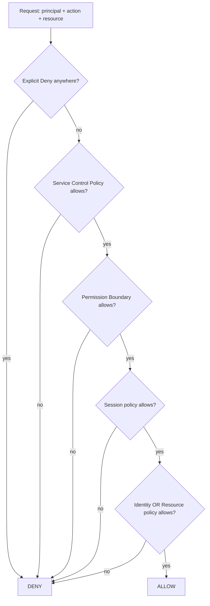
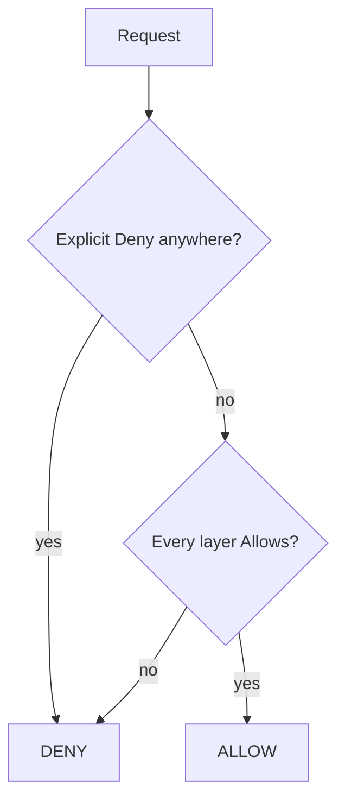

Identity and Access Management is the single most important Amazon Web Services service. Almost every Amazon Web Services interview question reduces to "what does the Identity and Access Management policy say?".

**Acronyms used in this chapter.** Amazon Resource Name (ARN), Amazon Web Services (AWS), Continuous Integration / Continuous Delivery (CI/CD), DynamoDB (DDB), Identity and Access Management (IAM), Identity Provider (IdP), JavaScript Object Notation (JSON), Multi-Factor Authentication (MFA), OpenID Connect (OIDC), Organisational Unit (OU), Security Assertion Markup Language (SAML), Service Control Policy (SCP), Single Sign-On (SSO), Simple Notification Service (SNS), Simple Queue Service (SQS), Simple Storage Service (S3), Security Token Service (STS).

## Principals, identities, policies

A **principal** is who is making the request — a user, a role, or an Amazon Web Services service such as Lambda or EventBridge. An **identity** is either a long-lived user or a role assumed temporarily for the duration of a session. A **policy** is a JSON document declaring what is allowed or denied. An **action** is the operation the principal wishes to perform (`s3:GetObject`, `dynamodb:PutItem`). A **resource** is the Amazon Resource Name the action targets. A **condition** is an optional constraint such as source Internet Protocol address, time of day, or "Multi-Factor Authentication must be present".

## Identity types

| Type | When | Notes |
| --- | --- | --- |
| **Root user** | Account creation only | Never use for daily work. Enable MFA, lock away. |
| **IAM user** | Long-lived human/service | Avoid in 2026 — prefer Identity Center / SSO + roles. |
| **IAM role** | Temporary credentials, assumed by a principal | The default. |
| **IAM Identity Center user** | Workforce SSO | Federates from your IdP (Okta, Entra ID); maps to roles in accounts. |
| **Service-linked role** | Created by an AWS service for itself | E.g. AWSServiceRoleForCloudFront. Don't fight them. |

The 2026 senior recommendation: **AWS Organizations + Identity Center + roles**. No long-lived IAM users.

## A policy's anatomy

```json
{
  "Version": "2012-10-17",
  "Statement": [
    {
      "Sid": "ReadOwnAvatar",
      "Effect": "Allow",
      "Action": ["s3:GetObject"],
      "Resource": "arn:aws:s3:::avatars-bucket/${aws:username}/*",
      "Condition": {
        "Bool": {
          "aws:MultiFactorAuthPresent": "true"
        }
      }
    }
  ]
}
```

- `Effect`: `Allow` or `Deny`.
- `Action`: one or many. Wildcards (`s3:*`, `s3:Get*`).
- `Resource`: ARN. Wildcards.
- `Condition`: keys vary by service. Common: `aws:SourceIp`, `aws:RequestedRegion`, `aws:PrincipalOrgID`, `aws:MultiFactorAuthPresent`, `s3:prefix`.
- `${aws:username}`: variable substitution.

## Identity-based vs resource-based policies

- **Identity-based**: attached to a principal (user/role). "I can read S3 bucket X."
- **Resource-based**: attached to a resource (S3 bucket, KMS key, Lambda function, SNS topic). "Anyone in account 123 can read me."

For cross-account access you typically need both: account A grants role B access in its identity policy, AND the resource in account C has a policy allowing role B.

## The policy-evaluation logic



Mental model: **default deny. An explicit Deny always wins. Otherwise, every active policy must allow.**

## Roles and trust

A role has two policies:

- **Permissions policy** — what the role can do.
- **Trust policy** — who can assume the role.

```json
{
  "Version": "2012-10-17",
  "Statement": [
    {
      "Effect": "Allow",
      "Principal": { "Service": "lambda.amazonaws.com" },
      "Action": "sts:AssumeRole"
    }
  ]
}
```

This trust policy says "the Lambda service is allowed to assume this role". When your Lambda function executes, AWS hands it temporary credentials for this role.

For cross-account:

```json
{
  "Effect": "Allow",
  "Principal": { "AWS": "arn:aws:iam::111122223333:role/CIRunner" },
  "Action": "sts:AssumeRole",
  "Condition": {
    "StringEquals": {
      "sts:ExternalId": "shared-secret-string"
    }
  }
}
```

`ExternalId` defends against the "confused deputy" problem when other AWS customers might be tricked into accessing your resources.

## Least privilege

The principle: grant only what's needed for the task. Examples of getting it right:

| Wrong | Right |
| --- | --- |
| `"Action": "*", "Resource": "*"` | Specific actions on specific ARNs |
| `"Action": "s3:*"` | `["s3:GetObject", "s3:PutObject"]` |
| `"Resource": "arn:aws:s3:::*"` | `"arn:aws:s3:::my-bucket/users/${aws:username}/*"` |
| Reusing one role for "everything" | One role per Lambda function |

Use IAM Access Analyzer to see what permissions a role has actually used in the last N days, then prune.

## Permission boundaries

A guardrail: a role's effective permissions are the **intersection** of its permissions policy and its boundary. Used to delegate role creation to teams without giving them unbounded power.

```json
{
  "Version": "2012-10-17",
  "Statement": [
    {
      "Effect": "Allow",
      "Action": ["s3:*", "dynamodb:*"],
      "Resource": "*"
    }
  ]
}
```

A team can create roles with any S3/DDB permissions but nothing else, regardless of what they put in the role's permission policy.

## Service Control Policies (SCPs)

Org-wide guardrails. Apply at OU or account level. **Cannot grant** — only restrict.

```json
{
  "Version": "2012-10-17",
  "Statement": [
    {
      "Sid": "DenyOutsideRegions",
      "Effect": "Deny",
      "Action": "*",
      "Resource": "*",
      "Condition": {
        "StringNotEquals": {
          "aws:RequestedRegion": ["eu-west-1", "us-east-1"]
        }
      }
    }
  ]
}
```

"Nobody in this org can do anything outside these two regions." A common compliance pattern.

## Federation: Cognito, SAML, OIDC

For workforce: SAML or OIDC into Identity Center, which maps to roles.

For end users (your app's users): Cognito, or use OIDC providers (Google, GitHub) to get a Cognito Identity Pool credential or `AssumeRoleWithWebIdentity`.

## Avoid `aws_access_key_id` in env vars in 2026

For your CI/CD: use **OIDC federation from GitHub Actions / GitLab to AWS**. No long-lived keys.

```yaml
# GitHub Actions
- uses: aws-actions/configure-aws-credentials@v4
  with:
    role-to-assume: arn:aws:iam::111122223333:role/GHA-Deploy
    aws-region: eu-west-1
```

The trust policy on the AWS role:

```json
{
  "Version": "2012-10-17",
  "Statement": [
    {
      "Effect": "Allow",
      "Principal": {
        "Federated": "arn:aws:iam::111122223333:oidc-provider/token.actions.githubusercontent.com"
      },
      "Action": "sts:AssumeRoleWithWebIdentity",
      "Condition": {
        "StringEquals": {
          "token.actions.githubusercontent.com:aud": "sts.amazonaws.com"
        },
        "StringLike": {
          "token.actions.githubusercontent.com:sub": "repo:my-org/my-repo:ref:refs/heads/main"
        }
      }
    }
  ]
}
```

No long-lived secret in your CI; GitHub mints a short-lived OIDC token, AWS exchanges for temp credentials.

## Common policy-evaluation subtleties

When an Allow on a bucket conflicts with a Deny on the user, the Deny wins because explicit denies always override allows. When a user belongs to two groups and one allows Simple Storage Service while the other does not mention it, the user can read Simple Storage Service because the effective permissions are the union of all allows minus all denies. To grant a Lambda function access to DynamoDB, create a role with the relevant DynamoDB policy and attach it as the function's execution role; do not use access keys hard-coded into the function. The recommended pattern for cross-account access is a resource policy on the target resource plus `sts:AssumeRole` from the source account, scoped with `ExternalId` to defeat the "confused deputy" problem.

## Key takeaways

The senior framing for Identity and Access Management: default deny, explicit deny always wins, and otherwise every active policy must allow. Use roles plus temporary credentials rather than Identity and Access Management users with access keys. Identity Center plus organisation-wide Service Control Policies form the 2026 baseline for workforce access. Use OpenID Connect federation for Continuous Integration and Continuous Delivery so no long-lived secrets are stored in build pipelines. Apply least privilege and use Access Analyzer to right-size permissions over time. Apply permission boundaries to delegate role creation to teams without losing organisational control.

## Common interview questions

1. Walk through the IAM policy evaluation order.
2. Difference between a role and a user?
3. What is a permission boundary?
4. How do you grant cross-account access safely?
5. How do you let GitHub Actions deploy to AWS without a long-lived key?

## Answers

### 1. Walk through the IAM policy evaluation order.

The Identity and Access Management policy evaluation logic begins with default deny — every request is denied unless explicitly allowed. The evaluator then checks for an explicit deny anywhere in the policy hierarchy: identity-based policy on the principal, resource-based policy on the resource, organisation Service Control Policies, permission boundary, session policy. If any policy contains a matching deny, the request is denied immediately. If no explicit deny is found, every active policy layer must allow the request: the Service Control Policy must allow, the permission boundary must allow, the session policy must allow, and either the identity-based policy or the resource-based policy must allow.



For cross-account requests, both the source account's identity policy and the destination account's resource policy must allow the action.

**Trade-offs / when this fails.** The evaluation logic is precise but easy to misread when many policy layers are in play. Use the Identity and Access Management Policy Simulator and Access Analyzer to validate the effective permissions of a role rather than reasoning by hand. Errors of intuition typically involve forgetting that a Service Control Policy applies even if the role itself permits the action — Service Control Policies cannot grant permission, only restrict it.

### 2. Difference between a role and a user?

An Identity and Access Management user is a long-lived identity with permanent credentials (access key and secret access key, or password). An Identity and Access Management role is an identity that is assumed temporarily by a principal (a user, another role, or an Amazon Web Services service) and grants short-lived credentials valid for a session. Roles are the modern default; users with permanent credentials are an anti-pattern in 2026 because the credentials become a liability — they leak into Git, into developer machines, into Continuous Integration logs.

```json
{
  "Version": "2012-10-17",
  "Statement": [{
    "Effect": "Allow",
    "Principal": { "Service": "lambda.amazonaws.com" },
    "Action": "sts:AssumeRole"
  }]
}
```

Roles support trust relationships — the role declares which principals are permitted to assume it — and the principal exchanges its identity for the role's credentials at runtime via Security Token Service. Roles also support cross-account assumption with an `ExternalId` to defeat the confused-deputy problem.

**Trade-offs / when this fails.** Roles require a federation source (Identity Center, OpenID Connect, Security Assertion Markup Language) to be useful for human access; the team must set this up. Once configured, the workflow is to log in to the Identity Provider, select an account and role, and receive temporary credentials, which is more secure and more auditable than handing out long-lived access keys.

### 3. What is a permission boundary?

A permission boundary is an Identity and Access Management policy attached to a role (or user) that defines the maximum permissions the role can have. The role's effective permissions are the intersection of its permissions policy and its boundary; if the boundary does not allow an action, the role cannot perform it, regardless of what the permissions policy says.

```json
{
  "Version": "2012-10-17",
  "Statement": [{
    "Effect": "Allow",
    "Action": ["s3:*", "dynamodb:*"],
    "Resource": "*"
  }]
}
```

The pattern is to delegate role creation to application teams without granting them unbounded power. The platform team creates the boundary; application teams create roles attached to the boundary, and the boundary ensures any role they create cannot exceed its scope (only Simple Storage Service and DynamoDB in this example).

**Trade-offs / when this fails.** Boundaries add a layer of mental overhead — the team must remember that the role's effective permissions are not what its permission policy alone says. The benefit is delegation without risk; the team can grant developers `iam:CreateRole` without granting them the ability to create administrator roles.

### 4. How do you grant cross-account access safely?

The pattern requires three pieces: an identity-based policy in the source account that permits the principal to call `sts:AssumeRole` on the destination role; a trust policy on the destination role that lists the source principal (or source account); and an `ExternalId` condition on the trust policy to defeat the confused-deputy problem.

```json
{
  "Effect": "Allow",
  "Principal": { "AWS": "arn:aws:iam::111122223333:role/CIRunner" },
  "Action": "sts:AssumeRole",
  "Condition": {
    "StringEquals": {
      "sts:ExternalId": "shared-secret-string"
    }
  }
}
```

The `ExternalId` is a shared secret between the destination account and the source principal. Without it, an attacker who can convince a third party to assume their role might trick the destination account into granting access; with `ExternalId`, the destination account knows the assumption was intended.

**Trade-offs / when this fails.** Forgetting `ExternalId` exposes the destination account to confused-deputy attacks when the source role is a third-party service (such as a software-as-a-service provider that integrates with multiple customers' accounts). For internal cross-account access between accounts in the same organisation, `ExternalId` is less critical but still good hygiene. The senior pattern uses Identity Center for human cross-account access and Security Token Service `AssumeRole` chains for machine-to-machine cross-account access.

### 5. How do you let GitHub Actions deploy to AWS without a long-lived key?

The mechanism is OpenID Connect federation. GitHub Actions issues a short-lived OpenID Connect token for each workflow run, signed by GitHub's OpenID Connect provider. Amazon Web Services trusts the GitHub OpenID Connect provider as a federated identity provider, and the team creates a role with a trust policy that accepts assumption from GitHub Actions tokens matching specific repository and branch claims.

```yaml
- uses: aws-actions/configure-aws-credentials@v4
  with:
    role-to-assume: arn:aws:iam::111122223333:role/GHA-Deploy
    aws-region: eu-west-1
```

The trust policy on the Amazon Web Services role validates the OpenID Connect audience and the subject claim, restricting which repositories and branches can assume the role:

```json
{
  "Effect": "Allow",
  "Principal": { "Federated": "arn:aws:iam::111122223333:oidc-provider/token.actions.githubusercontent.com" },
  "Action": "sts:AssumeRoleWithWebIdentity",
  "Condition": {
    "StringEquals": { "token.actions.githubusercontent.com:aud": "sts.amazonaws.com" },
    "StringLike": { "token.actions.githubusercontent.com:sub": "repo:my-org/my-repo:ref:refs/heads/main" }
  }
}
```

GitHub mints a short-lived OpenID Connect token, Amazon Web Services exchanges it for temporary credentials, and the workflow deploys with no long-lived secret stored anywhere.

**Trade-offs / when this fails.** OpenID Connect federation requires the team to configure the OpenID Connect provider once per Amazon Web Services account and to write the trust policy carefully. The benefits are substantial: no long-lived credentials to rotate, audit-able authentication via the OpenID Connect token claims, and per-repository or per-branch access control. The same pattern works for GitLab, Buildkite, and other Continuous Integration providers that support OpenID Connect.

## Further reading

- [AWS IAM User Guide — Policies and permissions](https://docs.aws.amazon.com/IAM/latest/UserGuide/access_policies.html).
- [IAM Access Analyzer](https://docs.aws.amazon.com/IAM/latest/UserGuide/what-is-access-analyzer.html).
- [GitHub OIDC federation](https://docs.aws.amazon.com/IAM/latest/UserGuide/id_roles_create_for-idp_oidc.html).
