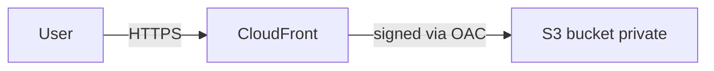

Simple Storage Service is the storage primitive of Amazon Web Services. A frontend developer encounters it for hosting the built site, storing user uploads, and serving large static assets such as videos and downloads.

**Acronyms used in this chapter.** Access Control List (ACL), Amazon Web Services (AWS), Amazon Web Services Certificate Manager (ACM), Application Programming Interface (API), Availability Zone (AZ), Content Delivery Network (CDN), Customer Managed Key (CMK), Customer-supplied Encryption (SSE-C), Cross-Origin Resource Sharing (CORS), Globally Unique (GU), Hypertext Transfer Protocol (HTTP), Hypertext Transfer Protocol Secure (HTTPS), Identity and Access Management (IAM), Infrequent Access (IA), Key Management Service (KMS), Network Time Protocol (NTP), Origin Access Control (OAC), Point of Presence (POP), Server-Side Encryption (SSE), Service Control Policy (SCP), Simple Storage Service (S3), Single-Page Application (SPA), Transport Layer Security (TLS), Uniform Resource Locator (URL), Web Application Firewall (WAF).

## Buckets and objects

A **bucket** is a globally unique namespace for objects (`my-app-uploads-prod-eu-west-1`). An **object** is a key (string) plus a value (bytes), with attached metadata such as `Content-Type` and `Cache-Control`. The **key** looks like a filesystem path (`users/123/avatar.jpg`) but is in fact a single string — Simple Storage Service has no directories, only key prefixes.

Buckets are regional — the data lives in one Amazon Web Services region — but the bucket name is in a single global namespace shared across all customers, so the team must pick a naming convention that avoids collisions and conveys ownership and environment.

## Hosting a static site

Two patterns:

### Pattern A: S3 + CloudFront (recommended)

The bucket stays private; CloudFront serves to the world via Origin Access Control (OAC).



The benefits are substantial. Transport Layer Security certificates are free via Amazon Web Services Certificate Manager. Edge caching across more than two hundred Points of Presence reduces latency globally. Custom domains are wired through Route 53. CloudFront supports Hypertext Transfer Protocol/2 and Hypertext Transfer Protocol/3. Web Application Firewall integration provides Layer 7 protection against common attacks. The bucket itself remains private, so a misconfigured policy cannot accidentally expose objects to the public Internet.

The bucket policy:

```json
{
  "Version": "2012-10-17",
  "Statement": [
    {
      "Sid": "AllowCloudFrontOAC",
      "Effect": "Allow",
      "Principal": { "Service": "cloudfront.amazonaws.com" },
      "Action": "s3:GetObject",
      "Resource": "arn:aws:s3:::my-site-bucket/*",
      "Condition": {
        "StringEquals": {
          "AWS:SourceArn": "arn:aws:cloudfront::123456789012:distribution/EXAMPLE"
        }
      }
    }
  ]
}
```

### Pattern B: S3 static website hosting (legacy)

Enables index/error documents and a public bucket. Limitations: HTTP only (no TLS unless fronted by CloudFront, in which case use Pattern A).

Use Pattern B only for internal tools where HTTPS isn't required, which is rarely.

## SPA routing on S3

A SPA needs all unmatched paths to serve `index.html`. Two approaches:

1. **CloudFront Function** that rewrites unknown paths to `/index.html` (cheap, fast).
2. **CloudFront error response** that maps `403/404 → /index.html` with status `200`.

```ts
// CloudFront Function (JavaScript runtime)
function handler(event) {
  var req = event.request;
  var uri = req.uri;
  if (uri.endsWith("/")) req.uri = uri + "index.html";
  else if (!uri.includes(".")) req.uri = "/index.html";
  return req;
}
```

## Cache headers

Set `Cache-Control` on objects when uploading:

```bash
aws s3 cp dist/index.html s3://my-site-bucket/index.html \
  --cache-control "public, max-age=0, must-revalidate" \
  --content-type "text/html"

aws s3 sync dist/assets/ s3://my-site-bucket/assets/ \
  --cache-control "public, max-age=31536000, immutable"
```

- `index.html`: never cache (you change it every deploy).
- `assets/*` (with content hash in filename): cache forever.

## Presigned URLs (uploads from the browser)

The pattern: server generates a temporary URL, browser uploads directly to S3, server only handles metadata. Avoids streaming uploads through your API.

```ts
import { S3Client } from "@aws-sdk/client-s3";
import { PutObjectCommand } from "@aws-sdk/client-s3";
import { getSignedUrl } from "@aws-sdk/s3-request-presigner";

const s3 = new S3Client({ region: "eu-west-1" });

export async function presignUpload(userId: string, contentType: string) {
  const key = `uploads/${userId}/${crypto.randomUUID()}`;
  const cmd = new PutObjectCommand({
    Bucket: "my-uploads",
    Key: key,
    ContentType: contentType,
    Metadata: { uploadedBy: userId },
  });
  const url = await getSignedUrl(s3, cmd, { expiresIn: 60 });
  return { url, key };
}
```

Browser:

```ts
const { url, key } = await fetch("/api/uploads/presign", {
  method: "POST",
  body: JSON.stringify({ contentType: file.type }),
}).then((r) => r.json());

await fetch(url, {
  method: "PUT",
  headers: { "Content-Type": file.type },
  body: file,
});

await fetch("/api/uploads/finalize", {
  method: "POST",
  body: JSON.stringify({ key }),
});
```

For multipart uploads (>5 GB) use `CreateMultipartUpload` + presign each part.

## Presigned POST (with policy)

For browser form uploads with constraints (max size, content-type whitelist):

```ts
import { createPresignedPost } from "@aws-sdk/s3-presigned-post";

const post = await createPresignedPost(s3, {
  Bucket: "my-uploads",
  Key: key,
  Conditions: [
    ["content-length-range", 0, 10 * 1024 * 1024],
    ["starts-with", "$Content-Type", "image/"],
  ],
  Expires: 60,
});
```

The browser uses the returned `fields` and `url` in a regular `<form enctype="multipart/form-data">`.

## Storage classes

| Class | When | Cost |
| --- | --- | --- |
| **Standard** | Default; hot data | Highest storage cost |
| **Intelligent-Tiering** | Mixed access patterns | Auto-moves; small monitoring fee |
| **Standard-IA** | Infrequent access | Cheaper storage, retrieval fee |
| **One Zone-IA** | Reproducible data | Cheaper still; single AZ |
| **Glacier Instant Retrieval** | Rare-access archive, ms retrieval | Cheap storage; per-GB retrieval |
| **Glacier Flexible Retrieval** | Minute-to-hour retrieval | Cheaper |
| **Glacier Deep Archive** | Rare-access, hours retrieval | Cheapest |

Set lifecycle rules to transition objects automatically:

```json
{
  "Rules": [
    {
      "Id": "tier-to-IA-then-glacier",
      "Status": "Enabled",
      "Filter": { "Prefix": "uploads/" },
      "Transitions": [
        { "Days": 30, "StorageClass": "STANDARD_IA" },
        { "Days": 180, "StorageClass": "GLACIER" }
      ],
      "Expiration": { "Days": 365 * 7 }
    }
  ]
}
```

## Versioning

```json
{ "VersioningConfiguration": { "Status": "Enabled" } }
```

Every overwrite/delete keeps the previous version. Defends against accidental deletion. Costs more storage. Combine with lifecycle rules to expire old versions.

## Server-side encryption

By default in 2026, S3 buckets are encrypted (SSE-S3). For more control:

- **SSE-KMS**: AWS-managed key from KMS. Adds an audit trail of who decrypted what.
- **SSE-C**: customer-supplied key. You manage everything; AWS just stores the encrypted bytes.

Most apps: SSE-KMS with a CMK (customer-managed key) per environment.

## Block public access

The single most useful S3 setting: account-level "Block Public Access". Turn it on. Even if a bucket policy tries to make a bucket public, AWS refuses.

If you need public objects (CDN serving public images), serve them through CloudFront from a private bucket.

## Common bugs

| Bug | Cause | Fix |
| --- | --- | --- |
| 403 on `aws s3 cp` to bucket in another account | Default ACL Owner is uploader | `--acl bucket-owner-full-control` (or disable ACLs entirely) |
| Browser CORS error on direct upload | No `CORSConfiguration` on bucket | Set `AllowedOrigins`, `AllowedMethods` |
| Presigned URL expired immediately | Clock skew on signing host | Sync NTP |
| Public bucket "but I unchecked block-public" | Org-level SCP still blocking | Lift the SCP or use CloudFront |

## Key takeaways

The senior framing for Simple Storage Service: a private bucket plus CloudFront with Origin Access Control is the default for static hosting in 2026. Cache `index.html` short and content-hashed assets forever (`immutable`). Use presigned Uniform Resource Locators for direct browser uploads, constrained by size and type. Enable Block Public Access at the account level. Use Server-Side Encryption with a Key Management Service Customer Managed Key in production for the audit trail.

## Common interview questions

1. How do you host a SPA on AWS?
2. Walk through a direct browser upload to S3.
3. Difference between Block Public Access and a bucket policy?
4. When would you pick One Zone-IA?
5. SPA routing on S3 — how do you handle deep links?

## Answers

### 1. How do you host a SPA on AWS?

The recommended pattern is a private Simple Storage Service bucket fronted by CloudFront with Origin Access Control. The bucket holds the built site (`index.html`, `assets/`); CloudFront serves the content over Hypertext Transfer Protocol Secure with edge caching, a custom domain via Route 53, and a free Transport Layer Security certificate from Amazon Web Services Certificate Manager. The bucket policy permits CloudFront to read objects but denies all other principals.

```bash
aws s3 sync dist/ s3://my-site-bucket/ \
  --cache-control "public, max-age=31536000, immutable" \
  --exclude index.html
aws s3 cp dist/index.html s3://my-site-bucket/index.html \
  --cache-control "public, max-age=0, must-revalidate"
```

For Single-Page Application routing, configure a CloudFront Function to rewrite unknown paths to `/index.html` so deep links into the application resolve correctly. Set `Cache-Control: immutable` on content-hashed assets and a short cache on `index.html` so a deploy is reflected immediately.

**Trade-offs / when this fails.** This pattern works for fully client-rendered Single-Page Applications. For server-rendered or hybrid applications (Next.js with Server Components, for example), the architecture moves to Lambda or container hosting with CloudFront in front, and the static-site pattern is insufficient.

### 2. Walk through a direct browser upload to S3.

The pattern keeps the upload data flow off the application server: the server generates a temporary presigned Uniform Resource Locator that grants the browser permission to upload directly to Simple Storage Service for a short window, the browser issues the upload request directly, and the server is notified after the upload completes.

```ts
const cmd = new PutObjectCommand({
  Bucket: "my-uploads",
  Key: `uploads/${userId}/${crypto.randomUUID()}`,
  ContentType: contentType,
});
const url = await getSignedUrl(s3, cmd, { expiresIn: 60 });
return { url, key };
```

The browser issues `PUT url` with the file body. The server then receives a `POST /api/uploads/finalize` with the key and updates application state. The benefits: the application server never streams the upload bytes (saving bandwidth and Lambda execution time); the upload runs at Simple Storage Service speed (often faster than the application's own bandwidth); and large files (greater than five gigabytes) can use multipart uploads with a presigned Uniform Resource Locator per part.

**Trade-offs / when this fails.** Validation of the upload (size, content type, virus scan) must happen post-upload because the browser bypasses the server. Use presigned `POST` with policy conditions to enforce size and content-type limits at the Simple Storage Service edge, and run a Simple Storage Service event (`s3:ObjectCreated:*` triggering a Lambda function) to finalise validation, scan for malware, or update metadata.

### 3. Difference between Block Public Access and a bucket policy?

Block Public Access is an account-level (or bucket-level) setting that overrides any bucket policy or Access Control List that would make the bucket public. Even if a bucket policy explicitly grants `s3:GetObject` to `Principal: "*"`, Block Public Access refuses the request before the policy is evaluated. The setting is the structural defence against the most common Simple Storage Service incident: a bucket made public by accident, leaking customer data.

A bucket policy is a resource-based policy that grants or denies specific principals access to the bucket. It can be very permissive ("public read") or very restrictive ("only this CloudFront distribution"). Block Public Access provides a guardrail; the bucket policy provides per-principal control.

The recommended posture in 2026: Block Public Access enabled at the account level for every account, and per-bucket bucket policies that grant access only to specific principals (typically a CloudFront distribution's Origin Access Control). If the application requires public objects, serve them through CloudFront from a private bucket; do not make the bucket public.

**Trade-offs / when this fails.** Block Public Access is a hard restriction — turning it off accidentally is the most common path to a leak. The control is bound to the account and to specific organisational units via Service Control Policies, and the team should automate verification that it remains enabled.

### 4. When would you pick One Zone-IA?

One Zone Infrequent Access is appropriate for data that is reproducible (the team can regenerate it from another source), accessed infrequently, and tolerant of occasional unavailability. The class stores the data in a single Availability Zone — if that zone fails, the data is unavailable until the zone recovers, and if the zone is permanently destroyed, the data is lost. The cost is roughly twenty percent lower than Standard Infrequent Access in exchange for the reduced durability.

Typical use cases: thumbnail caches that can be regenerated from the original image; backup copies whose primary lives elsewhere; processed analytics data that can be recomputed from raw events. The class is inappropriate for the only copy of customer-uploaded data, financial records, or anything that must survive an Availability Zone failure.

```json
{ "Rules": [{
  "Id": "tier-thumbnails-to-onezone-ia",
  "Status": "Enabled",
  "Filter": { "Prefix": "thumbnails/" },
  "Transitions": [{ "Days": 30, "StorageClass": "ONEZONE_IA" }]
}]}
```

**Trade-offs / when this fails.** The cost saving is modest, and the operational risk is non-trivial — losing the data because of an Availability Zone failure is a real possibility. For most workloads, Intelligent-Tiering is the better default because it auto-moves objects between Standard and Infrequent Access based on observed access patterns, capturing similar savings without the durability trade-off.

### 5. SPA routing on S3 — how do you handle deep links?

A Single-Page Application uses client-side routing — the path `/users/123/profile` is handled by the JavaScript router after the browser loads `index.html`. When a user navigates directly to `/users/123/profile` (typing the Uniform Resource Locator, opening a bookmark, following a link), the browser issues a `GET /users/123/profile` to the server, but Simple Storage Service has no object at that key and returns `404`.

The solution is to make CloudFront serve `/index.html` for any path that does not correspond to a stored asset. Two approaches: a CloudFront Function that rewrites unknown paths, or a CloudFront error-response configuration that maps `403` and `404` to `/index.html` with a `200` status.

```js
function handler(event) {
  var req = event.request;
  var uri = req.uri;
  if (uri.endsWith("/")) req.uri = uri + "index.html";
  else if (!uri.includes(".")) req.uri = "/index.html";
  return req;
}
```

The function rewrites `/users/123/profile` to `/index.html` so the browser receives the application shell, and the client-side router then renders the correct view based on the original Uniform Resource Locator (which is preserved in the browser's `location`).

**Trade-offs / when this fails.** The error-response approach is simpler but maps every `404` to `index.html`, including missing assets that should genuinely return `404`. The function approach is more precise — only paths without a file extension are rewritten — and is the senior choice. CloudFront Functions are inexpensive (sub-millisecond execution, fractional cents per million invocations).

## Further reading

- [S3 Best Practices](https://docs.aws.amazon.com/AmazonS3/latest/userguide/security-best-practices.html).
- [Hosting a SPA on S3 + CloudFront](https://docs.aws.amazon.com/AmazonCloudFront/latest/DeveloperGuide/single-page-app.html).
