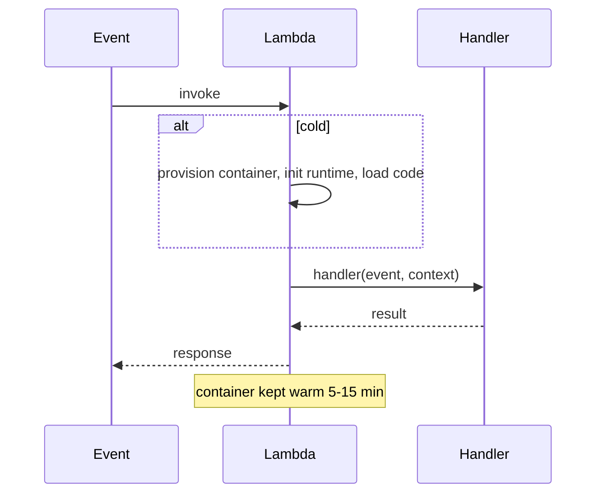
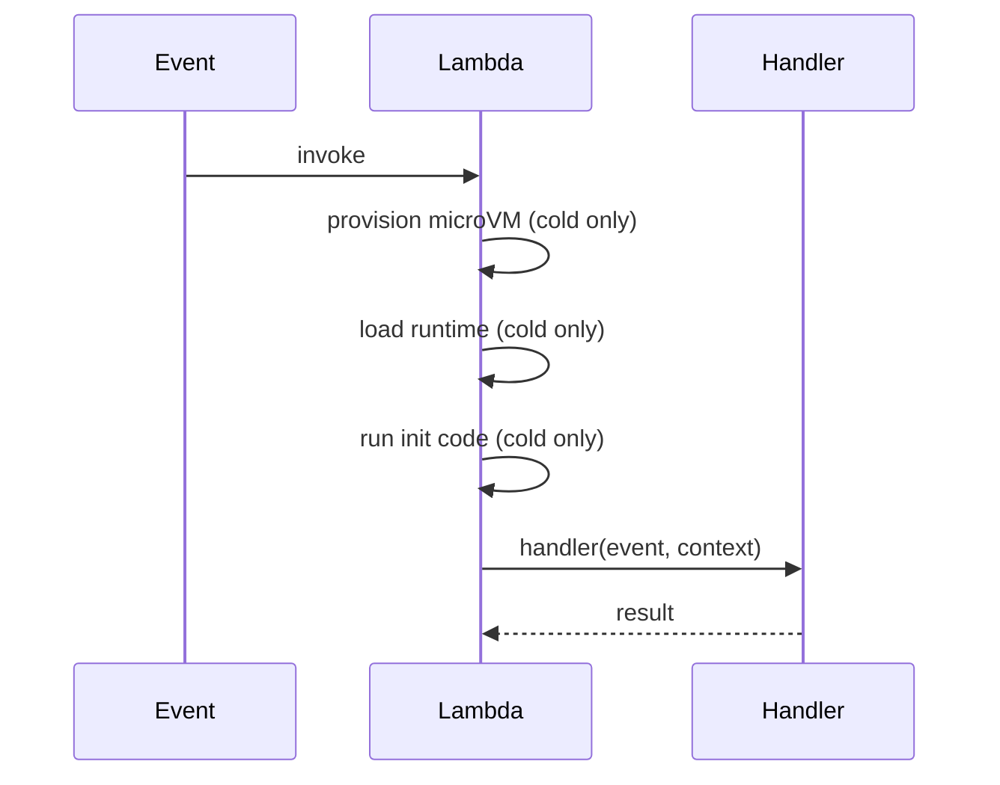

Lambda is the serverless compute primitive of Amazon Web Services. The team writes a function, Amazon Web Services runs it on demand, and the bill is per invocation plus execution time. There is no server to provision, patch, or scale; capacity grows and shrinks automatically with demand.

**Acronyms used in this chapter.** Application Load Balancer (ALB), Application Programming Interface (API), Amazon Web Services (AWS), Amazon Web Services Software Development Kit (AWS SDK), Cloud Development Kit (CDK), Container Registry (ECR), Domain Name System (DNS), Elastic Compute Cloud (EC2), Elastic Container Service (ECS), Elastic Network Interface (ENI), Elasticsearch (ES), Hypertext Transfer Protocol (HTTP), Hypertext Transfer Protocol Secure (HTTPS), Identity and Access Management (IAM), Input/Output (I/O), Java Virtual Machine (JVM), JavaScript Object Notation (JSON), JavaScript (JS), Network Address Translation (NAT), p95 (95th-percentile latency), Relational Database Service (RDS), Simple Notification Service (SNS), Simple Queue Service (SQS), Software Development Kit (SDK), Virtual Private Cloud (VPC).

## Mental model

A **function** is a unit of code with a single entry point (`handler`). An **invocation** is one execution, triggered by an event (Hypertext Transfer Protocol, queue message, scheduled timer). A **container** is the runtime sandbox; it is reused across invocations while warm but never handles concurrent invocations — one container, one invocation at a time.



## Cold starts

The first invocation in a fresh container pays for:

1. **Init**: AWS spins up a microVM (Firecracker), loads the runtime, runs your top-level code.
2. **Handler**: your function body.

For Node.js: 200ms-1s typical. For JVM/.NET: 1-5s. Python is between Node and JVM.

Mitigations:

- **Bundle small** (esbuild minify, tree-shake AWS SDK).
- **Keep init code minimal** — defer heavy work into the handler.
- **Provisioned Concurrency**: pre-warm N containers at all times. Costs more but eliminates cold starts.
- **SnapStart** (Java, Python in 2026): snapshot the initialised runtime, restore on invoke.
- **Lambda Runtime API extensions**: tail-call optimisation for some workloads.

For a public API that must respond in under 500 milliseconds at the 95th percentile, set Provisioned Concurrency to your typical concurrency.

## Configuration knobs

- **Memory**: 128 MB to 10240 MB. CPU scales linearly with memory; doubling memory often halves runtime.
- **Timeout**: 1 second to 15 minutes.
- **Architecture**: x86_64 or arm64 (Graviton). Graviton is ~20% cheaper and often faster.
- **Ephemeral storage**: 512 MB to 10 GB of `/tmp`.
- **Environment variables**: limit ~4 KB per function.
- **VPC**: attach to private subnets if you need to reach RDS / ElastiCache. Adds cold start time and ENI plumbing.

The "right size" your memory: AWS Lambda Power Tuning is a step function that runs your function at different memory sizes and tells you the cost-optimal point.

## Bundling

Default: zip your code + `node_modules`. Slow cold starts because the runtime has to load thousands of files.

The 2026 standard: **esbuild bundle to a single file** (or a few). CDK does this for you with `NodejsFunction`:

```ts
new NodejsFunction(stack, "Api", {
  entry: "src/handlers/api.ts",
  runtime: Runtime.NODEJS_22_X,
  architecture: Architecture.ARM_64,
  memorySize: 1024,
  timeout: Duration.seconds(10),
  bundling: {
    minify: true,
    sourceMap: true,
    target: "node22",
    externalModules: ["@aws-sdk/*"], // SDK is provided by the runtime
  },
});
```

External modules: AWS SDK v3 is in the runtime; don't bundle it. For other deps, bundle. For native modules (sharp, prisma engine), use Lambda Layers or container image deployments.

## Layers

A layer is a versioned zip of `/opt/nodejs/node_modules` (etc.) shared across functions. Useful for:

- Common deps used by many functions.
- Native modules pre-built for the Lambda runtime.
- Custom runtimes.

Modern advice: prefer bundling everything per-function. Layers add complexity and were more useful before esbuild was the norm.

## Container images

For functions >250 MB (after extraction) or with complex dependencies, ship as a container image (up to 10 GB). The image must implement the Lambda Runtime API; AWS provides base images.

```dockerfile
FROM public.ecr.aws/lambda/nodejs:22

COPY package.json pnpm-lock.yaml ./
RUN npm install -g pnpm && pnpm install --frozen-lockfile
COPY . .
CMD ["dist/handler.handler"]
```

## Concurrency model

- One container handles **one** invocation at a time.
- AWS spawns more containers as concurrency rises.
- **Reserved concurrency**: cap on how many containers a function can run at once (back-pressure, prevent runaway cost).
- **Provisioned concurrency**: minimum warm containers (pre-paid, no cold start).
- Account-wide default cap: 1000 concurrent. Request raise if needed.

## Handler signature (Node.js)

```ts
import type { APIGatewayProxyHandlerV2 } from "aws-lambda";

export const handler: APIGatewayProxyHandlerV2 = async (event, context) => {
  console.log({ requestId: context.awsRequestId, path: event.rawPath });
  return {
    statusCode: 200,
    headers: { "content-type": "application/json" },
    body: JSON.stringify({ ok: true }),
  };
};
```

The `context` object carries the request ID, remaining time, and a `getRemainingTimeInMillis()` for graceful shutdown.

## Reuse across invocations

Top-level state survives within a warm container:

```ts
import { DynamoDBClient } from "@aws-sdk/client-dynamodb";

const ddb = new DynamoDBClient({});

export const handler = async (event) => {
  await ddb.send(...);
};
```

The `DynamoDBClient` is created once per cold start, reused per warm invocation. Don't create it inside `handler` — you'll re-establish HTTPS keep-alive on every call.

## Async invocation patterns

Lambda supports three invocation models, each with different retry and error semantics. **Synchronous** invocation (Application Programming Interface Gateway, Application Load Balancer) blocks the caller until the handler returns; the caller sees errors directly. **Asynchronous** invocation (Simple Notification Service, EventBridge) returns 202 Accepted immediately; Lambda processes the event, retries twice on failure, and sends terminal failures to a Dead Letter Queue. **Stream-based** invocation (Simple Queue Service, Kinesis, DynamoDB Streams) has Lambda poll the source and process messages in batches; failed batches are retried and partial-batch responses can mark individual records as failed.

Pick deliberately. Synchronous is appropriate when the caller can wait and needs the response. Asynchronous is appropriate for fire-and-forget patterns where the caller does not need confirmation of completion. Stream-based is appropriate for high-throughput pipelines that benefit from batching.

## Logging, tracing

`console.log` → CloudWatch Logs. Use structured JSON:

```ts
console.log(JSON.stringify({ level: "info", msg: "checkout", userId, total }));
```

Enable X-Ray tracing for distributed traces. Lambda automatically adds segments for AWS SDK calls.

## Lambda + VPC

Attaching to a VPC gives access to private resources (RDS, ElastiCache). Two costs:

1. **ENI provisioning** on cold start: managed by AWS now (Hyperplane), so usually fine.
2. **Outbound internet** requires a NAT Gateway (or VPC endpoints to AWS services).

Prefer VPC endpoints for talking to S3/DynamoDB/SQS from a VPC Lambda — avoids NAT cost and is faster.

## Lambda Web Adapter (for full HTTP frameworks)

If you want to run Express/Next.js on Lambda, the Web Adapter is a layer that translates Lambda events into HTTP requests to your local server.

```dockerfile
FROM public.ecr.aws/lambda/nodejs:22
COPY --from=public.ecr.aws/awsguru/aws-lambda-adapter:0.8.4 /lambda-adapter /opt/extensions/lambda-adapter
ENV PORT=8080 AWS_LAMBDA_EXEC_WRAPPER=/opt/bootstrap
COPY . /var/task
CMD ["node", "server.js"]
```

This is how OpenNext deploys Next.js to Lambda.

## Anti-patterns

Several patterns are recognised as senior-level mistakes. The Lambda monolith — one function handling many routes via `if`/`else` inside the handler — is hard to test, observe, and right-size; split it into one function per route. Long-running Lambdas hit the fifteen-minute execution cap; for longer jobs, use Step Functions, Elastic Container Service Fargate, or Elastic Compute Cloud. Lambdas calling Lambdas synchronously for orchestration produce costly call chains and hide the workflow's state; use Step Functions for orchestration. A substantial cold-start initialisation phase makes every cold invocation slow; profile with `pnpm bundle-stats` and shrink the bundle.

## Key takeaways

The senior framing for Lambda: cold starts are real and can be minimised by bundling small, deferring heavy init, using Graviton, and applying Provisioned Concurrency for latency-sensitive endpoints. Reuse Software Development Kit clients at the module top level. Pick synchronous, asynchronous, or stream-based invocation patterns based on retry needs and caller expectations. Use AWS Lambda Power Tuning to right-size memory. Virtual Private Cloud plus Network Address Translation Gateway is expensive — use Virtual Private Cloud endpoints for Amazon Web Services services to avoid the gateway cost.

## Common interview questions

1. Walk through a Lambda cold start.
2. How do you minimise cold starts in Node.js?
3. Sync vs async vs stream invocation — when each?
4. Why is the Lambda concurrency model "one container = one invocation"?
5. How do you run Next.js on Lambda?

## Answers

### 1. Walk through a Lambda cold start.

A cold start occurs when an invocation arrives and no warm container is available. Amazon Web Services provisions a fresh microVM (Firecracker), loads the runtime (Node.js, Python, Java), downloads the function code (or pulls the container image), and runs the top-level initialisation code — module imports, Software Development Kit client construction, configuration loading. Once the init phase is complete, the handler executes. The container is then kept warm for five to fifteen minutes, during which subsequent invocations skip the init phase entirely.



For Node.js, cold starts are typically 200ms to 1s; for Java Virtual Machine and .NET, 1s to 5s; for Python, between Node and Java Virtual Machine. The init phase counts toward cold start latency but not toward execution time billing on most plans.

**Trade-offs / when this fails.** Cold starts are most visible at the boundary of latency-sensitive endpoints. Reduce them with smaller bundles, deferred initialisation, Provisioned Concurrency, or SnapStart (Java/Python). The trade-off with Provisioned Concurrency is cost — you pay for warm capacity whether or not it is invoked.

### 2. How do you minimise cold starts in Node.js?

The senior playbook: bundle small with esbuild, mark `@aws-sdk/*` external (the runtime provides the Software Development Kit), tree-shake unused exports, and minify. Defer heavy initialisation into the handler when possible — module-top-level code runs on every cold start, while handler code runs on every invocation; the trade-off is that handler-resident initialisation runs more often. Use Graviton (`arm64`) for roughly twenty percent lower cost and often better performance. For latency-sensitive endpoints, Provisioned Concurrency keeps N containers warm at all times; the team trades cost for guaranteed sub-100ms cold start latency.

```ts
new NodejsFunction(stack, "Api", {
  entry: "src/handlers/api.ts",
  runtime: Runtime.NODEJS_22_X,
  architecture: Architecture.ARM_64,
  bundling: {
    minify: true,
    target: "node22",
    externalModules: ["@aws-sdk/*"],
  },
});
```

**Trade-offs / when this fails.** Bundle minification can break source maps unless explicitly enabled. Provisioned Concurrency must be sized with autoscaling rules — under-provisioning still produces cold starts at the margin, over-provisioning wastes money. The structural alternative is to keep the function lightweight enough that cold starts are tolerable.

### 3. Sync vs async vs stream invocation — when each?

Synchronous invocation suits request/response patterns where the caller waits for the result — Application Programming Interface Gateway endpoints, Application Load Balancer targets. Errors propagate to the caller, who decides whether to retry. Synchronous is the right model when the caller can hold open the connection and the operation completes in seconds.

Asynchronous invocation suits fire-and-forget patterns where the caller does not need confirmation of completion — Simple Notification Service notifications, EventBridge events, scheduled tasks. Lambda returns 202 Accepted immediately, then processes the event in the background. Failures are retried twice with exponential backoff; terminal failures go to a Dead Letter Queue (Simple Queue Service or Simple Notification Service) for inspection.

Stream-based invocation suits high-throughput data pipelines — Simple Queue Service, Kinesis, DynamoDB Streams. Lambda polls the source and processes messages in batches (up to ten thousand records per batch for Kinesis, ten messages for Simple Queue Service); the team can tune batch size, batch window, and parallelisation. Failed batches are retried; partial-batch responses can mark individual records as failed so the rest of the batch is not retried.

**Trade-offs / when this fails.** Pick the wrong model and the retry semantics fight the application — synchronous retries on transient failures put the burden on the caller; asynchronous Dead Letter Queues can fill silently if not monitored; stream-based processing can stall the entire shard if a single bad message blocks the batch. Document the model and configure observability (Dead Letter Queue alarms, batch-failure metrics) at deploy time.

### 4. Why is the Lambda concurrency model "one container = one invocation"?

The model is a deliberate simplification that eliminates an entire class of concurrency bugs. A function does not need to be thread-safe because it never handles concurrent invocations within a single container; module-level state survives across invocations only in the warm-reuse sense, not in the concurrent-access sense. This makes Lambda functions easier to write correctly than threaded servers, where shared state requires synchronisation.

The cost is throughput — to serve one thousand concurrent requests, Lambda spins up one thousand containers, each with its own initialised runtime and Software Development Kit clients. For workloads that benefit from connection pooling and shared in-memory caches across requests, the model is wasteful (every container has to establish its own database connection, its own cached configuration). For workloads that scale by request count without significant per-request infrastructure overhead, the model is efficient.

```ts
const ddb = new DynamoDBClient({});
export const handler = async (event) => {
  // ddb is shared across warm invocations but never concurrent
  return ddb.send(...);
};
```

**Trade-offs / when this fails.** Database connection storms occur when one thousand new Lambda containers each open a fresh connection to the database, exhausting the database's connection limit. Use Relational Database Service Proxy or DynamoDB to absorb the connection burst; Relational Database Service Proxy multiplexes Lambda connections onto a smaller pool of database connections. Reserved concurrency caps how many containers a function can run at once, providing back-pressure against runaway scaling.

### 5. How do you run Next.js on Lambda?

Next.js can run on Lambda via OpenNext, an open-source adapter that bundles the Next.js application for Lambda deployment. The pattern uses Lambda Web Adapter — a runtime layer that translates Lambda events into local Hypertext Transfer Protocol requests against the Next.js server, so the application runs unmodified.

```dockerfile
FROM public.ecr.aws/lambda/nodejs:22
COPY --from=public.ecr.aws/awsguru/aws-lambda-adapter:0.8.4 \
  /lambda-adapter /opt/extensions/lambda-adapter
ENV PORT=8080 AWS_LAMBDA_EXEC_WRAPPER=/opt/bootstrap
COPY . /var/task
CMD ["node", "server.js"]
```

The deployment uses CloudFront in front of Lambda Function Uniform Resource Locators (or Application Programming Interface Gateway), Simple Storage Service for static assets, and DynamoDB or Amazon Web Services-specific services for caching. OpenNext handles the translation from Next.js conventions (Image Optimisation, Incremental Static Regeneration, Server Actions) to Amazon Web Services primitives.

**Trade-offs / when this fails.** Lambda has cold starts that affect first-request latency for less-popular routes; Provisioned Concurrency mitigates this. The fifteen-minute execution cap is rarely a problem for Hypertext Transfer Protocol responses but does affect long-running Server Actions. For maximum compatibility and minimum cold start, the alternative is to host Next.js on Vercel or self-host on a long-running Node.js server (Elastic Container Service Fargate, Elastic Compute Cloud); the Lambda pattern is appropriate when the team wants pay-per-use pricing and is willing to accept the operational complexity.

## Further reading

- [AWS Lambda Operator Guide](https://docs.aws.amazon.com/lambda/latest/operatorguide/intro.html).
- [AWS Lambda Power Tuning](https://github.com/alexcasalboni/aws-lambda-power-tuning).
- [OpenNext](https://opennext.js.org/).
