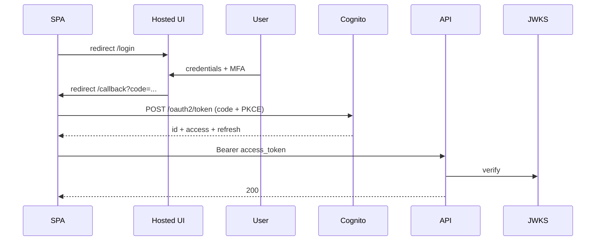

Cognito is the Amazon Web Services managed identity service. It comprises two distinct products that are often confused. **Cognito User Pools** is a user directory plus authentication (sign up, sign in, Multi-Factor Authentication, password reset) that issues JSON Web Tokens. **Cognito Identity Pools** is federation that exchanges any token (a Cognito JSON Web Token, a Google token, a Security Assertion Markup Language assertion) for temporary Amazon Web Services credentials, intended for browsers and mobile applications that call Amazon Web Services services directly.

Most teams need only User Pools. Identity Pools are niche and most applications are better served by a backend that mints presigned Uniform Resource Locators rather than handing Amazon Web Services credentials to the browser.

**Acronyms used in this chapter.** Amazon Web Services (AWS), Amazon Web Services Software Development Kit (AWS SDK), Application Programming Interface (API), Backend-for-Frontend (BFF), Cascading Style Sheets (CSS), Identity and Access Management (IAM), Identity Provider (IdP), JSON Web Key Set (JWKS), JSON Web Token (JWT), JavaScript (JS), Monthly Active User (MAU), Multi-Factor Authentication (MFA), OpenID Connect (OIDC), Role-Based Access Control (RBAC), RS256 (RSA SHA-256), Security Assertion Markup Language (SAML), Simple Email Service (SES), Single-Page Application (SPA), Single Sign-On (SSO), Short Message Service (SMS), Software Development Kit (SDK), System for Cross-domain Identity Management (SCIM), Time-based One-Time Password (TOTP), User Experience (UX).

## User Pools

A managed directory.

Features:

- Email/phone + password sign-in.
- Hosted UI for login/signup/MFA.
- Federation with Google, Facebook, Apple, Amazon, SAML, OIDC.
- MFA: SMS, TOTP.
- Password policies.
- User attributes (verified email, phone).
- Lambda triggers for custom logic (pre-signup, post-confirm, custom-message, ...).

Issues three JWTs:

- **ID token** (OIDC): user identity. Validated by your app/API.
- **Access token**: bearer token for OAuth-style scopes.
- **Refresh token**: long-lived, opaque.

## Hosted UI vs custom UI

Hosted UI: a hosted login page on `https://your-pool.auth.region.amazoncognito.com`. Customisable CSS but limited. Saves you from building login forms.

Custom UI: build your own forms, call Cognito's APIs (`InitiateAuth`, `RespondToAuthChallenge`) directly. More flexibility, more code.

For most products in 2026: Hosted UI is the right call unless you need custom flows.

## A typical SPA flow with Cognito Hosted UI



The BFF variant (recommended): the BFF (Next.js server) handles `/callback` and the token exchange, then sets a single `HttpOnly` session cookie for the browser. Tokens never reach JS.

## Validating Cognito JWTs

```ts
import { jwtVerify, createRemoteJWKSet } from "jose";

const userPoolId = "eu-west-1_AbCdEfGhI";
const clientId = "1example2345abcd";
const region = "eu-west-1";

const issuer = `https://cognito-idp.${region}.amazonaws.com/${userPoolId}`;
const JWKS = createRemoteJWKSet(new URL(`${issuer}/.well-known/jwks.json`));

export async function verifyAccessToken(token: string) {
  const { payload } = await jwtVerify(token, JWKS, {
    issuer,
    algorithms: ["RS256"],
  });

  if (payload.token_use !== "access") throw new Error("not an access token");
  if (payload.client_id !== clientId) throw new Error("wrong client");

  return {
    sub: payload.sub as string,
    scopes: ((payload.scope as string) ?? "").split(" "),
    groups: ((payload["cognito:groups"] as string[]) ?? []),
  };
}
```

Cognito splits a user's roles via `cognito:groups`. Map these to your app's RBAC.

## Lambda triggers

Hooks into the auth lifecycle:

- **PreSignUp**: validate / auto-confirm.
- **PostConfirmation**: write the user to your application DB.
- **PreAuthentication**: enforce business rules (e.g. account locked).
- **CustomMessage**: customise emails (verification, password reset).
- **PreTokenGeneration**: add custom claims to the issued tokens.

```ts
import type { PreTokenGenerationTriggerHandler } from "aws-lambda";

export const handler: PreTokenGenerationTriggerHandler = async (event) => {
  const userId = event.request.userAttributes["sub"];
  const profile = await fetchProfileFromDb(userId);

  event.response.claimsOverrideDetails = {
    claimsToAddOrOverride: {
      tenant_id: profile.tenantId,
      app_role: profile.role,
    },
  };
  return event;
};
```

Now your access token includes `tenant_id` and `app_role` — your API doesn't need to look the user up.

## Multi-tenancy

Two patterns:

1. **One user pool per tenant**: maximum isolation, hard to manage at scale (limit 1000 pools/account).
2. **One pool, tenant claim per user**: a `custom:tenant_id` attribute, propagated to tokens via PreTokenGeneration. Almost always the right choice.

## Limitations / quirks

- **No password rotation policy** beyond a one-shot expiry. Build it yourself.
- **MFA enforcement is per-user**, not per-pool, until you set it pool-wide.
- **Password reset emails** are limited to a tiny template; for branded emails, use SES + custom flow.
- **Scaling**: free tier 50k MAU, then $0.0055 per MAU. Cheap until it isn't.
- **Hosted UI customisation** is CSS-only; no React control.
- **Cognito doesn't easily federate with Cognito** (cross-account is painful).

## Identity Pools (the other Cognito)

Exchanges any token for **temporary AWS credentials**. Use case: a mobile app that wants to upload directly to S3 with credentials scoped to that user.

```ts
import { CognitoIdentityClient } from "@aws-sdk/client-cognito-identity";
import { fromCognitoIdentityPool } from "@aws-sdk/credential-providers";

const credentials = fromCognitoIdentityPool({
  client: new CognitoIdentityClient({ region }),
  identityPoolId,
  logins: {
    [`cognito-idp.${region}.amazonaws.com/${userPoolId}`]: idToken,
  },
});

const s3 = new S3Client({ region, credentials });
await s3.send(new PutObjectCommand({ Bucket: "uploads", Key: `users/${userId}/file`, Body: data }));
```

The IAM role attached to the Identity Pool can use `${cognito-identity.amazonaws.com:sub}` in policies to scope per-user.

The alternative most apps prefer: presigned URLs minted by your backend (no SDK in the client). Lower complexity.

## When to NOT pick Cognito

- You need a great-looking, deeply customised login UX → Auth0, Clerk, WorkOS.
- You have complex enterprise SSO (SAML quirks, SCIM provisioning) → Auth0/WorkOS handle it better.
- You don't want to manage password reset emails → ditto.
- You're not on AWS → obviously.

But for "AWS-native, get auth done" Cognito + Hosted UI is hard to beat for the price.

## Key takeaways

The senior framing for Cognito: User Pools provide the directory, authentication, and JSON Web Token issuance; Identity Pools exchange tokens for temporary Amazon Web Services credentials. Hosted User Interface is the right starting point for new applications. Validate the issued JSON Web Token against the JSON Web Key Set endpoint with strict `iss`, `aud`, and `alg` checks. Use the PreTokenGeneration trigger to add tenant and role claims to tokens. Use a Backend-for-Frontend to keep tokens out of the browser. Cognito has rough edges; Auth0, Clerk, and WorkOS exist for a reason and are often the right choice for teams that need polish or enterprise Single Sign-On features.

## Common interview questions

1. Difference between User Pools and Identity Pools?
2. How do you validate a Cognito JWT in your API?
3. How would you add a `tenant_id` claim to issued tokens?
4. Hosted UI vs custom — when each?
5. What are Cognito's limitations vs Auth0?

## Answers

### 1. Difference between User Pools and Identity Pools?

User Pools is a managed user directory and authentication service. It stores users, handles sign-up and sign-in, supports Multi-Factor Authentication and password reset, and issues OpenID Connect-compliant JSON Web Tokens (an ID token, an access token, and a refresh token). It is the right choice when the application needs to authenticate users and authorise their requests against a backend Application Programming Interface.

Identity Pools is a federation service that exchanges any token (a Cognito JSON Web Token, a Google token, a Facebook token, a Security Assertion Markup Language assertion) for temporary Amazon Web Services credentials scoped to an Identity and Access Management role. It is appropriate when the application needs to call Amazon Web Services services directly from the browser or mobile (for example, uploading directly to Simple Storage Service from a mobile application) and the team has decided not to mint presigned Uniform Resource Locators server-side.

```ts
// User Pool — issues JWTs to authenticate against your API
const access = await jwtVerify(token, JWKS, { issuer, audience: clientId });

// Identity Pool — exchanges a JWT for AWS credentials
const credentials = fromCognitoIdentityPool({ identityPoolId, logins: { ... } });
```

**Trade-offs / when this fails.** Most applications need only User Pools. Identity Pools is a niche product because the safer, more flexible pattern is a backend that mints presigned Uniform Resource Locators or proxies the Amazon Web Services calls; handing Amazon Web Services credentials to the browser increases the attack surface and is harder to audit.

### 2. How do you validate a Cognito JWT in your API?

The validation steps: fetch the public keys from the User Pool's JSON Web Key Set endpoint and cache them; verify the token signature against the keys; verify the `iss` (issuer) claim equals the User Pool's issuer URL; verify the `aud` (audience) claim equals the application client identifier; verify the `alg` is the expected algorithm (RSA SHA-256 for Cognito); verify the `exp` claim has not passed; and reject tokens used in the wrong context (`token_use` must be `access` for access tokens or `id` for ID tokens).

```ts
import { jwtVerify, createRemoteJWKSet } from "jose";

const issuer = `https://cognito-idp.eu-west-1.amazonaws.com/${userPoolId}`;
const JWKS = createRemoteJWKSet(new URL(`${issuer}/.well-known/jwks.json`));

export async function verifyAccessToken(token: string) {
  const { payload } = await jwtVerify(token, JWKS, {
    issuer,
    algorithms: ["RS256"],
  });

  if (payload.token_use !== "access") throw new Error("not an access token");
  if (payload.client_id !== clientId) throw new Error("wrong client");
  return payload;
}
```

**Trade-offs / when this fails.** Skipping any of the validation steps exposes the application — accepting tokens with `alg: none` was the canonical historical bug, accepting tokens with the wrong `aud` allows tokens issued for one application to be reused on another. Use a vetted library (`jose`, `aws-jwt-verify`); do not implement the validation by hand.

### 3. How would you add a `tenant_id` claim to issued tokens?

The PreTokenGeneration Lambda trigger runs immediately before Cognito issues tokens. It receives the user's attributes and the request context, and it can add or override claims in the issued tokens. The senior pattern: look up the user's tenant assignment in the application database (or read it from a Cognito custom attribute), and add the tenant identifier as a claim.

```ts
export const handler: PreTokenGenerationTriggerHandler = async (event) => {
  const userId = event.request.userAttributes["sub"];
  const profile = await fetchProfileFromDb(userId);

  event.response.claimsOverrideDetails = {
    claimsToAddOrOverride: {
      tenant_id: profile.tenantId,
      app_role: profile.role,
    },
  };
  return event;
};
```

The application's Application Programming Interface then reads `tenant_id` from the validated token without performing a separate database lookup, which is faster and simpler than the alternative ("look up the user on every request").

**Trade-offs / when this fails.** PreTokenGeneration runs on every token issuance, so it must be fast — a slow Lambda blocks every login. The data it reads is captured at token issuance and is valid until the token expires, so changes to the user's tenant assignment do not take effect until the next refresh; for security-critical changes (revoking access), the application must invalidate tokens via Cognito's `GlobalSignOut` rather than waiting for natural expiry.

### 4. Hosted UI vs custom — when each?

Hosted User Interface is the Cognito-managed sign-in page hosted at `https://your-pool.auth.region.amazoncognito.com`. It handles sign-up, sign-in, password reset, Multi-Factor Authentication challenges, and federation flows out of the box, with Cascading Style Sheets-only customisation. The benefit is substantial: the team does not maintain login forms, password reset flows, or the security-critical handling of credentials.

Custom User Interface means building the forms in the application and calling Cognito's Application Programming Interfaces (`InitiateAuth`, `RespondToAuthChallenge`) directly. The benefit is full design control and the ability to embed authentication into the application's existing User Experience without a redirect to a separate hosted page.

For most products in 2026, Hosted User Interface is the right call unless the team needs custom flows that the hosted page does not support. The trade-off — a redirect to a Cognito-hosted page during sign-in — is a small friction that most users tolerate; the engineering cost of a fully custom flow is high.

**Trade-offs / when this fails.** The Cascading Style Sheets-only customisation of the Hosted User Interface is a real limitation for teams with strong brand requirements; the hosted page will look like a Cognito page with the team's colours rather than a native part of the application. For consumer products where the sign-in experience is part of the brand promise, custom User Interface (or a third-party identity service such as Auth0, Clerk, or WorkOS) is often the better choice.

### 5. What are Cognito's limitations vs Auth0?

Cognito's limitations: no built-in password rotation policy beyond a one-shot expiry (the team must implement rotation in PreAuthentication or via custom logic); Multi-Factor Authentication enforcement is per-user by default rather than pool-wide; password reset emails are limited to a small template (for branded emails the team must use Simple Email Service plus a custom flow with the CustomMessage trigger); the Hosted User Interface is Cascading Style Sheets-customisable only, with no React control; cross-account federation between Cognito pools is painful; and the developer experience for advanced enterprise features (Security Assertion Markup Language quirks, System for Cross-domain Identity Management provisioning, multi-tenant Single Sign-On) is rougher than dedicated identity-as-a-service products.

Auth0, Clerk, and WorkOS provide polished User Experience, better enterprise Single Sign-On support (Security Assertion Markup Language, System for Cross-domain Identity Management, organisation switching, just-in-time provisioning), and richer customisation. Their cost is higher, often substantially so at scale, and they are not Amazon-Web-Services-native (the team must federate with Identity and Access Management for service-to-service authentication).

```text
Cognito           — Cheap, AWS-native, rough edges, MAU pricing.
Auth0             — Polished, expensive at scale, full SSO support.
Clerk             — Modern UX, React-friendly, B2C focus.
WorkOS            — Enterprise SSO, B2B focus.
```

**Trade-offs / when this fails.** For a startup that needs authentication done cheaply on Amazon Web Services, Cognito plus Hosted User Interface is hard to beat. For a product with strong brand requirements, complex enterprise customers, or a User Experience-driven sign-in flow, the dedicated identity services pay for themselves. The choice is a trade-off between cost and polish; senior teams pick deliberately rather than defaulting to Cognito because it is in the Amazon Web Services console.

## Further reading

- [Cognito Developer Guide](https://docs.aws.amazon.com/cognito/latest/developerguide/what-is-amazon-cognito.html).
- [Cognito JWT verification](https://docs.aws.amazon.com/cognito/latest/developerguide/amazon-cognito-user-pools-using-tokens-verifying-a-jwt.html).
