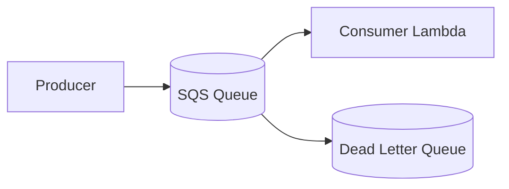
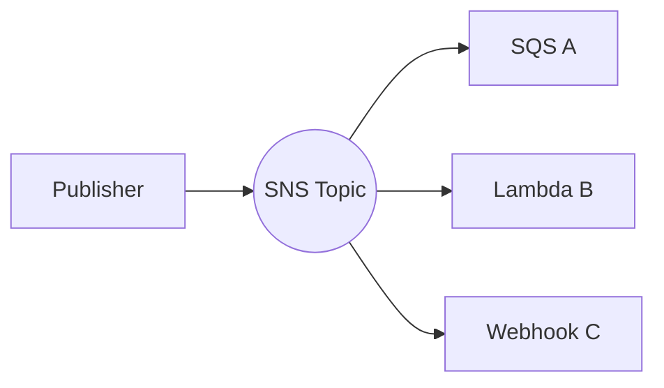

Decoupling services is most of what "doing distributed systems right" entails. Amazon Web Services provides four messaging primitives — Simple Queue Service, Simple Notification Service, EventBridge, and Simple Email Service — that look superficially similar. Pick the wrong one and the team will spend weeks debugging delivery semantics that the other primitive would have solved trivially.

**Acronyms used in this chapter.** Amazon Web Services (AWS), Application Programming Interface (API), Cloud Development Kit (CDK), DomainKeys Identified Mail (DKIM), Dead Letter Queue (DLQ), Domain-based Message Authentication, Reporting, and Conformance (DMARC), Domain Name System (DNS), Elastic Container Service (ECS), First-In, First-Out (FIFO), Hypertext Transfer Protocol (HTTP), Internet of Things (IoT), JavaScript Object Notation (JSON), Sender Policy Framework (SPF), Simple Email Service (SES), Simple Notification Service (SNS), Simple Queue Service (SQS), Software-as-a-Service (SaaS), Short Message Service (SMS), TypeScript (TS), Uniform Resource Locator (URL), User Interface (UI).

## Quick decision

| Use case | Service |
| --- | --- |
| One producer, one consumer, retry & DLQ | **SQS** |
| Fan-out to many consumers (push) | **SNS** |
| Multi-source events with filtering, replay, scheduling | **EventBridge** |
| Send transactional / marketing email | **SES** |
| Real-time streaming (video, IoT) | Kinesis (out of scope) |
| Workflow orchestration | Step Functions (out of scope) |

## SQS — Simple Queue Service

A managed queue.

- **Standard**: at-least-once delivery, best-effort ordering, ~unlimited throughput.
- **FIFO**: exactly-once, strict ordering per `MessageGroupId`, 3,000 msg/s with batching.

The 95% case: Standard.

### Pattern



Producer puts a message; consumer (Lambda, ECS task, anything that polls) pulls it; failed messages move to DLQ after N attempts.

### CDK

```ts
const dlq = new Queue(stack, "Dlq", { retentionPeriod: Duration.days(14) });

const queue = new Queue(stack, "Q", {
  visibilityTimeout: Duration.seconds(30),
  retentionPeriod: Duration.days(4),
  deadLetterQueue: { queue: dlq, maxReceiveCount: 5 },
});

const fn = new NodejsFunction(stack, "Worker", { entry: "src/worker.ts" });
fn.addEventSource(new SqsEventSource(queue, { batchSize: 10 }));
```

### Handler shape

```ts
import type { SQSHandler } from "aws-lambda";

export const handler: SQSHandler = async (event) => {
  const failures: { itemIdentifier: string }[] = [];

  for (const msg of event.Records) {
    try {
      await process(JSON.parse(msg.body));
    } catch (err) {
      console.error("processing failed", { id: msg.messageId, err });
      failures.push({ itemIdentifier: msg.messageId });
    }
  }

  return { batchItemFailures: failures };
};
```

`batchItemFailures` lets you partially fail: only the failed messages are retried, the rest are deleted. Always implement this; otherwise one bad message poisons the entire batch.

### Visibility timeout

When a consumer pulls a message, it becomes invisible for N seconds. If not deleted in that window, it reappears. Set this to **6x your function's timeout** to avoid duplicates from slow processing.

### Long polling

Default `WaitTimeSeconds=20` reduces polling cost and latency. Set it.

## SNS — Simple Notification Service

A managed pub-sub. One topic, many subscribers (Lambda, SQS, HTTP webhook, email, SMS).



### When SNS, when EventBridge?

SNS:

- Simple fan-out, no transformation.
- Cheap.
- HTTP webhook subscriptions.
- SMS/email notifications.

EventBridge:

- Multiple sources (your services, AWS services, third-party SaaS).
- Filtering by event content (not just topic).
- Scheduling.
- Replay.
- Schema registry.
- Higher cost (slightly).

The 2026 trend: EventBridge for the application event bus, SNS for the "I literally need to send a webhook to a URL" cases.

### SNS → SQS fan-out

The pattern: publish to SNS, multiple SQS queues subscribe, each consumer reads its own queue. Each consumer gets durable, retryable delivery without needing the publisher to know.

```ts
const topic = new Topic(stack, "OrdersTopic");

const orderEmailQ = new Queue(stack, "EmailQ");
const orderAnalyticsQ = new Queue(stack, "AnalyticsQ");

topic.addSubscription(new SqsSubscription(orderEmailQ));
topic.addSubscription(new SqsSubscription(orderAnalyticsQ));
```

Now publishing to `OrdersTopic` puts a copy in both queues. Each consumer scales independently.

## EventBridge

A managed event bus with content-based routing, schemas, replay, and direct integrations to ~100 SaaS sources.

### Concepts

- **Bus**: container for events. `default` per account; create custom buses for your app.
- **Event**: JSON with `source`, `detail-type`, `detail`.
- **Rule**: pattern that selects events; targets receive the matched events.

```json
{
  "version": "0",
  "id": "...",
  "detail-type": "OrderPlaced",
  "source": "shop.orders",
  "account": "123456789012",
  "time": "2026-05-04T12:34:56Z",
  "region": "eu-west-1",
  "detail": {
    "orderId": "ord_abc",
    "userId": "usr_xyz",
    "total": 49.99
  }
}
```

### Rule with filtering

```ts
const bus = new EventBus(stack, "AppBus");

new Rule(stack, "HighValueOrders", {
  eventBus: bus,
  eventPattern: {
    source: ["shop.orders"],
    detailType: ["OrderPlaced"],
    detail: { total: [{ numeric: [">=", 100] }] },
  },
  targets: [new LambdaFunction(highValueFn)],
});
```

Only orders ≥ 100 hit the function. Filtering happens in EventBridge — no wasted invocations.

### EventBridge Scheduler

Cron / one-time jobs.

```ts
new Schedule(stack, "DailyDigest", {
  schedule: ScheduleExpression.cron({ hour: "8", minute: "0" }),
  target: new LambdaInvoke(digestFn),
});
```

A single API for scheduling, with timezone support, max 14M schedules per region. Replaces the older "CloudWatch Events scheduled rules".

### Schema registry

Auto-discover schemas from events and generate code bindings (TypeScript, Java, Python). Useful when your event bus has many producers/consumers and you want type-safety.

## SES — Simple Email Service

Outbound email (and limited inbound).

### Setup essentials

1. **Verify domain** (and ideally DKIM-signing keys).
2. **Move out of sandbox**: until verified, you can only send to verified addresses. Request production access (small AWS support form).
3. **Set up SPF + DKIM + DMARC** DNS records — without all three, your mail goes to spam.

### Sending

```ts
import { SESv2Client, SendEmailCommand } from "@aws-sdk/client-sesv2";

const ses = new SESv2Client({});

await ses.send(new SendEmailCommand({
  FromEmailAddress: "no-reply@example.com",
  Destination: { ToAddresses: ["user@example.com"] },
  Content: {
    Simple: {
      Subject: { Data: "Welcome" },
      Body: {
        Text: { Data: "Hi there" },
        Html: { Data: "<h1>Hi</h1>" },
      },
    },
  },
  ConfigurationSetName: "main",
}));
```

### Configuration sets

Per-stream sending settings + event publishing (bounces, complaints, opens) to SNS/Kinesis/CloudWatch. Use them to wire bounces back into your suppression list.

### Reputation

SES tracks your bounce rate and complaint rate. Cross thresholds and AWS pauses your account. To stay healthy:

- Validate emails before sending (use a verifier like ZeroBounce, or just confirm via double-opt-in).
- Honor unsubscribes immediately.
- Keep complaint rate under 0.1%.
- Keep bounce rate under 5%.

### When to use a third-party

For marketing email at scale, Postmark, Resend, SendGrid, Customer.io often offer better deliverability + UI than SES. SES is great for transactional (welcome, password reset) where deliverability matters but volume is moderate.

## Common interviewer scenarios

### "How would you process orders asynchronously?"

```text
Web -> POST /orders -> API GW -> Lambda -> DynamoDB.PutItem
                                    -> SNS Publish OrderPlaced
                                    -> 202 Accepted

OrderPlaced -> SQS:email     -> Email Lambda -> SES
           -> SQS:fulfilment -> Fulfilment Lambda
           -> SQS:analytics  -> Kinesis Firehose -> S3
```

The API does the minimum: persist + publish. Each downstream concern is a separate Lambda reading from its own queue with its own retry/DLQ semantics.

### "How would you fan-out to 10 services?"

EventBridge bus + 10 rules, each targeting one of the consumer Lambdas/queues. New consumer = new rule, no producer changes.

### "How would you debounce/throttle webhook bursts?"

Webhook → SQS (with `MaximumBatchingWindowInSeconds`) → Lambda processes batches.

## Key takeaways

The senior framing for messaging on Amazon Web Services: Simple Queue Service for queues with retry; Simple Notification Service for fan-out; EventBridge for a filtered, multi-source event bus; Simple Email Service for outbound email. Always add a Dead Letter Queue to a Simple Queue Service queue. Use `batchItemFailures` for partial-batch failure on the Lambda plus Simple Queue Service consumer. Use Simple Notification Service to Simple Queue Service fan-out when many independent consumers must each receive durable, retryable copies. Use EventBridge for pattern-based routing and scheduled jobs. Simple Email Service needs Sender Policy Framework, DomainKeys Identified Mail, and Domain-based Message Authentication, Reporting, and Conformance Domain Name System records and a configuration set with bounce handling.

## Common interview questions

1. SQS Standard vs FIFO — when each?
2. SNS vs EventBridge?
3. Why use a DLQ?
4. How does `batchItemFailures` work in a Lambda + SQS consumer?
5. What three DNS records does SES need to avoid spam folders?

## Answers

### 1. SQS Standard vs FIFO — when each?

Simple Queue Service Standard provides at-least-once delivery, best-effort ordering, and effectively unlimited throughput. Messages may occasionally be delivered more than once, and the order is not guaranteed across the queue (consumers must tolerate both duplicates and out-of-order processing). The 95% case is Standard because the throughput is unlimited and the operational characteristics are simple.

Simple Queue Service First-In, First-Out provides exactly-once processing (with deduplication), strict ordering per `MessageGroupId`, and a throughput cap of 3,000 messages per second per Application Programming Interface call (with batching). It is appropriate when ordering matters within a partition (for example, processing all events for one user in the order they occurred) and when duplicates are unacceptable. The throughput cap and higher per-message cost are the trade-offs.

```ts
// Standard queue
new Queue(stack, "Q", { visibilityTimeout: Duration.seconds(30) });

// FIFO queue
new Queue(stack, "Q.fifo", {
  fifo: true,
  contentBasedDeduplication: true,
});
```

**Trade-offs / when this fails.** First-In, First-Out queues' per-`MessageGroupId` ordering means that a single bad message blocks processing of every other message in the same group until it is resolved or moved to the Dead Letter Queue. Standard queues parallelise across all messages, so a bad message blocks only itself. The senior pattern uses Standard queues by default and reaches for First-In, First-Out only when ordering is a hard requirement.

### 2. SNS vs EventBridge?

Simple Notification Service is a simple pub/sub primitive — one topic, many subscribers (Lambda, Simple Queue Service, Hypertext Transfer Protocol webhook, email, Short Message Service). It does no content-based routing, no scheduling, no replay. It is cheap, fast, and operationally simple.

EventBridge is a managed event bus with content-based routing rules, scheduling, replay, schema discovery, and direct integrations with approximately one hundred Software-as-a-Service sources. Rules can filter on event content (`detail.total >= 100`), not just topic, which means EventBridge can fan out the same event to different consumers based on what the event contains. The cost is slightly higher than Simple Notification Service.

```ts
// SNS — flat fan-out
topic.addSubscription(new SqsSubscription(emailQ));
topic.addSubscription(new SqsSubscription(analyticsQ));

// EventBridge — filtered fan-out
new Rule(stack, "HighValue", {
  eventBus: bus,
  eventPattern: { source: ["shop.orders"], detail: { total: [{ numeric: [">=", 100] }] } },
  targets: [new LambdaFunction(highValueFn)],
});
```

**Trade-offs / when this fails.** The 2026 trend is EventBridge for the application's event bus (because filtering, replay, and schema registry are valuable) and Simple Notification Service for "I literally need to send a webhook to a Uniform Resource Locator" cases. For high-throughput simple fan-out, Simple Notification Service is faster and cheaper; for an event bus that the team will extend over time, EventBridge is the better foundation.

### 3. Why use a DLQ?

A Dead Letter Queue captures messages that have failed processing more than the configured number of times. Without a Dead Letter Queue, failed messages either remain in the source queue (continuously retried, blocking the consumer's progress and accumulating cost) or are silently dropped (depending on the source's retry semantics). Either failure mode hides the problem; the Dead Letter Queue makes it visible.

```ts
const dlq = new Queue(stack, "Dlq", { retentionPeriod: Duration.days(14) });
const queue = new Queue(stack, "Q", {
  deadLetterQueue: { queue: dlq, maxReceiveCount: 5 },
});
```

The senior pattern: a Dead Letter Queue per source queue, a CloudWatch alarm on `ApproximateNumberOfMessagesVisible > 0` for the Dead Letter Queue, and a runbook that describes how to inspect and replay failed messages once the underlying issue is fixed.

**Trade-offs / when this fails.** A Dead Letter Queue without monitoring is barely better than no Dead Letter Queue — the messages accumulate silently. The alarm is non-negotiable. After the underlying issue is fixed, the team can replay the messages back into the source queue (Simple Queue Service has a built-in `StartMessageMoveTask` Application Programming Interface for this) or process them with a one-off script.

### 4. How does batchItemFailures work in a Lambda + SQS consumer?

By default, when a Lambda function processes a Simple Queue Service batch and throws an error, the entire batch is returned to the queue and retried. This means one bad message poisons the entire batch — the other messages succeed in processing but are still re-delivered, leading to duplicate work.

`batchItemFailures` is the partial-batch response mechanism: the Lambda returns a list of message identifiers that failed, and only those messages are retried; the rest are deleted from the queue. The function processes each message individually inside a `try`/`catch`, accumulates failures, and returns them as `{ batchItemFailures: [{ itemIdentifier: messageId }, ...] }`.

```ts
export const handler: SQSHandler = async (event) => {
  const failures: { itemIdentifier: string }[] = [];
  for (const msg of event.Records) {
    try {
      await process(JSON.parse(msg.body));
    } catch {
      failures.push({ itemIdentifier: msg.messageId });
    }
  }
  return { batchItemFailures: failures };
};
```

**Trade-offs / when this fails.** The function must report failures correctly — returning an empty `batchItemFailures` when a message failed deletes the failed message instead of retrying it. The team should test the partial-failure behaviour explicitly, because it is the difference between robust processing and silent data loss. The Lambda function configuration must enable the partial-batch response feature (`reportBatchItemFailures` in the event source mapping).

### 5. What three DNS records does SES need to avoid spam folders?

Sender Policy Framework, DomainKeys Identified Mail, and Domain-based Message Authentication, Reporting, and Conformance. Without all three, the application's mail will be filtered to spam by every major provider.

Sender Policy Framework is a TXT record listing the Internet Protocol addresses (or sending services) authorised to send mail for the domain. The receiving server checks the sending Internet Protocol address against the record and rejects mismatches.

```text
example.com.    TXT    "v=spf1 include:amazonses.com ~all"
```

DomainKeys Identified Mail is a public key published as a TXT record at a service-prefixed subdomain. Outgoing mail is signed with the corresponding private key, and the receiving server verifies the signature against the public key. Simple Email Service generates the keys and the team adds the records.

```text
abcdef._domainkey.example.com.    CNAME    abcdef.dkim.amazonses.com.
```

Domain-based Message Authentication, Reporting, and Conformance is a TXT record that tells receiving servers what to do when Sender Policy Framework or DomainKeys Identified Mail fails (`p=none` for monitoring only, `p=quarantine` for spam folder, `p=reject` for outright rejection) and where to send aggregate reports.

```text
_dmarc.example.com.    TXT    "v=DMARC1; p=quarantine; rua=mailto:dmarc@example.com"
```

**Trade-offs / when this fails.** Many teams set up Sender Policy Framework and DomainKeys Identified Mail but skip Domain-based Message Authentication, Reporting, and Conformance, leaving the policy unenforced. The senior pattern is to start with `p=none` (monitor reports for false positives) and progress to `p=quarantine` and `p=reject` as confidence builds. Reputation, complaint rate (less than 0.1%), and bounce rate (less than 5%) are equally important; even with all three records, a high complaint rate gets the sending account paused.

## Further reading

- [SQS best practices](https://docs.aws.amazon.com/AWSSimpleQueueService/latest/SQSDeveloperGuide/sqs-best-practices.html).
- [EventBridge user guide](https://docs.aws.amazon.com/eventbridge/latest/userguide/eb-what-is.html).
- [SES sending best practices](https://docs.aws.amazon.com/ses/latest/dg/best-practices.html).
