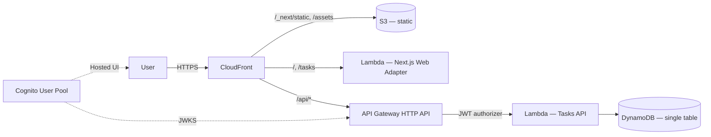
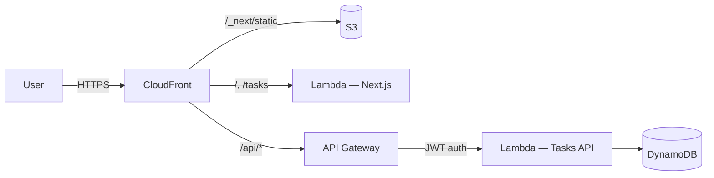

This is the capstone chapter for [Part 12 (AWS for Frontend Engineers)](./index.md): a real-shaped deployment combining the primitives covered earlier. The chapter walks through deploying a "Tasks" application — a Next.js User Interface, a Hypertext Transfer Protocol Application Programming Interface on Lambda, persistence in DynamoDB, and authentication via Cognito.

The full Cloud Development Kit source lives in [`code/aws-samples/`](https://github.com/Dejaaaan/senior-fe-interview-book/tree/main/code/aws-samples).

**Acronyms used in this chapter.** Application Programming Interface (API), Amazon Web Services (AWS), Amazon Web Services Certificate Manager (ACM), Cloud Development Kit (CDK), Continuous Integration / Continuous Delivery (CI/CD), Database (DB), DynamoDB (DDB), Embedded Metric Format (EMF), Global Secondary Index (GSI), Hypertext Transfer Protocol (HTTP), Hypertext Transfer Protocol Secure (HTTPS), Identity and Access Management (IAM), Infrastructure as Code (IaC), JSON Web Token (JWT), Monthly Active User (MAU), OpenID Connect (OIDC), Pull Request (PR), Relational Database Service (RDS), Software-as-a-Service (SaaS), Server-Side Rendering (SSR), Simple Storage Service (S3), Single-Page Application (SPA), Software Development Kit (SDK), Systems Manager (SSM), Transport Layer Security (TLS), User Interface (UI), Uniform Resource Locator (URL), Virtual Private Cloud (VPC), Web Application Firewall (WAF).

## Architecture



Layers:

- **CloudFront**: TLS, edge cache, single origin.
- **S3**: static assets (`_next/static/`, `public/`).
- **Lambda Web Adapter**: runs the Next.js server (App Router) on Lambda. Built and packaged as a container image via OpenNext.
- **API Gateway HTTP API**: routes `/api/tasks/*` → Tasks Lambda, with JWT authorizer pointing to Cognito.
- **DynamoDB**: single-table; PK = `USER#<id>`, SK = `TASK#<id>`.
- **Cognito User Pool**: Hosted UI for sign-in.

## Repository layout

```text
code/aws-samples/
├── cdk/
│   ├── bin/app.ts
│   ├── lib/
│   │   ├── data-stack.ts          # DynamoDB + Cognito
│   │   ├── api-stack.ts           # API GW + Lambda
│   │   └── web-stack.ts           # CloudFront + S3 + Next.js Lambda
│   ├── cdk.json
│   └── package.json
├── api/
│   ├── src/
│   │   ├── handler.ts
│   │   ├── tasks-repo.ts
│   │   └── auth.ts
│   └── package.json
└── web/                            # Next.js app (uses the API)
    ├── app/...
    └── package.json
```

## DynamoDB schema (single-table)

```text
PK              SK                Entity   Attributes
USER#<userId>   PROFILE           user     email, name, createdAt
USER#<userId>   TASK#<taskId>     task     title, done, priority, createdAt, updatedAt

GSI1 (by status):
  PK = USER#<userId>
  SK = STATUS#<done|todo>#<createdAt>
```

Access patterns:

1. List all tasks for a user, newest first.
2. List a user's open tasks (status = todo).
3. Get one task.
4. Create / update / delete a task.

## CDK — the data stack

```ts
import { Stack, RemovalPolicy } from "aws-cdk-lib";
import { Table, AttributeType, BillingMode, ProjectionType } from "aws-cdk-lib/aws-dynamodb";
import { UserPool, AccountRecovery, OAuthScope } from "aws-cdk-lib/aws-cognito";

export class DataStack extends Stack {
  public readonly table: Table;
  public readonly userPool: UserPool;
  public readonly userPoolClient: UserPoolClient;

  constructor(scope: Construct, id: string, props?: StackProps) {
    super(scope, id, props);

    this.table = new Table(this, "AppTable", {
      partitionKey: { name: "PK", type: AttributeType.STRING },
      sortKey: { name: "SK", type: AttributeType.STRING },
      billingMode: BillingMode.PAY_PER_REQUEST,
      pointInTimeRecovery: true,
      removalPolicy: RemovalPolicy.RETAIN,
    });

    this.table.addGlobalSecondaryIndex({
      indexName: "GSI1",
      partitionKey: { name: "PK", type: AttributeType.STRING },
      sortKey: { name: "GSI1SK", type: AttributeType.STRING },
      projectionType: ProjectionType.ALL,
    });

    this.userPool = new UserPool(this, "Users", {
      selfSignUpEnabled: true,
      signInAliases: { email: true },
      autoVerify: { email: true },
      passwordPolicy: { minLength: 12, requireDigits: true, requireSymbols: true, requireUppercase: true },
      accountRecovery: AccountRecovery.EMAIL_ONLY,
      removalPolicy: RemovalPolicy.RETAIN,
    });

    const domain = this.userPool.addDomain("Domain", {
      cognitoDomain: { domainPrefix: "tasks-app-prod" },
    });

    this.userPoolClient = this.userPool.addClient("WebClient", {
      generateSecret: false,
      oAuth: {
        flows: { authorizationCodeGrant: true },
        scopes: [OAuthScope.OPENID, OAuthScope.EMAIL, OAuthScope.PROFILE],
        callbackUrls: ["https://app.example.com/auth/callback"],
        logoutUrls: ["https://app.example.com"],
      },
    });
  }
}
```

## CDK — the API stack

```ts
import { HttpApi, HttpMethod, CorsHttpMethod } from "aws-cdk-lib/aws-apigatewayv2";
import { HttpLambdaIntegration } from "aws-cdk-lib/aws-apigatewayv2-integrations";
import { HttpJwtAuthorizer } from "aws-cdk-lib/aws-apigatewayv2-authorizers";
import { NodejsFunction } from "aws-cdk-lib/aws-lambda-nodejs";
import { Architecture, Runtime, Tracing } from "aws-cdk-lib/aws-lambda";

export class ApiStack extends Stack {
  public readonly api: HttpApi;

  constructor(scope: Construct, id: string, props: ApiStackProps) {
    super(scope, id, props);

    const tasksFn = new NodejsFunction(this, "TasksFn", {
      entry: "../api/src/handler.ts",
      runtime: Runtime.NODEJS_22_X,
      architecture: Architecture.ARM_64,
      memorySize: 1024,
      tracing: Tracing.ACTIVE,
      bundling: { minify: true, sourceMap: true, externalModules: ["@aws-sdk/*"] },
      environment: {
        TABLE_NAME: props.table.tableName,
      },
    });
    props.table.grantReadWriteData(tasksFn);

    this.api = new HttpApi(this, "Api", {
      corsPreflight: {
        allowOrigins: ["https://app.example.com"],
        allowMethods: [
          CorsHttpMethod.GET, CorsHttpMethod.POST,
          CorsHttpMethod.PATCH, CorsHttpMethod.DELETE,
        ],
        allowHeaders: ["Content-Type", "Authorization"],
        allowCredentials: true,
      },
    });

    const issuer = `https://cognito-idp.${this.region}.amazonaws.com/${props.userPoolId}`;
    const authorizer = new HttpJwtAuthorizer("Auth", issuer, {
      jwtAudience: [props.userPoolClientId],
    });

    const integration = new HttpLambdaIntegration("TasksInt", tasksFn);

    this.api.addRoutes({
      path: "/api/tasks",
      methods: [HttpMethod.GET, HttpMethod.POST],
      integration,
      authorizer,
    });

    this.api.addRoutes({
      path: "/api/tasks/{id}",
      methods: [HttpMethod.GET, HttpMethod.PATCH, HttpMethod.DELETE],
      integration,
      authorizer,
    });
  }
}
```

## API handler (Lambda)

```ts
import type { APIGatewayProxyHandlerV2WithJWTAuthorizer } from "aws-lambda";
import { z } from "zod";
import { TasksRepo } from "./tasks-repo";

const repo = new TasksRepo(process.env.TABLE_NAME!);

const TaskCreate = z.object({
  title: z.string().min(1).max(120),
  priority: z.enum(["low", "med", "high"]).default("med"),
});

const TaskPatch = TaskCreate.partial().extend({
  done: z.boolean().optional(),
});

export const handler: APIGatewayProxyHandlerV2WithJWTAuthorizer = async (event) => {
  const userId = event.requestContext.authorizer.jwt.claims.sub as string;
  const method = event.requestContext.http.method;
  const path = event.rawPath;
  const id = (event.pathParameters?.id ?? "").trim();

  try {
    if (method === "GET" && path === "/api/tasks") {
      const status = (event.queryStringParameters?.status ?? "all") as "all" | "done" | "todo";
      const limit = Math.min(Number(event.queryStringParameters?.limit ?? 50), 100);
      const cursor = event.queryStringParameters?.cursor;
      const result = await repo.list(userId, { status, limit, cursor });
      return ok(result);
    }

    if (method === "POST" && path === "/api/tasks") {
      const body = TaskCreate.parse(JSON.parse(event.body ?? "{}"));
      const task = await repo.create(userId, body);
      return ok(task, 201);
    }

    if (method === "GET" && id) {
      const task = await repo.get(userId, id);
      return task ? ok(task) : notFound();
    }

    if (method === "PATCH" && id) {
      const body = TaskPatch.parse(JSON.parse(event.body ?? "{}"));
      const task = await repo.update(userId, id, body);
      return task ? ok(task) : notFound();
    }

    if (method === "DELETE" && id) {
      const removed = await repo.remove(userId, id);
      return removed ? noContent() : notFound();
    }

    return notFound();
  } catch (err) {
    if (err instanceof z.ZodError) {
      return problem(400, "validation", "Validation failed", { issues: err.issues });
    }
    console.error("unhandled", err);
    return problem(500, "internal", "Internal error");
  }
};

function ok(body: unknown, status = 200) { return { statusCode: status, headers: jsonHeaders, body: JSON.stringify(body) }; }
function noContent() { return { statusCode: 204, headers: jsonHeaders, body: "" }; }
function notFound() { return problem(404, "not-found", "Not found"); }
function problem(status: number, type: string, title: string, extras?: Record<string, unknown>) {
  return { statusCode: status, headers: { ...jsonHeaders, "content-type": "application/problem+json" }, body: JSON.stringify({ type: `https://errors.example.com/${type}`, title, status, ...extras }) };
}
const jsonHeaders = { "content-type": "application/json" };
```

## Repository (DynamoDB)

```ts
import { DynamoDBClient } from "@aws-sdk/client-dynamodb";
import { DynamoDBDocumentClient, GetCommand, PutCommand, QueryCommand, UpdateCommand, DeleteCommand } from "@aws-sdk/lib-dynamodb";

const ddb = DynamoDBDocumentClient.from(new DynamoDBClient({}));

type ListOpts = { status: "all" | "done" | "todo"; limit: number; cursor?: string };

export class TasksRepo {
  constructor(private table: string) {}

  pk(userId: string) { return `USER#${userId}`; }
  sk(taskId: string) { return `TASK#${taskId}`; }
  gsi1Sk(done: boolean, createdAt: string) { return `STATUS#${done ? "done" : "todo"}#${createdAt}`; }

  async list(userId: string, { status, limit, cursor }: ListOpts) {
    const useGsi = status !== "all";
    const params = useGsi
      ? {
          IndexName: "GSI1",
          KeyConditionExpression: "PK = :pk AND begins_with(GSI1SK, :prefix)",
          ExpressionAttributeValues: {
            ":pk": this.pk(userId),
            ":prefix": `STATUS#${status === "done" ? "done" : "todo"}#`,
          },
        }
      : {
          KeyConditionExpression: "PK = :pk AND begins_with(SK, :prefix)",
          ExpressionAttributeValues: { ":pk": this.pk(userId), ":prefix": "TASK#" },
        };

    const r = await ddb.send(new QueryCommand({
      TableName: this.table,
      ScanIndexForward: false,
      Limit: limit,
      ExclusiveStartKey: cursor ? JSON.parse(Buffer.from(cursor, "base64").toString("utf8")) : undefined,
      ...params,
    }));

    return {
      items: (r.Items ?? []).map((i) => this.toTask(i)),
      cursor: r.LastEvaluatedKey ? Buffer.from(JSON.stringify(r.LastEvaluatedKey)).toString("base64") : null,
    };
  }

  async get(userId: string, id: string) {
    const r = await ddb.send(new GetCommand({ TableName: this.table, Key: { PK: this.pk(userId), SK: this.sk(id) } }));
    return r.Item ? this.toTask(r.Item) : null;
  }

  async create(userId: string, input: { title: string; priority: "low" | "med" | "high" }) {
    const id = crypto.randomUUID();
    const now = new Date().toISOString();
    const item = {
      PK: this.pk(userId), SK: this.sk(id),
      GSI1SK: this.gsi1Sk(false, now),
      taskId: id, title: input.title, priority: input.priority,
      done: false, createdAt: now, updatedAt: now, version: 1,
    };
    await ddb.send(new PutCommand({ TableName: this.table, Item: item, ConditionExpression: "attribute_not_exists(PK)" }));
    return this.toTask(item);
  }

  async update(userId: string, id: string, patch: { title?: string; priority?: "low" | "med" | "high"; done?: boolean }) {
    const existing = await this.get(userId, id);
    if (!existing) return null;

    const now = new Date().toISOString();
    const next = { ...existing, ...patch, updatedAt: now };
    const newSk = this.gsi1Sk(next.done, existing.createdAt);

    await ddb.send(new UpdateCommand({
      TableName: this.table,
      Key: { PK: this.pk(userId), SK: this.sk(id) },
      UpdateExpression: "SET title = :t, priority = :p, done = :d, updatedAt = :u, GSI1SK = :g, version = version + :one",
      ConditionExpression: "version = :v",
      ExpressionAttributeValues: {
        ":t": next.title, ":p": next.priority, ":d": next.done, ":u": now,
        ":g": newSk, ":one": 1, ":v": existing.version,
      },
    }));
    return next;
  }

  async remove(userId: string, id: string) {
    try {
      await ddb.send(new DeleteCommand({
        TableName: this.table,
        Key: { PK: this.pk(userId), SK: this.sk(id) },
        ConditionExpression: "attribute_exists(PK)",
      }));
      return true;
    } catch { return false; }
  }

  private toTask(i: Record<string, unknown>) {
    return {
      id: i.taskId as string,
      title: i.title as string,
      priority: i.priority as "low" | "med" | "high",
      done: i.done as boolean,
      createdAt: i.createdAt as string,
      updatedAt: i.updatedAt as string,
      version: i.version as number,
    };
  }
}
```

## Web stack — CloudFront + Next.js on Lambda

For a fully-AWS Next.js deploy, [OpenNext](https://opennext.js.org/) does the bundling: it builds a Lambda for the SSR/Server Components and a separate Lambda for `next/image`, uploads `_next/static/*` and `public/*` to S3, and wires CloudFront with the right cache behaviours.

```ts
// web-stack.ts (sketch)
import { OpenNextCdkReferenceImplementation } from "open-next-cdk";

export class WebStack extends Stack {
  constructor(scope: Construct, id: string, props: WebStackProps) {
    super(scope, id, props);

    new OpenNextCdkReferenceImplementation(this, "Site", {
      openNextPath: "../web/.open-next",
      domain: { name: "app.example.com", certificate: props.certificate, hostedZone: props.zone },
      environment: {
        NEXT_PUBLIC_API_URL: props.apiUrl,
        NEXT_PUBLIC_COGNITO_DOMAIN: props.cognitoDomain,
        NEXT_PUBLIC_COGNITO_CLIENT_ID: props.cognitoClientId,
      },
    });
  }
}
```

If you don't want OpenNext, the alternative is Vercel for the Next.js side and CDK for the API/data side. That's a perfectly senior choice — no need to do everything on AWS.

## Deploy order

1. `cdk deploy DataStack` — creates the table and Cognito pool.
2. `cdk deploy ApiStack` — needs table ARN and pool from step 1.
3. Build the Next.js app pointing to the API URL.
4. `cdk deploy WebStack` — uploads to S3 and creates CloudFront.

Cross-stack references via stack outputs / SSM Parameter Store keep stacks loosely coupled (you can redeploy data without touching the web stack).

## CI/CD

GitHub Actions, OIDC federation to AWS, deploy on `main`:

```yaml
name: Deploy
on:
  push:
    branches: [main]

permissions:
  id-token: write
  contents: read

jobs:
  deploy:
    runs-on: ubuntu-latest
    steps:
      - uses: actions/checkout@v5
      - uses: pnpm/action-setup@v4
      - uses: actions/setup-node@v4
        with: { node-version: 22 }
      - run: pnpm install --frozen-lockfile
      - run: pnpm test
      - uses: aws-actions/configure-aws-credentials@v4
        with:
          role-to-assume: arn:aws:iam::111122223333:role/GHA-Deploy
          aws-region: eu-west-1
      - run: pnpm --filter web build
      - run: pnpm --filter web run open-next
      - run: pnpm --filter cdk deploy --all --require-approval never
```

## Costs (rough, EU region, low traffic)

| Service | Cost |
| --- | --- |
| CloudFront | $0 (free tier) → $5-20 |
| S3 | $0.50 |
| Lambda | $0 (free tier) → $1-5 |
| API GW HTTP API | $1 / million requests |
| DynamoDB On-Demand | $0.25 / million writes, $0.05 / million reads |
| Cognito | Free up to 50k MAU |
| ACM, Route 53 | $0.50/month per zone |

A small SaaS easily fits under $50/month. Scale linearly.

## Senior framing in interviews

When asked "design a Next.js application on Amazon Web Services", the senior answer in one paragraph names the right primitives without over-engineering:

> "I would put CloudFront in front, Simple Storage Service for static assets, OpenNext-packaged Lambda for the Next.js server. Application Programming Interface Gateway HTTP API plus Lambda for the Application Programming Interface layer; Cognito plus Hosted User Interface for authentication; DynamoDB single-table for persistence. Cloud Development Kit for Infrastructure as Code; GitHub Actions with OpenID Connect federation for Continuous Integration and Continuous Delivery. CloudWatch with Embedded Metric Format for metrics; X-Ray for tracing. Web Application Firewall managed rules at the edge. Costs scale per-request and per-megabyte; mostly free at small scale."

## Key takeaways

The reference shape for a senior-built Amazon Web Services frontend application: CloudFront in front of Simple Storage Service plus Lambda for Next.js; Application Programming Interface Gateway plus Lambda fronting DynamoDB. OpenNext bridges Next.js to Lambda plus CloudFront. Cross-stack outputs and Systems Manager Parameter Store keep deploys decoupled. Cloud Development Kit plus GitHub Actions OpenID Connect federation eliminates long-lived secrets. Costs scale per-request — friendly to small projects.

## Common interview questions

1. Sketch a Next.js + API + DDB deployment on AWS.
2. Why DynamoDB over RDS for this app?
3. How do you avoid long-lived AWS credentials in CI?
4. How do you handle CloudFront + Lambda for Next.js — what is OpenNext doing?
5. How do you scale this to multi-region?

## Answers

### 1. Sketch a Next.js + API + DDB deployment on AWS.

The senior reference architecture: CloudFront in front for Transport Layer Security termination, edge caching, and Web Application Firewall integration; Simple Storage Service for static assets (`_next/static/`, `public/*`); OpenNext-packaged Lambda for the Next.js server (Server Components, Server Actions, server-rendered pages); Application Programming Interface Gateway HTTP API plus Lambda for the Application Programming Interface layer with the JSON Web Token authorizer pointing at Cognito; DynamoDB single-table for persistence; Cognito User Pool with Hosted User Interface for authentication; CloudWatch and X-Ray for observability; Cloud Development Kit for Infrastructure as Code; GitHub Actions with OpenID Connect federation for deployment.



The deployment splits into three Cloud Development Kit stacks: a data stack (DynamoDB plus Cognito), an Application Programming Interface stack (Application Programming Interface Gateway plus Lambda), and a web stack (CloudFront plus Simple Storage Service plus Next.js Lambda). Cross-stack outputs keep the dependencies explicit.

**Trade-offs / when this fails.** This shape is appropriate for a small-to-medium Software-as-a-Service product. For larger products with multi-region requirements, the architecture extends to multi-region DynamoDB Global Tables and CloudFront with origin failover. For products with predictable steady-state traffic, Elastic Container Service Fargate or Elastic Compute Cloud may be cheaper than Lambda; the senior choice depends on the traffic profile.

### 2. Why DynamoDB over RDS for this app?

DynamoDB suits an application with known, simple access patterns (get one task, list a user's tasks, update a task) at predictable single-digit-millisecond latency, with pay-per-use pricing that scales to zero. The application has no joins (every task belongs to a user, modeled as `PK=USER#<id>, SK=TASK#<id>`), no ad-hoc analytical queries, and no operational overhead — DynamoDB requires no patching, no scaling decisions, and no Virtual Private Cloud configuration.

Relational Database Service Aurora PostgreSQL would suit an application that needs ad-hoc queries, complex joins across many entities, transactional patterns spanning many rows, or a relational data model the team is more familiar with. The trade-off is operational complexity: a Virtual Private Cloud, security groups, parameter groups, instance sizing, patching schedules, backup management, and the per-hour cost of the instance even at zero traffic.

```text
DynamoDB         — Known patterns, scale-to-zero, no ops, ms latency.
RDS / Aurora     — Ad-hoc queries, joins, transactional patterns.
```

For a "Tasks" application with a small, well-defined data model and unpredictable load, DynamoDB is the better fit. If the application later grows to support analytics, project relationships, and complex search, the team would either add OpenSearch alongside DynamoDB or migrate to a relational database; the migration cost is non-trivial but is incurred only when the access patterns genuinely require it.

**Trade-offs / when this fails.** If the access patterns are not well understood at design time, DynamoDB can lock the team into a model that resists product changes. Senior pattern: validate that the access patterns fit before committing.

### 3. How do you avoid long-lived AWS credentials in CI?

Use OpenID Connect federation between the Continuous Integration provider (GitHub Actions, GitLab Continuous Integration) and Amazon Web Services. The Continuous Integration provider issues a short-lived OpenID Connect token for each workflow run; Amazon Web Services trusts the provider's OpenID Connect issuer as a federated identity provider; the team creates an Identity and Access Management role with a trust policy that accepts assumption from tokens matching specific repository and branch claims.

```yaml
- uses: aws-actions/configure-aws-credentials@v4
  with:
    role-to-assume: arn:aws:iam::111122223333:role/GHA-Deploy
    aws-region: eu-west-1
```

The trust policy validates the OpenID Connect token's audience (`sts.amazonaws.com`) and subject claim (`repo:my-org/my-repo:ref:refs/heads/main`), so only deploys from the protected branch can assume the role. No long-lived access keys are stored anywhere.

**Trade-offs / when this fails.** OpenID Connect federation requires the team to configure the OpenID Connect provider once per Amazon Web Services account and to write the trust policy carefully. The benefits are substantial: nothing to rotate, audit-able authentication via the OpenID Connect token claims, per-repository or per-branch access control. The same pattern applies to GitLab, Buildkite, and other Continuous Integration providers that support OpenID Connect.

### 4. How do you handle CloudFront + Lambda for Next.js — what is OpenNext doing?

OpenNext is an open-source adapter that packages a Next.js application for deployment on Amazon Web Services Lambda plus CloudFront plus Simple Storage Service. It analyses the Next.js build output (`.next/`) and produces multiple artefacts: a Lambda function for Server-Side Rendering, Server Components, and Server Actions; a separate Lambda for `next/image` optimisation; pre-rendered Hypertext Markup Language for static routes; static assets uploaded to Simple Storage Service; and the CloudFront cache behaviours that route requests appropriately.

The senior framing: Next.js's framework conventions assume a long-running Node.js server with a filesystem cache. OpenNext translates these conventions to the Lambda model — the Lambda Web Adapter runs the Next.js server inside the Lambda's container, the cache moves to DynamoDB or Simple Storage Service, the Image Optimisation Application Programming Interface becomes a separate Lambda, and the static assets become Simple Storage Service objects served by CloudFront. The result is that the Next.js application runs unmodified on Amazon Web Services with the team owning every piece of the infrastructure.

```ts
new OpenNextCdkReferenceImplementation(this, "Site", {
  openNextPath: "../web/.open-next",
  domain: { name: "app.example.com", certificate: props.certificate, hostedZone: props.zone },
  environment: {
    NEXT_PUBLIC_API_URL: props.apiUrl,
  },
});
```

**Trade-offs / when this fails.** OpenNext is the open path; the alternative is to host on Vercel (which knows Next.js intimately and has the simplest operations) or to self-host Next.js on a long-running Node.js server (Elastic Container Service Fargate, Elastic Compute Cloud) with custom infrastructure. OpenNext suits teams that want Lambda's pay-per-use pricing and Amazon-Web-Services-native operations; Vercel suits teams that want zero infrastructure management; self-hosted Node.js suits teams with predictable traffic that benefits from a warm runtime.

### 5. How do you scale this to multi-region?

The architecture extends to multi-region with several changes. DynamoDB becomes a Global Table replicated to multiple regions; reads are local to each region (low latency), writes propagate asynchronously across regions with eventual consistency. CloudFront uses origin failover to route to a healthy regional Application Programming Interface Gateway when the primary fails. Route 53 latency-based routing directs each user to the nearest healthy region. Cognito User Pools become per-region with cross-region Authentication via federation, or a single primary pool replicated to a backup region for disaster recovery.

```text
Region A (primary)               Region B (failover)
  CloudFront -> API GW -> Lambda    CloudFront -> API GW -> Lambda
                       |                                 |
                       v                                 v
              DynamoDB Global Table  <===replication===>
```

The senior framing: multi-region is a substantial increase in operational complexity and cost. The team should be confident that the resilience benefits justify the trade-offs before pursuing it. Most products start single-region with multi-region as a roadmap item triggered by enterprise customer requirements, regulatory constraints, or growth that exceeds a single region's reliability needs.

**Trade-offs / when this fails.** Multi-region introduces eventual consistency in DynamoDB (a write in Region A may not be visible in Region B for hundreds of milliseconds), cross-region cost (data transfer between regions is billed), and the operational overhead of running and observing multiple regions. The structural alternative for resilience is a single-region deployment with strong intra-region redundancy (multiple Availability Zones, automatic failover within the region), which is sufficient for most applications.

## Further reading

- [OpenNext docs](https://opennext.js.org/).
- [AWS Solutions Library — Serverless Web App](https://aws.amazon.com/solutions/implementations/serverless-image-handler/).
- [The Serverless Patterns Collection](https://serverlessland.com/patterns).
