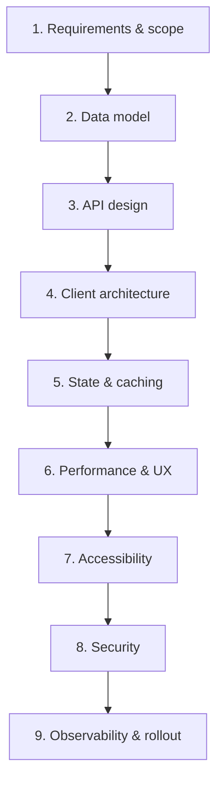
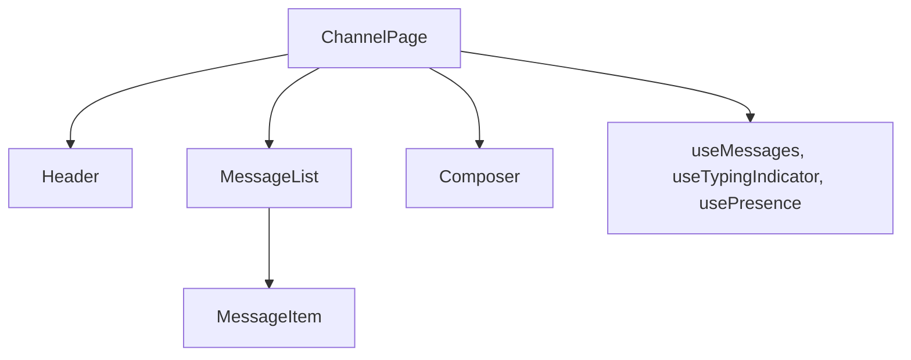

Frontend system design is not backend system design. The interviewer is not looking for the candidate to draw load balancers and Kafka clusters; the interviewer wants to know how the candidate would build a non-trivial **client** application — the structure of the React or Angular tree, the state and caching strategy, the rendering decisions, the accessibility plan, the observability hooks.

**Acronyms used in this chapter.** Application Programming Interface (API), Cumulative Layout Shift (CLS), Cross-Origin Resource Sharing (CORS), Cross-Site Request Forgery (CSRF), Content Security Policy (CSP), Daily Active User (DAU), General Data Protection Regulation (GDPR), GraphQL Subscriptions over WebSocket (GraphQL WS), Hypertext Transfer Protocol (HTTP), Identity and Access Management (IAM), Interaction to Next Paint (INP), Largest Contentful Paint (LCP), Minimum Viable Product / Proof of Concept (MVP/POC), Personally Identifiable Information (PII), Real User Monitoring (RUM), React Server Component (RSC), Representational State Transfer (REST), Server-Side Rendering (SSR), Single-Page Application (SPA), TanStack Query (formerly React Query), Time-to-Interactive (TTI), Time to First Byte (TTFB), Universally Unique Identifier (UUID), User Experience (UX), Web Accessibility Initiative — Accessible Rich Internet Applications (WAI-ARIA), Web Content Accessibility Guidelines (WCAG), WebSocket (WS).

A senior-quality answer to a frontend system-design prompt is structured (the candidate does not ramble); driven by requirements (not by buzzwords); aware of the trade-offs being made and willing to name them aloud; and honest about what the candidate would defer to a later iteration. The framework that follows is the structural skeleton; the candidate's judgement and depth fill in the muscle.

## The framework: nine sections

Memorise these. Walk through them in order. Adapt depth based on time and the interviewer's interest.



Spend 5 minutes on (1) before touching (2). Most failures are "you started designing before clarifying".

## 1. Requirements & scope (5 minutes — the most important)

Ask. Out loud. Write each answer.

- **Who is the user?** B2C, B2B, internal? What's their device profile?
- **What do they do?** List the top 3-5 user actions. Out-of-scope is as important as in-scope.
- **Scale.** DAU, peak QPS, payload sizes, growth rate.
- **Constraints.** Latency budgets, offline support, browser matrix, device constraints (low-end mobile?), regions.
- **Existing context.** Brownfield (existing app)? Greenfield? Stack constraints? Team size?
- **Definition of done.** "Working POC" vs "production-ready". You'll allocate effort accordingly.

Write the **functional requirements** (what it does) and **non-functional** (latency, availability, accessibility) explicitly. Confirm with the interviewer before moving on.

## 2. Data model

What entities exist, what are their relationships, what shape is sent over the wire?

```text
User { id, name, avatarUrl }
Message { id, channelId, authorId, text, ts, edits?, reactions[] }
Channel { id, name, members[], lastReadTs }
```

Decide:

- Server format vs client format (do you transform on read?).
- Identifiers (UUIDs, content-addressable hashes, server-allocated incrementing IDs).
- Time fields (UTC ISO strings, ms since epoch).
- Pagination shape (cursors, not offsets — see [Part 9 chapter 2](../09-rest-and-networking/02-pagination-filtering.md)).

## 3. API design

Sketch the REST/GraphQL/tRPC endpoints. Don't enumerate every CRUD; show the interesting ones.

```text
GET    /channels/:id/messages?cursor&limit   # paginated history
POST   /channels/:id/messages                # send (Idempotency-Key)
PATCH  /messages/:id                          # edit
DELETE /messages/:id

WS     /ws                                    # subscribe { channelId } for realtime
```

State the protocol: REST + WebSocket for chat; GraphQL with subscriptions for a complex collaborative app; tRPC if it's all internal and TypeScript.

Discuss:

- Auth (cookie? Bearer? both?).
- Idempotency.
- Caching headers (ETag, Cache-Control).
- Rate limiting.

## 4. Client architecture

The structure of the React/Angular/Next.js app.



State which:

- Routes (URL is state — what's encoded?).
- Components (top-level + reusable primitives).
- Custom hooks / services for cross-cutting logic.
- Where SSR vs SPA-only renders.
- Module boundaries (feature folders, monorepo split).

## 5. State & caching

The most undervalued section. Cover:

- **Server state**: TanStack Query / SWR / Apollo / built-in. How long is cached? Invalidation triggers? Optimistic updates?
- **Client state**: local component state vs URL vs global store (Zustand/Redux/Context).
- **Cache layers**: in-memory, IndexedDB for offline, service worker for HTTP cache.
- **Sync between clients**: WebSocket → invalidate query keys.
- **Pagination**: cursor-based with prefetch on scroll.
- **Optimistic UI**: write to local cache immediately; reconcile on server response; rollback on error.

## 6. Performance & UX

- **Loading**: skeleton, suspense, progressive hydration.
- **Time to interactive**: code-splitting, prefetch on hover, critical CSS inlined.
- **Core Web Vitals**: LCP target, INP under 200ms, CLS near 0. How would you measure (RUM)?
- **Lists**: virtualization above ~100 items.
- **Images**: AVIF/WebP, responsive `srcset`, `loading="lazy"`, `decoding="async"`.
- **Rendering strategy**: SSR? RSC? Static at build? Edge?
- **Network**: `prefetch` hints, HTTP/2 push (rare in 2026), compression.
- **Animation budgets**: 60 fps; reduce work on the main thread.

## 7. Accessibility

State the WCAG target (2.2 AA). Cover:

- Keyboard nav for the primary flow.
- Focus management on route change / modal open.
- Live regions for async updates (`aria-live="polite"`).
- Form labels / error association.
- Contrast & reduced-motion preference.
- Screen-reader testing in CI (axe).

For chat-style apps: announcing new messages politely; for dashboards: keyboard shortcuts; for media: captions/transcripts.

## 8. Security

- AuthN / AuthZ pattern (Cognito, Auth.js, ...).
- Token storage (HttpOnly cookie default).
- CSRF / CORS posture.
- CSP with nonces.
- Input sanitisation for user-generated content (DOMPurify if HTML; otherwise escape).
- Rate-limiting on the client (debounce destructive actions).
- PII / GDPR (consent banner, data export/delete endpoints).

## 9. Observability & rollout

- **Logs**: structured browser logs to Sentry/Datadog.
- **Metrics**: Web Vitals via `web-vitals` library; custom business metrics.
- **Errors**: error boundaries → telemetry, with source maps.
- **Tracing**: distributed trace IDs from client → API.
- **Feature flags**: LaunchDarkly / Unleash; canary, A/B tests.
- **Release**: branch strategy, preview deploys, blue-green, monitored rollout.
- **Runbooks**: oncall, alerts, dashboards.

## Time management in the interview

Typical 45-50 min slot:

| Section | Time |
| --- | --- |
| 1 — Requirements | 5-7 min |
| 2 — Data model | 3-5 min |
| 3 — API | 3-5 min |
| 4 — Client architecture | 7-10 min |
| 5 — State & caching | 7-10 min |
| 6 — Perf & UX | 5-7 min |
| 7-9 — A11y, security, observability | 5 min total (mention all) |
| Buffer for follow-ups | 5-10 min |

Don't go deep on one section at the expense of skipping others. **Mention every section** — even briefly — so the interviewer knows you have it on your radar. Then go deep wherever they probe.

## Things that win interviews

- **You drove the conversation.** "Before I dive in, let me clarify..." > "OK so I'll start with React".
- **You named tradeoffs.** "We could use SSR for this, which gives us better LCP at the cost of harder caching and slower TTFB on cold cache. Given the scale..."
- **You knew when to stop.** Recognising when the framework's enough; not over-engineering.
- **You answered "what would you defer?"** Senior engineers ship MVPs and iterate; juniors gold-plate v1.
- **You had a recovery move.** When the interviewer pushes back: "good point, in that case..."

## Things that lose interviews

- Listing technologies without saying why ("I'd use Redux, RTK Query, Zustand, Recoil, ...").
- No requirement-gathering before designing.
- Skipping accessibility / security entirely.
- Designing to impress instead of fit.
- Not asking the interviewer for guidance when you're clearly drifting.

## Key takeaways

The senior framing for the system-design framework: use the nine-section structure as a checklist; spend the first ten percent of the interview clarifying requirements; mention every section in the framework, even briefly, so the interviewer knows the candidate has it on the radar, then deepen wherever probed. Trade-offs are more valuable than technology name-drops. "What would you defer?" is the senior-level question the candidate should volunteer.

## Common interview questions

1. Walk through how you would structure a system-design interview answer.
2. What is the first thing you ask before designing?
3. How do you decide between SSR / SPA / RSC for a new project?
4. Where does caching live in a frontend app?
5. What is your rollout and observability story for a new feature?

## Answers

### 1. Walk through how you would structure a system-design interview answer.

The structure: nine sections, in order, with deliberate time allocation. Requirements and scope first (five to seven minutes — the most important section, because every later decision depends on these answers). Then data model (the entities and their relationships). Then Application Programming Interface design (the wire shape, the protocol choice, the auth posture). Then client architecture (the component tree, the routes, the cross-cutting hooks). Then state and caching (server state, client state, cache layers, sync). Then performance and User Experience (Core Web Vitals targets, loading patterns, list virtualisation). Then accessibility (WCAG target, keyboard navigation, focus management). Then security (authentication, authorisation, Content Security Policy, Cross-Site Request Forgery). Then observability and rollout (telemetry, feature flags, deployment strategy).

The candidate mentions every section, even briefly, so the interviewer knows the candidate has the full picture, then deepens wherever the interviewer probes. Going deep on one section at the expense of skipping others is the most common failure mode.

```text
1. Requirements & scope        <- 5-7 min — the most important
2. Data model                  <- 3-5 min
3. API design                  <- 3-5 min
4. Client architecture         <- 7-10 min
5. State & caching             <- 7-10 min — most undervalued
6. Performance & UX            <- 5-7 min
7. Accessibility               <- 2-3 min — never skip
8. Security                    <- 2-3 min — never skip
9. Observability & rollout     <- 2-3 min
```

**Trade-offs / when this fails.** A rigid recitation of the framework without adapting to the prompt sounds rehearsed. The framework is the skeleton; the candidate's judgement and depth on the specific prompt fill in the muscle. If the interviewer wants to focus on one section ("let's go deep on the data model"), follow the lead rather than insisting on covering every section.

### 2. What is the first thing you ask before designing?

"Who is the user, and what are the top three things they need to do?" The answer determines almost every subsequent decision: a business-to-consumer mobile-first product has different latency budgets and offline requirements than a business-to-business desktop dashboard; a public-facing application has different security and accessibility requirements than an internal tool. The follow-ups: scale (Daily Active Users, peak Requests Per Second, payload sizes); constraints (latency budgets, offline support, browser matrix, device profile); existing context (greenfield or brownfield, stack constraints, team size); and the definition of done ("working Proof of Concept" versus "production-ready").

The senior pattern is to write down the functional requirements (what the application does) and the non-functional requirements (latency, availability, accessibility) explicitly, and confirm them with the interviewer before moving to design. Most failures are the candidate "starting to design before clarifying" — the interviewer wants to see the candidate driving the conversation rather than being driven by the prompt.

```text
Q: "Who's the user?"
Q: "What are the top 3 actions?"
Q: "DAU? Peak QPS?"
Q: "Latency budgets?"
Q: "Offline?"
Q: "Browser matrix? Mobile?"
```

**Trade-offs / when this fails.** Spending too long on requirements ("I have ten more questions") wastes interview time the candidate needs for design. The senior balance is five to seven minutes of clarification followed by design that explicitly references the requirements when justifying decisions ("because the user is on a low-end mobile device, we need to be aggressive about bundle size").

### 3. How do you decide between SSR / SPA / RSC for a new project?

The decision matrix: Server-Side Rendering for content-heavy pages where Largest Contentful Paint and Search Engine Optimisation matter (marketing pages, product detail pages, blog content). Single-Page Application for application-shell experiences where the user spends most of their session inside the application after initial load (dashboards, internal tools). React Server Components for applications that benefit from server-side data fetching with selective client interactivity (modern Next.js applications that mix dashboards with marketing-style landing pages).

```text
SSR  -> SEO matters, content-heavy, fast first paint required
SPA  -> User spends session inside the app, fewer SEO concerns
RSC  -> Hybrid; data fetching on the server, interactivity on client
```

For a new project in 2026, the senior default is React Server Components in Next.js because the model defaults to server work (better Largest Contentful Paint, smaller client bundles) while supporting client interactivity where needed. Single-Page Application is the right choice for an internal tool with no Search Engine Optimisation requirement and engineers who prefer the simpler mental model. Pure Server-Side Rendering without React Server Components is rare in greenfield projects but common in brownfield maintenance.

**Trade-offs / when this fails.** React Server Components add a learning curve and require clear discipline about what runs on the server versus the client. For teams new to the model, a Single-Page Application with traditional Application Programming Interface fetching is faster to ship; for teams familiar with the model, React Server Components reduce client work substantially. The senior choice depends on the team's familiarity, not just the technical merits.

### 4. Where does caching live in a frontend app?

Caching lives in multiple layers, each with different invalidation triggers. Service-state caching lives in TanStack Query, SWR, or Apollo Client — keyed by query, with configurable stale time and garbage collection. Client-state caching lives in component state, the Uniform Resource Locator (the most under-used cache layer for shareable application state), and global stores (Zustand, Redux Toolkit). Browser caching lives in HTTP cache (Cache-Control headers), Service Workers (offline-first caching with strategies such as cache-first or network-first), IndexedDB (large structured data, offline support), and local storage (small key-value config).

```ts
// Server state — TanStack Query
const { data } = useQuery({
  queryKey: ["messages", channelId],
  queryFn: () => fetchMessages(channelId),
  staleTime: 30_000,
});

// Client state — URL
const [filter, setFilter] = useSearchParams();

// Offline — Service Worker
self.addEventListener("fetch", (e) => {
  if (e.request.url.includes("/api/")) {
    e.respondWith(networkFirst(e.request));
  }
});
```

The senior pattern is to be explicit about what is cached where, what triggers invalidation (a successful mutation invalidates query keys; a WebSocket event invalidates affected queries), and how the layers interact (Service Worker may serve stale data while TanStack Query refetches).

**Trade-offs / when this fails.** Over-caching produces stale User Interface that users mistrust; under-caching produces slow User Interface that wastes server capacity. The right balance depends on the data freshness requirements — a stock ticker needs near-real-time data, a settings page can tolerate a minute of staleness.

### 5. What is your rollout and observability story for a new feature?

The rollout: branch strategy (feature branch, Pull Request review, merge to main); preview deployment for every Pull Request so reviewers and product managers can interact with the feature before merge; feature flag wrapping the new feature so it can be toggled in production without a deploy; canary rollout (one percent, then ten percent, then twenty-five percent, then full) with metric checks at each stage; automated rollback on Service Level Objective breach.

The observability: error capture via Sentry with source maps and release annotations so each error maps to a specific commit; Real User Monitoring for Core Web Vitals (Largest Contentful Paint, Interaction to Next Paint, Cumulative Layout Shift) sliced by route, device, and country; custom business metrics for the feature ("checkout completed", "tasks created"); distributed tracing with the trace identifier propagated from the browser through every backend hop; structured logs for non-error events that aid debugging.

```ts
// Feature flag wrapper
function NewCheckoutFlow() {
  const enabled = useFlag("new-checkout-flow");
  return enabled ? <NewCheckout /> : <LegacyCheckout />;
}

// Web Vitals beacon
import { onCLS, onINP, onLCP } from "web-vitals/attribution";
onLCP((metric) => navigator.sendBeacon("/rum", JSON.stringify(metric)));
```

**Trade-offs / when this fails.** Skipping the rollout discipline is how production incidents happen — a feature that worked in staging fails in production because of traffic patterns the team did not anticipate. The senior pattern is to invest in the rollout plumbing once (preview deployments, feature flags, canary tooling) and reuse it for every feature. The observability investment pays for itself the first time the team needs to debug a production incident at three in the morning.

## Further reading

- *Designing Data-Intensive Applications* — Martin Kleppmann (data-modeling chapters apply).
- [Frontend System Design (Alex Xu — frontend chapter)](https://bytebytego.com/courses/frontend-system-design).
- [Web.dev: System design for the frontend](https://web.dev/articles).
