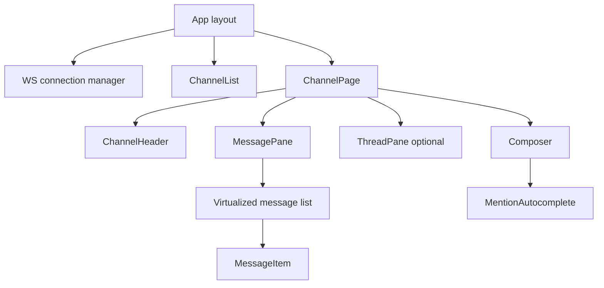
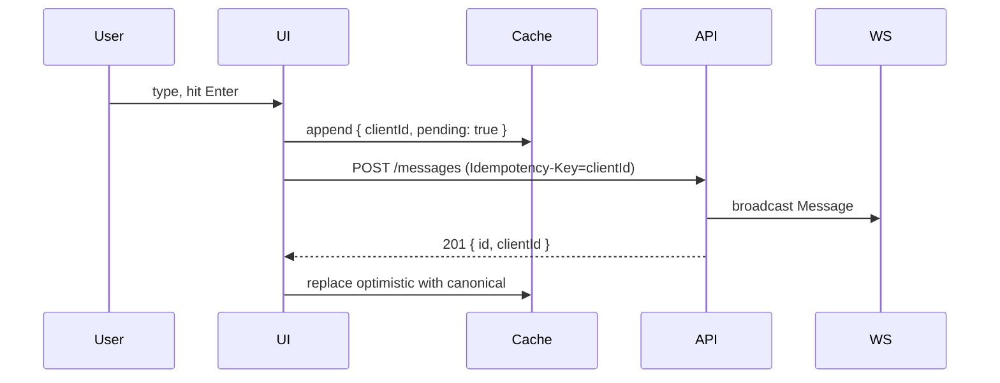

Prompt: *"Design the frontend of a Slack-like chat application. Channels, messages, threads, presence, typing indicators."*

This chapter walks through the prompt end-to-end using the nine-section system-design framework. Times in brackets are the recommended pacing for a forty-five-minute interview slot.

**Acronyms used in this chapter.** Application Programming Interface (API), Cross-Site Request Forgery (CSRF), Content Security Policy (CSP), Cumulative Layout Shift (CLS), Daily Active User (DAU), Hypertext Markup Language (HTML), Hypertext Transfer Protocol (HTTP), Interaction to Next Paint (INP), Largest Contentful Paint (LCP), Multipurpose Internet Mail Extensions (MIME), Personally Identifiable Information (PII), Pull Request (PR), Real User Monitoring (RUM), Representational State Transfer (REST), Server-Side Rendering (SSR), Search Engine Optimization (SEO), Single-Page Application (SPA), Universally Unique Lexicographically Sortable Identifier (ULID), Uniform Resource Locator (URL), User Experience (UX), User Interface (UI), Web Accessibility Initiative — Accessible Rich Internet Applications (WAI-ARIA), Web Content Accessibility Guidelines (WCAG), WebSocket (WS).

## 1. Requirements [5 min]

> *"Before I start, a few clarifying questions:"*

- Who's the user? **Knowledge workers; mostly desktop, mobile-secondary.**
- Scale? **100k DAU per workspace, channels with up to 10k members, ~100M messages stored.**
- Realtime expectation? **Sub-second message delivery, ~5-second tolerance for presence.**
- Offline? **Read recent messages offline; queue sends to deliver when back online.**
- Browser matrix? **Last two versions of Chromium-based browsers + Firefox + Safari.**
- Multi-workspace? **One user can be in many; they switch between them.**
- Search? **Yes, but defer the implementation — assume an existing search service.**

Out of scope: video calls, file storage internals, admin / billing UI.

Constraints: LCP under 2.5 seconds on cable; INP under 200 milliseconds; WCAG 2.2 AA.

## 2. Data model [3 min]

```text
User { id, name, avatarUrl, status }
Workspace { id, name }
Channel { id, workspaceId, name, isPrivate, lastReadTs, unreadCount }
Message { id, channelId, authorId, threadParentId?, text, attachments[], reactions[], ts, editedTs? }
Thread { rootMessageId, replyCount, lastReplyTs }
Presence { userId, status: "online"|"away"|"offline", lastActiveTs }
TypingEvent { channelId, userId, ts }
```

Identifiers: ULIDs (sortable by time).
Timestamps: ms since epoch (server-authoritative).

## 3. API design [4 min]

REST for CRUD, WebSocket for realtime + presence + typing.

```text
GET    /workspaces/:wid/channels                       # list
GET    /channels/:cid/messages?cursor&limit&direction  # paginated history
POST   /channels/:cid/messages    Idempotency-Key      # send (echoed via WS)
PATCH  /messages/:mid                                  # edit (echoed via WS)
DELETE /messages/:mid                                  # tombstone

POST   /channels/:cid/typing                           # typing indicator
POST   /channels/:cid/read                             # mark read

WS /ws  -> subscribe { channelIds[] }, { workspaceId }
        <- message, presence, typing, channel.update events
```

Auth: HttpOnly session cookie; WS handshake re-uses it.

## 4. Client architecture [10 min]



- **Stack**: Next.js (App Router) for SSR of channel page (better LCP & SEO of public channels), client components for the realtime parts.
- **Routes**:
  - `/[workspace]/[channel]` — channel view; URL = state.
  - `/[workspace]/[channel]/thread/[mid]` — thread pane open via parallel route.
- **WS connection** lives at the app root, dispatches events into a typed event bus.
- **Per-channel hook** `useChannelMessages(channelId)` consumes events + REST history.

## 5. State & caching [10 min]

- **Server state**: TanStack Query (or built-in if Next.js Server Actions cover it).
  - Cache key per `[channelId, cursor]`.
  - Infinite-query pattern; `getNextPageParam` from cursor.
  - WS events update the cache via `queryClient.setQueryData`.
- **Optimistic send**:
  - Client generates a `clientId`; appends optimistically with `pending: true`.
  - Server returns the canonical id; we replace by `clientId` match.
  - On error, mark `pending: false, error: true` with a "retry" affordance.
- **Read state**: `lastReadTs` per channel — locally for instant UI, sync via `POST /read` debounced 500ms.
- **Offline cache**: IndexedDB store of recent messages per channel, written through TanStack Query persistence plugin.
- **Outbox**: pending sends in IndexedDB; service worker / a worker drains when online.



## 6. Performance & UX [7 min]

- **Virtualization**: TanStack Virtual; 10k+ messages OK.
- **Image / file lazy-load**: `IntersectionObserver` + `loading="lazy"`.
- **WS reconnect**: exponential backoff with jitter; on reconnect, fetch any messages newer than last known.
- **INP**: composer typing must stay under 50 milliseconds — no blocking work in `onChange`. Mention autocomplete in a `startTransition`.
- **Code splitting**: thread pane lazy-loaded.
- **Prefetch**: hovering a channel in the sidebar prefetches its first page.
- **Critical CSS** in `<head>`; non-critical async.

## 7. Accessibility [3 min]

- Semantic landmarks: `<nav>` (channel list), `<main>` (channel), `<aside>` (thread).
- Focus management: opening a thread shifts focus into the thread pane; closing returns it.
- Live region for new messages: `aria-live="polite"`, throttled to "1 new message" / "X new messages".
- Keyboard: arrow keys navigate channels; Cmd-K command palette.
- Reactions and tooltips reachable by Tab; aria labels.
- High-contrast and `prefers-reduced-motion` respected.

## 8. Security [3 min]

- HttpOnly session cookie; SameSite=Lax; CSRF token for cookie-based mutations.
- WS: validate `Origin` on handshake.
- CSP with nonces; no inline scripts.
- Sanitize message HTML (we render Markdown → AST, not raw HTML).
- File uploads: presigned URLs, MIME / size validation.
- Rate limit on send (server-side; client just shows "slow down" toast).
- Per-workspace tenant isolation; every API call scoped by workspace.

## 9. Observability & rollout [3 min]

- Sentry for JS errors (with source maps).
- `web-vitals` shipped to RUM endpoint.
- Custom events: message-sent (success/fail), reconnect-attempt, optimistic-rollback.
- Feature flags around major changes (e.g. "new threading UX" canary at 5%).
- Trace ID per request, propagated to API.
- Branch deploys for every PR (Vercel-style).
- Runbook: WS connection rate >X/min triggers paging.

## What you'd defer in v1

- Full-text search (use the existing service).
- Threads as a separate route (start with a side pane).
- File previews beyond images (PDF/video later).
- Mobile native apps (PWA first).

## Senior framing

> "This is a chat app, so the realtime + offline + optimistic story is the differentiator. I'd prove the WS connection manager and the optimistic-send + outbox pipeline in week one, because everything else hangs off them. Search, threads, voice, all defer."

## Common follow-ups the interviewer asks

- *"What if presence has 100k subscribers per channel?"* — Don't broadcast every status change; aggregate per-channel and push deltas every 5s.
- *"How do you handle rate-limiting from the WS side?"* — Server pushes a `slow-down` event; client backs off and shows UI; queue drains as allowed.
- *"What if two devices send a message at the same time?"* — Both succeed; both echo; client dedupes by `(clientId, authorId)`.
- *"How do you scale the WS connection?"* — Sticky load balancing per user, one connection per workspace, multiplexed channels per connection.
- *"How do you test this end-to-end?"* — Contract test for the WS event shape (Pact); Playwright for the optimistic-send flow; chaos testing the WS connection drop / reconnect.

## Key takeaways

The chat-application story rests on three pillars: real-time delivery, offline tolerance, and optimistic User Interface. TanStack Query plus IndexedDB persistence plus a WebSocket event bus is the durable pattern. Virtualise long lists; lazy-load secondary panes (the thread view, the search results). Defer search, threads, and file previews to version two; ship the realtime and optimistic-send pipeline first because everything else hangs off them.

## Common interview questions

1. Walk through optimistic message-send.
2. How do you reconcile after a WS reconnect?
3. Where does state live (component, query cache, IndexedDB)?
4. Accessibility considerations for new-message announcements?
5. How would you test the optimistic-send + reconnect path?

## Answers

### 1. Walk through optimistic message-send.

The user types a message and presses Enter. The client generates a `clientId` (a Universally Unique Lexicographically Sortable Identifier so messages remain ordered), appends the message to the local cache marked `pending: true`, and renders it immediately so the User Interface feels instant. The client then issues `POST /channels/:id/messages` with `Idempotency-Key: clientId` and the message body. The server persists the message, broadcasts a `Message` event over the WebSocket to all subscribers including the sender, and returns `201 Created` with the canonical server identifier.

```ts
async function send(text: string) {
  const clientId = ulid();
  queryClient.setQueryData(["messages", channelId], (old) => [
    ...old, { id: clientId, text, pending: true, ts: Date.now() }
  ]);
  try {
    const { id } = await fetch(`/channels/${channelId}/messages`, {
      method: "POST",
      headers: { "Idempotency-Key": clientId, "Content-Type": "application/json" },
      body: JSON.stringify({ text }),
    }).then(r => r.json());
    queryClient.setQueryData(["messages", channelId], (old) =>
      old.map(m => m.id === clientId ? { ...m, id, pending: false } : m));
  } catch {
    queryClient.setQueryData(["messages", channelId], (old) =>
      old.map(m => m.id === clientId ? { ...m, error: true, pending: false } : m));
  }
}
```

The WebSocket echo arrives at the same client in parallel; the client deduplicates by matching `clientId` to the canonical message and replaces the optimistic entry. On error, the client marks the message with a retry affordance.

**Trade-offs / when this fails.** The pattern requires the server to honour the idempotency key so a retry of the same `POST` does not create a duplicate message. Without idempotency, a network blip on the response can produce double-sends. The dedupe by `(clientId, authorId)` handles the case where the WebSocket echo arrives before the `POST` response.

### 2. How do you reconcile after a WS reconnect?

When the WebSocket connection drops, the client buffers any outgoing sends in the outbox (IndexedDB) and flips a "reconnecting" indicator. On reconnect, the client fetches messages newer than the last known timestamp via `GET /channels/:id/messages?after=<lastKnownTs>`, merges them into the cache, drains the outbox by re-issuing the queued sends (each with its original `clientId`, so server-side idempotency prevents duplicates), and resubscribes to the channel via the WebSocket.

```ts
ws.addEventListener("open", async () => {
  const lastTs = lastKnownTs(channelId);
  const messages = await fetch(`/channels/${channelId}/messages?after=${lastTs}`).then(r => r.json());
  mergeIntoCache(messages);
  for (const queued of await drainOutbox(channelId)) {
    await sendWithIdempotencyKey(queued.text, queued.clientId);
  }
  ws.send(JSON.stringify({ type: "subscribe", channelId }));
});
```

The reconnection backoff uses exponential delay with jitter (one second, two seconds, four seconds, up to thirty seconds) so a flapping network does not trigger a reconnect storm.

**Trade-offs / when this fails.** Long disconnections produce long catch-up fetches; if the user has been offline for hours, the client may need to fetch hundreds of messages. The mitigation is to cap the catch-up window and, beyond that, to reset the cache and start fresh — the alternative of streaming hours of old messages over a slow connection is worse.

### 3. Where does state live (component, query cache, IndexedDB)?

State lives in three layers, each with a different lifetime and purpose. Component state holds ephemeral interaction state — the composer's draft text, the open/closed state of the thread pane, hover and focus highlights. Query cache (TanStack Query) holds server state — the messages, the channel list, presence, the user's profile — keyed by query and synchronised with the server via REST and WebSocket events. IndexedDB holds persistent state — the recent messages cache for offline read, the outbox for queued sends, the user preferences for offline access.

```text
Component state    — Draft text, panel open/closed, hover state.
Query cache (TQ)   — Server state, keyed, with WS-driven invalidation.
IndexedDB          — Offline message cache, outbox, preferences.
```

The boundaries are explicit: the component never reaches into IndexedDB directly (it goes through the query cache, which is hydrated from IndexedDB at startup); the query cache never bypasses the server (mutations go through the API and the cache is updated via the response or the WebSocket echo); IndexedDB is the durability layer, not the source of truth (the server is the source of truth).

**Trade-offs / when this fails.** Mixing the layers — keeping a copy of server state in component state, for example — is the source of stale-data bugs. The senior pattern is to be strict about which layer owns each piece of data and to update the right layer on each user action.

### 4. Accessibility considerations for new-message announcements?

New messages must be announced to screen-reader users without flooding them with audio when activity is high. The pattern uses an `aria-live="polite"` region that aggregates new arrivals on a throttle — "one new message" for the first arrival, "three new messages" if more arrive within a short window, with the announcement throttled to at most every five seconds.

```html
<div aria-live="polite" aria-atomic="true" class="visually-hidden">
  {newCount === 1 ? "1 new message" : `${newCount} new messages`}
</div>
```

Beyond announcements, the focus management is critical: opening a thread shifts focus into the thread pane (so screen-reader users land in the right context), closing returns focus to the trigger (so they continue from where they were), and arrow-key navigation through the channel list does not require a mouse. The composer's typing must not produce announcements (every character would be exhausting); only the eventual "message sent" confirmation, if any, is announced.

**Trade-offs / when this fails.** Aggressive announcements ("new message in #general", "new message in #random") fatigue screen-reader users into ignoring the live region. Throttling and aggregation are essential. The senior pattern is to test with real screen-reader users — the pattern that feels right to a sighted developer is often wrong for a daily screen-reader user.

### 5. How would you test the optimistic-send + reconnect path?

Three layers of testing. Unit tests for the message-send logic and the cache update — verify that the optimistic message appears, the canonical replacement happens on success, and the error state appears on failure. Integration tests with Mock Service Worker that simulate the API responses — verify the request shape, the idempotency key handling, and the rollback on `4xx`. End-to-end tests with Playwright that exercise the full flow including the WebSocket — verify that a message typed and sent appears immediately, that a network failure produces the retry affordance, and that a WebSocket reconnect drains the outbox.

```ts
test("optimistic send appears immediately", async ({ page }) => {
  await page.goto("/general");
  await page.getByRole("textbox", { name: "Message" }).fill("Hello");
  await page.keyboard.press("Enter");
  await expect(page.getByText("Hello")).toBeVisible(); // before server response
  await expect(page.getByLabel("Sending...")).toBeVisible();
  await expect(page.getByLabel("Sent")).toBeVisible({ timeout: 2000 });
});
```

Chaos testing the WebSocket — drop the connection, verify the client reconnects, verify the outbox drains — catches the bugs unit tests miss. The senior pattern includes a "WebSocket disconnect storm" load test to validate the backoff behaviour under a degraded network.

**Trade-offs / when this fails.** End-to-end tests are slow and flaky; the team should keep them focused on the critical paths (send, receive, reconnect) and rely on unit and integration tests for the broader coverage. Contract tests for the WebSocket event shape (Pact) catch schema mismatches between the frontend and backend without requiring a live deployment.

## Further reading

- [Linear's how-we-built-our-sync](https://linear.app/blog/scaling-the-linear-sync-engine).
- [Slack's "How Slack works" engineering blog series](https://slack.engineering/).
