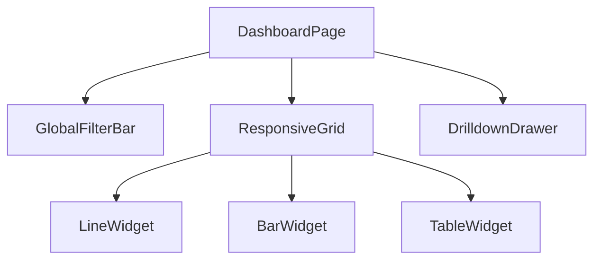
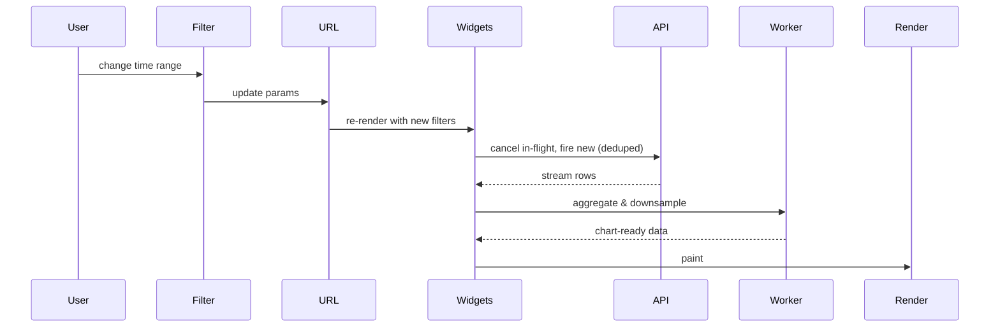

Prompt: *"Design the frontend of an analytics dashboard with multiple charts, time-range and dimension filters, and the ability to drill into individual metrics."*

**Acronyms used in this chapter.** Application Programming Interface (API), Cascading Style Sheets (CSS), Comma-Separated Values (CSV), Content Delivery Network (CDN), Content Security Policy (CSP), Drag-and-Drop (DnD), JSON Web Token (JWT), Largest Triangle Three Buckets (LTTB), Personally Identifiable Information (PII), Pull Request (PR), Real User Monitoring (RUM), Row-Level Security (RLS), Scalable Vector Graphics (SVG), Server-Sent Events (SSE), Single-Page Application (SPA), Structured Query Language (SQL), Sub-Resource Integrity (SRI), Time to First Byte (TTFB), Uniform Resource Locator (URL), User Experience (UX), User Interface (UI), p95 (95th-percentile latency).

## 1. Requirements [5 min]

- Users: data-savvy customers; mostly desktop, big monitors common.
- Scope: 10-30 widgets per page; user can build custom dashboards with drag-and-drop.
- Data: time-series and aggregations from a backend SQL warehouse; a single query may be 100k points / 5MB.
- Latency: dashboard must feel "snappy" — no metric should block another from loading.
- Filters: global time range + per-widget overrides; dimension filters (country, plan, ...).
- Export: PNG of widget, CSV of underlying data.
- Sharing: a dashboard can be shared via signed link (no auth needed, expires).
- Out of scope: ad-hoc SQL editor, alert configuration UI.

## 2. Data model [3 min]

```text
Dashboard { id, name, layout: Widget[] }
Widget { id, type: "line" | "bar" | "table" | "kpi" | ..., query, position, perWidgetFilters }
Query { metric, dimensions[], filters, groupBy, timeRange }
Result { columns[], rows[], totalRows, isPartial?, queryId }
SavedView { id, dashboardId, name, filters }
```

## 3. API design [4 min]

```text
GET    /dashboards/:id
PUT    /dashboards/:id

POST   /query                        # execute one query, returns Result (sync or paginated)
POST   /query/stream                 # SSE for long-running queries
POST   /export/:widgetId             # returns presigned S3 URL when ready
GET    /shares/:token/dashboard      # auth-free read for shared links
```

Query shape uses cursor-style pagination for very large results; otherwise single response.

## 4. Client architecture [10 min]



- Stack: SPA (React/Vite) — heavy interactivity, low SEO needs. Could SSR the shell for faster TTFB.
- Routes:
  - `/d/:id` — dashboard.
  - `/d/:id?w=:widgetId` — drilldown drawer open (URL = state).
- Each widget is a self-contained component owning its own query + cache key.

## 5. State & caching [10 min]

This is the meat of this design.

- **Server state**: TanStack Query.
  - Cache key: `["query", normalizedQueryShape]`. Two widgets with the same query share the cache (and the network call).
  - StaleTime: ~30 seconds (filters rarely change faster).
  - Background refetch on window focus.
- **Global filters in URL**: `?from=...&to=...&country=US`. Bookmarkable, shareable.
- **Per-widget filters merged** with global filters at widget level.
- **Streaming results**: large queries use SSE; widget shows a progress bar and renders partial rows as they arrive (`isPartial: true`).
- **Cancellation**: when filters change, in-flight widget queries are cancelled (TanStack Query handles via signal).
- **Web Worker for heavy aggregation**: if the server returns raw points (e.g. 100k) and the client aggregates, do it in a Worker so the main thread stays responsive.



## 6. Performance & UX [7 min]

- **Skeleton per widget**, not page-wide loader. Each widget loads independently.
- **Charts**: ECharts / uPlot / Visx; canvas for dense data (10k+ points), SVG for small charts.
- **Downsampling**: don't render 100k points; LTTB downsample to ~2-5k visible.
- **Resize observer** so widgets re-render at the right canvas size.
- **Virtualize the table widget**.
- **Code split** chart libraries per widget type — only ship `echarts` if a chart on the page uses it.
- **Memo per widget** on filters; expensive recomputes guarded.
- **`requestIdleCallback`** for non-critical telemetry / prefetches.
- **HTTP/2 multiplexing** lets 30 widget queries fire in parallel without bottlenecking.

## 7. Accessibility [3 min]

- Charts have **accessible alternatives**: a hidden `<table>` with the same data, a "View as table" toggle.
- Color palettes are colorblind-safe; rely on shape/labels in addition to color.
- Filter controls: keyboard-navigable, proper labels.
- Live region announcing "Filters applied; 5 widgets refreshed".
- Focus restored to the trigger when drilldown drawer closes.

## 8. Security [3 min]

- HttpOnly session cookie.
- Server-side authorization on every query (RLS in the warehouse).
- Shared links: signed JWT with widget-scope, audience, expiry. Read-only.
- CSP: `connect-src` includes the API origin; chart libs from a trusted CDN with SRI.
- Don't render user-provided HTML in widget titles.
- PII in aggregates: server-side k-anonymity if any breakdown reveals individuals.

## 9. Observability & rollout [3 min]

- Per-widget timing: `web-vitals` plus custom marks for "query started → first paint".
- Sentry for chart-render exceptions (charts are notorious for edge cases).
- Sample large query payloads to avoid blowing up the analytics pipeline.
- Feature flag for new widget types; allow customer-level overrides.
- Long-tail performance: track p95 widget render time per widget type.

## What you'd defer in v1

- Drag-and-drop dashboard editing — start with a fixed layout per dashboard, add custom dashboards in v2.
- Annotation overlays.
- Real-time updating widgets (refresh on schedule is enough).
- Cross-filtering (clicking a chart filters others) — nice but complex.

## Senior framing

> "The crux is independent loading + dedup. 30 widgets must render independently, not block each other; identical queries should share a single network call. URL is the source of truth for filters so dashboards are linkable. Beyond that, charts need careful downsampling, canvas where dense, and an accessible table fallback."

## Common follow-ups

- *"What if a query is very expensive (30s)?"* — SSE/long-poll, partial rendering, server-side cancellation, "this query is slow, want to limit the time range?"
- *"How do you handle widget errors?"* — Per-widget Error Boundary, retry, fall back to "Couldn't load — Retry / Open in new tab".
- *"Why not Recharts / Chart.js?"* — Either is fine for low-density. For 10k+ points use uPlot or a canvas-based lib; for complex interactions, ECharts. Mention you'd benchmark.
- *"How do you make widgets resizable?"* — `react-grid-layout` or a custom DnD; Resize Observer to re-render charts.

## Key takeaways

- Per-widget independent loading; per-widget cache.
- Filters in URL → bookmarkable / shareable.
- Downsample dense data; canvas for high density.
- Web Workers for client-side aggregation.
- Accessible alternative (table) for every chart.

## Common interview questions

1. How do two widgets sharing a query avoid double-fetching?
2. Where do filters live and why?
3. How do you make a 100k-point line chart usable?
4. Accessibility for charts — what would you ship?
5. What would you defer to v2?

## Answers

### 1. How do two widgets sharing a query avoid double-fetching?

The mechanism is a normalised cache key in TanStack Query. Each widget computes its query key from the normalised query shape — the metric, dimensions, filters, group-by, and time range. Two widgets that compute the same key share the cache entry; when the second widget mounts, TanStack Query returns the in-flight promise (request deduplication) or the cached result, with no second network call.

```ts
function normalizeQuery(q: Query): string[] {
  return ["query", JSON.stringify({
    metric: q.metric,
    dimensions: [...q.dimensions].sort(),
    filters: Object.entries(q.filters).sort(),
    groupBy: q.groupBy,
    timeRange: { from: q.timeRange.from, to: q.timeRange.to },
  })];
}

useQuery({
  queryKey: normalizeQuery(widget.query),
  queryFn: ({ signal }) => fetch("/query", {
    method: "POST",
    body: JSON.stringify(widget.query),
    signal,
  }).then(r => r.json()),
  staleTime: 30_000,
});
```

The normalisation must be deterministic — sorting dimension and filter arrays so two semantically identical queries produce the same key. The `signal` parameter enables cancellation when the widget unmounts or the filters change.

**Trade-offs / when this fails.** If the normalisation is incomplete (the team forgets to sort one field), two equivalent queries will cache separately and cause double-fetching. The structural defence is a serialiser that the team writes once, tests, and uses everywhere. The trade-off with deduplication is that an error in one widget's query becomes an error in every widget sharing the cache; per-widget Error Boundaries contain the blast radius.

### 2. Where do filters live and why?

Filters live in the Uniform Resource Locator. The senior framing: the Uniform Resource Locator is the source of truth for application state that the user might bookmark, share, or refresh; for an analytics dashboard, the time range and dimension filters are exactly that kind of state.

```ts
const [params, setParams] = useSearchParams();
const filters = {
  from: params.get("from") ?? defaultFrom,
  to: params.get("to") ?? defaultTo,
  country: params.get("country") ?? null,
};
```

The benefits are substantial. Bookmarkable: the user can save a specific filtered view and return to it. Shareable: the user can copy the Uniform Resource Locator and send it to a colleague who sees the same view. Time-traveling: the browser back button restores the previous filter state. Stateless: the application has no hidden state to keep in sync; the Uniform Resource Locator is the single source of truth.

Per-widget filters that override the global filters live in the widget's saved configuration (and are loaded from the dashboard definition); at render time, the widget merges the global Uniform Resource Locator filters with its per-widget overrides to compute the effective query.

**Trade-offs / when this fails.** Very long filter values produce ugly Uniform Resource Locators; for filters that are large (a list of one hundred selected items), the team can store the filter in a server-side "saved view" and put just the saved-view identifier in the Uniform Resource Locator. The Uniform Resource Locator-as-state pattern is the right default for any filter that the user might want to share.

### 3. How do you make a 100k-point line chart usable?

Three techniques in combination. First, downsample on the client using the Largest Triangle Three Buckets algorithm — reduce one hundred thousand points to two to five thousand points that visually approximate the original; the human eye cannot distinguish more density. Second, render with canvas (uPlot, ECharts) rather than Scalable Vector Graphics — Scalable Vector Graphics with one hundred thousand path elements is unusable, while canvas is bounded by the actual pixels rendered. Third, use a Web Worker for the downsampling so the main thread remains responsive during interaction.

```ts
import { lttb } from "downsample-lttb";

const downsampled = lttb(points, 2000); // 100k -> 2k

new uPlot({
  width, height,
  series: [{}, { stroke: "blue" }],
  data: [downsampled.map(p => p.x), downsampled.map(p => p.y)],
}, container);
```

For interactions (pan, zoom), recompute the downsample at the new viewport — the user is looking at a different range, so the optimal sampling is different. The Worker keeps this computation off the main thread.

**Trade-offs / when this fails.** Downsampling loses information; for charts where every point matters (financial data, anomaly detection), the team must choose a sampling algorithm that preserves outliers (Largest Triangle Three Buckets does this, but naive averaging does not). For charts with millions of points, server-side downsampling before transmission is the better pattern — sending one hundred thousand points over the wire only to discard ninety-eight percent of them is wasteful.

### 4. Accessibility for charts — what would you ship?

Charts are challenging for screen readers because Scalable Vector Graphics paths and canvas pixels carry no semantic information. The senior pattern ships every chart with an accessible alternative: a hidden `<table>` with the same data, exposed via a "View as table" toggle that swaps the visual chart for the table view.

```html
<div role="img" aria-label="Revenue by country, last 30 days">
  <Chart data={data} />
  <table className="visually-hidden" aria-hidden="true">
    <thead><tr><th>Country</th><th>Revenue</th></tr></thead>
    <tbody>
      {data.map(d => <tr key={d.country}><td>{d.country}</td><td>{format(d.revenue)}</td></tr>)}
    </tbody>
  </table>
</div>
<button onClick={toggle}>View as table</button>
```

Beyond the table fallback, the colour palette is colourblind-safe (use a tested palette such as Viridis), and the chart relies on shape and labels in addition to colour so a colourblind user can distinguish the series. Filter controls are keyboard-navigable with proper labels. A live region announces "Filters applied; five widgets refreshed" so screen-reader users know the dashboard updated.

**Trade-offs / when this fails.** The "table fallback" pattern is more work than just shipping the chart, but it is the correct accessibility pattern for charts and is widely accepted as the senior standard. For very large datasets, the table can be virtualised or paginated.

### 5. What would you defer to v2?

The senior pattern volunteers what would be deferred without being asked, demonstrating restraint and product judgement. For the analytics dashboard: drag-and-drop dashboard editing (start with a fixed layout per dashboard, add custom dashboards in version two); annotation overlays (notes on specific time ranges); real-time updating widgets (refresh on a schedule is enough for version one); cross-filtering (clicking a chart filters other charts on the dashboard — useful but complex to implement well); ad-hoc Structured Query Language editor; alert configuration User Interface.

```text
v1 — Fixed dashboards, scheduled refresh, basic filters, accessible charts.
v2 — Drag-and-drop editing, real-time, cross-filtering, annotations.
v3 — Ad-hoc SQL, alert configuration, custom widget types.
```

The justification for each deferral is "the version one User Experience is good without it; version two adds it once we know users want it". This communicates that the candidate is shipping a Minimum Viable Product that solves the user's primary problem, not gold-plating a version one that takes twice as long to ship.

**Trade-offs / when this fails.** Deferring too much produces a version one that does not justify the investment. The senior balance is to ship the smallest application that solves the user's primary problem and to plan the roadmap so version two adds the obvious next features. The candidate's product judgement — knowing what is "primary" versus "nice to have" — is part of what the interviewer is evaluating.
