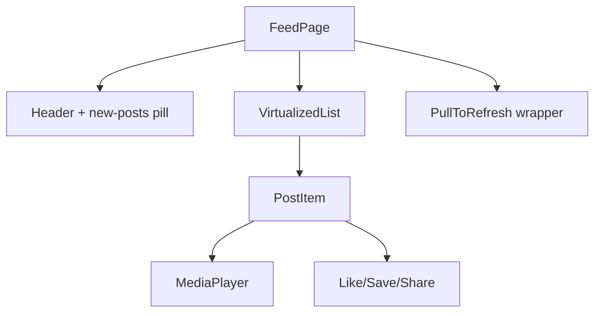

Prompt: *"Design the frontend of a Twitter / Instagram / TikTok-style feed: infinite scroll, mixed media (text, image, video), pull-to-refresh, like / share / save actions."*

**Acronyms used in this chapter.** Application Programming Interface (API), AV1 Image File Format (AVIF), Cumulative Layout Shift (CLS), Daily Active User (DAU), Direct Message (DM), Hypertext Transfer Protocol (HTTP), Interaction to Next Paint (INP), Intersection Observer (IO), Largest Contentful Paint (LCP), Least Recently Used (LRU), Pull Request (PR), Real User Monitoring (RUM), React Server Component (RSC), Requests Per Second (RPS), TypeScript (TS), Uniform Resource Locator (URL), User Experience (UX), User Interface (UI), Web App Manifest (WAM), WebP (Web Picture format), WebSocket (WS).

## 1. Requirements [5 min]

- B2C, mobile-first, 50%+ traffic from low-end Android.
- 10M DAU, peak 200k QPS to the feed endpoint.
- Posts include text, single images, image carousels, autoplay video, polls.
- Algorithmic ranking — feed contents change when refreshed.
- Pull-to-refresh, "new posts available" indicator if the feed shifted.
- Offline: read previously-loaded posts.
- Accessibility: screen-reader navigable, video captions, reduced motion.

Out of scope: composer (in a separate flow), DM, notifications.

## 2. Data model [3 min]

```text
Post { id, authorId, type, ts, text?, media[], pollOptions[]?, likeCount, commentCount, hasLiked }
Author { id, name, avatarUrl, verified }
FeedPage { items: Post[], cursor: string | null, refreshedAt }
```

## 3. API design [3 min]

```text
GET    /feed?cursor=...&limit=20         # paginated; cursor encodes ranking position + filters
POST   /feed/refresh                     # explicit refresh; returns "new" cursor
POST   /posts/:id/like                   # idempotent toggle
POST   /posts/:id/save
WS     /events                            # like-count updates, "new posts" notice
```

Cursor is opaque (server-generated), encodes ranking & dedup state.

## 4. Client architecture [10 min]



- Stack: Next.js App Router; the feed page itself is a client component due to scroll/IO interactions, but the route shell is RSC.
- One `useFeed()` hook backed by TanStack Infinite Query.
- Each PostItem is **memoised**; render-cost is the bottleneck.
- Media player lazy-loaded.

## 5. State & caching [10 min]

- **Infinite query** with cursor pagination; pages flat-mapped into items.
- **WS event invalidation**: `post.likeCount` updates a single item via `setQueryData`.
- **Optimistic likes**: increment counter, rollback on error.
- **Save state in IndexedDB** for offline reading.
- **"New posts" indicator**: a separate poll/WS that tells the client "5 new posts above"; user clicks → refresh + scroll to top.
- **Restore scroll position** on back-nav: store the visible item id and scroll back to it.

## 6. Performance & UX [10 min]

This is the make-or-break section.

- **Virtualization** with TanStack Virtual or `react-virtuoso`. Posts have variable heights — measure with ResizeObserver.
- **Lazy-load media**: image/video loads only when within ±2 viewport heights via IntersectionObserver. Use `loading="lazy"` and `decoding="async"`.
- **Image format**: AVIF with WebP fallback, served via `<picture>` + multiple `srcset` widths.
- **Video**: muted autoplay only when visible; pause when out of view; `<video preload="metadata">` for byte savings.
- **Thumbnails / blur placeholders** to avoid CLS — set explicit `width`/`height`.
- **Codesplit by post type**: only ship the poll-rendering bundle if a poll appears.
- **Composer prefetch**: hovering "Compose" prefetches the composer route bundle.
- **Animation**: `transform`/`opacity` only; no layout-trigger animations during scroll.
- **INP**: action buttons must respond in under 200 milliseconds; debounce telemetry; avoid React work during the gesture.
- **CSS containment**: `contain: layout style paint` on each card to reduce style/layout cost during scroll.

For TikTok-style full-screen video feeds, additional concerns:

- Preload **next** video's first second; discard the previous after 2 viewport-heights away.
- Single shared `<video>` element pool to avoid per-card `<video>` allocation.

## 7. Accessibility [3 min]

- Each post is a `<article>` with proper landmarks.
- Action buttons have `aria-pressed` for like/save toggle state.
- Video: captions, transcripts, `aria-label` on controls.
- Autoplay only when `prefers-reduced-motion: no-preference`; otherwise show first frame, user clicks play.
- Skip-to-content link; H1 on the page; logical heading levels per post.
- Screen-reader user can navigate post-by-post via a virtualised list properly (interesting challenge — see "common follow-ups").

## 8. Security [3 min]

- HttpOnly cookie session.
- CSRF: SameSite=Lax + token for POSTs.
- All user content escaped; allow only Markdown subset for rich text → AST → React, never raw HTML.
- Image / video fetched cross-origin should not leak cookies (`crossorigin="anonymous"`).
- Rate-limit likes server-side; client just shows toast on 429.
- Report/Block flows; safety-net moderation hooks.

## 9. Observability & rollout [3 min]

- Per-card render-time histogram → catch regressions in a particular post type.
- Track CLS; any new post type shouldn't push CLS above target.
- Track INP on action buttons.
- Feature-flag the new media player; canary on 5% then full rollout.
- A/B test ranking algorithm by version; client just sends `experimentId`.
- Sentry for video errors (codec compatibility across browsers and devices is highly variable).

## What you'd defer in v1

- Comments inline (use a drawer / separate page).
- Stories (separate surface).
- Live streaming (separate stack).
- Custom user themes.

## Senior framing

> "The hard parts are virtualisation with variable-height + media items, INP under load, and accessibility for an infinite list. I'd ship a vanilla virtualised list with lazy media first, then layer on the WS-driven optimistic updates and the 'new posts' pill. Performance regressions in this kind of app sneak in — RUM with per-card render histograms catches them."

## Common follow-ups

- *"How do screen-reader users navigate an infinite list?"* — Provide a "load older" button at the bottom, not auto-scroll. Use `aria-live="polite"` to announce "5 new posts" rather than dumping them all.
- *"What if the user has 10MB of cached posts and runs out of memory?"* — Cap cache size; evict from IndexedDB LRU; in-memory list trimmed to ±N items around the viewport.
- *"How do you avoid the 'jumping' bug when items change height after image loads?"* — Reserve space using `aspect-ratio` from server-provided dimensions; show the blurhash placeholder.
- *"Two devices like the same post — race?"* — Server returns canonical state; client uses server count.
- *"How do you measure success?"* — Engagement (likes/post seen), perceived speed (LCP, INP), drop-off rate during scroll.

## Key takeaways

- Virtualise; lazy-load media; reserve space to avoid CLS.
- Infinite query + WS-driven invalidation for live counters.
- Optimistic updates with server-canonical reconciliation.
- A11y for an infinite list needs "load more" + live-region announcements.
- Per-card render-time histogram is the regression detector.

## Common interview questions

1. Walk through virtualisation with variable heights.
2. How do you avoid CLS for images you do not have dimensions for?
3. How do you make autoplay video accessible and cheap?
4. WS is unreliable — how do you reconcile counters?
5. What is your strategy for keeping INP under 200ms during scroll?

## Answers

### 1. Walk through virtualisation with variable heights.

Virtualisation renders only the items currently in (or near) the viewport, leaving the rest as empty space at the correct height. For variable heights, the library (TanStack Virtual, react-virtuoso) measures each item as it renders and caches the measurement, then uses the cache to compute the total scroll height and the offset of each visible item.

```ts
import { useVirtualizer } from "@tanstack/react-virtual";

const virtualizer = useVirtualizer({
  count: posts.length,
  estimateSize: () => 400, // initial estimate
  overscan: 3,
  getScrollElement: () => parentRef.current,
});

return (
  <div ref={parentRef} style={{ height: 600, overflow: "auto" }}>
    <div style={{ height: virtualizer.getTotalSize(), position: "relative" }}>
      {virtualizer.getVirtualItems().map(v => (
        <div key={v.key} style={{ position: "absolute", transform: `translateY(${v.start}px)` }}>
          <PostItem post={posts[v.index]} />
        </div>
      ))}
    </div>
  </div>
);
```

The challenge with variable heights is the chicken-and-egg problem: the virtualiser needs the height to position the item, but the height is unknown until the item renders. The library handles this by initially using the estimate, then measuring once the item mounts and updating the cache; subsequent scrolls use the measured value.

**Trade-offs / when this fails.** Items whose height changes after first render (an image loads, a description expands) cause the cache to become stale, producing scroll jumps. The mitigations: reserve space for images using `aspect-ratio` from server-provided dimensions; use `ResizeObserver` to detect height changes and invalidate the cache; avoid expanding content during scroll (defer to a separate user action). For very large lists, the cache itself can be memory-heavy; cap it and accept that recent items may need to be re-measured.

### 2. How do you avoid CLS for images you do not have dimensions for?

The structural defence is to send dimensions from the server alongside every image — height and width are part of the post payload, not just the image file. Given dimensions, the client reserves the space using `aspect-ratio` (or explicit `width` and `height` attributes) before the image loads, so the layout is stable and Cumulative Layout Shift stays at zero.

```html

```

For images where dimensions are not available server-side (legacy data, third-party feeds), the team computes the dimensions during ingestion and persists them; the cost of one image read at ingestion is far less than the User Experience cost of every visitor seeing a layout shift. As a fallback, render with a default aspect ratio that produces less jarring shifts than no aspect ratio at all (a 4:3 placeholder for unknown content tends to look better than no reservation).

**Trade-offs / when this fails.** Some images legitimately have unpredictable dimensions (user-generated content rendered through a transformation that depends on the user's input). For these, the team should standardise on a maximum height (`max-height: 600px; object-fit: cover;`) so the worst case is bounded.

### 3. How do you make autoplay video accessible and cheap?

Autoplay video must respect the user's `prefers-reduced-motion` preference — for users who have requested reduced motion, do not autoplay; show the first frame with a play button overlay. For users without the preference, autoplay only when the video is in view (using IntersectionObserver), pause when out of view (saving bandwidth and battery), and start muted (browsers refuse to autoplay sound without user interaction).

```ts
const ref = useRef<HTMLVideoElement>(null);
useEffect(() => {
  if (window.matchMedia("(prefers-reduced-motion: reduce)").matches) return;
  const obs = new IntersectionObserver(([entry]) => {
    if (entry.isIntersecting) ref.current?.play();
    else ref.current?.pause();
  }, { threshold: 0.5 });
  obs.observe(ref.current!);
  return () => obs.disconnect();
}, []);
```

For accessibility, every video has captions (the `<track>` element pointing at a WebVTT file), the controls are keyboard-navigable with proper labels, and the video has an accessible name describing its content. For TikTok-style full-screen feeds, a single shared `<video>` element pool avoids per-card allocation; preloading the next video's first second keeps swipes smooth without over-fetching.

**Trade-offs / when this fails.** Autoplay is bandwidth-intensive on cellular networks; the senior pattern provides a "data saver" preference that disables autoplay entirely. Captions are not optional — videos without captions exclude deaf and hard-of-hearing users entirely.

### 4. WS is unreliable — how do you reconcile counters?

The pattern: optimistic update on the user's own action, server-canonical replacement when the response arrives, WebSocket events that update other clients' views. The reconciliation rule is "the server is the source of truth"; the client never trusts a counter computed locally over a counter received from the server.

```ts
async function like(postId: string) {
  queryClient.setQueryData(["post", postId], (old) => ({
    ...old,
    likeCount: old.hasLiked ? old.likeCount - 1 : old.likeCount + 1,
    hasLiked: !old.hasLiked,
  }));
  try {
    const updated = await fetch(`/posts/${postId}/like`, { method: "POST" }).then(r => r.json());
    queryClient.setQueryData(["post", postId], updated); // server's count wins
  } catch {
    queryClient.invalidateQueries({ queryKey: ["post", postId] }); // refetch on failure
  }
}
```

When the WebSocket connection drops, the client switches to polling (`refetchInterval: 30_000`) so counters stay reasonably fresh; on reconnect, it stops polling and resubscribes. Lost WebSocket events are caught by the next poll or by the next user action that triggers a refetch.

**Trade-offs / when this fails.** Two devices liking the same post race — both increment, both send the request, the server returns the canonical count to each, and both clients display the same value. The server-canonical pattern handles this correctly. For high-traffic posts (a viral tweet), the like counter can be approximate and updated periodically rather than per-event; the User Experience cost of slightly stale counts is far less than the infrastructure cost of streaming every increment.

### 5. What is your strategy for keeping INP under 200ms during scroll?

Several techniques in combination. Memoise every PostItem with `React.memo` so the post does not re-render when an unrelated post updates. Defer telemetry and non-essential work to `requestIdleCallback` or `scheduler.yield()` so the main thread is free for the scroll. Use Cascading Style Sheets containment (`contain: layout style paint`) on each card so style and layout recalculation is bounded to the card. Avoid layout-triggering animations during scroll; transform and opacity only.

```css
.post-card {
  contain: layout style paint;
  content-visibility: auto;
  contain-intrinsic-size: 0 400px;
}
```

For action buttons (like, save, share), keep the synchronous click handler minimal — update the optimistic state and queue the network call; do not run analytics or expensive computation in the click handler. Wrap any non-urgent React state update in `startTransition` so the urgent updates (the like animation) take priority over the deferred updates (the side-panel refresh).

```ts
function onLike(postId: string) {
  // Urgent: optimistic toggle
  toggleLike(postId);
  // Deferred: telemetry, side-effects
  startTransition(() => sendAnalytics({ event: "like", postId }));
}
```

**Trade-offs / when this fails.** A single expensive item type (a complex poll, a video with heavy initialisation) can blow the budget for the whole list. The mitigation is per-card render-time monitoring with Real User Monitoring; when a card type exceeds the budget, the team optimises that specific component rather than chasing a generic "the feed is slow" complaint. The 200-millisecond Interaction to Next Paint target is achievable for typical post types; reach out to the User Experience team if the design pushes the limit.
