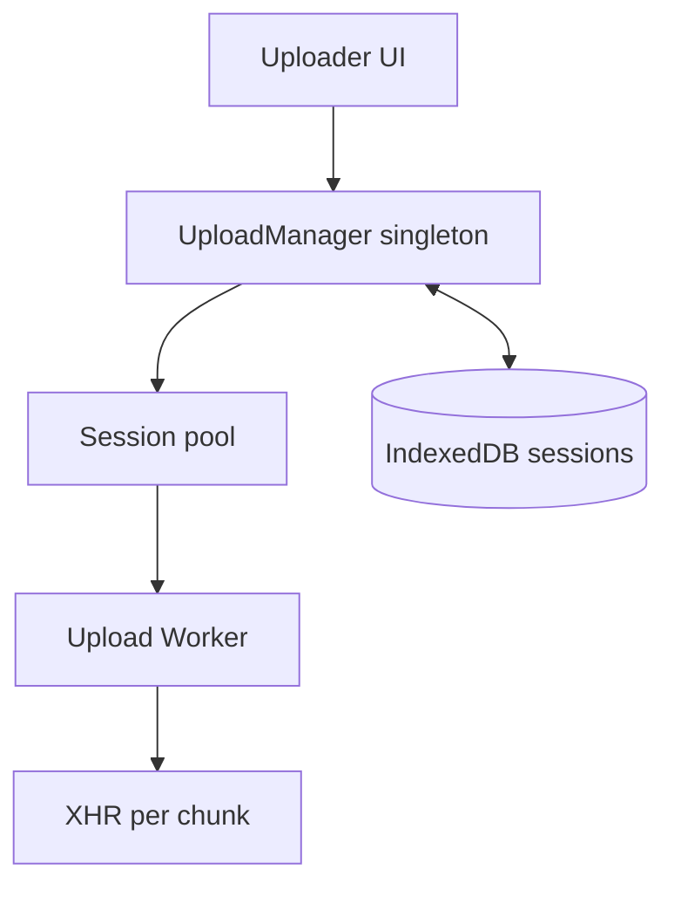

Prompt: *"Design a resumable file uploader. Files up to 5GB. Multiple files concurrently. Pause/resume, network interruptions."*

**Acronyms used in this chapter.** Application Programming Interface (API), Cyclic Redundancy Check (CRC), Customer Managed Key (CMK), Estimated Time of Arrival (ETA), Hypertext Transfer Protocol (HTTP), Identity and Access Management (IAM), Key Management Service (KMS), MD5 (Message-Digest Algorithm 5), Multipurpose Internet Mail Extensions (MIME), Pull Request (PR), Simple Storage Service (S3), Uniform Resource Locator (URL), User Interface (UI), XMLHttpRequest (XHR).

## 1. Requirements [4 min]

- Files: typically 10MB-2GB; up to 5GB.
- Concurrent uploads: 3-5 simultaneous, each with chunk parallelism.
- Network: tolerate flaky mobile networks; auto-retry; resume after refresh.
- UI: per-file progress, pause/resume, cancel, total throughput.
- Backend: S3 multipart upload (or compatible).
- Browser matrix: modern evergreen.

Out of scope: actual content processing (transcoding, virus scan); just upload + finalize.

## 2. Data model [3 min]

```text
UploadSession {
  id, fileName, fileSize, mimeType,
  chunkSize, chunks: { index, etag?, status: pending|uploading|done|failed }[],
  uploadId,           // S3 multipart upload id
  status: pending|active|paused|done|failed,
  bytesUploaded,
  startedAt, finishedAt?,
}
```

Persisted in IndexedDB so refresh-resume works.

## 3. API design [3 min]

```text
POST   /uploads                                # init: returns uploadId + presigned URL per part
GET    /uploads/:id                            # resume: lists which parts are already uploaded
POST   /uploads/:id/parts/:n/url               # presigned URL for one part (also issued in init)
POST   /uploads/:id/complete                   # finalize: server calls S3 CompleteMultipartUpload
DELETE /uploads/:id                             # abort
```

Server delegates to S3:

- `CreateMultipartUpload` → returns `uploadId`.
- For each part: presigned `UploadPart` URL, returns ETag on success.
- `CompleteMultipartUpload` requires all part ETags + part numbers.

## 4. Client architecture [10 min]



- `UploadManager` (singleton; could live in a Web Worker for off-main-thread).
- For each file, spin up an `UploadSession`.
- Each session has a chunk pool: e.g. 4 chunks in flight at a time.
- All progress events bubble up via an event bus / observable / signal store.
- UI subscribes per-session.

## 5. State & caching [10 min]

- IndexedDB stores per-session metadata (chunk statuses, ETags, file handle reference for File System Access API where supported).
- On page load, manager rehydrates incomplete sessions and offers "resume?" prompt.
- File reference: `File` objects can't be persisted directly; use the File System Access API where supported (`showOpenFilePicker` + `requestPermission`), otherwise prompt re-select on resume.
- Network detection via `navigator.connection` and `online`/`offline` events; pause sessions when offline, resume when online.

## 6. Performance & UX [10 min]

- **Chunk size**: 5MB-25MB; tune dynamically based on observed throughput.
- **Parallelism**: 4 chunks/session, 2-3 sessions in parallel by default. Cap based on `navigator.hardwareConcurrency` / connection.effectiveType.
- **Backpressure**: if a chunk fails, exponential backoff per chunk; if N consecutive chunks fail, pause the session.
- **Progress**: throttle UI updates to ~60fps; aggregate bytes-per-chunk into a session-level `bytesUploaded`.
- **CRC / checksum** per chunk (xxhash) for integrity; compare with S3 ETag (which is MD5 for non-multipart).
- **Use Web Worker** for hashing — main thread must stay responsive.
- **Reading the file**: `File.slice(start, end)` returns a Blob; stream via `fetch(presigned, { method: 'PUT', body: blob })`. Use `XMLHttpRequest` if you need upload progress (fetch's progress story is still being shipped via Streams).
- **Memory**: chunks should never all be in memory simultaneously.

## 7. Accessibility [3 min]

- Each row: `aria-label="Uploading photo.jpg, 35% complete, 12 MB of 34 MB"`.
- Live region for state changes ("Upload paused", "Upload complete").
- Pause/resume buttons keyboard-reachable, with `aria-pressed`.
- Don't auto-focus the uploader on page load — too disruptive for screen readers.
- Drag-and-drop: also expose a `<button>` "Choose files" — DnD alone is inaccessible.

## 8. Security [3 min]

- Presigned URLs are short-lived (5-15 min); refresh on expiry.
- Validate file type / size **server-side** (the presign POST policy can enforce content-length and content-type prefix).
- Don't trust the client's reported MIME — server inspects the bytes after upload.
- Rate-limit init endpoint per user.
- S3 bucket policy: only the uploading principal can finalize; uploads expire after 24h via lifecycle.
- For sensitive files: server-side encryption with KMS CMK; per-user prefix.

## 9. Observability & rollout [3 min]

- Sentry for failures (which chunk, which retry attempt, network error code).
- Custom metrics: throughput (MB/s), failed-chunk rate, retry-attempt distribution.
- Structured event log per upload session (init, chunk-success, chunk-failure, pause, resume, complete).
- Feature-flag the uploader: roll out to 1% → monitor failure rate → ramp.
- Synthetic test: a Lambda that uploads a 100MB file every 5 min; alert on failure.

## What you'd defer in v1

- Drag a folder (vs files).
- Chunked downloads.
- Background sync via Service Worker (some browsers; experimental).
- Encryption-on-the-client.
- Side-loading from URL ("import from Drive").

## Senior framing

> "The non-obvious bits are persistence (IndexedDB + File System Access API), backpressure (slow down on errors before pausing), and main-thread cost (hashing in a Worker). The S3 multipart protocol does most of the work; the client glue is the engineering."

## Common follow-ups

- *"What if the user closes the tab mid-upload?"* — On refresh, IndexedDB state is rehydrated. If File System Access available + permission held, resume directly; otherwise prompt re-select. Re-select compares file size + name + last-modified to detect "same file".
- *"How do you ensure chunk integrity?"* — Hash each chunk client-side; S3 returns ETag (MD5 for single-part puts). Optionally use `Content-MD5` header for end-to-end validation.
- *"What about quota — IndexedDB is ~50MB?"* — We don't store file bytes in IndexedDB, only metadata. The actual bytes stream from `File`.
- *"5GB on a 10MB connection?"* — That's >1h. Show ETA; warn user; allow background-tab uploads (browsers throttle background, but uploads usually continue at lower priority).
- *"How do you test this?"* — Unit tests around the chunk state machine; integration test with a fake S3 (LocalStack); chaos test that fails 30% of part uploads to verify retry/backoff.

## Key takeaways

- Persist session state in IndexedDB; rehydrate on refresh.
- Hash + slice + upload off the main thread (Web Worker).
- Chunk parallelism tuned per network; backpressure on failures.
- Server-side validate type/size; don't trust client MIME.
- Observability on per-chunk events catches regressions.

## Common interview questions

1. How do you survive a tab refresh mid-upload?
2. Why use Web Workers for hashing?
3. What is S3's multipart upload — what API calls?
4. How do you handle chunk failures vs whole-session failures?
5. How would you load-test the uploader?

## Answers

### 1. How do you survive a tab refresh mid-upload?

The session metadata lives in IndexedDB — every chunk's status, the Simple Storage Service multipart upload identifier, and the per-chunk ETags as they arrive. On page load, the upload manager rehydrates incomplete sessions and offers a "resume?" prompt to the user. The bytes themselves never live in IndexedDB (they would exceed the storage quota); the client reads them fresh from the `File` object via `slice(start, end)` for each chunk.

```ts
const session = await db.get("uploads", sessionId);
if (session.status === "active" || session.status === "paused") {
  const remainingChunks = session.chunks.filter(c => c.status !== "done");
  for (const chunk of remainingChunks) {
    await uploadChunk(file, chunk);
  }
  await finalize(sessionId);
}
```

The `File` reference itself is the challenge: native browser `File` objects cannot be persisted across page loads. The senior pattern uses the File System Access API (`showOpenFilePicker` plus `requestPermission`) where supported, which allows the file handle to survive across sessions; for browsers without the API, the user re-selects the file and the client compares name, size, and last-modified time to detect "same file" before resuming.

**Trade-offs / when this fails.** The File System Access API requires user permission (one prompt) but works across refreshes. Without it, the team falls back to "select again" which is a User Experience cost. For very large files where a refresh resets the upload, the ability to resume is the entire point of the feature, so the File System Access API is the senior default where supported.

### 2. Why use Web Workers for hashing?

Hashing a five-gigabyte file on the main thread freezes the User Interface for tens of seconds. The browser shows the "page is unresponsive" dialog, scroll jank stops, and any input the user attempts is queued. A Web Worker runs the hashing on a separate thread; the main thread remains responsive for User Interface updates and other work, while the Worker streams the file in chunks and produces the hash incrementally.

```ts
// upload-worker.ts
self.addEventListener("message", async (e) => {
  const { file, chunkSize } = e.data;
  for (let offset = 0; offset < file.size; offset += chunkSize) {
    const blob = file.slice(offset, offset + chunkSize);
    const buffer = await blob.arrayBuffer();
    const hash = await crypto.subtle.digest("SHA-256", buffer);
    self.postMessage({ offset, hash: Array.from(new Uint8Array(hash)) });
  }
});
```

For very large files, the Worker also hashes the file as a whole (xxhash or SHA-256) so the upload can include a `Content-MD5` (or equivalent) header per part for end-to-end integrity verification.

**Trade-offs / when this fails.** Workers cannot share memory with the main thread (without `SharedArrayBuffer`, which has security restrictions); data crosses the boundary via `postMessage` and is structurally cloned, which is fast for typed arrays but slower for objects. The senior pattern keeps the Worker boundary clean — file slices in, hash bytes out — and accepts the marshalling cost as the price of main-thread responsiveness.

### 3. What is S3's multipart upload — what API calls?

Simple Storage Service multipart upload is the protocol for uploading large objects in pieces. Three primary calls: `CreateMultipartUpload` initiates the upload and returns an `UploadId` that identifies the operation; `UploadPart` uploads each part (numbered one through ten thousand) and returns an ETag for each; `CompleteMultipartUpload` finalises the upload by submitting the list of part numbers and ETags, which Simple Storage Service uses to assemble the final object.

```text
1. POST   /uploads          -> server calls CreateMultipartUpload, returns UploadId + presigned URLs per part
2. PUT    presigned-url-N   -> client uploads part N directly to Simple Storage Service, receives ETag
3. POST   /uploads/:id/complete -> server calls CompleteMultipartUpload with all part ETags
```

The senior pattern: the application server initiates and finalises the upload (so the team can authorise the operation, validate the file, and update application state); the client uploads parts directly to Simple Storage Service via presigned Uniform Resource Locators (so the application server is not in the data path). The presigned Uniform Resource Locators are short-lived (five to fifteen minutes); the client requests new ones if the upload takes longer.

**Trade-offs / when this fails.** Forgetting to call `CompleteMultipartUpload` (or `AbortMultipartUpload` for failed uploads) leaves orphaned parts that consume storage indefinitely. The mitigation is a Simple Storage Service lifecycle rule that aborts incomplete multipart uploads after twenty-four hours; the team also abandons the session client-side after a sufficiently long timeout.

### 4. How do you handle chunk failures vs whole-session failures?

Chunk failures (one part fails to upload) are handled with per-chunk exponential backoff: retry the chunk after one second, then two seconds, then four seconds, up to thirty seconds. After several consecutive failures of the same chunk, the session pauses and the user receives a "couldn't upload — retry?" prompt. The other chunks continue uploading in parallel; one failed chunk does not block the others.

```ts
async function uploadChunk(chunk: Chunk, attempt = 0): Promise<void> {
  try {
    chunk.etag = await putChunk(chunk);
    chunk.status = "done";
    await persist(chunk);
  } catch (err) {
    if (attempt < MAX_RETRIES) {
      await delay(1000 * Math.pow(2, attempt));
      return uploadChunk(chunk, attempt + 1);
    }
    chunk.status = "failed";
    pauseSession(chunk.sessionId);
  }
}
```

Whole-session failures (the user goes offline for an extended period, the file becomes unreadable, the server returns a permanent error such as `403 Forbidden` on the presigned Uniform Resource Locator) abort the session: the client calls `AbortMultipartUpload` to release any partial parts on Simple Storage Service, removes the session from IndexedDB, and shows the user a clear error message.

**Trade-offs / when this fails.** Aggressive retry can mask a persistent issue (the file is being modified by another process, the user's quota is exhausted); the senior pattern caps retries and surfaces the error so the user can take action. The transient-versus-permanent distinction is encoded in the Hypertext Transfer Protocol status code: `5xx` and network errors are transient (retry); `4xx` is permanent (abort).

### 5. How would you load-test the uploader?

Three layers of load testing. First, a unit-level chunk-state-machine test that fakes Simple Storage Service responses and verifies the state transitions (pending → uploading → done, retry on failure, abort on permanent error). Second, an integration test against a local Simple Storage Service emulator (LocalStack, MinIO) that exercises the full protocol — `CreateMultipartUpload`, `UploadPart`, `CompleteMultipartUpload` — with realistic file sizes. Third, a chaos test that injects failures into thirty percent of part uploads and verifies the retry and backoff behaviour produces eventual success within the expected time bounds.

```ts
// Chaos test
const failingFetch = (req: Request) => {
  if (Math.random() < 0.3) return Promise.reject(new Error("network"));
  return originalFetch(req);
};

await uploadFile(largeFile, { fetch: failingFetch });
expect(uploadComplete).toBe(true);
```

For real-world load profiles, a synthetic upload from a Lambda function that uploads a one-hundred-megabyte file every five minutes, with the same code path the production application uses, catches regressions before users do. Real User Monitoring on real production uploads tracks throughput, failure rate, and retry distribution per file size, surfacing performance trends over time.

**Trade-offs / when this fails.** Load testing the network behaviour requires injecting realistic conditions (latency, jitter, packet loss); a perfect test environment that the production network does not match produces false confidence. The senior pattern combines deterministic chaos tests (for correctness) with production telemetry (for reality) rather than relying on either alone.
