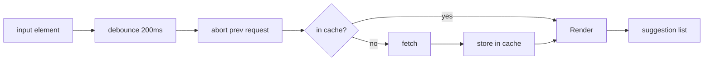

Prompt: *"Build a search autocomplete. As the user types, suggestions appear. Should be fast, not spam the API, and feel correct."*

This is the smallest of the worked prompts but the one most often asked in coding rounds. The senior expectation is that it must be boringly correct — every edge case handled, every race condition closed.

**Acronyms used in this chapter.** Application Programming Interface (API), Hypertext Transfer Protocol (HTTP), Internet Protocol (IP), JavaScript Object Notation (JSON), Least Recently Used (LRU), Reactive Extensions for JavaScript (RxJS), Single-Page Application (SPA), Uniform Resource Locator (URL), User Experience (UX), Web Accessibility Initiative — Accessible Rich Internet Applications (WAI-ARIA).

## 1. Requirements [3 min]

- Suggestions update as the user types (within ~150ms of stopping).
- Don't fire a request per keystroke.
- Cancel stale requests; don't display an old result for a newer query.
- Cache previous queries so back-and-forth is instant.
- Keyboard-navigable; screen-reader friendly.
- Empty input → no suggestions, no spurious request.

## 2. Data model [2 min]

```text
Suggestion { id, label, type?, payload? }
QueryResult { query, items: Suggestion[], queriedAt }
```

## 3. API [2 min]

```text
GET /suggestions?q=&limit=10
```

Returns within 100-300ms typically. Server may rate-limit (429) — handle.

## 4. Architecture [5 min]

A single component, plus a hook (or service) that manages the request lifecycle.



## 5. State & caching [10 min]

The classic "trick" autocomplete: handling all of these correctly:

1. **Debounce**: 200ms after the last keystroke. Cancel the previous timer.
2. **Cancellation**: AbortController per in-flight request; cancel when a new query starts.
3. **Race protection**: even with cancellation, an in-flight response may arrive after the user typed more. Compare the response's query to the **current** query before rendering.
4. **Cache**: keyed by `q.trim().toLowerCase()`. LRU with a small budget (50 entries).
5. **Empty / whitespace handling**: don't fire requests for "".
6. **Backspace path**: typing "react", erasing to "rea" — should hit the cache.
7. **Min length**: don't query for queries < 2 chars (defer to "popular" suggestions if you have them).
8. **Loading state**: don't flicker; only show spinner if the query takes >300ms.
9. **Error state**: graceful UI, don't blow up the input.

```ts
import { useEffect, useRef, useState } from "react";

type Suggestion = { id: string; label: string };

const cache = new Map<string, Suggestion[]>();
const MAX_CACHE = 50;

export function useAutocomplete(query: string, debounceMs = 200) {
  const [items, setItems] = useState<Suggestion[]>([]);
  const [loading, setLoading] = useState(false);
  const [error, setError] = useState<Error | null>(null);
  const abortRef = useRef<AbortController | null>(null);
  const timerRef = useRef<ReturnType<typeof setTimeout> | null>(null);

  useEffect(() => {
    const q = query.trim().toLowerCase();
    if (q.length < 2) {
      setItems([]); setError(null);
      return;
    }

    if (cache.has(q)) {
      setItems(cache.get(q)!); setError(null);
      return;
    }

    if (timerRef.current) clearTimeout(timerRef.current);
    timerRef.current = setTimeout(async () => {
      abortRef.current?.abort();
      const ctrl = new AbortController();
      abortRef.current = ctrl;

      const showSpinnerTimer = setTimeout(() => setLoading(true), 300);

      try {
        const r = await fetch(`/suggestions?q=${encodeURIComponent(q)}&limit=10`, { signal: ctrl.signal });
        if (!r.ok) throw new Error(`HTTP ${r.status}`);
        const data = (await r.json()) as Suggestion[];

        if (cache.size >= MAX_CACHE) {
          const oldest = cache.keys().next().value;
          if (oldest) cache.delete(oldest);
        }
        cache.set(q, data);

        if (q === query.trim().toLowerCase()) {
          setItems(data); setError(null);
        }
      } catch (err) {
        if ((err as Error).name !== "AbortError") setError(err as Error);
      } finally {
        clearTimeout(showSpinnerTimer);
        setLoading(false);
      }
    }, debounceMs);

    return () => {
      if (timerRef.current) clearTimeout(timerRef.current);
      abortRef.current?.abort();
    };
  }, [query, debounceMs]);

  return { items, loading, error };
}
```

## 6. UX & A11y [5 min]

WAI-ARIA Combobox pattern:

```html
<div role="combobox" aria-expanded="true" aria-controls="suggest-list" aria-haspopup="listbox">
  <input type="text" aria-autocomplete="list" aria-activedescendant="opt-3" />
</div>
<ul id="suggest-list" role="listbox">
  <li id="opt-3" role="option" aria-selected="true">React Hook Form</li>
</ul>
```

- Arrow Up/Down moves the active descendant; Enter selects; Esc closes.
- `aria-live="polite"` announces "5 suggestions available".
- Don't trap focus; don't auto-fill the input on highlight (annoying).
- Mobile keyboards: avoid `enterkeyhint="search"` if Enter selects from list.

## 7. Performance [3 min]

- Debounce 150-300ms; tune with usability testing.
- Fetch is JSON, very small; HTTP/2 multiplexing handles it.
- Render of 10 items is trivial; don't over-engineer with virtualisation.
- Pre-fetch on focus (warm the cache for popular queries).
- If results render with rich content (avatars), lazy-load images.

## 8. Security [2 min]

- Encode query in URL (`encodeURIComponent`).
- Server-side sanitises and indexes; client never builds raw HTML from `label`.
- Rate-limit per IP / per session at the API; client backs off on 429.

## What you'd defer

- Personalised suggestions / "recent searches".
- Server-side filtering by user permissions.
- Highlight matches with bold (just `<mark>` it; trivial).

## Senior framing

> "The fun isn't in the debounce — it's in the race protection. Even with `AbortController`, an in-flight response can arrive after the user typed more, and rendering it would feel laggy and wrong. The check `q === currentQuery` is the easy fix. Beyond that: ARIA combobox pattern, cache, min-length, no-flicker spinner."

## Common follow-ups

- *"What if the API is rate-limited?"* — Backoff + show "too many — slow down". Better: pre-aggregate recent queries server-side and cache aggressively.
- *"How do you preserve user input on backspace if the cache returned empty results?"* — Render the input value as-is; "no results" message only.
- *"Can you implement this with RxJS?"* — Yes — `fromEvent → map → debounceTime → distinctUntilChanged → switchMap → catchError`. Same idea, fewer lines, but you must own that you've imported a 30KB lib for one feature.
- *"What if we want it to work offline?"* — Cache via IndexedDB; serve last-known suggestions; tag them as "offline" in UI.

## Key takeaways

- Debounce + cancel + race-check are non-negotiable.
- Cache by normalised query; backspace is free.
- ARIA Combobox pattern; arrow keys, Esc, Enter.
- Min length + delayed-spinner avoid flicker.
- Rate-limit response handling.

## Common interview questions

1. Walk through the request-cancellation story.
2. Why is not `AbortController` enough?
3. ARIA roles for combobox / listbox / option?
4. How do you handle the "no results" state vs "loading"?
5. Where would caching break down in this design?

## Answers

### 1. Walk through the request-cancellation story.

Each in-flight request is associated with an `AbortController`. When a new query starts, the previous controller is aborted via `controller.abort()`, which causes the in-flight `fetch` to reject with an `AbortError`. The `try/catch` distinguishes `AbortError` from real failures and silently ignores it; only genuine failures update the error state.

```ts
abortRef.current?.abort();
const ctrl = new AbortController();
abortRef.current = ctrl;

try {
  const r = await fetch(url, { signal: ctrl.signal });
  // ...
} catch (err) {
  if ((err as Error).name !== "AbortError") setError(err as Error);
}
```

The cleanup function in `useEffect` aborts the in-flight request on component unmount or query change, so navigating away mid-request does not produce a wasted response. The same pattern handles the user typing while a request is in flight — the new request aborts the old one before the old response arrives.

**Trade-offs / when this fails.** Cancellation prevents the response from being processed by the client, but the server still completes the work — the request reached the server, and the server cannot un-do the work it has done. This is fine for read-only suggestion endpoints; for mutation endpoints, idempotency keys are required.

### 2. Why is not `AbortController` enough?

Even with `AbortController`, an in-flight response may arrive after the user has typed more characters — the cancellation is asynchronous, and the response was already in transit when the abort was issued. Without a check, the older response would render, displaying suggestions for a query the user has already moved past.

The defence is to compare the response's query to the *current* query before rendering:

```ts
if (q === query.trim().toLowerCase()) {
  setItems(data);
}
```

Only if the response matches the current query does the component update. Older responses are silently discarded. This is the "race protection" check that distinguishes a correctly-implemented autocomplete from one that intermittently flashes stale results.

**Trade-offs / when this fails.** The check requires the component to remember the current query at the moment the response arrives; using a `useRef` or capturing the query in the closure is the typical approach. The pattern is the same in RxJS (`switchMap` automatically discards results from cancelled streams), in TanStack Query (the query key changes, the result is ignored), and in raw `fetch` plus `AbortController` (the explicit check shown above).

### 3. ARIA roles for combobox / listbox / option?

The Web Accessibility Initiative — Accessible Rich Internet Applications combobox pattern uses a small set of roles and attributes that screen readers understand. The text input has `role="combobox"`, `aria-expanded` indicating whether the suggestion list is visible, `aria-controls` pointing at the list element's identifier, `aria-haspopup="listbox"`, and `aria-autocomplete="list"`. The suggestion list has `role="listbox"` and an identifier matching the `aria-controls` value. Each suggestion has `role="option"`, with `aria-selected="true"` on the currently-highlighted item.

```html
<div role="combobox" aria-expanded="true" aria-controls="suggest-list" aria-haspopup="listbox">
  <input type="text" aria-autocomplete="list" aria-activedescendant="opt-3" />
</div>
<ul id="suggest-list" role="listbox">
  <li id="opt-3" role="option" aria-selected="true">React Hook Form</li>
</ul>
```

The `aria-activedescendant` attribute on the input points at the currently-active option without moving focus from the input — the screen reader announces the option as the user navigates with arrow keys, while the input remains focused so typing continues to work.

**Trade-offs / when this fails.** The pattern has subtle requirements that change between specifications (Web Accessibility Initiative — Accessible Rich Internet Applications 1.1 versus 1.2 differ in the combobox structure). Use a tested headless library (Radix Combobox, React Aria Combobox) rather than implementing from scratch; the libraries handle the cross-browser and cross-screen-reader differences.

### 4. How do you handle the "no results" state vs "loading"?

The states must be distinguishable to the user. Loading is "we are fetching"; no results is "we fetched and there are zero matches"; error is "we could not fetch". The User Interface should never confuse them.

The senior pattern: a single state machine with explicit transitions. Initial state is "idle" (no query). Typing transitions to "fetching" (after the debounce). Successful response with results transitions to "results"; with empty results transitions to "no-results". Failed response transitions to "error".

```ts
type State =
  | { kind: "idle" }
  | { kind: "fetching" }
  | { kind: "results"; items: Suggestion[] }
  | { kind: "no-results"; query: string }
  | { kind: "error"; message: string };
```

The User Interface renders a different message per state: nothing for "idle"; a spinner (delayed three hundred milliseconds to avoid flicker) for "fetching"; the list for "results"; "No results for *query*" for "no-results"; "Couldn't fetch — try again" for "error". The spinner delay prevents the User Interface from flickering between "fetching" and "results" for fast queries (under three hundred milliseconds).

**Trade-offs / when this fails.** The state machine is more code than a few `useState` calls but is the structurally correct pattern that prevents impossible states (such as showing both a spinner and results simultaneously). For trivial autocomplete, the simpler `useState` approach is acceptable; for production applications with rich states, the explicit state machine pays off.

### 5. Where would caching break down in this design?

Several places. First, results that depend on the user's permissions or context must not be cached across users — the cache must be scoped per session, and it must be cleared on logout. Second, results that change frequently (recent searches, trending topics) must have a short stale time, after which the cache is bypassed; an indefinite cache produces stale suggestions. Third, the cache key must be carefully normalised — `react`, `React`, and `  react  ` should hit the same cache entry, but `react-router` should not.

```ts
const key = q.trim().toLowerCase();
// Per-user cache: namespace by user id
const userCache = caches.get(userId) ?? new Map();
caches.set(userId, userCache);
userCache.set(key, data);
```

Fourth, the cache size must be bounded — an unlimited cache grows indefinitely as the user types many queries; a Least Recently Used policy with fifty entries is a reasonable default. Fifth, results from rate-limited responses (`429`) should not be cached — caching the rate-limit error means subsequent identical queries serve the error from cache rather than retrying.

**Trade-offs / when this fails.** Caching is a User Experience win (instant backspace, instant repeated queries) but a correctness risk (stale data, cross-user leakage). The senior pattern is conservative caching — short stale time, per-user scope, bounded size, no caching of error responses — that gets the User Experience benefit without the correctness risk.
