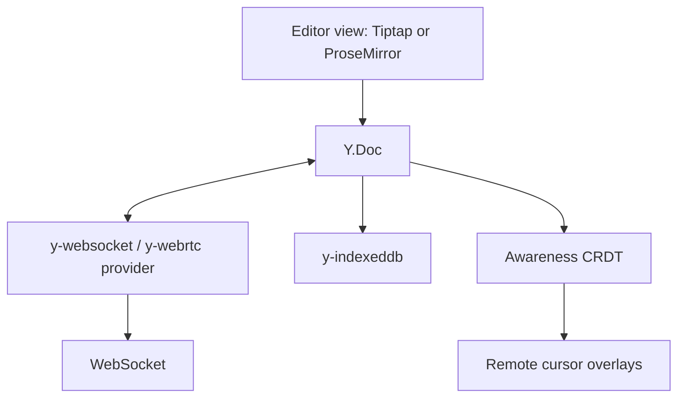

Prompt: *"Design the frontend of a collaborative document editor. Multiple users edit the same document simultaneously; cursors visible; conflict-free."*

This is the most demanding of the worked prompts. The senior expectation is that the candidate can name Conflict-free Replicated Data Types (CRDTs) and Operational Transform (OT), can articulate the trade-offs between them, and can defend a choice between them.

**Acronyms used in this chapter.** Application Programming Interface (API), Conflict-free Replicated Data Type (CRDT), Content Security Policy (CSP), End-to-End (E2E), Garbage Collection (GC), Hypertext Transfer Protocol (HTTP), Key-Value (KV), Local Area Network (LAN), Operational Transform (OT), Peer-to-Peer (P2P), Progressive Web Application (PWA), Pull Request (PR), Simple Storage Service (S3), Uniform Resource Locator (URL), User Experience (UX), User Interface (UI), WebSocket (WS), Y.js Awareness (Awareness CRDT).

## 1. Requirements [5 min]

- 1-50 concurrent editors per document.
- Real-time (sub-second) propagation.
- Survives network drops; merges cleanly when re-connected.
- Offline editing: changes queued, merged on reconnect.
- Cursor + selection visibility per user.
- Comments anchored to text ranges.
- Block-based content (paragraph, heading, list, code, image).
- Document size: typical 5-50 pages; max 500.

Out of scope: actual rendering of complex layouts (tables); voice/video calls; advanced version history UI.

## 2. Data model [5 min]

```text
Document { id, title, blocks: Block[], yDoc (CRDT state) }
Block { id, type, content (rich text), attrs }
RichText { ops: Insert | Delete | Format }    # operation log
User { id, name, color }
PresenceState { userId, cursor: { blockId, offset }, selection?, status }
Comment { id, blockId, range: { start, end }, threads: Reply[] }
```

We'll use **Y.js** as the CRDT layer. Its data model maps cleanly: `Y.Doc` containing `Y.XmlFragment` (for the structured tree), `Y.Map` for metadata, `Y.Awareness` for ephemeral presence.

## 3. API [5 min]

```text
GET    /docs/:id                                # initial snapshot (CRDT state vector + content)
WS     /docs/:id/ws                              # bidirectional CRDT updates + awareness
POST   /docs/:id/comments
GET    /docs/:id/history?cursor=
```

Sync protocol: **Y.js sync protocol** (sync-step-1, sync-step-2, update messages).

Snapshot pattern: server periodically persists the latest state vector + document; on join, client receives this and only newer ops over the wire.

## 4. Architecture [10 min]



- **Editor**: Tiptap (built on ProseMirror) with the Y.js binding.
- **Y.Doc**: source of truth on the client; the editor view derives from it.
- **Provider**: `y-websocket` (centralised) — for production with auth & persistence — or `y-webrtc` (P2P) for low-latency LAN.
- **IndexedDB persistence**: every change saved locally; survives refresh.
- **Awareness**: separate from the doc; ephemeral; cursors / selections / typing indicators.

## 5. State & sync [10 min]

The non-trivial and important section:

- **CRDT (we picked Y.js)** vs **OT (Google Docs)**. CRDTs are mathematically guaranteed to converge without a central authority — every replica eventually agrees on the same state given the same set of operations, regardless of order. OT requires a server to transform operations against concurrent ones, which is a more complex protocol with a single point of authority. CRDTs are slightly larger on the wire (operations carry more metadata for ordering) but simpler to operate (no transformation server, no central authority).
- **Updates flow both ways through the Y.Doc**: editor emits an op, applied locally, broadcast to peers, applied on remote, editor view updates.
- **Conflict resolution is automatic**: same-position inserts get a deterministic order via Lamport clocks (a logical clock that ensures every operation has a globally-unique total order, even across replicas without a synchronised wall clock).
- **Offline**: the provider queues updates locally; on reconnect, it exchanges state vectors with the server and catches up by sending only the operations the other side does not have.
- **Initial load**: HTTP fetches a snapshot (state vector and binary update); WS streams subsequent ops.
- **Garbage collection**: Y.js compacts deleted content via a tombstone GC, which is configurable to balance storage size against history preservation.

```ts
import * as Y from "yjs";
import { WebsocketProvider } from "y-websocket";
import { IndexeddbPersistence } from "y-indexeddb";

const ydoc = new Y.Doc();
const wsProvider = new WebsocketProvider("wss://api.example.com/sync", docId, ydoc);
const idbProvider = new IndexeddbPersistence(docId, ydoc);

idbProvider.on("synced", () => {
  // Local IndexedDB snapshot loaded; the editor can render.
});

wsProvider.awareness.setLocalStateField("user", {
  name: currentUser.name,
  color: currentUser.color,
  cursor: null,
});
```

Server side:

- Stores `Y.encodeStateAsUpdate(doc)` periodically (every N seconds or N ops).
- Authorises every connection (this user can edit this doc).
- Validates operations don't violate invariants if any (rare in pure-text docs).
- Optionally enforces edit rate limits.

## 6. UX & performance [5 min]

- **Tiptap** handles the editor UI; rich-text formatting bar; slash commands.
- **Remote cursors**: render as colored carets with the user's name on hover.
- **Selection highlights**: faded color block over the user's selection range.
- **Typing indicator**: implicit via cursor movement.
- **Latency hiding**: local edit applies instantly; remote ops merge in.
- **Large docs**: virtualise blocks; render only visible + buffer.
- **Image / video blocks**: lazy-load; show placeholders; uploads via the chunked uploader.
- **Comments**: anchored using ProseMirror marks (so they survive most edits); show in a side gutter.

## 7. Accessibility [3 min]

- Editor must be screen-reader navigable — Tiptap/ProseMirror have specific accessibility patterns; turn on the relevant extensions and audit with NVDA/VoiceOver.
- Headings expose proper `H1`/`H2`/...
- Comments accessible via a list view ("Comments on this document"), not just gutter pins.
- Live region for "Alice joined the document".
- Color-coded cursors must include the user's initials/name (color alone is inaccessible).

## 8. Security [3 min]

- Auth on WS handshake (cookie or token).
- Authorise per-document; per-user permissions (view / comment / edit).
- Read-only viewers don't get a Y.Doc with write capability — server filters.
- CSP: editor mustn't allow arbitrary HTML — Tiptap configured with safe schema.
- Protect against malicious peers in peer-to-peer mode (don't trust ops; the provider's transport must be authenticated).
- Rate limit ops per user; bursts are normal, sustained spam is not.

## 9. Observability & rollout [3 min]

- Per-doc op rate; sustained high op rate may indicate a runaway bot.
- Reconnect counts; failed sync rate.
- Convergence delay: client's "first visible remote op" latency.
- Sentry for editor crashes (large surface, rich plugins → crashes happen).
- Feature-flag major editor extensions; canary new schemas.

## What you'd defer in v1

- Branching / version history UI (keep server-side snapshots; surface "restore to..." in v2).
- Comments on images / blocks (start with text only).
- Mobile editing UI (PWA later).
- E2E encryption (CRDTs work; add later — search becomes hard).

## Senior framing

> "The non-obvious choice is CRDT vs OT. I'd pick Y.js: convergence guarantee, simpler ops story, an ecosystem (Tiptap, providers). Beyond that, the architecture is local-first: every edit applies instantly, the provider is a sync mechanism, the server's job is auth + persistence + relay. Awareness CRDT keeps presence cheap and ephemeral."

## Common follow-ups

- *"How do you handle two users formatting overlapping ranges?"* — Y.js handles it with Format mark CRDTs; one user's format-range and another's overlap and merge deterministically.
- *"Comment anchored to text — what if both users edit the anchored range?"* — The mark moves with the surviving content; if all anchored content is deleted, the comment becomes "orphaned" and we surface it in a separate list.
- *"How do you migrate the schema when you add a new block type?"* — Server validates ops before relaying; old clients see new blocks as "unsupported" placeholders; add migration in version N+1 to upgrade clients.
- *"What about scaling?"* — One WS server per document or sharded by doc id. Persistence in S3 (snapshots) + a cheap KV (latest state vector). Consider Liveblocks or PartyKit if you don't want to operate it.

## Key takeaways

- Y.js (CRDT) over OT for collaboration in 2026.
- Local-first: edit applies instantly; provider relays.
- Awareness CRDT for presence; ephemeral, separate from doc.
- Tiptap or ProseMirror as the editor view.
- Server: auth + persistence + relay, not authority.

## Common interview questions

1. CRDT vs OT — when would you choose each?
2. How does Y.js converge without a central authority?
3. How are cursors and presence handled?
4. What survives a five-minute disconnect?
5. How do you anchor a comment to a text range that may be edited?

## Answers

### 1. CRDT vs OT — when would you choose each?

CRDTs are the right choice for new collaborative applications in 2026 because the operational story is simpler and the convergence guarantee is mathematical. OT is the historical choice (Google Docs, EtherPad) and remains in production systems that predate mature CRDT libraries; for new systems, the trade-offs favour CRDTs.

OT requires a central server that transforms every concurrent operation against the operations the other client has not yet seen — the transformation logic is non-trivial and the canonical OT papers contain bugs that took years to discover. CRDTs encode ordering metadata into each operation (Lamport clocks, replica identifiers), which means the server's job is reduced to relaying operations and persisting them; correctness is a property of the operations themselves, not the server.

```text
OT:    client1 -> server (transforms) -> client2
CRDT:  client1 -> server (relays)     -> client2
                                       (convergence is automatic)
```

**Trade-offs / when this fails.** CRDT operations carry more metadata than OT operations, so the wire format is slightly larger; for documents with millions of operations, the metadata accumulates and Y.js needs garbage collection to keep storage bounded. OT is more wire-efficient but more complex. For peer-to-peer collaboration with no central server, CRDTs are the only practical choice.

### 2. How does Y.js converge without a central authority?

Y.js encodes each character insertion as an operation with a unique identifier (replica identifier plus a Lamport clock value), a position (relative to neighbouring operations rather than absolute), and the inserted content. When two replicas insert at the same logical position concurrently, the deterministic ordering of replica identifiers ensures both replicas place the operations in the same final order — without any communication between them.

The state vector mechanism enables efficient sync: when two replicas connect, they exchange state vectors (a map from replica identifier to "highest clock value seen"). Each replica then sends only the operations the other side has not yet seen, reducing the sync to the minimal set of missing operations rather than the full operation log.

```ts
const sv = Y.encodeStateVector(localDoc);
ws.send(sv);
ws.onmessage = (msg) => {
  const update = new Uint8Array(msg.data);
  Y.applyUpdate(localDoc, update);
};
```

**Trade-offs / when this fails.** The convergence guarantee assumes operations are delivered eventually (at-least-once); if operations are silently dropped, the replicas diverge. The provider (`y-websocket`, `y-webrtc`) is responsible for guaranteed delivery, typically through acknowledgements and replay on reconnect. Bypass the provider at your peril.

### 3. How are cursors and presence handled?

Cursors and presence live in the Awareness CRDT, which is intentionally separate from the document CRDT. Awareness state is ephemeral — it is not persisted, it is broadcast to all connected peers as a small key-value map per user, and it expires when the user disconnects (or after a short timeout if the disconnect is unclean).

```ts
provider.awareness.on("change", () => {
  const states = provider.awareness.getStates();
  // states is Map<clientId, { user, cursor, selection }>
  renderCursors(states);
});

provider.awareness.setLocalStateField("cursor", {
  blockId: currentBlock,
  offset: cursorOffset,
});
```

The separation matters: documents are persistent and grow with every edit; presence is ephemeral and changes many times per second. Putting them in the same CRDT would mean garbage-collecting cursor positions, which is conceptually wrong (they were never meant to be retained).

**Trade-offs / when this fails.** Awareness scales linearly with the number of connected users — every change broadcasts to every peer. For documents with thousands of concurrent viewers, awareness must be sampled (every Nth user's cursor is broadcast) or scoped (only users in the same section see each other's cursors). The default `y-websocket` provider does not do this; large-scale collaboration requires custom presence layering on top of the awareness primitives.

### 4. What survives a five-minute disconnect?

The document survives because of two layers of persistence. First, every change is persisted to IndexedDB on the local client immediately via `y-indexeddb` — if the user closes the tab and re-opens it, the document state is restored from IndexedDB without a network round trip. Second, the provider queues outgoing operations in memory (and replays them on reconnect), so changes made during the disconnect are applied to the server's copy as soon as the WebSocket reconnects.

Presence does not survive — the user's cursor is removed from other peers' views immediately on disconnect, and a new cursor appears when the user reconnects. The reconnect handshake exchanges state vectors and catches up on the operations the disconnected client missed; by the end of the handshake, the local state is consistent with the server's state.

**Trade-offs / when this fails.** If the same user edits offline on two devices simultaneously and reconnects both, both sets of edits merge into the server's copy — convergence is preserved, but the user may see surprising results (their two devices' edits interleaved). The mitigation is to scope edit sessions to a single device per user, or to surface a "your other device made changes" notification.

### 5. How do you anchor a comment to a text range that may be edited?

Comments are anchored using ProseMirror marks, which are CRDT-aware structures that travel with the surviving content under edits. A comment mark with identifier `c-123` applied to characters five through twelve will continue to mark the same logical content as users insert and delete around it; if a user inserts text in the middle of the marked range, the mark expands; if a user deletes characters from the marked range, the mark contracts.

```ts
const tr = view.state.tr.addMark(
  rangeStart,
  rangeEnd,
  view.state.schema.marks.comment.create({ commentId: "c-123" })
);
view.dispatch(tr);
```

If all marked content is deleted, the comment becomes "orphaned" — the mark has no characters to attach to. The application surfaces orphaned comments in a separate list ("Comments on deleted text") rather than losing them; users can choose to delete them or attach them to new locations.

**Trade-offs / when this fails.** Marks survive most edits but have edge cases: if the marked range is replaced via a paste operation that deletes the entire range and inserts new content in one transaction, the mark may not transfer to the new content. The cure is to detect orphaning explicitly and to provide UI for re-anchoring. The pattern is the same for highlights, suggestions, and other range-anchored decorations.

## Further reading

- [Y.js docs](https://docs.yjs.dev/).
- Martin Kleppmann, *Local-First Software*.
- [Notion's data model post](https://www.notion.com/blog/data-model-behind-notion).
- [Liveblocks](https://liveblocks.io/) — managed real-time collab.
